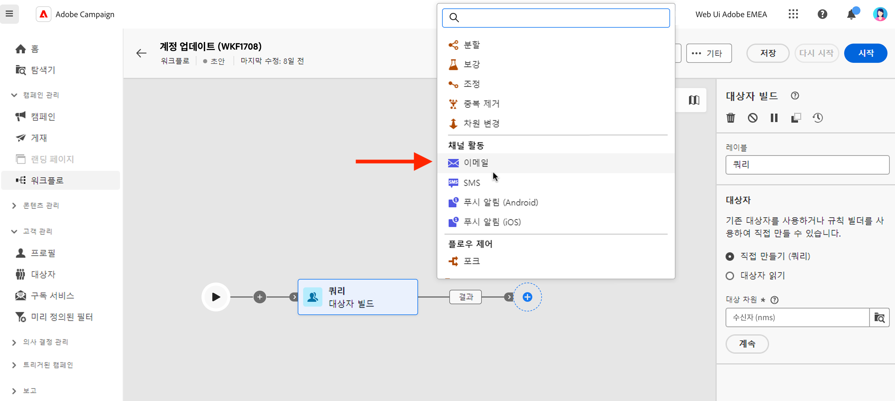
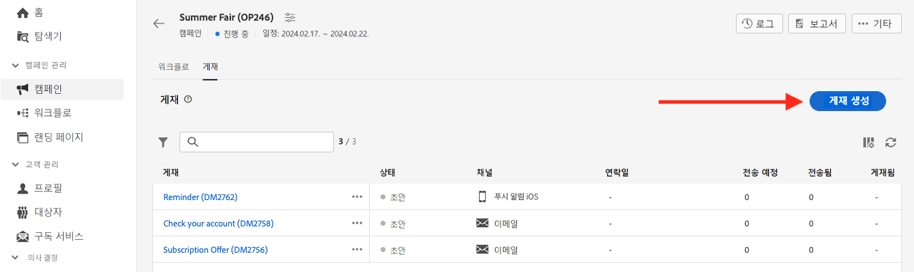

# 게재 만들기 {#create-delivery}

<!-- /NEO-92684 / DOCAC-13767-->

>[!CONTEXTUALHELP]
>id="acw_deliveries_profile_enrichment_settings"
>title="프로필 보강 활성화"
>abstract="프로필 강화를 위한 필드를 선택합니다."

**[!UICONTROL 게재]** 왼쪽 메뉴에서 독립 실행형 게재를 만들거나, 캠페인에 포함되거나 포함되지 않은 워크플로 컨텍스트에서 게재를 만들 수 있습니다.

아래 탭을 검색하여 게재를 만드는 방법에 대해 알아봅니다.

>[!BEGINTABS]

>[!TAB 독립 실행형 게재 만들기]

독립 실행형 게재를 만들려면 다음 단계를 수행하십시오.

1. 왼쪽 탐색 영역에서 **[!UICONTROL 게재]** 메뉴로 이동한 다음 **[!UICONTROL 게재 만들기]** 버튼을 클릭합니다.

   {zoomable="yes"}

1. 게재를 위한 채널을 선택합니다.
1. 주 타겟 및 컨트롤 그룹의 게재 대상을 정의합니다. [대상자에 대해 자세히 알아보기](../audience/about-recipients.md).

   대상 선택 인터페이스를 보여 주는 {zoomable="yes"}{width="70%" align="left"}

1. 메시지 콘텐츠를 정의합니다. 다음 섹션에서 게재 채널 및 게재 콘텐츠를 정의하는 방법에 대해 자세히 알아보십시오.

   * [이메일 채널](../email/create-email.md)
   * [푸시 알림 채널](../push/gs-push.md)
   * [SMS 채널](../sms/create-sms.md)

1. (선택 사항) 게재 [일정](#gs-schedule)을(를) 정의합니다. 일정이 정의되지 않은 경우 **[!UICONTROL 보내기]** 단추를 클릭하면 메시지가 즉시 전송됩니다.
1. 설정을 확인하려면 **[!UICONTROL 검토 및 보내기]** 단추를 클릭하세요.
1. **[!UICONTROL 콘텐츠 시뮬레이션]** 단추를 사용하여 게재 및 개인화 설정을 테스트하십시오. [이 섹션](../preview-test/preview-test.md)에서 메시지 시뮬레이션에 대해 자세히 알아보십시오.
1. **[!UICONTROL 준비]** 단추를 클릭하여 대상 모집단을 계산하고 메시지를 생성합니다. 준비 단계는 몇 분 정도 걸릴 수 있습니다. 준비가 완료되면 메시지를 전송할 준비가 되어 있습니다. 오류가 발생한 경우 **로그**(으)로 이동하여 경고 및 경고를 확인하십시오.
1. 결과를 확인하고 **[!UICONTROL 보내기]** 단추를 클릭하여 메시지 보내기를 시작합니다.
1. 메시지가 전송되면 **보고서** 섹션으로 이동하여 주요 지표에 액세스합니다. [이 섹션](../reporting/delivery-reports.md)에서 게재 보고서에 대해 자세히 알아보십시오.

>[!TAB 워크플로에서 게재 만들기]

워크플로에서 게재를 만들려면 다음 단계를 수행하십시오.

1. 워크플로를 만들거나 기존 워크플로를 엽니다. [워크플로에 대해 자세히 알아보기](../workflows/gs-workflow-creation.md#gs-workflow-steps)
1. [**[!UICONTROL 대상자 빌드]**](../workflows/activities/build-audience.md) 활동을 추가하고 구성합니다.
1. `+` 아이콘을 클릭하고 게재 활동을 선택합니다. **[!UICONTROL 이메일]**, **[!UICONTROL SMS]**, **[!UICONTROL 푸시 알림(Android)]** 또는 **[!UICONTROL 푸시 알림(iOS)]**. 워크플로우의 게재 채널 활동과 [이 섹션](../workflows/activities/channels.md)에서 게재 콘텐츠를 정의하는 방법에 대해 자세히 알아보세요.

   {zoomable="yes"}

1. 워크플로를 시작하고 로그를 확인합니다.

워크플로를 만들지 않고도 캠페인에서 게재를 추가할 수도 있습니다. 이를 실현하려면 캠페인의 **[!UICONTROL 게재]** 탭을 클릭하고 **[!UICONTROL 게재 만들기]** 버튼을 클릭합니다.

{zoomable="yes"}

구성 단계는 독립형 게재에 대한 단계와 유사합니다.

캠페인을 구성하고 캠페인에 속한 게재를 관리하는 방법에 대한 자세한 내용은 [이 섹션](../campaigns/gs-campaigns.md)을 참조하세요.

>[!ENDTABS]

## 개인화 추가 {#personalization}

Adobe Campaign에서 제공하는 메시지는 다양한 방식으로 개인화할 수 있습니다. [개인화 기능에 대해 자세히 알아보십시오](../personalization/gs-personalization.md).

캠페인을 사용하여 동적 콘텐츠를 만들고 개인화된 메시지를 보냅니다. 개인화 기능을 결합하여 메시지를 개선하고 맞춤형 사용자 경험을 만들 수 있습니다.

다음과 같은 작업을 수행하여 메시지 콘텐츠를 개인화할 수 있습니다.

* 동적 **개인화 필드** 삽입

  개인화 필드는 메시지의 첫 번째 수준 개인화에 사용됩니다. 개인화 편집기에서 데이터베이스에서 사용 가능한 모든 필드를 선택할 수 있습니다. 게재의 경우 수신자, 메시지 또는 게재와 관련된 필드를 선택할 수 있습니다. 이러한 개인화 속성은 메시지의 제목 줄이나 본문에 삽입할 수 있습니다. [자세히 알아보기](../personalization/personalize.md)

* 사전 정의된 **식 조각** 삽입

  Campaign에는 게재에 삽입할 수 있는 특정 렌더링을 포함하는 표현식 조각 세트가 포함되어 있습니다. 예를 들어 로고, 인사말 메시지 또는 메시지 미러 페이지에 대한 링크를 추가할 수 있습니다. 표현식 조각은 개인화 편집기의 전용 항목에서 사용할 수 있습니다. 또한 필요에 따라 나만의 표현식 조각을 만들 수 있습니다. [식 조각 사용 방법 알아보기](../content/use-expression-fragments.md)

* **조건부 콘텐츠**&#x200B;를 만드는 중

  예를 들어 수신자의 프로필을 기반으로 동적 개인화를 추가하도록 조건부 콘텐츠를 구성합니다. 특정 조건이 참 이면 텍스트 블록 및/또는 이미지가 삽입됩니다. [자세히 알아보기](../personalization/conditions.md)

* **개인화된 오퍼 추가**

  수신자의 위치, 현재 날씨 또는 마지막 구매 주문에 따라 메시지 콘텐츠에 개인화된 오퍼를 삽입합니다. [자세히 알아보기](../msg/offers.md)

## 게재 미리보기 및 테스트

메시지 콘텐츠가 정의되면 미리 보기를 통해 메시지 렌더링을 제어하고 테스트 프로필로 개인화 설정을 확인할 수 있습니다. [자세히 알아보기](../preview-test/preview-test.md)

## 게재 전송 예약 {#gs-schedule}

>[!CONTEXTUALHELP]
>id="acw_deliveries_email_schedule"
>title="연락일 및 시간 설정"
>abstract="게재를 전송하는 일자와 정확한 시간을 정의합니다. 마케팅 메시지에 가장 적합한 시간을 선택하면 열람률을 극대화할 수 있습니다."

메시지를 보내는 날짜와 정확한 시간을 설정할 수 있습니다. 마케팅 메시지에 가장 적합한 시간을 선택하면 열람률을 극대화할 수 있습니다.

게재 전송을 예약하려면 게재를 열고 **[!UICONTROL 예약]** 섹션으로 이동하십시오. **[!UICONTROL 예약 활성화]** 토글을 사용하여 예약을 활성화하고 원하는 전송 일자 및 시간을 설정합니다. 게재를 전송하면 정의한 연락 날짜에 실제 전송이 시작됩니다.

{zoomable="yes"}

기본적으로 **[!UICONTROL 전송 전에 확인 활성화]** 옵션이 활성화되어 있습니다. 이 옵션을 활성화하면 게재가 예약된 날짜 및 시간에 전송되기 전에 전송을 확인해야 합니다. 예약된 일자 및 시간에 자동으로 게재를 전송해야 하는 경우 이 옵션을 비활성화하면 됩니다.

[이 섹션](../monitor/prepare-send.md#schedule-the-send)에서 예약된 게재를 전송하는 단계를 알아봅니다.

## 로그 모니터링 및 추적 {#gs-tracking-logs}

게재가 전송된 후 게재를 모니터링하는 것은 마케팅 캠페인이 효율적이고 고객에게 도달하는지 확인하는 중요한 단계입니다.

게재 후 모니터링은 물론 게재 실패와 검역된 메시지가 어떻게 관리되는지 파악할 수 있습니다.

[이 섹션](../reporting/gs-reports.md)의 모니터링 및 추적 기능에 대해 자세히 알아봅니다.