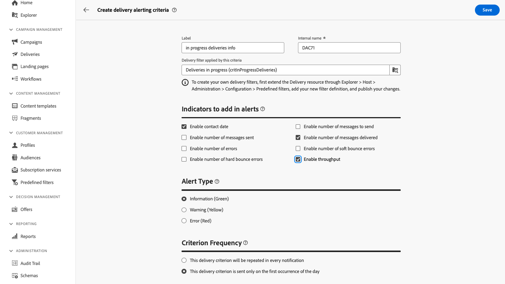

# 게재 경고 기준 {#delivery-alerting-criteria}

>[!CONTEXTUALHELP]
>id="acw_delivery_alerting_criteria"
>title="게재 경고 기준 대시보드"
>abstract="Campaign Web 사용자 인터페이스는 대시보드에 추가할 수 있는 사전 정의된 경고 기준(처리량이 낮은 게재, 준비에 실패한 게재 등)을 제공합니다. 필요에 따라 자체 기준을 만들 수도 있습니다."

Campaign 웹 사용자 인터페이스는 처리량이 낮은 게재 또는 준비가 실패한 게재 등 미리 정의된 경고 기준을 제공하여 대시보드에 추가할 수 있습니다. 필요에 따라 자체 기준을 만들 수도 있습니다.

경고 기준은 왼쪽 탐색 창의 **기준** 탭 아래에 있는 **게재 경고** 메뉴에서 액세스할 수 있습니다.

>[!AVAILABILITY]
>
>이 기능은 LA(Limited Availability)에 있습니다. 이는 **Adobe Campaign Standard에서 Adobe Campaign v8**&#x200B;로 마이그레이션하는 고객으로 제한되며 다른 환경에는 배포할 수 없습니다.

## 사전 정의된 경고 기준 {#ootb-criteria}

Campaign 웹 사용자 인터페이스에서 사전 정의된 경고 기준을 사용할 수 있습니다. 이러한 기준은 아래와 같은 다양한 시나리오를 다룹니다.

* **게재 실패**: 정의된 범위 내에서 예약된 모든 게재가 잘못된 상태입니다.
* **준비 중인 게재 실패**: 준비 단계(대상 계산 및 콘텐츠 생성)가 실패한 정의된 범위 내에서 수정된 게재가 모두 실패했습니다.
* **소프트 바운스에 대한 잘못된 오류 비율이 있는 게재**: 정의된 범위 내에서 예약된 모든 게재(상태가 &quot;진행 중&quot;이며 소프트 바운스 오류 비율이 정의된 비율보다 큽니다.
* **하드 바운스에 대한 잘못된 오류 비율이 있는 게재**: 정의된 범위 내에서 예약된 모든 게재(상태가 &quot;진행 중&quot;이며 하드 바운스 오류 비율이 정의된 비율보다 큽니다.
* **긴 시작을 보류 중인 게재**: 정의된 기간 이상 동안 &quot;시작 보류 중&quot; 상태로 정의된 범위 내에 예약된 게재. &quot;시작 보류 중&quot; 상태는 메시지가 아직 시스템에서 고려되지 않았음을 의미합니다.
* **낮은 처리량의 게재**: 정의된 기간보다 오래 동안 시작된 게재(처리된 메시지의 정의된 비율보다 적음 및 정의된 값보다 낮은 처리량).
* **진행 중인 게재**: 정의된 범위 내에서 &quot;진행 중&quot; 상태로 예약된 게재.

>[!NOTE]
>
>위의 기준에 대한 모든 매개 변수에 기본값이 적용됩니다. 이러한 값은 사용 중인 게재 경고 대시보드의 **기준 매개 변수** 섹션에서 사용자 지정할 수 있습니다. [대시보드 작업 방법 알아보기](../msg/delivery-alerting-dashboards.md)

## 경고 기준 만들기 {#criteria}

>[!CONTEXTUALHELP]
>id="acw_delivery_alerting_criteria_create"
>title="게재 경고 기준 만들기"
>abstract="Adobe Campaign에서 제공하는 사전 정의된 경고 기준 외에도 필요에 맞는 자체 기준을 만들 수 있습니다."

>[!CONTEXTUALHELP]
>id="acw_delivery_alerting_criteria_create_indicators"
>title="경고에 추가할 표시기"
>abstract="이메일 경고의 &#39;세부 사항&#39; 섹션에 열로 표시할 지표를 선택합니다."

>[!CONTEXTUALHELP]
>id="acw_delivery_alerting_criteria_create_alert"
>title="경고 유형"
>abstract="기준에 대한 **경고 유형**&#x200B;을 지정하여, 경고의 &#39;요약&#39; 섹션에서 게재 기준 옆에 표시할 레이블과 색상을 선택합니다."

>[!CONTEXTUALHELP]
>id="acw_delivery_alerting_criteria_create_frequency"
>title="기준 빈도"
>abstract="기준을 충족하는 각 게재에 대해 일일 경고 빈도를 제어합니다."

새 기준을 만들려면 다음 단계를 수행하십시오.

1. 왼쪽 탐색 창에서 **게재 경고** 메뉴로 이동한 다음 **기준** 탭을 선택합니다.
1. **게재 경고 기준 만들기** 단추를 클릭합니다.
1. 기준에 대한 레이블을 제공합니다. 내부 이름은 자동으로 채워지고 읽기 전용입니다.
1. 이 조건에 적용되는 **게재 필터**&#x200B;를 사용하여 미리 정의된 필터를 적용하여 기준의 범위를 구체화합니다.

   아래 예제에서는 **진행 중인 게재(critInProgressDeliveries)** 필터를 선택했습니다. 즉, 이 기준은 &quot;진행 중&quot; 상태의 게재만 고려합니다.

   

   >[!NOTE]
   >
   >미리 정의된 필터 중 사용자의 요구에 맞는 필터가 없으면 **고객 관리** > **미리 정의된 필터** 메뉴에서 직접 필터를 만들 수 있습니다. [자세히 알아보기](../get-started/predefined-filters.md)
   >
   >이 작업은 고급 사용자만 수행해야 합니다.

1. **경고에 추가할 표시기** 섹션에서 전자 메일 경고의 &quot;세부 정보&quot; 섹션에 열로 표시할 지표를 선택합니다.

1. 기준에 대한 **경고 유형**&#x200B;을 지정하여, 경고의 “요약” 섹션에서 게재 기준 옆에 표시할 레이블과 색상을 선택합니다.

1. **기준 빈도** 섹션을 사용하여 기준을 충족하는 각 게재에 대해 일별 경고 빈도를 제어합니다.

   * **이 게재 기준은 모든 알림에서 반복됩니다**: 해당 날짜의 모든 전자 메일 알림에 기준을 충족하는 게재를 표시합니다.
   * **이 게재 기준은 그 날의 첫 번째 발생 시에만 전송됩니다**: 이후의 전자 메일 경고에서 반복하지 않고 그 날의 첫 번째 보고서에서만 기준을 충족하는 게재를 표시합니다.