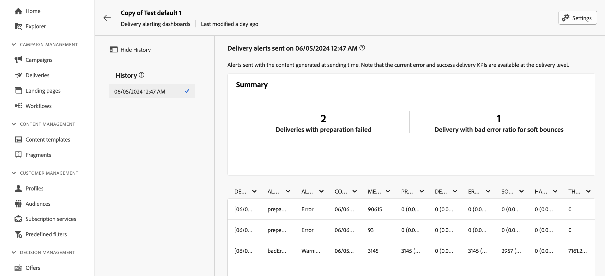

# 게재 경고 대시보드 {#delivery-alerting-dashboards}

>[!CONTEXTUALHELP]
>id="acw_delivery_alerting_dashboards"
>title="게재 경고 대시보드"
>abstract="게재 경고 기능은 사용자 그룹이 게재 실행에 대한 정보가 포함된 이메일 알림을 자동으로 수신할 수 있는 경고 관리 시스템입니다. 게재 경고 대시보드를 사용하면 이메일 경고의 수신자를 지정하고, 해당 경고를 보내는 데 사용할 경고 기준을 선택 및 구성하고, 전송된 경고 알림의 기록에 액세스할 수 있습니다."

게재 경고 대시보드를 사용하면 이메일 경고를 수신할 사용자를 지정하고, 해당 경고를 전송하는 데 사용할 경고 기준을 선택 및 구성하고, 전송된 모든 알림의 기록에 액세스할 수 있습니다. 왼쪽 탐색 창의 **대시보드** 탭 아래에 있는 **게재 경고** 메뉴에서 액세스할 수 있습니다.

## 게재 대시보드 만들기 {#dashboards}

>[!CONTEXTUALHELP]
>id="acw_delery_alerting_dashboard_create"
>title="게재 경고 대시보드 만들기"
>abstract="게재 경고 대시보드를 만들면 이메일 경고의 수신자를 지정하고, 해당 경고를 보내는 데 사용할 경고 기준을 선택 및 구성하고, 전송된 경고 알림의 기록에 액세스할 수 있습니다."

>[!CONTEXTUALHELP]
>id="acw_delivery_alerting_create_general"
>title="게재 경고 일반 매개변수"
>abstract="게재 경고 대시보드의 일반 속성을 지정합니다. **경고 그룹 선택** 필드를 사용하면 이 대시보드에서 보낸 경고를 수신할 **운영자 그룹**&#x200B;을 지정할 수 있습니다."

>[!CONTEXTUALHELP]
>id="acw_delivery_alerting_create_criteria_add"
>title="게재 경고 기준"
>abstract="이 섹션에서는 이 대시보드에서 경고를 보내는 데 사용할 기준을 추가합니다. 사전 정의된 기준 중에서 선택하거나 특정 요구에 맞게 자체 기준을 만들 수 있습니다."

>[!CONTEXTUALHELP]
>id="acw_delivery_alerting_create_criteria_parameters"
>title="기준 매개변수"
>abstract="기준에는 적용 방법을 정의하는 기본 매개변수 값이 있습니다. 이 섹션에서 요구에 맞게 이러한 값을 변경할 수 있습니다."

게재 대시보드를 만들려면 다음 단계를 수행하십시오.

1. 왼쪽 탐색 창에서 **게재 경고** 메뉴로 이동한 다음 **게재 대시보드 만들기**&#x200B;를 클릭합니다.

   

1. **레이블** 필드에서 대시보드 이름을 지정합니다. **내부 이름** 필드는 자동으로 채워지고 읽기 전용입니다.

1. **경고 그룹 선택** 필드에서 이 대시보드에서 보낸 경고를 받을 **연산자 그룹**&#x200B;을(를) 지정합니다. 선택한 운영자 그룹의 모든 구성원이 경고를 받습니다.

   [Adobe Campaign v8(콘솔) 설명서](https://experienceleague.adobe.com/ko/docs/campaign/campaign-v8/admin/permissions/gs-permissions){target="_blank"}에서 권한 및 연산자 그룹에 대해 자세히 알아보세요.

1. **게재 경고 기준** 섹션에서 경고를 보내는 데 사용할 기준을 추가합니다. 사전 정의된 기준 중에서 선택하거나 특정 요구 사항에 맞게 고유한 기준을 만듭니다. [기준 작업 방법 알아보기](../msg/delivery-alerting-criteria.md)

1. 기준에는 기준을 적용하는 방법을 정의하는 기본 매개 변수 값이 있습니다. **기준 매개 변수** 섹션에서 필요에 맞게 이러한 값을 변경할 수 있습니다.

   

   예를 들어 기본적으로 **게재 대상 최소 크기** 기준 매개 변수는 50으로 설정되어 있습니다. 즉, 최소 50개의 프로필을 대상으로 하는 경우에만 이 대시보드에서 보내는 경고에 게재가 포함됩니다. 50개 미만의 프로필을 타겟팅하는 게재를 포함하려는 경우 이 매개 변수를 변경할 수 있습니다.

   각 기준 매개 변수에 대한 자세한 내용을 보려면 아래 섹션을 확장하십시오.

   +++사용 가능한 기준 매개 변수

   * **게재 대상 최소 크기**: 예를 들어 이 필드에 100을 입력하면 100명 이상의 수신자와 대상이 같은 게재에 대해서만 알림이 전송됩니다. 이 매개 변수는 모든 기준에 적용됩니다.
   * **연락 날짜 이전 및 이후의 모니터링 기간(시간)**: 현재 시간 이전 및 이후의 시간 수. 이 시간 범위에 연락 날짜가 있는 게재만 고려됩니다. 이 매개 변수는 모든 기준에 적용됩니다. 기본적으로 이 필드의 값은 24시간으로 설정됩니다.
   * **최대 소프트 바운스 오류 비율**: 지정된 값보다 큰 소프트 바운스 오류 비율을 가진 모든 게재에 대해 알림이 전송됩니다. 기본적으로 이 필드의 값은 0.05(5%)로 설정됩니다.
   * **하드 바운스 오류의 최대 비율**: 하드 바운스 오류 비율이 지정된 값보다 큰 모든 게재에 대해 알림이 전송됩니다. 기본적으로 이 필드의 값은 0.05(5%)로 설정됩니다.
   * **&#39;시작 보류 중&#39; 상태의 게재에 대한 최소 시간 임계값(분)**: 시작 보류 중 상태가 이 필드에 지정된 기간보다 긴 모든 게재에 대해 알림이 전송됩니다. 시작 보류 중 상태는 메시지가 아직 시스템에서 고려되지 않았음을 의미합니다.
   * **처리량을 계산하는 데 필요한 최소 시간(분)**: 처리량 기준이 낮은 게재에는 지정된 기간 이상 시작된 게재(진행 중 상태)만 고려됩니다.
   * **처리량을 계산하기 위해 처리된 메시지의 최대 비율**: 처리량 기준이 낮은 게재에는 처리된 메시지의 비율이 지정된 비율보다 낮은 게재만 고려됩니다.
   * **최소 예상 처리량(시간당 전송된 메시지)**: 처리량 기준이 낮은 게재에는 지정된 값보다 낮은 처리량의 게재만 고려됩니다.
   * **&#39;진행 중인 게재&#39; 기준에 필요한 최소 처리 비율**: 처리된 메시지 비율이 지정된 비율보다 높은 게재만 고려합니다.

   +++

1. 기본적으로 경고 대시보드는 비활성화되어 있으므로 이 대시보드에 연결된 이메일 경고가 전송되지 않습니다. 대시보드를 즉시 활성화하려면 경고 그룹 선택 필드 옆에 있는 **일반** 섹션에서 **활성화됨** 옵션을 전환하십시오.

   대시보드를 저장하고 나중에 활성화할 수도 있습니다.

   

1. 경고 대시보드를 저장하려면 **저장** 단추를 클릭하십시오.

경고 대시보드가 빈 데이터로 열립니다. 활성화하여 알림을 보낼 준비가 되면 **설정** 단추를 클릭하고 **활성화됨** 옵션을 전환합니다(아직 활성화되지 않은 경우).

이제 게재가 이 대시보드에 정의된 기준을 만족할 때마다 지정된 연산자 그룹으로 경고 알림이 전송됩니다.

## 경고 대시보드 관리

>[!CONTEXTUALHELP]
>id="acw_delivery_alerting_dashboard_alerts"
>title="게재 경고 전송됨"
>abstract="이 섹션에서는 최근 전송된 경고와 관련된 정보를 시각화할 수 있습니다."

>[!CONTEXTUALHELP]
>id="acw_delivery_alerting_dashboard_history"
>title="게재 경고 기록"
>abstract="**기록** 창에는 이 대시보드에서 전송된 모든 경고가 포함됩니다. 특정 시간에 전송된 경고에 액세스하려면 항목을 클릭합니다."

만든 모든 경고 대시보드는 **대시보드** 탭의 **게재 경고** 메뉴에서 액세스할 수 있습니다.

이름 옆에 있는 **추가 작업** 단추를 사용하여 대시보드를 복제하거나 삭제할 수 있습니다.

대시보드의 상세 보기에 액세스하려면 목록에서 해당 이름을 클릭합니다. 이 화면에서 전송된 최신 경고를 시각화할 수 있습니다. 전송된 모든 경고가 왼쪽 창에 나열됩니다. 특정 시간에 전송된 경고에 액세스하려면 항목을 클릭합니다.

대시보드를 편집하려면 오른쪽 상단의 **설정** 단추를 클릭하고 원하는 대로 변경합니다.