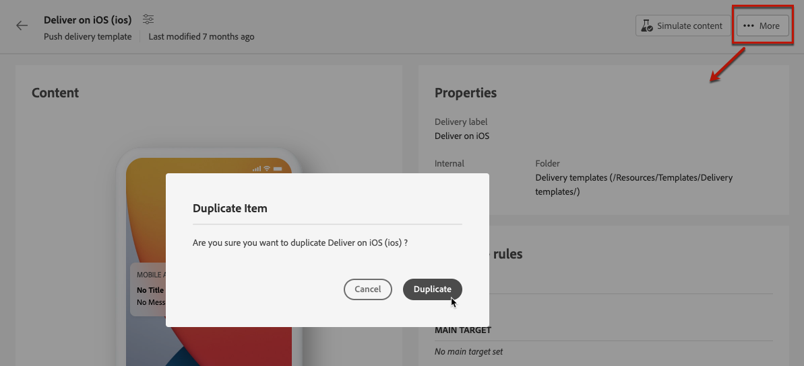

# 게재 템플릿 작업 {#work-with-delivery-templates}

>[!CONTEXTUALHELP]
>id="acw_delivery_template_for_campaign"
>title="게재 템플릿"
>abstract="캠페인 실행 및 론칭을 보다 신속하게 수행하기 위해 게재 템플릿을 사용하여 크리에이티브 룩과 느낌을 표준화합니다"

디자인 프로세스를 가속화하고 개선하기 위해 게재 템플릿을 만들어 캠페인 전반에서 사용자 지정 콘텐츠 및 설정을 쉽게 재사용할 수 있습니다. 이 기능을 사용하면 크리에이티브 룩과 느낌을 표준화하여 캠페인 실행 및 론칭을 보다 신속하게 수행할 수 있습니다.

템플릿에는 다음이 포함될 수 있습니다.

* [유형화](../advanced-settings/delivery-settings.md#typology),
* 발신자 주소,
* An [대상자](../audience/about-audiences.md), 포함 [컨트롤 그룹](../audience/control-group.md),
* 사용자 정의 [콘텐츠](../content/edit-content.md),
* [개인화된 필드](../personalization/personalize.md) 및 [조건부 콘텐츠](../personalization/conditions.md),
* 링크 대상 [미러 페이지](../content/mirror-page.md) 및 구독 취소 [링크](../content/message-tracking.md),
* 리소스 유효성, 재시도 매개 변수 또는 격리 설정 등 다른 게재 속성입니다.

>[!NOTE]
>
>게재 템플릿은 과(와) 다릅니다. [전자 메일 콘텐츠 템플릿](../content/email-templates.md)를 사용하여 메시지의 콘텐츠만 재사용할 수 있습니다.

## 게재 템플릿 액세스 및 관리 {#access-manage-templates}

>[!CONTEXTUALHELP]
>id="acw_delivery_templates"
>title="게재 템플릿 작업"
>abstract="게재 템플릿을 사용하여 나중에 사용할 수 있도록 기존 게재를 손쉽게 만들고 저장하십시오."
>additional-url="https://experienceleague.adobe.com/docs/campaign-web/v8/msg/delivery-template.html#copy-an-existing-template" text="기존 템플릿 복제"
>additional-url="https://experienceleague.adobe.com/docs/campaign-web/v8/msg/delivery-template.html#convert-an-existing-delivery" text="게재를 템플릿으로 변환"

콘텐츠 템플릿 목록에 액세스하려면 다음을 선택합니다. **[!UICONTROL Campaign Management]** > **[!UICONTROL 게재]** 왼쪽 메뉴에서 **템플릿** 탭.

다음의 모든 템플릿 [생성됨](#create-a-delivery-template) 현재 환경에 표시됩니다.

채널 및 폴더에서 콘텐츠 템플릿을 필터링할 수 있습니다. 게재 속성을 사용하여 규칙을 작성하여 고급 필터를 설정할 수도 있습니다. [규칙 빌더에 대해 자세히 알아보기](../audience/segment-builder.md)

템플릿을 편집하려면 목록에서 원하는 항목을 클릭합니다. 여기에서:

* 콘텐츠, 속성, 대상자 및 여기에 첨부된 모든 오퍼를 수정할 수 있습니다.
* 템플릿을 테스트할 수도 있습니다. [자세히 알아보기](#test-template)

또는 삭제 [복제](#copy-an-existing-template) 템플릿에서 해당 작업을 선택합니다. **[!UICONTROL 추가 작업]** 메뉴(다음 중 하나)에서 **[!UICONTROL 템플릿]** 템플릿 편집 화면에서 또는 을 나열합니다.

>[!NOTE]
>
>템플릿을 편집하거나 삭제할 때 이 템플릿을 사용하여 만든 게재는 영향을 받지 않습니다.

## 게재 템플릿 만들기 {#create-a-delivery-template}

게재 템플릿을 만들려면 다음 작업을 수행할 수 있습니다.
* 기존 템플릿 복제 - [자세히 알아보기](#copy-an-existing-template)
* 기존 게재를 템플릿으로 변환 - [자세히 알아보기](#convert-an-existing-delivery)
* 처음부터 게재 템플릿 만들기 - [자세히 알아보기](#create-a-new-template)

### 기존 게재 템플릿 복제 {#copy-an-existing-template}

캠페인에는 각 채널에 대한 이메일, 푸시, SMS 등 기본 제공 템플릿 세트가 제공됩니다. 게재 템플릿을 만드는 가장 쉬운 방법은 기본 제공 템플릿을 복제하고 사용자 지정하는 것입니다.

>[!NOTE]
>
>사용자 지정 템플릿을 복제할 수도 있습니다.

게재 템플릿을 복제하려면 아래 단계를 수행합니다.

1. **게재** 왼쪽 메뉴에서 **템플릿** 탭으로 이동합니다. [자세히 알아보기](#access-manage-templates)
1. 다음을 클릭합니다. **[!UICONTROL 추가 작업]** 원하는 템플릿 이름의 오른쪽에 있는 버튼을 선택하고  **[!UICONTROL 복제]**.

   목록에서 템플릿을 선택하고 템플릿 편집 화면에서 이 옵션을 선택할 수도 있습니다.

1. 복제를 확인합니다.

   

1. 새 템플릿 대시보드가 중앙 화면에 열립니다. 필요에 따라 템플릿 설정을 편집합니다.

   

1. 다음을 클릭합니다. **[!UICONTROL 리뷰]** 단추를 클릭하여 템플릿을 저장하고 검토합니다. 모든 설정을 편집하고, 삭제하고, 복제할 수 있습니다.

   

1. 필요한 경우 템플릿 렌더링을 테스트합니다. [자세히 알아보기](#test-template)

새 템플릿이 [**템플릿** 목록](#access-manage-templates). 이제 새 게재를 만들면 선택할 수 있습니다.

### 게재를 템플릿으로 변환 {#convert-an-existing-delivery}

모든 게재를 템플릿으로 변환하여 나중에 반복 게재 작업을 수행할 수 있습니다.

게재를 템플릿으로 저장하려면 아래 단계를 수행합니다.

1. 로 이동 **[!UICONTROL 캠페인 관리]** > **[!UICONTROL 게재]** 메뉴 아래의 제품에서 사용할 수 있습니다.
1. 다음에서 **[!UICONTROL 찾아보기]** 탭을 클릭하고 **[!UICONTROL 추가 작업]** 원하는 게재 이름의 오른쪽에 있는 버튼을 클릭하고 **[!UICONTROL 템플릿으로 복사]**.

   

1. 복제를 확인합니다.

1. 새 템플릿 대시보드가 중앙 화면에 열립니다. 필요에 따라 템플릿 설정을 편집합니다.

1. 다음을 클릭합니다. **[!UICONTROL 리뷰]** 단추를 클릭하여 템플릿을 저장하고 검토합니다. 모든 설정을 편집하고, 삭제하고, 복제할 수 있습니다.

1. 필요한 경우 템플릿 렌더링을 테스트합니다. [자세히 알아보기](#test-template)

새 템플릿이 [**템플릿** 목록](#access-manage-templates). 이제 새 게재를 만들면 선택할 수 있습니다.

### 새 게재 템플릿 만들기 {#create-a-new-template}

>[!NOTE]
>
>구성 오류를 방지하려면 [기본 제공 템플릿을 복제하고](#copy-an-existing-template) 새 템플릿을 만드는 대신 해당 속성을 사용자 지정하는 것이 좋습니다.

처음부터 게재 템플릿을 구성하려면 아래 단계를 수행합니다.

1. **게재** 왼쪽 메뉴에서 **템플릿** 탭으로 이동합니다. [자세히 알아보기](#access-manage-templates)
1. **[!UICONTROL 템플릿 만들기]** 버튼을 클릭합니다.

   

1. 템플릿에 사용할 채널을 선택합니다.
1. 해당 채널의 기본 제공 게재 템플릿은 기본적으로 자체 템플릿을 작성하는 데 사용됩니다. 필요한 경우 선택한 채널 오른쪽에 있는 전용 버튼을 사용하여 다른 템플릿을 선택합니다.

   

1. 다음을 클릭합니다. **[!UICONTROL 템플릿 만들기]** 단추를 다시 클릭합니다.

1. 템플릿 속성 정의, [대상자](../audience/add-audience.md) 및 콘텐츠는 선택한 채널에 따라 달라집니다.

   >[!NOTE]
   >
   >아래 섹션에서 게재 채널 및 각 콘텐츠를 디자인하는 방법에 대해 자세히 알아보십시오.
   >
   > * [이메일 채널](../email/create-email.md)
   > * [푸시 알림 채널](../push/gs-push.md)
   > * [SMS 채널](../sms/create-sms.md)

1. 또한 이메일 템플릿의 경우 유형화 규칙 및 대상 매핑과 같은 고급 설정에 액세스할 수 있습니다. **[!UICONTROL 설정]** 화면 오른쪽 상단에 있는 단추입니다. [자세히 알아보기](../advanced-settings/delivery-settings.md)

1. 다음을 클릭합니다. **[!UICONTROL 리뷰]** 단추를 클릭하여 템플릿을 저장하고 검토합니다. 모든 설정을 편집하고, 삭제하고, 복제할 수 있습니다.

1. 필요한 경우 템플릿 렌더링을 테스트합니다. [자세히 알아보기](#test-template)

새 템플릿이 [**템플릿** 목록](#access-manage-templates). 이제 새 게재를 만들면 선택할 수 있습니다.

## 게재 템플릿 테스트 {#test-template}

처음부터 만들거나 기존 콘텐츠에서 만든 모든 게재 템플릿의 렌더링을 테스트할 수 있습니다. 이렇게 하려면 아래 단계를 수행합니다.

1. 다음으로 이동 **템플릿** 탭 스루 **[!UICONTROL 캠페인 관리]** > **[!UICONTROL 게재]** 메뉴를 클릭하고 템플릿을 선택합니다. [자세히 알아보기](#access-manage-templates)

1. 다음을 클릭합니다. **[!UICONTROL 콘텐츠 시뮬레이션]** 화면 오른쪽 상단의 단추.

   

1. 하나 이상의 테스트 프로필을 선택하여 이메일 렌더링을 확인합니다. 데이터베이스에서 실제 프로필을 선택할 수도 있습니다.

1. 다른 프로필 간에 전환하여 선택한 프로필에 따라 개인화된 메시지 표현을 가져옵니다.

   <!--[Learn more on test profiles](../preview-test/test-deliveries.md#recipients)-->

   확대/축소 수준을 조정하고 데스크탑 또는 모바일 보기를 선택할 수도 있습니다.

   

1. 템플릿 편집 화면으로 돌아가려면 창을 닫습니다.

>[!NOTE]
>
>이메일 렌더링을 사용하거나 게재 템플릿에서 증명을 보낼 수 없습니다.

* [이메일 콘텐츠 미리 보기에 대한 자세한 정보](../preview-test/preview-content.md)

* [SMS 콘텐츠 미리 보기에 대한 자세한 정보](../sms/content-sms.md)

* [푸시 콘텐츠 미리 보기에 대한 자세한 내용](../push/gs-push.md)

