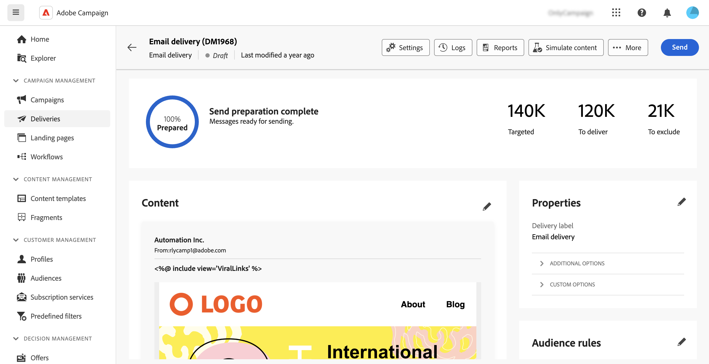
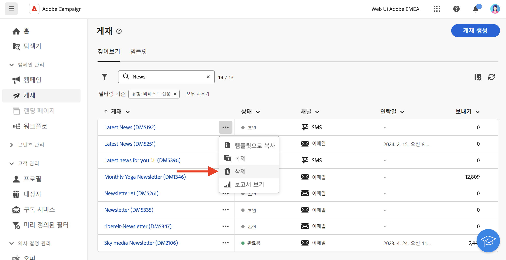

# 게재에 액세스하기 {#work-with-deliveries}

>[!CONTEXTUALHELP]
>id="acw_deliveries_list"
>title="게재"
>abstract="게재는 특정 채널(이메일, SMS 또는 푸시)의 대상자에게 전송되는 커뮤니케이션입니다. 이 화면에서는 기존 게재를 편집, 복제, 삭제할 수 있습니다. 또한 완료된 게재에 대한 보고서를 볼 수 있습니다. **게재 만들기** 버튼을 클릭하여 새 게재를 추가합니다."

## 게재에 액세스하기 {#access}

>[!CONTEXTUALHELP]
>id="acw_deliveries_additional_target"
>title="추가 대상"
>abstract="이들 규칙은 클라이언트 콘솔에서만 변경할 수 있습니다."

게재는 왼쪽 탐색 메뉴의 **[!UICONTROL 게재]** 메뉴에서 액세스할 수 있습니다. 클라이언트 콘솔 또는 웹 사용자 인터페이스에서 만든 모든 게재가 이 목록에 나타납니다. 이 화면에서 모든 기존 게재를 모니터링하거나, 복제 또는 삭제하거나, 새 게재를 만들 수 있습니다.

게재를 열려면 목록에서 해당 이름을 클릭합니다. 게재가 열리면 매개 변수 편집, 실행 확인 또는 전용 보고서를 사용한 성능 모니터링과 같은 다양한 작업을 수행할 수 있습니다.

>[!NOTE]
>
>클라이언트 콘솔에서 만든 게재를 여는 경우 대상자에 대해 **[!UICONTROL 추가 대상]** 섹션이 표시될 수 있습니다. 이는 이 게재에 대해 여러 대상이 구성되었음을 나타냅니다. 이러한 매개 변수는 콘솔에서만 수정할 수 있습니다.
>
>{zoomable="yes"}

## 게재 복제 {#delivery-duplicate}

게재 목록 또는 게재 대시보드에서 기존 게재의 사본을 만들 수 있습니다.

게재 목록에서 게재를 복제하려면 다음 단계를 수행합니다.

1. 게재 이름 옆 오른쪽에서 세 점 버튼을 클릭하여 복제합니다.
1. **[!UICONTROL 복제]**&#x200B;를 선택합니다.
1. 복제를 확인합니다. 새 게재 대시보드가 중앙 화면에서 열립니다.

대시보드에서 게재를 복제하려면 다음 단계를 수행합니다.

1. 게재를 열고 화면 맨 위에 있는 **[!UICONTROL ...자세히]** 단추를 클릭합니다.
1. **[!UICONTROL 복제]**&#x200B;를 선택합니다.
1. 복제를 확인합니다. 새 게재는 중앙 화면의 현재 게재를 대체합니다.

## 게재 삭제 {#delivery-delete}

게재는 게재 목록, 왼쪽 레일의 기본 게재 항목 또는 캠페인의 게재 목록에서 삭제됩니다.

게재 목록에서 게재를 삭제하려면 다음 단계를 수행합니다.

1. 삭제할 게재 이름 옆의 오른쪽에 있는 세 점 버튼을 클릭합니다.
1. **[!UICONTROL 삭제]**&#x200B;를 선택합니다.
1. 삭제를 확인합니다.

모든 게재는 이 목록에서 사용할 수 있지만, 워크플로에서 생성된 게재는 여기에서 삭제할 수 없습니다. 워크플로우 컨텍스트에서 생성된 게재를 삭제하려면 워크플로우에서 게재 활동을 삭제합니다.

워크플로에서 게재를 삭제하려면 다음 단계를 수행합니다.

1. 게재 활동을 선택합니다.
1. 오른쪽 패널의 **[!UICONTROL 삭제]** 아이콘을 클릭합니다.
1. 삭제를 확인합니다. 게재에 하위 노드가 있는 경우 삭제하거나 보유하도록 선택합니다.

