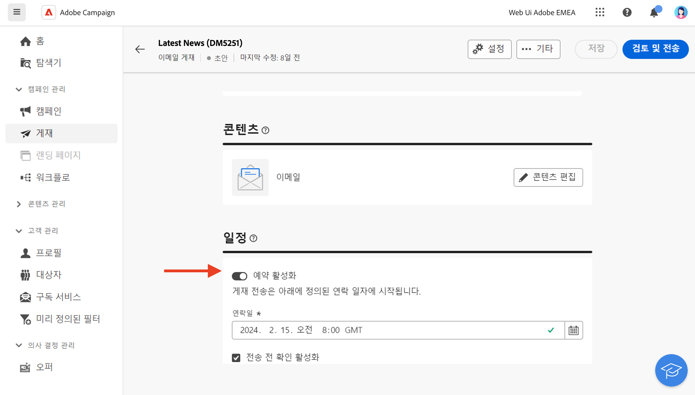

# 메시지 시작{#gs-messages}

>[!CONTEXTUALHELP]
>id="acw_deliveries_list"
>title="게재"
>abstract="게재는 이메일, SMS 또는 푸시 알림과 같은 특정 채널을 통해 대상자에게 전송되는 마케팅 커뮤니케이션입니다. 게재 목록에서 기존 게재를 편집할 수 있으며 상태, 연락처 및 수정 일자, KPI를 확인할 수 있습니다. “게재 만들기” 버튼을 클릭하여 새 게재를 추가합니다. 콘텐츠, 일정, 대상자 및 세부 정보를 조회하려면 게재를 선택합니다."

Adobe Campaign에서는 이메일, SMS, 푸시 알림 등 크로스 채널 캠페인을 보내고, 다양한 전용 보고서를 사용하여 캠페인의 효과를 측정할 수 있습니다.

이러한 메시지는 게재를 통해 디자인되고 전송되며 각 수신자에 대해 개인화할 수 있습니다. 이러한 게재는 독립 실행형이거나 마케팅 캠페인의 컨텍스트에서 워크플로우에 포함될 수 있습니다.

Adobe Campaign v8에는 다음과 같은 게재 채널이 포함되어 있습니다. 이메일, SMS 및 모바일 앱.

<table style="table-layout:fixed">
    <tr style="border: 0;">
    <td>
    
    
<a href="../email/create-email.md"><strong>이메일 작성</strong>
    

    

    </td>
    <td>
    
    

    <a href="../push/gs-push.md"><strong>푸시 알림 만들기</strong></a>
    

    

    </td>
    <td>
    
    

    <a href="../sms/create-sms.md"><strong>SMS 메시지 만들기</strong></a>
    

    

    </td>
    </tr>
    </table>

## 게재 만들기 {#create-delivery}

**[!UICONTROL 게재]** 왼쪽 메뉴에서 독립 실행형 게재를 만들거나, **[!UICONTROL 캠페인]** 왼쪽 메뉴의 마케팅 캠페인 컨텍스트에서 게재를 만들 수 있습니다.

아래 탭을 검색하여 게재를 만드는 방법에 대해 알아봅니다.

>[!BEGINTABS]

>[!TAB 독립 실행형 게재 만들기]

독립 실행형 게재를 만들려면 다음 단계를 수행하십시오.

1. 왼쪽 탐색 영역에서 **[!UICONTROL 게재]** 메뉴로 이동한 다음 **[!UICONTROL 게재 만들기]** 버튼을 클릭합니다.

   

1. 게재를 위한 채널을 선택합니다. 게재 채널과 이 섹션에서 게재 콘텐츠를 정의하는 방법에 대해 자세히 알아보십시오.

   * [이메일 채널](../email/create-email.md)
   * [푸시 알림 채널](../push/gs-push.md)
   * [SMS 채널](../sms/create-sms.md)

1. 기본 대상 및 컨트롤 그룹의 게재 대상자를 정의합니다. [이 섹션](../audience/about-audiences.md)에서 대상자에 대해 자세히 알아보십시오.
1. 메시지 콘텐츠를 정의합니다.
1. (선택 사항) 게재 정의 [예약](#gs-schedule). 일정이 정의되지 않은 경우 **[!UICONTROL 보내기]** 버튼을 클릭하면 메시지가 바로 전송됩니다.
1. **[!UICONTROL 검토 및 전송]** 버튼을 클릭하여 설정을 확인합니다.
1. **[!UICONTROL 콘텐츠 시뮬레이션]** 버튼을 사용하여 게재 및 개인화 설정을 테스트합니다. [이 섹션](../preview-test/preview-test.md)에서 메시지 시뮬레이션에 대해 자세히 알아보십시오.
1. **[!UICONTROL 준비]** 버튼을 클릭하여 대상 모집단을 계산하고 메시지를 생성합니다. 준비 단계는 몇 분 정도 소요될 수 있습니다. 준비가 완료되면 메시지를 전송할 준비가 되어 있습니다. 오류가 발생한 경우 **로그**&#x200B;로 이동하여 경고를 확인합니다.
1. 결과를 확인하고 **[!UICONTROL 보내기]** 버튼을 클릭하여 메시지 전송을 시작합니다.
1. 메시지가 전송되면 **보고서** 섹션으로 이동하여 주요 지표에 액세스합니다. [이 섹션](../reporting/delivery-reports.md)에서 게재 보고서에 대해 자세히 알아보십시오.

>[!TAB 캠페인 워크플로우에서 게재 만들기]

캠페인에서 게재를 만들려면 다음 단계를 수행하십시오.

1. 캠페인을 만들거나 기존 캠페인을 엽니다. [마케팅 캠페인](../campaigns/gs-campaigns.md)에 대해 자세히 알아보십시오.
1. 워크플로를 만들거나 기존 워크플로를 엽니다.
1. **[!UICONTROL 대상자 빌드]** 활동을 추가 및 구성하고 `+`버튼을 클릭합니다.

   

   **[!UICONTROL 대상자 빌드]** 활동은 [이 섹션](../workflows/activities/build-audience.md)에 자세히 설명되어 있습니다.

1. 게재 활동 선택: **[!UICONTROL 이메일]**, **[!UICONTROL SMS]**, **[!UICONTROL 푸시 알림(Android)]** 또는 **[!UICONTROL 푸시 알림(iOS)]**. 워크플로의 게재 채널과 [이 섹션](../workflows/activities/about-activities.md#channel)에서 게재 콘텐츠를 정의하는 방법에 대해 자세히 알아보십시오.
1. 워크플로를 시작하고 로그를 확인합니다.

워크플로를 만들지 않고도 캠페인에서 게재를 추가할 수도 있습니다. 이를 실현하려면 캠페인의 **[!UICONTROL 게재]** 탭을 클릭하고 **[!UICONTROL 게재 만들기]** 버튼을 클릭합니다.

구성 단계는 독립 실행형 게재와 비슷합니다.

캠페인을 구성하고, 캠페인에 속한 게재를 관리하는 방법에 대한 자세한 내용은 [이 섹션](../campaigns/gs-campaigns.md)을 참조하십시오.

>[!ENDTABS]

## 개인화 추가{#personalization}

Adobe Campaign에서 제공하는 메시지는 다양한 방식으로 개인화할 수 있습니다. [개인화 기능에 대해 자세히 알아보기](../personalization/gs-personalization.md).

캠페인을 사용하여 동적 콘텐츠를 만들고 개인화된 메시지를 보냅니다. 개인화 기능을 결합하여 메시지를 개선하고 맞춤형 사용자 경험을 만들 수 있습니다.

다음과 같은 작업을 수행하여 메시지 콘텐츠를 개인화할 수 있습니다.

* 동적 **개인화 필드** 삽입

  개인화 필드는 메시지의 첫 번째 수준 개인화에 사용됩니다. 개인화 편집기에서 데이터베이스에서 사용 가능한 모든 필드를 선택할 수 있습니다. 게재의 경우 수신자, 메시지 또는 게재와 관련된 모든 필드를 선택할 수 있습니다. 이러한 개인화 속성은 메시지의 제목 줄이나 본문에 삽입할 수 있습니다. [자세히 알아보기](../personalization/personalize.md)

* 미리 정의된 **콘텐츠 블록** 삽입

  Campaign에는 게재에 삽입할 수 있는 특정 렌더링이 포함된 개인화 블록 세트가 제공됩니다. 예를 들어 로고, 인사말 메시지 또는 메시지 미러 페이지에 대한 링크를 추가할 수 있습니다. 콘텐츠 블록은 개인화 편집기의 전용 항목에서 사용할 수 있습니다. [자세히 알아보기](../personalization/personalize.md#ootb-content-blocks)

* **조건부 콘텐츠** 만들기

  예를 들어 조건부 콘텐츠를 구성하여 수신자 프로필을 기반으로 동적 개인화를 추가합니다. 특정 조건이 true이면 텍스트 블록 및/또는 이미지가 삽입됩니다. [자세히 알아보기](../personalization/conditions.md)

* **맞춤형 오퍼** 추가

  수신자 위치, 현재 날씨 또는 마지막 구매 주문에 따라 메시지 콘텐츠에서 맞춤형 오퍼를 삽입합니다.

## 게재 미리보기 및 테스트

메시지 콘텐츠가 정의되면 미리보기를 통해 메시지 렌더링을 제어하고, 테스트 프로필을 사용하여 개인화 설정을 확인할 수 있습니다. [자세히 알아보기](../preview-test/preview-test.md)

## 게재 전송 예약 {#gs-schedule}

>[!CONTEXTUALHELP]
>id="acw_deliveries_email_schedule"
>title="전송 예약"
>abstract="메시지를 보낼 날짜와 정확한 시간을 정의합니다. 마케팅 메시지에 가장 적합한 시간을 선택하면 열람율을 극대화할 수 있습니다."

메시지를 보낼 날짜와 정확한 시간을 설정할 수 있습니다. 마케팅 메시지에 가장 적합한 시간을 선택하면 열람율을 극대화할 수 있습니다.

게재 전송을 예약하려면 게재를 열고 **예약** 섹션. 사용 **[!UICONTROL 예약 활성화]** 전환하여 활성화하고 원하는 전송 날짜 및 시간을 설정합니다. 게재를 전송하면 정의한 연락 일자부터 실제 전송이 시작됩니다.

기본적으로 **[!UICONTROL 전송 전에 확인 활성화]** 옵션이 활성화되어 있습니다. 이 옵션을 사용하려면 예약된 날짜 및 시간에 게재를 보내기 전에 전송을 확인해야 합니다. 예약된 날짜 및 시간에 자동으로 게재를 전송해야 하는 경우 이 옵션을 비활성화할 수 있습니다.

에서 예약된 게재를 보내는 단계 알아보기 [이 섹션](../monitor/prepare-send.md#schedule-the-send).

## 로그 모니터링 및 추적 {#gs-tracking-logs}

메시지를 게재한 후 마케팅 캠페인이 효율적이고 고객에게 도달하는지 확인하는 데 있어 게재 모니터링은 중요한 단계입니다.

게재 후 모니터링은 물론 게재 실패와 검역된 메시지가 어떻게 관리되는지 파악할 수 있습니다.

[이 섹션](../reporting/gs-reports.md)의 모니터링 및 추적 기능에 대해 자세히 알아봅니다.

## 게재 복제 {#delivery-duplicate}

게재 목록 또는 게재 대시보드에서 기존 게재의 사본을 만들 수 있습니다.

게재 목록에서 게재를 복제하려면 다음 단계를 수행합니다.

1. 게재 이름 옆 오른쪽에서 세 점 버튼을 클릭하여 복제합니다.
1. **[!UICONTROL 복제]**&#x200B;를 선택합니다.
1. 중복 확인: 새 게재 대시보드가 중앙 화면에서 열립니다.

대시보드에서 게재를 복제하려면 다음 단계를 수행합니다.

1. 게재를 열고 화면 상단의 **[!UICONTROL 자세히...]** 버튼을 클릭합니다.
1. **[!UICONTROL 복제]**&#x200B;를 선택합니다.
1. 중복 확인: 중앙 화면에서 새 게재는 현재 게재를 대체합니다.

## 게재 삭제 {#delivery-delete}

게재 목록(왼쪽 레일의 메인 게재 항목 또는 캠페인의 게재 목록 중 하나)에서 게재가 삭제됩니다.

게재 목록에서 게재를 삭제하려면 다음 단계를 수행합니다.

1. 게재 이름 옆 오른쪽에서 세 점 버튼을 클릭하여 복제합니다.
1. **[!UICONTROL 삭제]**&#x200B;를 선택합니다.
1. 삭제를 확인합니다.

모든 게재는 이 목록에서 사용할 수 있지만, 워크플로에서 생성된 게재는 여기에서 삭제할 수 없습니다. 워크플로 컨텍스트에서 생성된 게재를 삭제하려면 워크플로에서 게재 활동을 삭제해야 합니다.

워크플로에서 게재를 삭제하려면 다음 단계를 수행합니다.

1. 게재 활동을 선택합니다.
1. 오른쪽 패널의 **[!UICONTROL 삭제]** 아이콘을 클릭합니다.
1. 삭제를 확인합니다. 게재에 하위 노드가 있는 경우 하위 노드를 삭제하거나 유지하도록 선택할 수도 있습니다.

