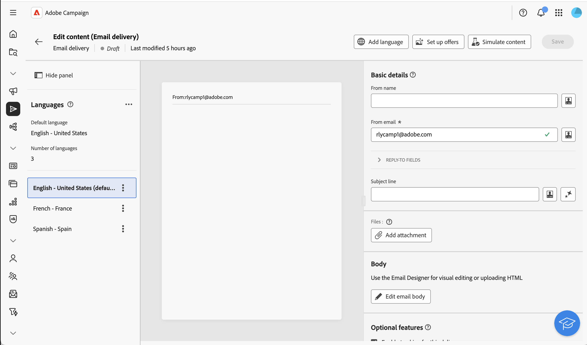

# 다국어 게재 구성 {#multilingual-delivery}

>[!CONTEXTUALHELP]
>id="acw_deliveries_email_multilingual"
>title="언어 추가"
>abstract="이 탭에서는 게재를 전송할 언어 목록을 찾을 수 있습니다. 언어 추가 버튼을 클릭하거나, 이 탭을 통해 다른 언어를 복제하여 더 많은 언어를 추가할 수 있습니다."

Campaign 웹 UI에서는 게재를 다국어로 설정하여 프로필의 기본 언어를 기반으로 메시지를 보낼 수 있습니다. 기본 설정이 정의되지 않으면 메시지가 기본 언어로 전송됩니다.

다국어 게재에서 언어 관리는 변형을 기반으로 합니다. 각 변형은 하나의 언어를 나타냅니다. 게재를 만드는 동안 메시지에 필요한 언어 수와 일치하도록 여러 언어 변형을 추가할 수 있습니다. 이러한 변형을 추가한 후 언제든지 기본 언어를 변경할 수도 있습니다.

다국어 기능은 현재 이메일, 푸시 알림, 트랜잭션 메시지 및 SMS에 사용할 수 있습니다.

>[!AVAILABILITY]
>
>다국어 푸시 알림, 트랜잭션 메시지 및 SMS는 조직 집합(제한된 가용성)에만 사용할 수 있으며 향후 릴리스에서 전역으로 롤아웃될 예정입니다. 서버를 8.8.2 이상으로 업그레이드해야 합니다.

다국어 게재를 설정하려면 다음 주요 단계를 따르십시오.

1. 언어 변형 추가, [자세히 보기](#add-variant)
1. 각 변형에 대한 콘텐츠를 정의합니다. [자세히 보기](#define-content)
1. 언어 변형을 관리합니다. [자세한 내용](#manage-variant)

## 언어 변형 추가{#add-variant}

언어 변형을 만들려면 다음 단계를 수행합니다.

1. 게재 대시보드에서 연필 아이콘을 클릭하여 게재 콘텐츠 편집 화면에 액세스한 다음 **[!UICONTROL 언어 추가]**&#x200B;를 클릭합니다.

   >[!IMPORTANT]
   >
   >**[!UICONTROL 언어 추가]** 단추는 대상 차원에 **언어** 스키마가 포함된 경우에만 사용할 수 있습니다. 스키마 및 대상 차원에 대한 자세한 내용은 [자세한 설명서](../audience/targeting-dimensions.md)를 참조하세요.

   {zoomable="yes"}

1. **언어 추가** 드롭다운에서 추가할 언어를 선택한 다음 확인합니다.

   추가하는 첫 번째 언어는 자동으로 기본값으로 설정되고 기존 콘텐츠는 기본 버전이 됩니다. 추가 언어가 추가되면 해당 콘텐츠는 처음에 기본 언어에서 복사됩니다.

   {zoomable="yes"}

   >[!NOTE]
   >
   >이 목록을 통해 사용할 수 있는 언어는 **Language** 특성으로 정의된 값(시스템, 사용자, dbenum 등)에 따라 다릅니다. 이 [섹션](../administration/enumerations.md)에서 열거형 관리에 대해 자세히 알아보세요.

1. 다른 언어를 추가하려면 이 작업을 반복하십시오. 왼쪽의 **[!UICONTROL 언어]** 패널에 선택한 언어 목록과 언어 수, 기본 언어가 표시됩니다.

   예를 들어 영어, 프랑스어 및 스웨덴어를 선택한 경우 다음과 같이 이 3개의 언어를 볼 수 있습니다.

   {zoomable="yes"}

   언어 변형을 관리하는 방법을 알아보려면 이 [섹션](#manage-variant)을 참조하세요.

## 각 변형에 대한 콘텐츠 정의{#define-content}

언어가 설정되면 각 언어에 대한 게재 콘텐츠를 정의합니다.

1. 게재 콘텐츠 편집 화면의 왼쪽에 있는 **[!UICONTROL 언어]** 패널에서 언어를 선택합니다.

   {zoomable="yes"}

1. 이 언어에 대한 메시지 콘텐츠를 정의합니다. 이 [섹션](../msg/create-deliveries.md)에서 자세히 알아보세요.

1. 각 언어에 대해 이 작업을 반복합니다.

<!--
>[!BEGINTABS]

>[!TAB Email delivery]

1. From the delivery content edition screen, choose a language and click the **[!UICONTROL Edit email body]** button. You can also hover over the email preview and select **[!UICONTROL Open email designer]**.

    {zoomable="yes"}

1. Define the content of your email for this language. [Read more](../email/get-started-email-designer.md#start-authoring)

1. Repeat this operation for each language.

>[!TAB SMS delivery]

1. From the delivery content edition screen, choose a language.

1. Edit the content of the SMS message for this language. [Read more](../sms/create-sms.md)

    {zoomable="yes"}

1. Repeat this operation for each language.

>[!ENDTABS]

-->

게재를 미리 보려면 **[!UICONTROL 콘텐츠 시뮬레이션]** 단추를 클릭하고 프로필을 선택하십시오. 각 프로필에 대해 올바른 콘텐츠가 표시되는지 확인하십시오.

{zoomable="yes"}

## 언어 변형 관리{#manage-variant}

왼쪽 패널에 모든 언어 변형 정보가 표시됩니다. 모든 언어를 삭제하려면 확장 단추를 클릭하고 **[!UICONTROL 모든 변형 삭제]**&#x200B;를 클릭합니다.

{zoomable="yes"}

언어 변형 목록에서 다음 작업을 수행할 수 있습니다.

* **편집**: 연결된 콘텐츠를 유지하면서 언어를 변경합니다.
* **기본값으로 설정**: 언어를 기본 언어로 설정합니다. 프로필에 정의된 언어가 없으면 기본 언어로 메시지가 전송됩니다.
* **복제**: 이 언어에 대해 정의된 콘텐츠를 복제하고 다른 변형을 선택합니다.
* **삭제**: 변형 및 관련 콘텐츠를 삭제합니다.

{zoomable="yes"}

