# 다국어 게재 구성 {#multilingual-delivery}

>[!CONTEXTUALHELP]
>id="acw_homepage_welcome_rn1"
>title="다국어 게재"
>abstract="이제 Campaign 웹 UI에서 여러 언어로 메시지를 보낼 수 있습니다. 푸시 알림의 경우 CSV 파일을 업로드하여 모든 언어 변형을 채웁니다."
>additional-url="https://experienceleague.adobe.com/docs/campaign-web/v8/release-notes/release-notes.html?lang=ko" text="릴리스 정보 참조"

>[!CONTEXTUALHELP]
>id="acw_deliveries_email_multilingual"
>title="언어 추가"
>abstract="이 탭에서는 게재를 전송할 언어 목록을 찾을 수 있습니다. 언어 추가 버튼을 클릭하거나, 이 탭을 통해 다른 언어를 복제하여 더 많은 언어를 추가할 수 있습니다."

>[!CONTEXTUALHELP]
>id="acw_multilingual_file_upload"
>title="언어 변형 가져오기"
>abstract="이 대화 상자를 사용하여 CSV 파일을 가져와 언어 변형을 추가할 수 있습니다. 파일은 선택한 언어에 대해 사용 가능한 모든 필드를 자동으로 채웁니다. 확인하기 전에 파일을 드래그 앤 드롭하거나 컴퓨터에서 선택할 수 있습니다."

Campaign 웹 UI에서는 게재를 다국어로 설정하여 프로필의 기본 언어를 기반으로 메시지를 보낼 수 있습니다. 기본 설정이 정의되지 않으면 메시지가 기본 언어로 전송됩니다.

다국어 게재에서 언어 관리는 변형을 기반으로 합니다. 각 변형은 하나의 언어를 나타냅니다. 게재를 만드는 동안 메시지에 필요한 언어 수와 일치하도록 여러 언어 변형을 추가할 수 있습니다. 이러한 변형을 추가한 후 언제든지 기본 언어를 변경할 수도 있습니다.

다국어 기능은 현재 이메일, 푸시 알림, 트랜잭션 메시지 및 SMS에 사용할 수 있습니다.

다국어 게재를 설정하려면 다음 주요 단계를 따르십시오.

1. 언어 변형 추가, [자세히 보기](#add-variant)
1. 각 변형에 대한 콘텐츠를 정의합니다. [자세히 보기](#define-content)
1. 언어 변형을 관리합니다. [자세한 내용](#manage-variant)

## 언어 변형 추가{#add-variant}

언어 변형을 만들려면 다음 단계를 수행합니다.

1. 게재 대시보드에서 연필 아이콘을 클릭하여 게재 콘텐츠 편집 화면에 액세스한 다음 **[!UICONTROL 언어 추가]**&#x200B;를 클릭합니다.

   >[!IMPORTANT]
   >
   >**[!UICONTROL 언어 추가]** 단추는 대상 차원에 **언어** 스키마가 포함된 경우에만 사용할 수 있습니다. 스키마 및 대상 차원에 대한 자세한 내용은 [자세한 설명서](../audience/targeting-dimensions.md)를 참조하세요.

   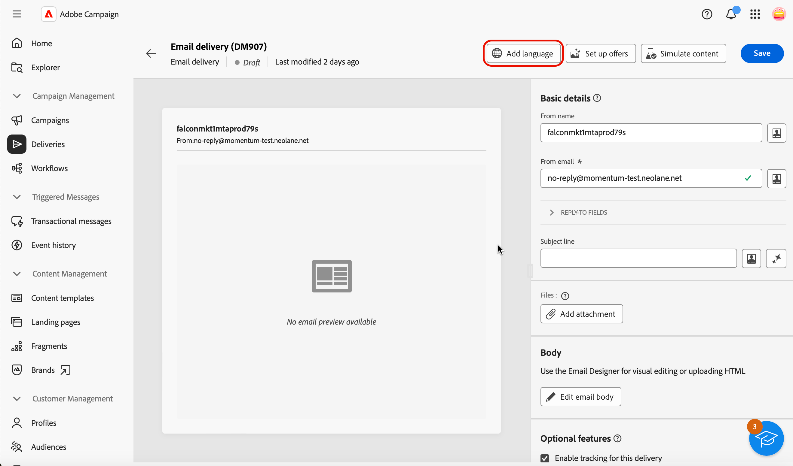{zoomable="yes"}

1. **언어 추가** 드롭다운에서 추가할 언어를 선택한 다음 확인합니다. 푸시 알림의 경우 [CSV 파일을 업로드](#csv-upload)하여 모든 언어 변형을 한 번에 가져올 수도 있습니다.

   추가하는 첫 번째 언어는 자동으로 기본값으로 설정되고 기존 콘텐츠는 기본 버전이 됩니다. 추가 언어가 추가되면 해당 콘텐츠는 처음에 기본 언어에서 복사됩니다.

   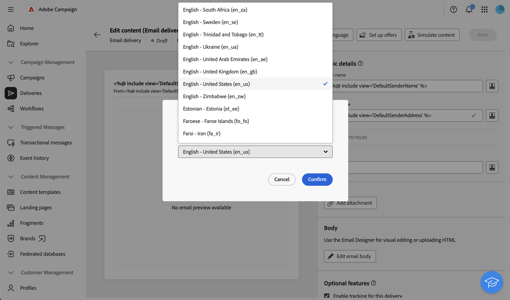{zoomable="yes"}

   >[!NOTE]
   >
   >이 목록을 통해 사용할 수 있는 언어는 **Language** 특성으로 정의된 값(시스템, 사용자, dbenum 등)에 따라 다릅니다. 이 [섹션](../administration/enumerations.md)에서 열거형 관리에 대해 자세히 알아보세요.

1. 다른 언어를 추가하려면 이 작업을 반복하십시오. 왼쪽의 **[!UICONTROL 언어]** 패널에 선택한 언어 목록과 언어 수, 기본 언어가 표시됩니다.

   예를 들어 영어, 프랑스어 및 스웨덴어를 선택한 경우 다음과 같이 이 3개의 언어를 볼 수 있습니다.

   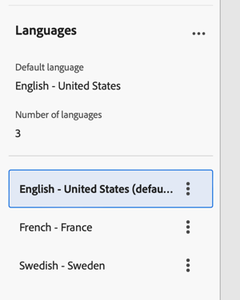{zoomable="yes"}

   언어 변형을 관리하는 방법을 알아보려면 이 [섹션](#manage-variant)을 참조하세요.

## 각 변형에 대한 콘텐츠 정의{#define-content}

언어가 설정되면 각 언어에 대한 게재 콘텐츠를 정의합니다.

1. 게재 콘텐츠 편집 화면의 왼쪽에 있는 **[!UICONTROL 언어]** 패널에서 언어를 선택합니다.

   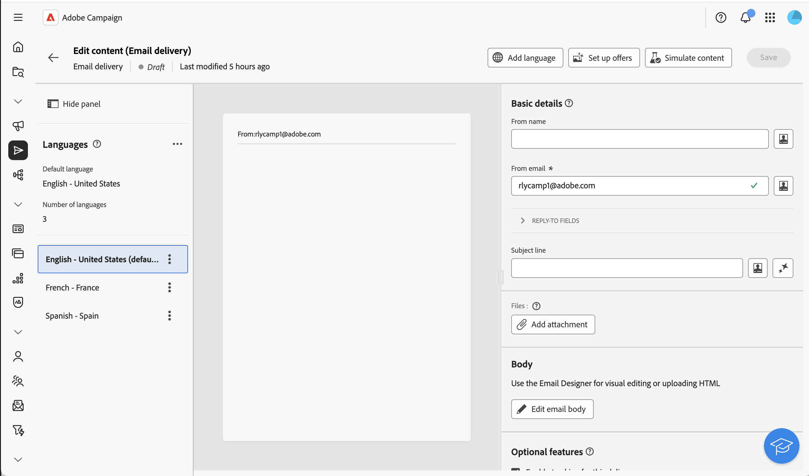{zoomable="yes"}

1. 이 언어에 대한 메시지 콘텐츠를 정의합니다. 이 [섹션](../msg/create-deliveries.md)에서 자세히 알아보세요.

1. 각 언어에 대해 이 작업을 반복합니다.

<!--
>[!BEGINTABS]

>[!TAB Email delivery]

1. From the delivery content edition screen, choose a language and click the **[!UICONTROL Edit email body]** button. You can also hover over the email preview and select **[!UICONTROL Open email designer]**.

    {zoomable="yes"}

1. Define the content of your email for this language. [Read more](../email/get-started-email-designer.md#start-authoring)

1. Repeat this operation for each language.

>[!TAB SMS delivery]

1. From the delivery content edition screen, choose a language.

1. Edit the content of the SMS message for this language. [Read more](../sms/create-sms.md)

    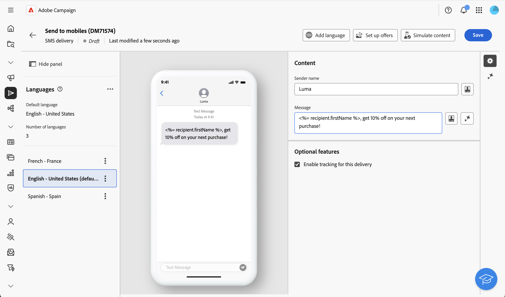{zoomable="yes"}

1. Repeat this operation for each language.

>[!ENDTABS]

-->

게재를 미리 보려면 **[!UICONTROL 콘텐츠 시뮬레이션]** 단추를 클릭하고 프로필을 선택하십시오. 각 프로필에 대해 올바른 콘텐츠가 표시되는지 확인하십시오.

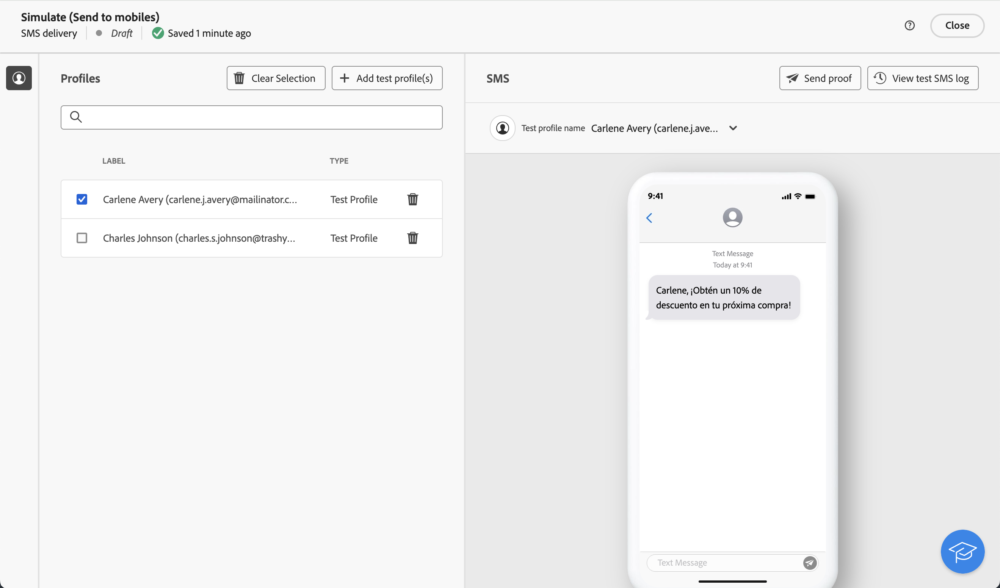{zoomable="yes"}

## 언어 변형 관리{#manage-variant}

왼쪽 패널에 모든 언어 변형 정보가 표시됩니다. 모든 언어를 삭제하려면 확장 단추를 클릭하고 **[!UICONTROL 모든 변형 삭제]**&#x200B;를 클릭합니다.

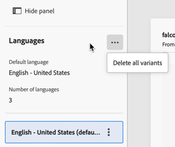{zoomable="yes"}

언어 변형 목록에서 다음 작업을 수행할 수 있습니다.

* **편집**: 연결된 콘텐츠를 유지하면서 언어를 변경합니다.
* **기본값으로 설정**: 언어를 기본 언어로 설정합니다. 프로필에 정의된 언어가 없으면 기본 언어로 메시지가 전송됩니다.
* **복제**: 이 언어에 대해 정의된 콘텐츠를 복제하고 다른 변형을 선택합니다.
* **삭제**: 변형 및 관련 콘텐츠를 삭제합니다.

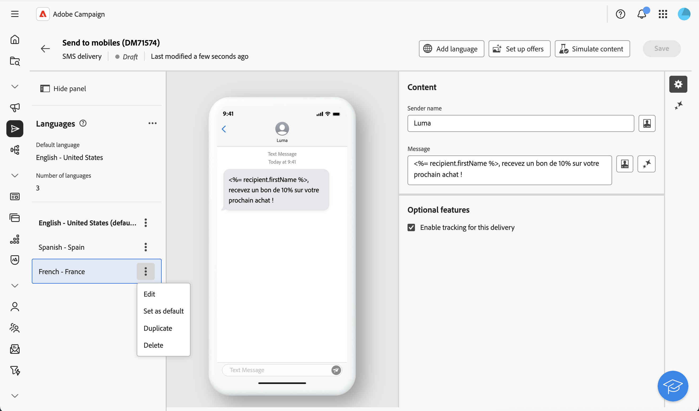{zoomable="yes"}

## CSV에서 언어 변형 가져오기(푸시 알림) {#csv-upload}

푸시 알림의 경우 다국어 콘텐츠가 포함된 CSV 파일을 업로드하면 모든 언어 변형을 빠르게 채울 수 있습니다. 이 기능을 사용하면 오프라인에서 콘텐츠를 준비하고 일괄적으로 가져올 수 있으므로 다국어 캠페인을 간소화할 수 있습니다.

* **효율성**: 한 번의 작업으로 여러 언어 및 해당 콘텐츠 추가
* **일관성**: 모든 언어 변형에서 균일한 메시징을 확인하십시오.
* **Collaboration**: 콘텐츠 팀이 익숙한 스프레드시트 도구에서 번역을 준비할 수 있도록 합니다.
* **일괄 관리**: 많은 수의 언어 변형을 쉽게 관리하고 업데이트합니다.

### 필수 구성 요소 {#csv-best-practices}

성공적인 CSV 가져오기를 확인하려면 다음 모범 사례를 따르십시오.

* **정확한 열 구조를 사용합니다**: 일부 열을 비워 두더라도 14개의 열이 모두 CSV 파일에 있어야 합니다. 열이 누락되면 가져오기에 실패합니다. 다른 순서를 사용할 수 있지만 모든 열이 있어야 합니다.
* **열 이름과 정확히 일치**: 열 이름은 대/소문자를 구분합니다. `title`이(가) 아닌 `Title`, `badge`이(가) 아닌 `Bbadge`, `locale`이(가) 아닌 `Locale`을(를) 사용합니다.
* **소문자 로케일 코드 사용**: 로케일 코드의 서식을 `en_us` 또는 `fr_fr`이(가) 아닌 `de_de`, `en_US`, `en-us`(밑줄이 있는 소문자)로 지정합니다.
* **필수 열 채우기**: `locale` 및 `language` 열은 모든 행에 대한 값을 포함해야 합니다. 값이 비어 있으면 가져오기 오류가 발생합니다.
* **로케일 고유 유지**: 각 로케일 코드는 CSV 파일에 한 번만 표시되어야 합니다. 중복 로케일이 거부됩니다.
* **UTF-8로 저장**: 국제 문자를 올바르게 지원하려면 항상 CSV 파일을 UTF-8 인코딩으로 저장하십시오.
* **쉼표가 포함된 콘텐츠 인용**: 제목이나 메시지 본문에 쉼표가 포함된 경우 전체 필드를 큰따옴표로 묶으십시오. `"Hello, welcome!"`.
* **숫자 값을 올바르게 사용**: 플래그 열(isContentAvailable, isMutableContent, silentPush)의 경우, true의 경우 `1`을(를) 사용하고, false의 경우 `0`을(를) 사용하거나, 기본적으로 비워 두십시오.
* **JSON 형식 유효성 검사**: customFields 열을 사용하는 경우 JSON의 형식이 올바른지 확인하십시오. `{"key":"value"}` 따옴표와 대괄호가 올바른지 확인하십시오.
* **최소 데이터로 먼저 테스트**: 간단한 2~3개 언어 CSV로 시작하여 큰 파일을 만들기 전에 형식을 확인하십시오.

>[!NOTE]
>
>열 구조가 이 [섹션](#csv-columns)에 자세히 설명되어 있습니다.

### CSV 파일 가져오기 {#csv-steps}

CSV 파일에서 언어 변형을 가져오려면 다음 단계를 수행합니다.

1. 게재 콘텐츠 편집기에서 **[!UICONTROL 언어 추가]**&#x200B;를 클릭합니다.

   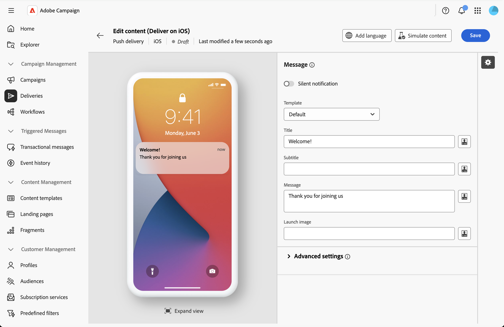{zoomable="yes"}

1. CSV 파일을 업로드 영역으로 끌어다 놓아 선택하거나 을(를) 클릭하여 컴퓨터를 찾습니다.

   시스템이 파일 형식 및 콘텐츠의 유효성을 검사합니다. 유효성 검사가 실패하면 오류 메시지에 잘못된 열 또는 데이터가 표시됩니다. CSV 파일의 문제를 해결하고 다시 업로드하십시오. 이 [섹션](#csv-troubleshooting)을 참조하십시오.

   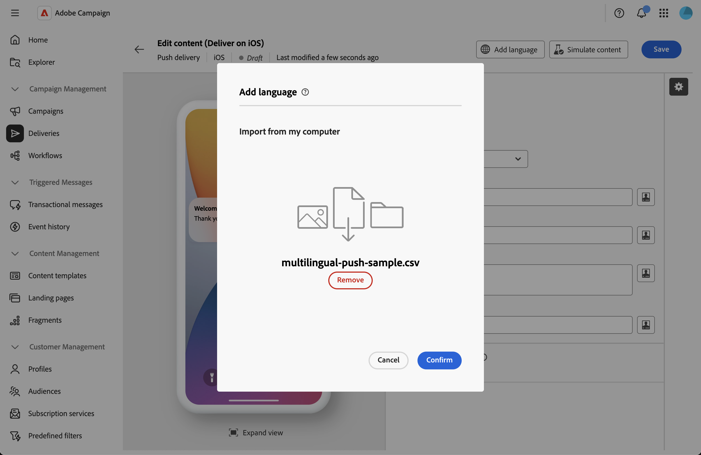{zoomable="yes"}

1. 언어 변형 패널에서 가져온 콘텐츠를 검토하여 올바르게 로드된 모든 번역을 확인합니다.

   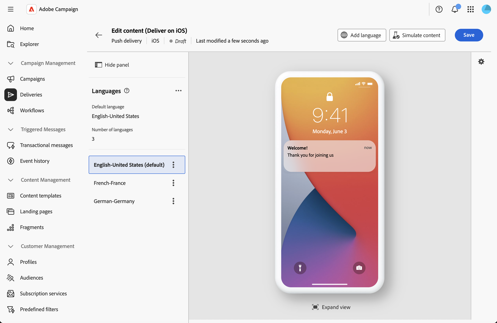{zoomable="yes"}

### 열 구조 {#csv-columns}

다음은 사용할 올바른 열 구조입니다.

>[!NOTE]
>
>다른 순서를 사용할 수 있지만 모든 열이 있어야 합니다. 자세한 모범 사례는 이 [섹션](#csv-best-practices)을 참조하세요.

1. **제목**: 알림 제목(필수)
1. **messageBody**: 알림 메시지 본문(필수)
1. **사운드**: 사운드 파일 이름(예: `default`, `custom_sound.mp3`) - 기본적으로 비워 둡니다.
1. **배지**: 앱 아이콘(iOS)에 표시할 배지 번호 - 숫자만 사용
1. **deeplinkURI**: 알림을 탭할 때 열 딥링크 URL입니다. 사용하지 않을 경우 비워 둡니다.
1. **category**: 사용자 지정 작업에 대한 알림 범주 식별자(iOS) - 사용되지 않는 경우 공백으로 남김
1. **iosMediaAttachmentURL**: iOS 알림에 대한 미디어 첨부 파일의 URL - 사용되지 않는 경우 공백으로 남김
1. **androidMediaAttachmentURL**: Android 알림에 대한 미디어 첨부 파일의 URL - 사용되지 않는 경우 공백으로 남김
1. **isContentAvailable**: 콘텐츠 사용 가능 플래그(iOS) - true에는 `1`, false에는 `0`을(를) 사용하고, 기본값으로 사용하려면 비워 둡니다(0).
1. **isMutableContent**: 변경 가능한 콘텐츠 플래그(iOS) - true에는 `1`, false에는 `0`을(를) 사용하고, 기본값에는 비워 둡니다.
1. **customFields**: JSON 형식의 사용자 지정 데이터(예: `{"key1":"value1","key2":"value2"}`) - 사용되지 않는 경우 비워 둡니다.
1. **locale**: 언어 코드(필수) - 예: `en_us`, `fr_fr`, `de_de` - **필수, 행당 고유해야 함**
1. **언어**: 언어 이름(필수) - 예: `English-United States`, `French-France` - **필수**
1. **silentPush**: 자동 푸시 플래그 - 자동 푸시는 `1`, 일반은 `0`을(를) 사용하고 기본값은 비워 둡니다(0).

### CSV 파일의 예 {#csv-examples}

다음은 필수 필드가 있는 기본 예입니다.

```csv
title,messageBody,sound,badge,deeplinkURI,category,iosMediaAttachmentURL,androidMediaAttachmentURL,isContentAvailable,isMutableContent,customFields,locale,language,silentPush
Welcome!,Thank you for joining us,,,,,,,,,, en_us,English-United States,0
Bienvenue !,Merci de nous avoir rejoint,,,,,,,,,,fr_fr,French-France,0
Willkommen!,Vielen Dank für Ihre Anmeldung,,,,,,,,,, de_de,German-Germany,0
¡Bienvenido!,Gracias por unirte a nosotros,,,,,,,,,, es_es,Spanish-Spain,0
```

다음은 선택적 필드가 있는 예입니다.

```csv
title,messageBody,sound,badge,deeplinkURI,category,iosMediaAttachmentURL,androidMediaAttachmentURL,isContentAvailable,isMutableContent,customFields,locale,language,silentPush
Welcome!,Thank you for joining us,default,1,,,https://example.com/welcome-en.jpg,https://example.com/welcome-en.jpg,,,, en_us,English-United States,0
Bienvenue !,Merci de nous avoir rejoint,default,1,,,https://example.com/welcome-fr.jpg,https://example.com/welcome-fr.jpg,,,, fr_fr,French-France,0
Willkommen!,Vielen Dank für Ihre Anmeldung,default,1,,,https://example.com/welcome-de.jpg,https://example.com/welcome-de.jpg,,,, de_de,German-Germany,0
¡Bienvenido!,Gracias por unirte a nosotros,default,1,,,https://example.com/welcome-es.jpg,https://example.com/welcome-es.jpg,,,, es_es,Spanish-Spain,0
```

다음은 사용자 정의 필드의 예입니다

```csv
title,messageBody,sound,badge,deeplinkURI,category,iosMediaAttachmentURL,androidMediaAttachmentURL,isContentAvailable,isMutableContent,customFields,locale,language,silentPush
New Collection,Discover our latest products,default,1,,,,,,,"{"campaign":"summer2025","segment":"premium"}",en_us,English-United States,0
Nouvelle Collection,Découvrez nos derniers produits,default,1,,,,,,,"{"campaign":"summer2025","segment":"premium"}",fr_fr,French-France,0
```

>[!NOTE]
>
>회전 메뉴 또는 작업 단추가 있는 리치 푸시 알림의 경우 Campaign은 CSV 가져오기와 다른 구성 방법을 사용합니다. 기본 다국어 콘텐츠를 가져온 후 게재 편집기에서 직접 리치 푸시 콘텐츠를 구성합니다.

### CSV 파일로 Personalization {#csv-personalization}

CSV 콘텐츠의 개인화 필드를 사용하려면 `<span>` 태그를 사용해야 합니다.

```csv
title,messageBody,sound,badge,deeplinkURI,category,iosMediaAttachmentURL,androidMediaAttachmentURL,isContentAvailable,isMutableContent,customFields,locale,language,silentPush
"Hello <span class=""nl-dce-field nl-dce-done"" data-nl-expr=""recipient.firstName"">recipient.firstName</span>","Your order has shipped!",,,,,,,,,,en_us,English-United States,0
"Bonjour <span class=""nl-dce-field nl-dce-done"" data-nl-expr=""recipient.firstName"">recipient.firstName</span>","Votre commande a été expédiée !",,,,,,,,,,fr_fr,French-France,0
```

게재 중에 Campaign은 이러한 자리 표시자를 실제 수신자 데이터로 바꿉니다.

### 문제 해결 {#csv-troubleshooting}

| 오류 | 원인 | 솔루션 |
|-------|-------|----------|
| 필수 열 누락 | CSV 파일에 14개 열이 모두 포함되어 있지 않습니다. | CSV에 14개의 열이 모두 위에 표시된 정확한 순서로 포함되어 있는지 확인합니다. 사용하지 않는 열에 대해 빈 값을 사용합니다. |
| 잘못된 로케일/언어 값 | 로케일 또는 언어 열이 비어 있습니다. | 로케일과 언어 열 모두에 모든 행에 대한 값이 있어야 합니다. |
| 중복 로케일 | 동일한 로케일 코드가 여러 번 나타남 | 각 로케일 값은 고유해야 함 - 중복 행 제거 |
| 파일 인코딩 문제 | CSV 파일이 호환되지 않는 인코딩을 사용함 | UTF-8 인코딩으로 CSV 파일 저장 |
| 열 불일치 | 행의 열 개수가 헤더와 다릅니다. | 모든 행에 헤더와 일치하는 열이 정확히 14개 있는지 확인합니다. |
| 잘못된 숫자 값 | 배지, isContentAvailable, isMutableContent 또는 silentPush에 숫자가 아닌 값이 포함되어 있습니다. | 플래그에는 숫자 0이나 1만 사용하고, 기본적으로 비워 둡니다. |
| 잘못된 JSON | customFields 열에 잘못된 JSON이 포함되어 있음 | JSON 구문이 올바른지 확인하십시오. `{"key":"value"}` 또는 비워 두십시오. |
| 열 이름 대/소문자 불일치 | 열 이름이 정확하게 일치하지 않음 | 열 이름은 대소문자를 구분합니다. 위에 표시된 정확한 이름을 사용하십시오(예: `badge` 또는 `Badge`이(가) 아닌 `BADGE`). |

>모범 사례는 이 [섹션](#csv-best-practices)에 나열되어 있습니다. 열 구조가 이 [섹션](#csv-columns)에 자세히 설명되어 있습니다.
