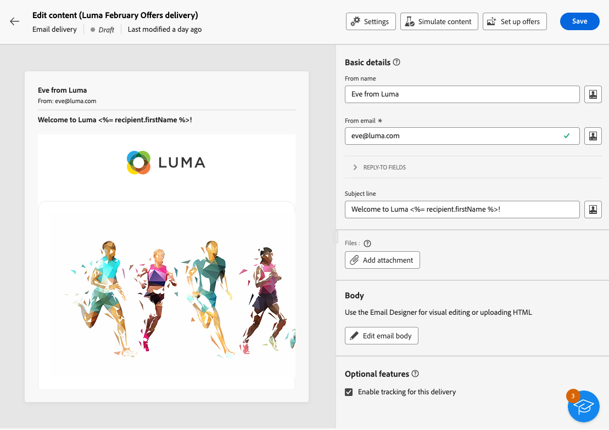

# 메시지에 오퍼 추가 {#offers-content}

Adobe Campaign 웹 사용자 인터페이스에서 게재에 오퍼를 추가할 수 있습니다. 다음 오퍼는 **오퍼** 오퍼 목록에 액세스할 수 있는 왼쪽 메뉴 이러한 모든 오퍼는 읽기 전용이며 Campaign 클라이언트 콘솔에서 다음을 사용하여 작성해야 합니다. **[!UICONTROL 상호 작용]** 모듈. 상호 작용 및 콘솔에서 오퍼 카탈로그를 관리하는 방법에 대한 자세한 내용은 [Campaign v8(클라이언트 콘솔) 설명서](https://experienceleague.adobe.com/docs/campaign/campaign-v8/offers/interaction.html){target="_blank"}.

게재와 함께 오퍼를 보내는 단계는 다음과 같습니다.

1. [제안할 오퍼 구성](#configure)
1. [게재에 오퍼 삽입](#insert)

## 제안할 오퍼 구성 {#configure}

>[!CONTEXTUALHELP]
>id="acw_deliveries_email_offers_settings"
>title="오퍼 매개변수 정의"
>abstract="오퍼 공간, 필요한 경우 범주 및 테마를 정의하여 수신자에게 제안할 오퍼를 구성하고 게재에 삽입할 오퍼 수를 지정합니다."

>[!CONTEXTUALHELP]
>id="acw_deliveries_email_offers_advanced_settings"
>title="오퍼 고급 설정 지정"
>abstract="적격 제안이 충분하지 않은 수신자를 제외하도록 활성화하고 오퍼 중 하나가 존재하지 않는 경우 메시지가 처리되는 방법을 선택할 수 있습니다."

Adobe Campaign을 사용하면 하나 또는 여러 개의 특정 오퍼를 제안하여 주어진 연락처에 대한 상호 작용 중에 실시간으로 응답할 수 있습니다. 이러한 오퍼는 간단한 통신 메시지, 하나 또는 여러 제품에 대한 특별 오퍼 또는 서비스일 수 있습니다.

게재에 추가할 오퍼를 선택하려면 아래 단계를 따르십시오.

1. 다음을 클릭합니다. **[!UICONTROL 오퍼 설정]** [게재 콘텐츠 편집] 화면의 단추

   

1. 수신자에게 제안할 오퍼를 구성합니다.

   먼저 **[!UICONTROL 오퍼 공간]** 오퍼 환경과 일치합니다. 에서 오퍼 공간을 만드는 방법을 알아봅니다. [Campaign v8(클라이언트 콘솔) 설명서](https://experienceleague.adobe.com/docs/campaign/campaign-v8/offers/interaction-settings/interaction-offer-spaces.html){target="_blank"}.

   

1. 엔진의 오퍼 선택을 세분화하려면 오퍼가 정렬되어 있는 특정 **[!UICONTROL 오퍼 범주]**&#x200B;를 선택합니다.

   폴더를 선택하면 모든 하위 폴더가 자동으로 포함되며 제거할 수 없습니다. 다음 사항에 주의하십시오. [!DNL Campaign] 인터페이스는 이 동작을 반영하지 않습니다.

   >[!NOTE]
   >
   >범주를 지정하지 않는 경우 **[!UICONTROL 오퍼 테마]**&#x200B;가 선택되어 있지 않으면 오퍼 엔진에서 환경에 포함된 모든 오퍼가 고려됩니다.

1. (선택 사항) 테마를 입력하여 범주를 필터링합니다. 테마는 카테고리에서 업스트림으로 정의된 키워드입니다. 필터와 같은 역할을 하며, 범주 세트에서 테마를 선택하여 표시할 오퍼 수를 세분화할 수 있습니다.

1. 사용 **[!UICONTROL 제안]** 게재에 삽입할 오퍼 수를 지정하는 필드입니다.

1. 필요한 경우 **[!UICONTROL 부적격 수신자 제외]** 옵션을 선택하십시오.

   이 옵션을 사용하면 적격 오퍼가 충분하지 않은 수신자의 제외를 활성화하거나 비활성화할 수 있습니다.

   * 옵션을 활성화하면 제안이 충분하지 않은 수신자는 게재에서 제외됩니다.
   * 옵션을 비활성화하면 이러한 수신자가 제외되지는 않지만 요청된 제안 수를 가질 수 없습니다.

1. 필요한 경우 **[!UICONTROL 오퍼가 선택되지 않은 경우 모두 숨기기]** 옵션을 선택하십시오.

   이 옵션을 사용하면 제안 중 하나가 없는 경우 메시지를 처리하는 방법을 선택할 수 있습니다.

   * 이 옵션을 활성화하면 누락된 제안의 표현식이 표시되지 않으며 이 제안에 대한 메시지에 콘텐츠가 표시되지 않습니다.
   * 옵션을 비활성화하면 메시지 자체가 전송 중에 취소되며 수신자는 더 이상 메시지를 받을 수 없게 됩니다.

게재에 제안하도록 오퍼를 구성했으면 게재 콘텐츠에 오퍼를 삽입할 수 있습니다.

## 게재에 오퍼 삽입 {#insert}

오퍼를 게재에 추가할 수 있는 방법: [표현식 편집기](../personalization/gs-personalization.md#access). 제목란이나 게재 본문에 삽입할 수 있습니다.

>[!CAUTION]
>
>오퍼를 게재에 삽입하기 전에 다음을 확인하십시오. [해당 게재를 제안할 오퍼를 구성했습니다.](#configure).

표현식 편집기를 사용하여 오퍼를 삽입하려면 아래 단계를 수행합니다.

1. 제목란 또는 게재의 콘텐츠에 액세스합니다.

1. 오퍼를 삽입할 위치에 마우스 커서를 놓고 개인화 아이콘을 사용하여 표현식 편집기를 엽니다.

   

1. 다음 항목 선택 **[!UICONTROL 제안]** 메뉴 아래의 제품에서 사용할 수 있습니다. 사용 가능한 제안이 목록에 표시됩니다.

   >[!NOTE]
   >
   >제안 수는 다음과 같은 경우에 정의됩니다. [오퍼 설정](#configure) 현재 게재용.

1. 개인화 필드, 렌더링 함수 또는 오퍼 속성을 사용하여 각 제안을 정의합니다.

   

   >[!NOTE]
   >
   >사용 가능한 제안 수는 엔진 호출이 구성되는 방식에 따라 다르며 오퍼 순서는 오퍼의 우선 순위에 따라 다릅니다. 다음에서 자세히 알아보기 [Campaign v8(클라이언트 콘솔) 설명서](https://experienceleague.adobe.com/docs/campaign/campaign-v8/offers/interaction-best-practices.html){target="_blank"}.

1. 변경 내용을 저장합니다.

1. 콘텐츠를 완료하고 테스트하여 게재를 전송합니다. [자세히 알아보기](gs-messages.md)

이제 수신자가 게재를 받으면 해당 특정 프로필에 올바른 오퍼가 표시됩니다.
