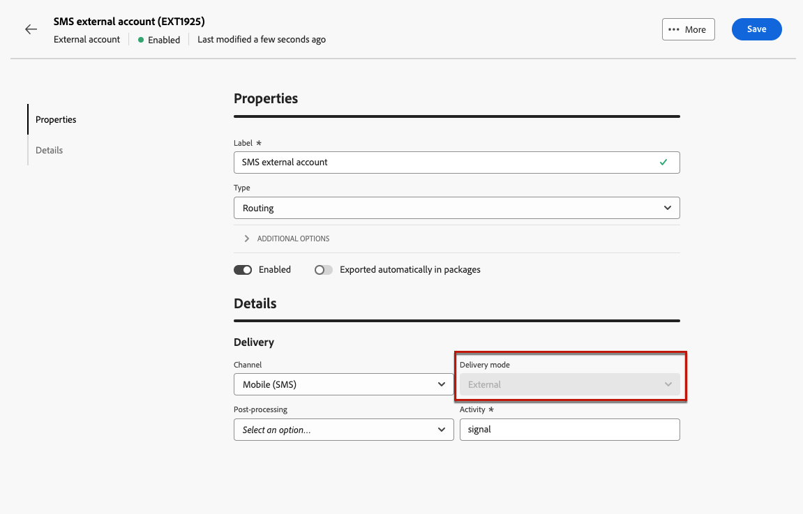

# 외부 게재 보내기 {#gs-direct-mail}

Adobe Campaign을 사용하면 Campaign 외부에서 만든 게재를 처리하여 외부 시스템을 통해 개인화된 이메일, SMS 메시지 또는 푸시 알림(iOs 및 Android)을 대량으로 전달할 수 있습니다.

<!--The supported channels are Email, Mobile (SMS), and Push (iOs and Android).-->

외부 게재를 만들 때 Adobe Campaign은 타겟팅된 모든 프로필과 선택한 데이터가 포함된 추출 파일을 자동으로 생성합니다. 이 파일은 선택한 서버로 전송되며 서버는 전송 프로세스를 처리합니다.

## 전용 외부 계정 만들기 {#routing-external-account}

먼저 외부 게재에서 사용할 특정 외부 계정을 구성해야 합니다. **[!UICONTROL 라우팅]** 형식이어야 합니다.

>[!NOTE]
>
>[이 섹션](../administration/external-account.md#routing)에서 라우팅 유형 외부 계정을 만드는 방법을 알아봅니다.

예를 들어 외부 계정에 대한 **[!UICONTROL 모바일(SMS)]** 채널을 선택하십시오. **[!UICONTROL 외부]**&#x200B;이(가) 기본적으로 **[!UICONTROL 배달 모드]**(으)로 선택됩니다.

{zoomable="yes"}

## 외부 게재 만들기 및 보내기 {#create-external-delivery}

특정 외부 계정이 구성되면 외부 게재를 만듭니다. 아래 단계를 수행합니다.

1. 게재를 만듭니다. [방법 알아보기](create-deliveries.md)

   세 가지 옵션이 있습니다.

   * **워크플로우에서**: 외부 채널 활동(이메일, SMS 또는 푸시)을 워크플로우에 추가합니다. 워크플로 구성 방법에 대한 자세한 지침은 [이 페이지](../workflows/gs-workflow-creation.md)를 참조하십시오.
   * **캠페인에서**: 캠페인을 만들면 전자 메일, SMS 또는 푸시 채널 외부 게재를 만들 수 있습니다. 캠페인 설정에 대한 자세한 내용은 [이 페이지](../campaigns/gs-campaigns.md)를 참조하십시오.
   * **독립 실행형 게재**: 개별 외부 게재를 통해 직접 및 즉시 고객 참여를 유도합니다. [게재를 만드는 방법 알아보기](../msg/gs-deliveries.md)

1. 게재 또는 게재 템플릿 [설정](../advanced-settings/delivery-settings.md)에서 선택한 채널(이 예에서는 SMS 채널)에 대해 만든 외부 계정을 선택하고 저장합니다.

   {zoomable="yes"}

   >[!NOTE]
   >
   >게재를 만드는 경우 **[!UICONTROL 라우팅]** 유형의 외부 계정을 사용하여 [게재 템플릿](delivery-template.md)을(를) 선택했는지 확인하십시오. 그렇지 않으면 [위](#routing-external-account)에서 만든 전용 계정을 선택할 수 없습니다.

1. 게재 **[!UICONTROL 콘텐츠]** 섹션에서 **[!UICONTROL 콘텐츠 편집]**&#x200B;을 클릭합니다.

   {zoomable="yes"}

1. 표준 게재와 달리 메시지 자체의 콘텐츠를 디자인하지 않습니다. 대신 외부 시스템으로 전송할 파일의 속성과 열을 정의해야 합니다.

   {zoomable="yes"}

   [DM 게재](../direct-mail/content-direct-mail.md)에서 생성된 추출 파일의 콘텐츠를 디자인할 때와 동일한 단계를 따릅니다.

   * 추출 파일의 속성을 정의합니다. [자세히 알아보기](../direct-mail/content-direct-mail.md#properties)
   * 해당 파일로 내보낼 정보가 포함된 열을 선택합니다. [자세히 알아보기](../direct-mail/content-direct-mail.md#content)

1. 파일을 미리 보고 <!--not in UI right now - to check--> 증명을 보낼 수 있습니다. [방법 알아보기](../direct-mail/send-direct-mail.md#preview-dm)

   {zoomable="yes"}

1. 게재를 전송하여 추출 파일을 생성합니다. [방법 알아보기](../direct-mail/send-direct-mail.md#send-dm)

게재를 전송하면 추출 파일이 자동으로 생성되고 게재 템플릿의 설정에서 선택한 [외부 계정](../administration/external-account.md#create-ext-account)에 지정된 위치로 내보내집니다.

게재 페이지에서 KPI를 추적하고 **[!UICONTROL 로그]** 메뉴에서 데이터를 추적할 수 있습니다.