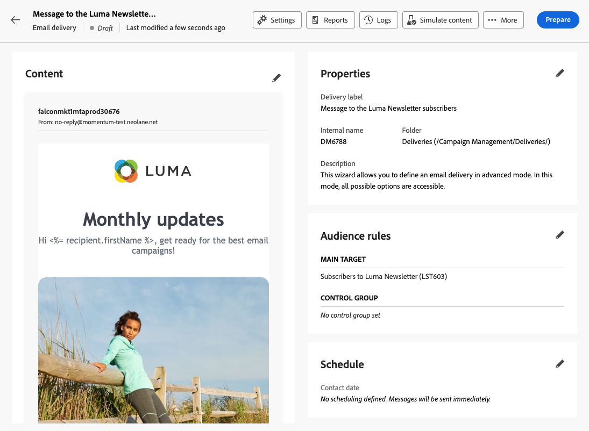

# 서비스 구독자에게 메시지 보내기 {#send-to-subscribers}

Adobe Campaign에서 구독 서비스를 만들고 구독자에게 메시지를 보낼 수 있습니다. 에서 구독 서비스를 만드는 방법 알아보기 [이 페이지](../audience//manage-services.md#create-service).

구독자에게 메시지를 보내려면 특정 대상을 만들어 구독자를 식별한 다음 아래에 설명된 대로 게재를 만듭니다.

1. 대상자를 만듭니다. 새 워크플로우는 자동으로 만들어집니다. [대상자에 대해 자세히 알아보기](../audience/create-audience.md)

1. 가독성을 높이려면 워크플로 설정에서 워크플로 이름을 변경합니다. **레이블** 필드. [워크플로우 설정 구성 방법 알아보기](../workflows/workflow-settings.md)

1. 를 엽니다. **[!UICONTROL 대상자 작성]** 활동 및 선택 **[!UICONTROL 대상자 만들기]**. [대상자 빌드 활동을 구성하는 방법 알아보기](../workflows/activities/build-audience.md)

   {zoomable=&quot;yes&quot;}

1. 대상자 만들기 흐름에서 다음 사용자 지정 조건을 선택합니다. **[!UICONTROL 구독]** 다음과 같이 존재합니다. **[!UICONTROL 서비스]** 은(는) 정의한 서비스와 같습니다. 이 예에서 **Luma 요가 뉴스레터**.

   {zoomable=&quot;yes&quot;}

1. 선택 **[!UICONTROL 확인]** 및 클릭 **[!UICONTROL 시작]** 워크플로우를 실행합니다.

1. 게재를 만듭니다. 게재를 만드는 단계는에 자세히 설명되어 있습니다. [이 페이지](../msg/gs-messages.md#create-delivery).
1. 게재 설정으로 이동하여 기본 대상 매핑을 다음으로 변경 **구독(nms:subscriptions)**.

   {zoomable=&quot;yes&quot;}

1. 게재의 기본 타겟 섹션에서 위에서 만든 대상자를 선택합니다.

   {zoomable=&quot;yes&quot;}

1. 에 자세히 설명된 대로 메시지 콘텐츠를 만들고 게재를 테스트하고 전송합니다. [이 섹션](../preview-test/preview-test.md).

   {zoomable=&quot;yes&quot;}

게재는 해당 서비스 가입자에게만 전송됩니다.
