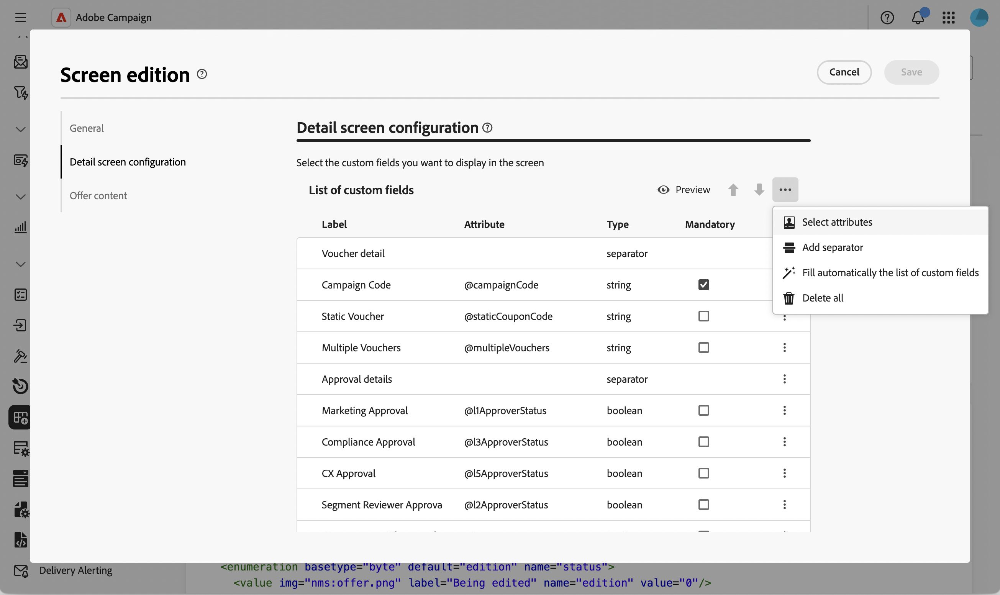
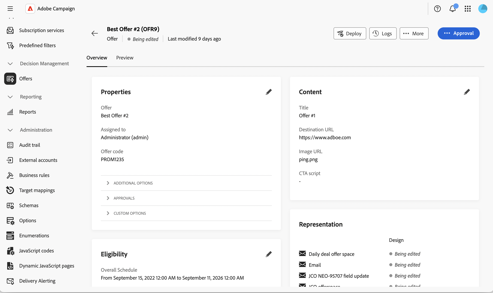

# 오퍼 스키마에 편집 가능한 목록 추가 {#offer-editable-list}

오퍼에 연결된 세그먼트 집합과 같은 사용자 지정 컬렉션 링크로 [스키마](../administration/schemas.md)를 확장하면 오퍼의 **[!UICONTROL 사용자 지정 옵션]** 섹션에서 바로 편집 가능한 목록으로 표시할 수 있습니다.  [!DNL nms:offer] 별도의 화면을 통해 관련 레코드를 관리하는 대신, 컬렉션이 오퍼 세부 정보의 목록으로 렌더링되며 전용 대화 상자를 통해 인라인으로 새 관련 레코드를 만들 수 있습니다.

>[!NOTE]
>
>이 기능은 현재 오퍼 스키마에만 사용할 수 있습니다.

## 컬렉션 링크 필드 추가 {#add-field}

1. 사용자 지정 컬렉션으로 [!DNL nms:offer] 스키마를 확장한 다음 **[!UICONTROL 스키마]** 메뉴로 이동하여 **[!UICONTROL 마케팅 오퍼]** 스키마를 열고 **[!UICONTROL 화면 편집]**&#x200B;을 클릭하세요. [자세히 알아보기](../administration/schemas-browse-access.md#screen-def).

   {zoomable="yes"}

1. **[!UICONTROL 세부 정보 화면 구성]** 섹션에서 **[!UICONTROL 사용자 지정 필드 목록]** 테이블 위의 줄임표 아이콘을 클릭하고 **[!UICONTROL 특성 선택]**&#x200B;을(를) 선택합니다. [자세히 알아보기](../administration/schemas-custom-fields.md).

   {zoomable="yes"}

1. 속성을 검색하고 해당 컬렉션 아이콘으로 식별되는 사용자 지정 컬렉션 링크를 선택합니다.

   {zoomable="yes"}

   >[!NOTE]
   >
   >컬렉션 링크 필드는 필수로 지정할 수 없으며 하위 특성을 지원하지 않습니다. 기본적으로 양식에서 두 개의 열에 걸쳐 있습니다.

1. 선택 내용을 확인합니다. 컬렉션 링크가 **[!UICONTROL 컬렉션]**&#x200B;을(를) 형식으로 하는 **[!UICONTROL 사용자 지정 필드 목록]** 테이블에 추가됩니다.

   {zoomable="yes"}

## 컬렉션의 편집 가능한 목록 구성 {#configure-list}

1. 컬렉션 필드 행의 줄임표 아이콘을 클릭하고 **[!UICONTROL 편집]**&#x200B;을 선택하여 **[!UICONTROL 컬렉션 링크 설정]** 대화 상자를 엽니다.

   {zoomable="yes"}

1. **[!UICONTROL 일반]** 탭에서 선택적으로 **[!UICONTROL 보이는 경우]** 조건을 설정하거나 **[!UICONTROL 읽기 전용]**&#x200B;을 사용하도록 설정하십시오.

   {zoomable="yes"}

1. **[!UICONTROL 화면 구성]** 탭에서 **[!UICONTROL 특성 선택]**&#x200B;을 클릭하고 목록에 새 요소(예: 세그먼트 이름 및 사용자 지정 필드)를 추가할 때 사용할 특성을 선택합니다.

   {zoomable="yes"}

1. **[!UICONTROL 레이아웃]** 탭에서 **[!UICONTROL 두 열 분산]**&#x200B;을 유지하거나 지웁니다.

1. **[!UICONTROL 확인]**&#x200B;을 클릭한 다음 화면 정의를 **[!UICONTROL 저장]**&#x200B;합니다.

## 오퍼에서 편집 가능한 목록 사용 {#use-list}

1. 왼쪽 메뉴에서 **오퍼**&#x200B;를 클릭하고 오퍼를 엽니다. [자세히 보기](create-offer.md#create)

   {zoomable="yes"}

1. 오퍼 속성에 액세스합니다. 컬렉션이 **사용자 지정 옵션** 섹션의 목록으로 렌더링됩니다.

   {zoomable="yes"}

1. **[!UICONTROL 추가]**&#x200B;를 클릭하여 구성한 특성을 표시하고 입력한 다음 **[!UICONTROL 확인]**&#x200B;을 클릭합니다. 새 요소가 목록에 추가됩니다.

   동일한 목록에 여러 요소를 추가할 수 있으며 오퍼 세부 사항에 둘 이상의 편집 가능한 목록이 포함될 수 있습니다.

1. **[!UICONTROL 저장]**&#x200B;을 클릭합니다.

<!--
Each element added through the editable list creates a new related record. For instance, adding a segment to an offer generates the following payload:

```xml
<offer ...>
  <offerSegment segmentName="..." _operation="insert"/>
</offer>
```
-->