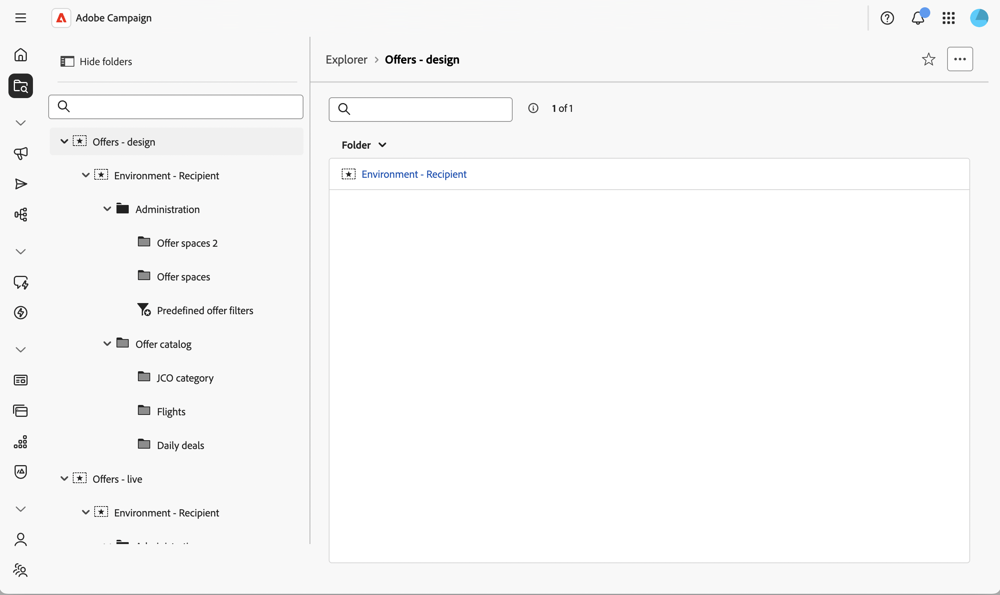
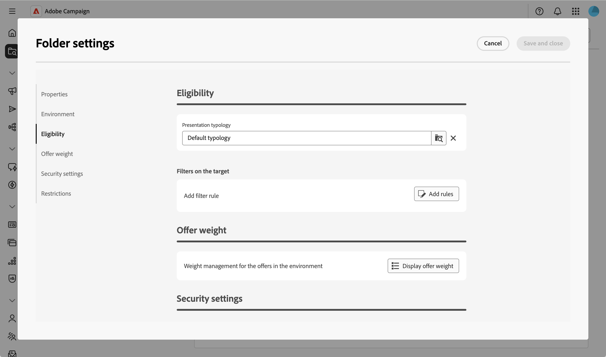

# 오퍼 환경 설정 검토 {#offer-environment}

**오퍼 환경**&#x200B;은(는) 오퍼 카탈로그 및 관련 오퍼 공간을 구성하는 컨테이너입니다. 환경에는 두 가지 유형이 있습니다.

* 오퍼를 만들고 구성하고 승인하는 **디자인** 환경
* 승인된 오퍼와 배포된 오퍼를 게재 선택에 사용할 수 있는 읽기 전용 **Live** 환경.

각 **디자인** 환경은 **Live** 환경에 연결되어 있습니다. 오퍼가 완료되고 승인되면 자동으로 **Live** 환경에 배포되어 게재할 수 있습니다.

환경을 보여주는 {zoomable="yes"}

기본적으로 Campaign에는 기본 제공 수신자 테이블(식별된 오퍼)을 타깃팅하도록 사전 구성된 두 개의 **디자인** 및 **라이브** 환경이 포함되어 있습니다.

인바운드 상호 작용을 위해 웹 사이트를 방문하는 익명 프로필과 같은 다른 테이블을 타겟팅하려면 추가 환경(타겟팅 차원당 환경)을 만들어야 합니다. [Campaign v8 설명서](https://experienceleague.adobe.com/en/docs/campaign/campaign-v8/offers/interaction-settings/interaction-env#create-an-offer-environment){target="_blank"}를 참조하세요.

## 오퍼 환경 액세스 {#offer-environment-settings}

오퍼 환경은 폴더로 저장됩니다. 환경 설정(자격, 가중치 관리, 보안)에 액세스하고 검토하려면 다음 단계를 수행합니다.

>[!CAUTION]
>
>이러한 설정은 수정할 수 있지만, 변경 사항으로 인해 기존 구현이 손상될 수 있으므로 주의해야 합니다.

1. 왼쪽 탐색 메뉴에서 **[!UICONTROL 탐색기]**&#x200B;를 열고 **디자인 환경** 노드 아래에서 오퍼 환경 폴더를 찾습니다.

1. ... 단추를 클릭하고 **[!UICONTROL 폴더 설정]**&#x200B;을 선택하여 환경 설정을 표시합니다.

   {zoomable="yes"}

1. 다른 섹션을 검토하십시오. 오퍼 환경 그룹 오퍼 특정 옵션의 폴더 설정입니다.

   {zoomable="yes"}

   대부분의 설정은 클라이언트 콘솔에서 사용할 수 있는 오퍼 환경 구성을 미러링합니다. 자세한 내용은 관련 [Campaign v8 설명서](https://experienceleague.adobe.com/docs/campaign/campaign-v8/offers/interaction-env.html){target="_blank"}를 참조하십시오.

<!--
## Create a new offer environment {#create}

If you need to manage a separate offer catalog — for example, for a different targeting dimension — you can create a new **Design** environment directly from the Web UI.

1. From the left navigation menu, open the **[!UICONTROL Explorer]** and locate the **Offers - design** folder.

1. Create a new folder from this location, then open its properties and fill in the environment-specific settings described below.

The **[!UICONTROL Linked live environment]** field is set automatically when the environment is created — see [Type of environment](#type).

## Access the offer environment settings {#access}

Offer environments are stored as folders. To access an environment and modify its properties, follow these steps. 

1. From the left navigation menu, open the **[!UICONTROL Explorer]** and locate the offer environment folder under the **Design environment** node.

1. Click on the ... button, and select **[!UICONTROL Folder settings]** to display the environment settings.

  {zoomable="yes"}

The folder settings of an offer environment group offer-specific options into several sections. 

-->
<!-- 
Most settings mirror the offer environment configuration available in the Adobe Campaign client console.
-->
<!-- 

## Properties {#properties}

This section is common to all folders. It allows you to define the **Label** of the folder and modify the technical folder properties.  

{zoomable="yes"}

-->
<!--

* **[!UICONTROL Label]** — Display name of the environment.

Expand **[!UICONTROL Additional options]** to access the technical properties of the folder:

* **[!UICONTROL Internal name]** — Unique identifier of the folder. Used to reference the environment from schemas, workflows, and API calls. The internal name is set at creation and should not be changed afterwards.

* **[!UICONTROL Full name]** — Read-only path of the folder in the Explorer tree (for example, `/Offers - design/Environment - Recipient/`).

* **[!UICONTROL Template]** — Read-only name of the folder template the environment is based on (for example, **[!DNL nmsOfferEnv]** for an offer environment).

* **[!UICONTROL Created by]** / **[!UICONTROL Modified by]** — Audit fields populated automatically with the operator that created and last modified the folder.

This section gathers the offer-specific settings of the folder.

-->
<!--

## Environment {#env-section}

  {zoomable="yes"}

### Type of environment {#type}

* **[!UICONTROL Type of environment]** — Switches the folder between **[!UICONTROL Design]** and **[!UICONTROL Live]**. The type is set when the environment is created. Changing it later is not recommended.

 **[!UICONTROL Linked live environment]** — Displays the read-only **[!UICONTROL Live]** environment that receives the deployed offers. Set automatically when the environment is created.

### Execution instances {#execution-instances}

* **[!UICONTROL Display execution instances]** — Opens the list of execution instances mapped to the environment. This section is only displayed when the multi-instance execution option is activated. Refer to the [Campaign v8 documentation](https://experienceleague.adobe.com/docs/campaign/campaign-v8/offers/interaction-architecture.html#distributed-architecture){target="_blank"}.

### Targets of this environment {#targets}

  {zoomable="yes"}

* **[!UICONTROL Environment dedicated to incoming anonymous interactions]** — Activates anonymous interaction features on the environment. This relies on a target mapping for the visitor targeting dimension, which you can now create directly from the Web UI — see [Manage target mappings](../administration/target-mappings.md). Refer to the [Campaign v8 documentation](https://experienceleague.adobe.com/docs/campaign/campaign-v8/offers/interaction-env.html#create-an-offer-environment){target="_blank"} for the full anonymous interaction setup.

-->
<!--
and [Anonymous interactions](https://experienceleague.adobe.com/docs/campaign/campaign-v8/offers/anonymous-interactions.html){target="_blank"}.
-->
<!--

* **[!UICONTROL Targeting dimension]** — Schema and table of the contacts targeted by the offers contained in this environment (for example, **[!DNL Recipients (nms:recipient)]**). The targeting dimension is reused by every offer and offer space of the environment.

### Storage of generated propositions {#storage}

* **[!UICONTROL Storage dimension]** — Schema and table where the propositions generated through this environment are stored (for example, **[!DNL Recipient offer propositions (nms:propositionRcp)]**).

* **[!UICONTROL Call data schema]** — Schema used to capture the data of each call to the Offer engine (for example, **[!DNL Interactions (nms:interaction)]**). For details on this schema, refer to the [Campaign v8 data model documentation](https://experienceleague.adobe.com/docs/campaign/campaign-v8/dev/datamodel.html){target="_blank"}.

### Implicit identification (if the function is enabled in the space) {#implicit-identification}

* **[!UICONTROL Target mapping]** — Used to configure the **changeover process**, which lets the Offer engine switch between an identified and an anonymous environment depending on whether the contact can be identified during an inbound interaction. Leave this field empty when implicit identification is not used. Learn how to create and manage target mappings directly from the Web UI in [Manage target mappings](../administration/target-mappings.md). For the offer-specific changeover process configuration, refer to [Campaign v8 documentation](https://experienceleague.adobe.com/docs/campaign/campaign-v8/offers/anonymous-interactions.html){target="_blank"}.

-->
<!--
## Eligibility {#eligibility}

  {zoomable="yes"}

* **[!UICONTROL Presentation typology]** — Typology rule of type **[!UICONTROL Offer presentation]** referenced by the environment. Presentation typologies exclude offers based on the proposition history of a recipient. You can edit these rules directly from the Web UI's **[!UICONTROL Business rules]** screen — see [Work with business rules (typologies)](../administration/typologies.md). Refer to the [Campaign v8 documentation](https://experienceleague.adobe.com/docs/campaign/campaign-v8/offers/interaction-offer.html#offer-presentation){target="_blank"} for the full rule reference.

* **[!UICONTROL Filters on the target]** — Filter rules that apply to every offer in the environment. Use **[!UICONTROL Add rules]** to open the rule builder and restrict the audience targeted by all offers contained in this environment.

## Offer weight {#offer-weight}

* **[!UICONTROL Display offer weight]** — Click the **Display offer weight** button to open the read-only list of offer weights included in the environment folder. Weights themselves are configured at the offer space and the offer levels — refer to [Create and publish an offer](create-offer.md#eligibility).

## Security settings and Restrictions {#security}

These two sections are generic Campaign folder controls. They are not specific to offer management.

* **[!UICONTROL Security settings]** — The **[!UICONTROL Group or operator]** table defines the operators and operator groups allowed to read, write, or delete the environment and its contents. For Interaction-specific operator roles (Offer manager, Delivery manager), refer to [Operators of the Interaction module](https://experienceleague.adobe.com/docs/campaign/campaign-v8/offers/interaction-operators.html){target="_blank"}.

* **[!UICONTROL System folder]** — When enabled, marks the folder as a system folder.

* **[!UICONTROL Restrictions]** — Lets you turn the folder into a view by enabling **[!UICONTROL This folder is a view]** and clicking **[!UICONTROL Edit restrictions]** to define a filter on the records displayed in the folder.
-->
그런 다음 [오퍼 공간을 만들고](offer-space.md)하여 오퍼가 노출되는 위치와 방법을 정의합니다.
