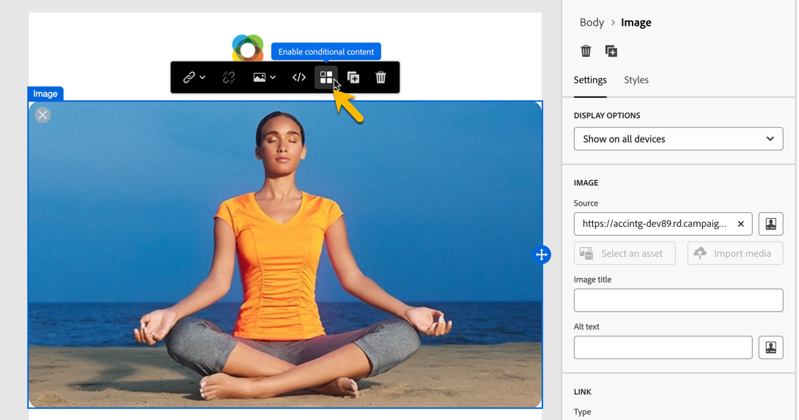
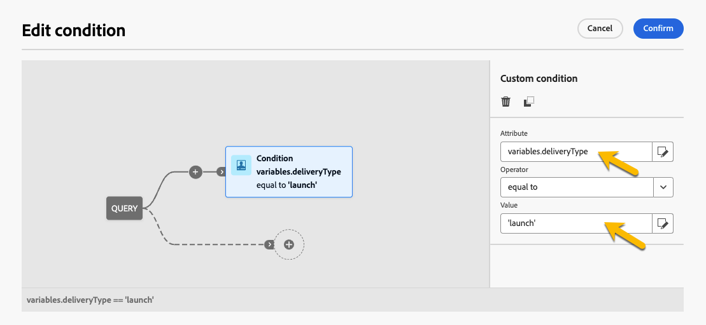

# 조건부 콘텐츠 작성{#add-conditions}

>[!CONTEXTUALHELP]
>id="acw_conditional_content"
>title="조건부 콘텐츠 추가"
>abstract="조건부 콘텐츠 필드를 구성하여 수신자 프로필 데이터를 기반으로 고급 동적 개인화를 만듭니다. 텍스트 블록, 링크, 제목 줄 및/또는 이미지는 특정 조건이 충족되면 메시지 콘텐츠에서 교체됩니다."

## 조건부 콘텐츠 시작 {#gs}

조건부 콘텐츠는 수신자의 프로필 데이터를 기반으로 동적 개인화를 만들 수 있는 강력한 기능으로, 특정 조건이 충족되면 자동으로 텍스트 블록 및 이미지를 대체합니다. 이 기능은 캠페인을 새로운 차원으로 끌어올리고 대상자에게 고도로 타겟팅되고 개인 맞춤화된 경험을 제공할 수 있습니다.

조건부 콘텐츠 필드를 구성하여 예를 들어 수신자의 프로필을 기반으로 고급 동적 개인화를 만들 수 있습니다. 특정 조건이 충족되면 메시지 콘텐츠에서 텍스트 블록, 링크, 제목란 및/또는 이미지가 교체됩니다. 예를 들어 Adobe Campaign 데이터베이스의 Gender 필드 값에 따라 &#39;Mr&#39; 또는 &#39;Mrs&#39;를 표시하거나 수신자 기본 언어를 기반으로 다른 링크를 포함할 수 있습니다.

조건부 콘텐츠를 만들려면 특정 도우미 함수를 사용하여 **식 편집기**&#x200B;에서 조건을 만들어야 합니다. 이 방법은 제목란 또는 이메일 링크 및 텍스트/버튼 콘텐츠 구성 요소와 같이 표현식 편집기에 액세스할 수 있는 모든 필드의 모든 게재 채널에 사용할 수 있습니다. [식 편집기에 액세스하는 방법 알아보기](gs-personalization.md#access)

표현식 편집기 외에도 전자 메일 본문의 요소에 대해 여러 변형을 만들 수 있는 전자 메일을 디자인할 때 전용 **조건부 콘텐츠 빌더**&#x200B;를 활용할 수 있습니다. [전자 메일에 조건부 콘텐츠를 만드는 방법을 알아봅니다](#condition-condition-builder)

## 표현식 편집기에서 조건 만들기 {#condition-perso-editor}

>[!CONTEXTUALHELP]
>id="acw_personalization_editor_conditions"
>title="조건"
>abstract="이 메뉴를 사용하면 도우미 함수를 활용하여 조건부 콘텐츠를 정의할 수 있습니다."

표현식 편집기를 사용하여 게재에 대한 조건부 콘텐츠를 정의하려면 아래 단계를 수행합니다. 이 예제에서는 수신자의 언어(프랑스어 또는 영어)를 기반으로 조건부 콘텐츠를 만들려고 합니다.

1. 게재를 열고 콘텐츠 편집 섹션으로 이동합니다.

1. 조건부 콘텐츠를 추가할 필드를 찾습니다. 예를 들어 SMS 메시지에 조건부 콘텐츠를 추가할 수 있습니다.

1. 필드 옆에 있는 **[!UICONTROL 개인화 대화 상자 열기]** 아이콘을 클릭하여 표현식 편집기를 엽니다.

   {zoomable="yes"}

1. 개인화 편집기에서 왼쪽의 **[!UICONTROL 조건]** 메뉴를 찾습니다.

1. 조건 작성을 시작하려면 **If** 함수 옆에 있는 &#39;+&#39; 아이콘을 클릭합니다. 다음 줄이 중앙 화면에 추가됩니다. `<% if (<FIELD>==<VALUE>) { %>Insert content here<% } %>`

   * `<FIELD>`을(를) 받는 사람의 언어(예: `recipient.language`)와 같은 개인화 필드로 바꾸십시오.
   * `<VALUE>`을(를) 충족할 값으로 바꾸십시오. 예: `'French'`.
   * `Ìnsert content here`을(를) 지정된 조건을 충족하는 프로필에 표시할 콘텐츠로 바꾸십시오.

     {zoomable="yes"}{width="800" align="center"}

1. 수신자가 조건을 충족하지 않을 경우 표시되어야 하는 콘텐츠를 지정합니다. 이렇게 하려면 **else** 도우미 함수를 사용합니다.

   1. `%>` 태그를 닫는 식 앞에 커서를 놓고 **Else** 함수 옆에 있는 `+`을(를) 클릭합니다.

   1. `Ìnsert content here`을(를) if 함수의 조건에 맞지 않는 프로필에 표시할 콘텐츠로 바꿉니다.

   {zoomable="yes"}{width="800" align="center"}

   **else if** 도우미 함수를 사용하여 여러 콘텐츠 변형이 있는 조건을 작성할 수도 있습니다. 예를 들어 아래 표현식은 수신자의 언어에 따라 메시지의 세 가지 변형을 표시합니다.

   {zoomable="yes"}{width="800" align="center"}

   >[!NOTE]
   >
   >도우미 함수를 추가할 때마다 함수 전후에 여는(`<%`) 태그와 닫는(`%>`) 태그가 자동으로 추가됩니다.
   >
   >표현식 내에 &quot;Else&quot; 도우미 함수를 추가한 후의 예: >
   >
   >`<% if (<FIELD>==<VALUE>) { %>Insert content here<% } <% else { %> Insert content here<% } %>%>`
   >
   >구문 오류를 방지하려면 이러한 태그를 제거해야 합니다. 이 예제에서 **else** 함수 태그를 제거한 후 수정된 식은 다음과 같습니다.
   >
   >`<% if (<FIELD>==<VALUE>) { %>Insert content here<% } else { %> Insert content here<% } %>`

1. 상태가 준비되면 콘텐츠를 저장하고 콘텐츠를 시뮬레이션하여 렌더링을 확인할 수 있습니다.

## 이메일에 조건부 콘텐츠 만들기 {#condition-condition-builder}

이메일의 조건부 콘텐츠는 다음 두 가지 방법으로 만들 수 있습니다.
* 도우미 함수를 사용하여 조건을 빌드하여 표현식 편집기에서
* 이메일을 디자인할 때 액세스할 수 있는 전용 조건부 콘텐츠 빌더에서.

다음 섹션에서는 이메일 Designer의 조건부 콘텐츠 기능을 사용하여 조건을 만드는 방법에 대한 단계별 지침을 제공합니다. 식 편집기를 사용하여 조건을 만드는 방법에 대한 자세한 내용은 [여기](#condition-perso-editor)를 참조하세요.

이 예제에서는 수신자의 언어를 기반으로 여러 변형이 있는 이메일 메시지를 만들려고 합니다. 다음 단계를 수행하십시오.

1. 이메일 게재를 만들거나 열고 콘텐츠를 편집한 다음 **[!UICONTROL 이메일 본문 편집]** 단추를 클릭하여 이메일 디자인 작업 영역을 엽니다.

1. 콘텐츠 구성 요소를 선택하고 **[!UICONTROL 조건부 콘텐츠 활성화]** 아이콘을 클릭합니다.

   {zoomable="yes"}{width="800" align="center"}

1. **[!UICONTROL 조건부 콘텐츠]** 창이 화면 왼쪽에 열립니다. 이 창에서는 조건을 사용하여 선택한 콘텐츠 구성 요소의 변형을 여러 개 만들 수 있습니다.

1. 첫 번째 변형을 구성합니다. **[!UICONTROL 조건부 콘텐츠]** 창의 **[!UICONTROL 변형 - 1]** 위로 마우스를 가져간 후 **[!UICONTROL 조건 추가]** 단추를 클릭하십시오.

   {zoomable="yes"}{width="800" align="center"}

1. 쿼리 모델러가 열립니다. 수신자의 프로필 데이터를 필터링하여 조건을 만들 수 있습니다. [쿼리 모델러를 사용하여 작업하는 방법을 알아봅니다](../query/query-modeler-overview.md).

   메시지의 첫 번째 변형에 대한 조건이 준비되면 **[!UICONTROL 확인]**&#x200B;을 클릭합니다. 이 예제에서는 언어가 &#39;프랑스어&#39;인 수신자를 타겟팅하는 규칙을 만들고 있습니다.

   {zoomable="yes"}{width="800" align="center"}

1. 이제 규칙이 변형과 연결됩니다. 가독성을 높이기 위해 줄임표 메뉴를 클릭하여 변형 이름을 바꾸는 것이 좋습니다.

1. 메시지를 보낼 때 규칙이 충족되는 경우 구성 요소가 표시되는 방식을 구성합니다. 이 예제에서는 수신자의 선호 언어인 경우 프랑스어로 텍스트를 표시하려고 합니다.

   {zoomable="yes"}{width="800" align="center"}

1. 콘텐츠 구성 요소에 필요한 만큼 변형을 추가합니다. 언제든지 변형 간을 전환하여 조건부 규칙에 따라 콘텐츠 구성 요소가 표시되는 방식을 확인할 수 있습니다.

   >[!NOTE]
   >메시지를 보낼 때 변형에 정의된 규칙이 모두 충족되지 않으면 콘텐츠 구성 요소는 **[!UICONTROL 조건부 콘텐츠]** 창에서 **[!UICONTROL 기본 변형]**&#x200B;에 정의된 콘텐츠를 표시합니다.

## 조건부 콘텐츠에 변수 사용 {#variables-conditional}

변수는 게재에서 조건부 콘텐츠에 사용할 수 있습니다.

[게재에 변수 추가](../advanced-settings/delivery-settings.md#variables-delivery)에 대해 자세히 알아보세요.

조건부 컨텐츠를 넣을 요소를 선택합니다.

{zoomable="yes"}

변수를 사용하려면 아래와 같이 **[!UICONTROL 표현식 편집]** 단추를 사용하여 조건을 구성하십시오.
이 예제에서는 변수 값이 `launch`일 때 이 이미지가 표시됩니다.

{zoomable="yes"}

예를 들어 다른 이미지가 표시되는 경우 값이 `reminder`인 다른 변형을 만들 수도 있습니다.
