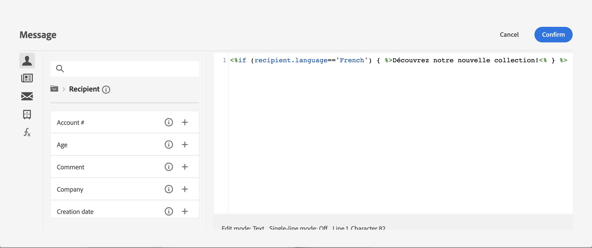
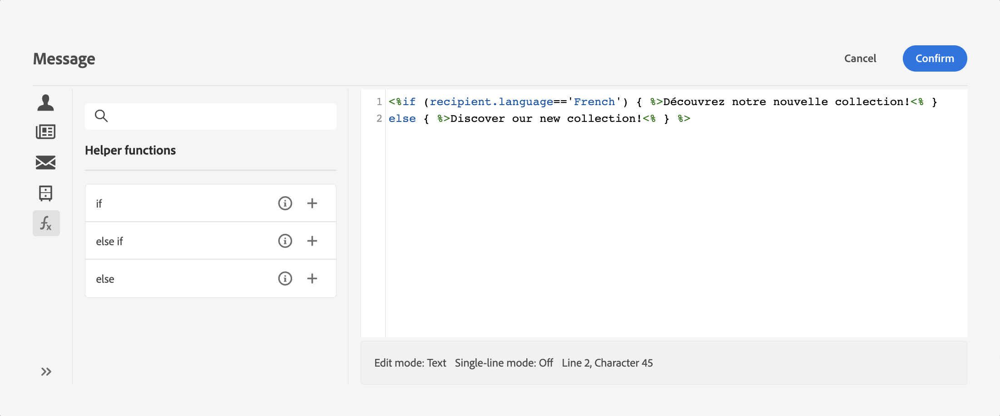
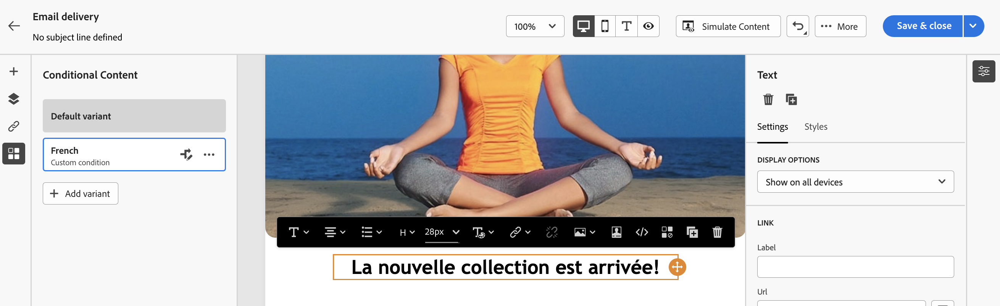

# 조건부 콘텐츠 작성{#add-conditions}

>[!CONTEXTUALHELP]
>id="acw_conditional_content"
>title="조건부 콘텐츠 추가"
>abstract="조건부 콘텐츠 필드를 구성하여 수신자 프로필 데이터를 기반으로 고급 동적 개인화를 만듭니다. 텍스트 블록, 링크, 제목 줄 및/또는 이미지는 특정 조건이 충족되면 메시지 콘텐츠에서 교체됩니다."

## 조건부 콘텐츠 시작 {#gs}

조건부 콘텐츠는 수신자의 프로필을 기반으로 동적 개인화를 만들 수 있는 강력한 기능으로, 특정 조건이 충족되면 자동으로 텍스트 블록 및 이미지를 대체합니다. 이 기능은 캠페인을 새로운 차원으로 끌어올리고 대상자에게 고도로 타겟팅되고 개인 맞춤화된 경험을 제공할 수 있습니다.

조건부 콘텐츠 필드를 구성하여 예를 들어 수신자의 프로필을 기반으로 고급 동적 개인화를 만들 수 있습니다. 특정 조건이 충족되면 메시지 콘텐츠에서 텍스트 블록, 링크, 제목란 및/또는 이미지가 교체됩니다. 예를 들어 Adobe Campaign 데이터베이스의 Gender 필드 값에 따라 &#39;Mr&#39; 또는 &#39;Mrs&#39;를 표시하거나 수신자 기본 언어를 기반으로 다른 링크를 포함할 수 있습니다.

조건부 콘텐츠를 만들려면 **표현식 편집기** 특정 도우미 함수를 사용합니다. 이 방법은 제목란 또는 이메일 링크 및 텍스트/버튼 콘텐츠 구성 요소와 같이 표현식 편집기에 액세스할 수 있는 모든 필드의 모든 게재 채널에 사용할 수 있습니다. [표현식 편집기에 액세스하는 방법 알아보기](gs-personalization.md/#access)

<!--In addition to the expression editor, you can leverage a dedicated **conditional content builder** when designing an email that allows you to build conditions using profile attributes only. [Learn how to create conditional content in emails](#condition-condition-builder)-->

## 표현식 편집기에서 조건 만들기 {#condition-perso-editor}

표현식 편집기를 사용하여 게재에 대한 조건부 콘텐츠를 정의하려면 아래 단계를 수행합니다. 이 예제에서는 수신자의 언어(프랑스어 또는 영어)를 기반으로 조건부 콘텐츠를 만들려고 합니다.

1. 게재를 열고 콘텐츠 편집 섹션으로 이동합니다.

1. 조건부 콘텐츠를 추가할 필드를 찾습니다. 예를 들어 SMS 메시지에 조건부 콘텐츠를 추가할 수 있습니다.

1. 다음을 클릭합니다. **[!UICONTROL 개인화 대화 상자 열기]** 필드 옆에 있는 아이콘을 클릭하여 표현식 편집기를 엽니다.

   

1. 개인화 편집기에서 **[!UICONTROL 도우미 함수]** 왼쪽에 있는 메뉴입니다.

1. 조건 작성을 시작하려면 옆에 있는 &#39;+&#39; 아이콘을 클릭합니다. **If** 함수. 다음 줄이 중앙 화면에 추가됩니다.`<% if (<FIELD>==<VALUE>) { %>Insert content here<% } %>`

   * 바꾸기 `<FIELD>` 수신자의 언어와 같은 개인화 필드 사용: `recipient.language`.
   * 바꾸기 `<VALUE>` 를 만족시킬 값으로 채우십시오. 예를 들어, `'French'`.
   * 바꾸기 `Ìnsert content here` 지정된 조건을 충족하는 프로필에 표시할 콘텐츠로 대체합니다.

     {width="800" align="center"}

1. 수신자가 조건을 충족하지 않을 경우 표시되어야 하는 콘텐츠를 지정합니다. 이렇게 하려면 다음을 사용하십시오. **else** 도우미 함수:

   1. 표현식 닫기 태그 앞에 커서를 놓습니다. `%>` 을(를) 클릭하고 `+` 다음 옆에 **Else** 함수.

   1. 바꾸기 `Ìnsert content here` if 함수의 조건을 충족하지 않는 프로필에 표시할 콘텐츠로 식별됩니다.

   {width="800" align="center"}

   다음을 사용할 수도 있습니다 **else if** 여러 콘텐츠 변형을 사용하여 조건을 빌드하는 도우미 함수입니다. 예를 들어 아래 표현식은 수신자의 언어에 따라 메시지의 세 가지 변형을 표시합니다.

   {width="800" align="center"}

   >[!NOTE]
   >
   >도우미 함수가 추가될 때마다 (`<%`) 및 닫기(`%>`) 태그는 함수 앞뒤에 자동으로 추가됩니다.
   >
   >표현식 내에 &quot;Else&quot; 도우미 함수를 추가한 후의 예: >
   >
   >`<% if (<FIELD>==<VALUE>) { %>Insert content here<% } <% else { %> Insert content here<% } %>%>`
   >
   >구문 오류를 방지하려면 이러한 태그를 제거해야 합니다. 이 예에서 를 제거한 후 수정된 표현식은 **else** 함수 태그:
   >
   >`<% if (<FIELD>==<VALUE>) { %>Insert content here<% } else { %> Insert content here<% } %>`

1. 상태가 준비되면 콘텐츠를 저장하고 콘텐츠를 시뮬레이션하여 렌더링을 확인할 수 있습니다.

<!--SECTION REMOVED FOR LA > CONDITIONAL CONTENT NOT AVAILABLE ANYMORE FROM THE DEDICATED MENU IN THE EMAIL DESIGNER. ONLY THE EXPRESSION EDITOR IS AVAILABLE FOR NOW

## Create conditional content in emails {#condition-condition-builder}

Conditional content in emails can be created in two ways:
* In the expression editor by building a condition with helper functions,
* In a dedicated conditional content builder that is accessible when designing an email.

Detailed information on how to create conditions using the expression editor is available [here](#condition-perso-editor). The following section provides step-by-step instructions on how to create conditions using the email designer's conditional content capability. In this example, we want to create an email message with multiple variants based on the recipients' language. Follow these steps:

1. Create or open an email delivery, edit its content, and click the **[!UICONTROL Edit email body]** button to open the email designing workspace.

1. Select a content component and click the **[!UICONTROL Enable conditional content]** icon.

    {width="800" align="center"}

1. The **[!UICONTROL Conditional Content]** pane opens on the left-hand side of the screen. In this pane, you can create multiple variants of the selected content component using conditions.

1. Configure your first variant. Hover over **[!UICONTROL Variant - 1]** in the **[!UICONTROL Conditional Content]** pane and click the **[!UICONTROL Add condition]** icon.

1. A query modeler appears. Use profile attributes to create the condition for the first variant of the message and click **[!UICONTROL Confirm]**. In this example, we are creating a rule targeting recipients whose language is 'French'.

    {width="800" align="center"}

1. The rule is now associated to the variant. For better readability, we recommend renaming the variant by clicking the ellipsis menu.

1. Configure how the component should display if the rule is met when sending the message. In this example, we want to display the text in French if it is the recipient's preferred language.

    {width="800" align="center"}

1. Add as many variants as needed for the content component. You can switch between the variants at any time to check how the content component will display based on their conditional rules.

    >[!NOTE]
    >If none of the rules defined in the variants are met when sending the message, the content component will display the content defined in the **[!UICONTROL Default variant]** from the **[!UICONTROL Conditional Content]** pane.
-->