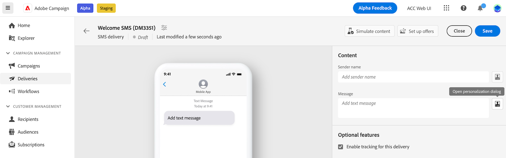

# 조건부 콘텐츠 작성{#add-conditions}

>[!CONTEXTUALHELP]
>id="acw_homepage_card3"
>title="조건부 콘텐츠를 만듭니다"
>abstract="조건부 콘텐츠를 만들어 수신자의 프로필을 기반으로 동적 개인화를 정의하고 특정 조건이 충족되면 텍스트 블록 및 이미지를 자동으로 대체합니다. 이 기능은 캠페인을 새로운 수준으로 전환하고 대상자에게 고도로 타기팅되고 개인화된 경험을 제공할 수 있습니다."


조건부 콘텐츠는 수신자의 프로필을 기반으로 동적 개인화를 만들 수 있는 강력한 기능으로, 특정 조건이 충족되면 자동으로 텍스트 블록 및 이미지를 대체합니다. 이 기능은 캠페인을 새로운 수준으로 전환하고 대상자에게 고도로 타기팅되고 개인화된 경험을 제공할 수 있습니다.

조건부 콘텐츠 필드를 구성하여 예를 들어 수신자의 프로필을 기반으로 고급 동적 개인화를 만들 수 있습니다. 특정 조건이 충족되면 메시지 콘텐츠에서 텍스트 블록, 링크, 제목란 및/또는 이미지가 교체됩니다. 예를 들어 Adobe Campaign 데이터베이스의 Gender 필드 값에 따라 &#39;Mr&#39; 또는 &#39;Mrs&#39;를 표시하거나 수신자 기본 언어를 기반으로 다른 링크를 포함할 수 있습니다.

## 개인화 구문{#perso-syntax}


## 개인화 편집기에서 조건 사용{#condition-perso-editor}

게재에 대한 조건부 콘텐츠를 정의하려면 다음 작업을 수행하십시오.

1. 게재를 열고 콘텐츠를 편집합니다.
1. 다음을 클릭합니다. **[!UICONTROL 개인화 대화 상자 열기]** 아이콘(예: SMS의 경우, 메시지 필드 오른쪽)

   

1. 개인화 편집기에서 다음 위치로 이동합니다. **[!UICONTROL 도우미 함수]**.
1. 옆에 있는 &#39;+&#39; 아이콘을 클릭합니다. **If** 함수. 다음 줄이 중앙 화면에 추가됩니다.
   `<% if (<FIELD>==<VALUE>) { %>Insert content here<% } %>`
1. 바꾸기 `<FIELD>` 개인화 필드 기준. 예를 들어 수신자의 회사는 다음과 같습니다. `recipient.company`.
1. 바꾸기 `<VALUE>` 를 만족시킬 값으로 지정합니다. 예제, `ADOBE`.


## 샘플: 조건부 SMS 제목 줄{#condition-subject-line}

SMS 메시지에 대한 조건부 제목 줄을 만들려면 아래 단계를 따르십시오.

1. 게재를 열고 콘텐츠를 편집합니다.
1. 제목란 오른쪽에 있는 개인화 대화 상자 열기 아이콘을 클릭합니다.
1. 개인화 편집기에서 다음 위치로 이동합니다.


```sql
<% if 
(recipient.email == 'recipient@domain.com' ) 
{ % >
<table>
    <tr>
        <td>variant A</td>
    </tr>
</table>
< % } 
else 
{ % >
<table>
    <tr>
        <td>variant B< td>
    </tr>
</table>
< % } 
%>
```
