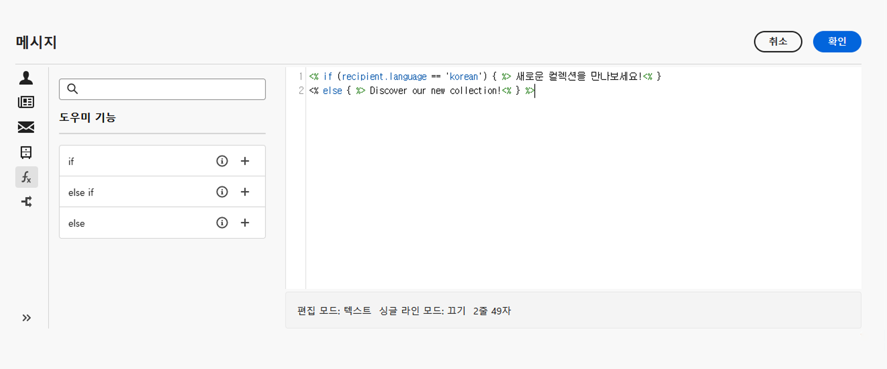
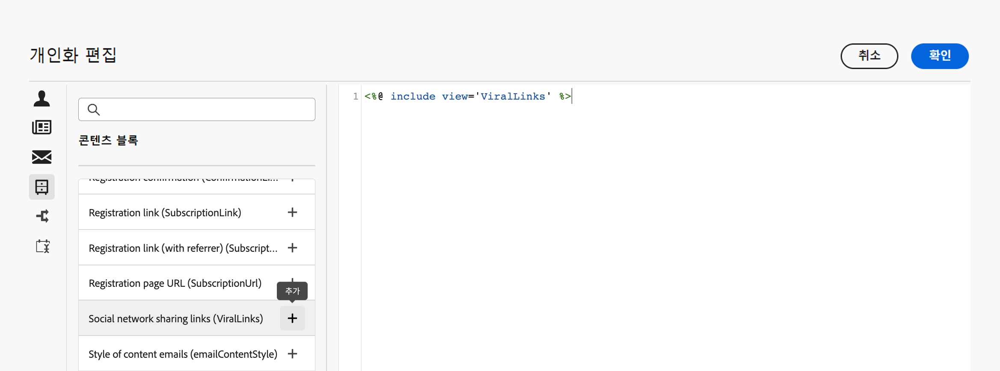

# 다이내믹 콘텐츠 시작 {#gs-dynamic-content}

>[!CONTEXTUALHELP]
>id="acw_targetdata_personalization_dashboard"
>title="개인화"
>abstract="표현식 편집기를 사용하면 모든 데이터를 선택하고, 정렬하고, 사용자 정의하고, 유효성을 검사하여 콘텐츠에 대한 사용자 지정 경험을 만들 수 있습니다. 프로필 데이터를 활용하여 각 수신자에게 메시지를 개인화하고, 조건부 콘텐츠를 만들어 각 수신자에게 메시지를 적용하고 관련 있는 콘텐츠만 표시할 수 있습니다. 또한 개인화 블록을 사용하여 게재에 사전 정의된 개인화된 콘텐츠를 추가할 수 있습니다."

마케터로서 오퍼링에 관심이 많은 고객을 타겟팅하고 효과적이고 적절한 콘텐츠를 제공하여 고객 참여를 유도하는 것이 중요합니다. 다양한 수신자의 범위를 고려할 때 다양한 사람에게 어필할 수 있도록 여러 개의 마케팅 콘텐츠를 만드는 것은 시간이 오래 걸리고 낭비적일 수 있습니다. 여기에서 다이내믹 콘텐츠가 실행됩니다.

Adobe Campaign 웹 다이내믹 콘텐츠 기능을 사용하면 수신자에 대해 수집한 정보를 기반으로 콘텐츠를 사용자 지정할 수 있습니다. 다이내믹 콘텐츠를 활용함으로써 마케팅 노력이 더 연관성이 있는지 확인하고 원치 않거나 불필요한 제품 또는 서비스를 마케팅하는 것을 피할 수 있습니다. 이 접근 방식을 사용하면 콘텐츠를 보다 매력적으로 만들고 읽을 가능성을 높일 수 있습니다. 또한 컨텐츠를 개인화할 수 있으므로 수신자는 기계가 아닌 사람으로부터 정보를 받고 있다는 느낌을 받을 수 있습니다.

## 콘텐츠를 동적으로 만드는 방법 {#make-content-dyn}

Campaign 웹 표현식 편집기에 JavaScript 구문을 삽입하여 메시지 콘텐츠를 동적으로 만들 수 있습니다. 메시지를 보낼 때 각 수신자에게 올바른 콘텐츠를 전달하기 위해 Adobe Campaign에서 이러한 표현식을 해석합니다.

* **메시지 개인화** 이름, 관심사, 사는 곳, 구입한 물건 등과 같은 프로필 데이터를 활용하여 각 특정 수신자에게 보냅니다. 수신자, 메시지 또는 게재와 관련된 개인화 편집기에서 데이터베이스에서 사용할 수 있는 필드를 선택할 수 있습니다. 이러한 개인화 속성은 메시지의 제목 줄이나 본문에 삽입할 수 있습니다. 다음 구문은 콘텐츠에 수신자의 도시를 삽입합니다. &lt;%= recipient.location.city %>

  {width="800" align="center"}

* **조건부 콘텐츠 만들기** 를 사용하여 각 수신자에 대한 게재를 조정하고, 해당 수신자에 대해 보유하고 있는 정보를 기반으로 해당 고객에 대해 적절한 콘텐츠만 표시합니다. 이를 통해 조건에 따라 특정 텍스트 블록 및/또는 이미지를 표시할 수 있습니다. 예를 들어 수신자의 특정 서비스 구독을 기반으로 이메일 배너를 조정합니다.

  {width="800" align="center"}

* **개인화 블록 사용** 시간을 절약하고 쉽게 재사용할 수 있는 개인화된 콘텐츠를 메시지에 활용할 수 있습니다. Campaign에는 게재에 삽입할 수 있는 특정 렌더링이 포함된 개인화 블록 세트가 제공됩니다. 예를 들어 로고, 인사말 메시지 또는 이메일 메시지의 미러 페이지에 대한 링크를 추가할 수 있습니다. 콘텐츠 블록은 개인화 편집기의 전용 항목에서 사용할 수 있습니다.

  {width="800" align="center"}

## 표현식 편집기 액세스 {#access}

Adobe Campaign V8 웹에서는 모든 데이터를 선택, 정렬, 사용자 지정 및 유효성을 검사하여 콘텐츠에 대한 사용자 지정 환경을 만들 수 있는 표현식 편집기를 제공합니다. 표현식 편집기는 를 사용하는 모든 필드에서 모든 채널에 사용할 수 있습니다. **[!UICONTROL 개인화 대화 상자 열기]** 제목 줄 필드 또는 이메일 링크 및 텍스트/버튼 콘텐츠 구성 요소와 같은 아이콘

다음은 다이내믹하게 만들려는 콘텐츠에 따라 표현식 편집기에 액세스하는 방법에 대한 몇 가지 예입니다.

* *발신자 이름 필드에서 표현식 편집기 액세스*

  {width="800" align="center"}

* *이메일 텍스트 구성 요소에서 표현식 편집기 액세스*

  {width="800" align="center"}

* *이메일의 링크에서 표현식 편집기 액세스*

  {width="800" align="center"}

>[!NOTE]
>
>표현식 편집기 외에도 이메일을 디자인할 때 전용 조건부 콘텐츠 빌더를 활용할 수도 있습니다. [이메일에서 조건부 콘텐츠를 작성하는 방법 알아보기](conditions.md)

## 더 자세히 알아보기 {#dive-deeper}

이제 콘텐츠를 동적으로 만드는 방법을 이해했으므로 이 설명서 섹션을 자세히 살펴보고 기능 작업을 시작해야 합니다.

<table style="table-layout:fixed"><tr style="border: 0;">
<td>

<a href="personalize.md"><strong>개인화 추가</strong></a>

</td>
<td>

<a href="conditions.md"><strong>조건부 콘텐츠 추가</strong>

</td>
<td>

<a href="content-blocks.md"><strong>기본 제공 콘텐츠 블록 추가</strong></a>

</td>
</tr></table>
