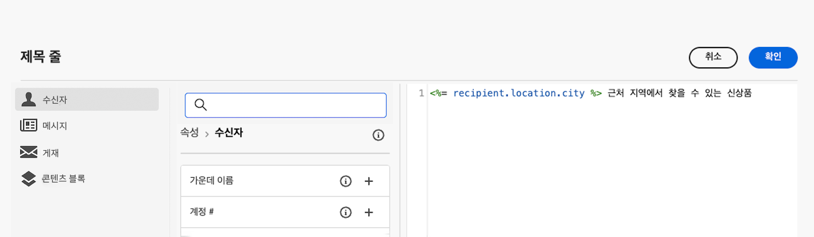
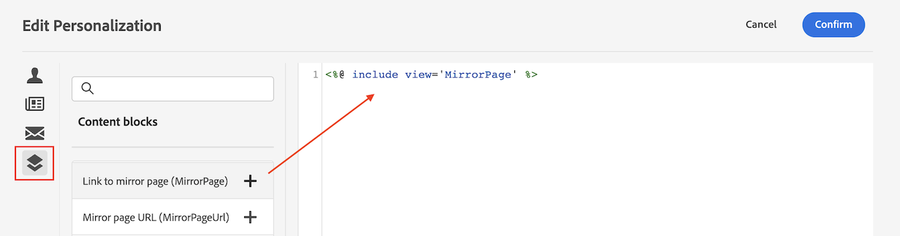
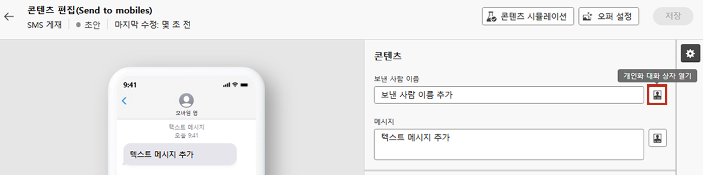
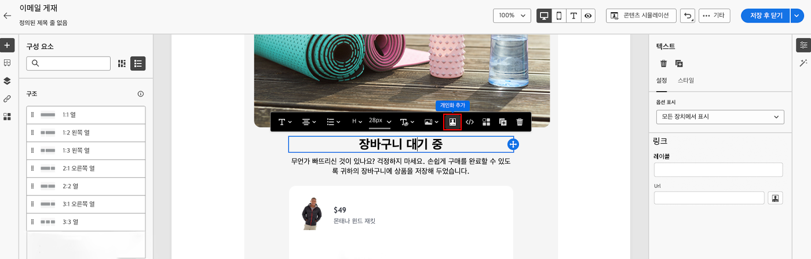

# 다이내믹 콘텐츠 시작

Adobe Campaign에서는 모든 마케팅 캠페인을 최대한 활용하기 위해 고객의 수준에 맞는 다이내믹 콘텐츠를 맞춤형으로 제공할 수 있습니다. 프로필 데이터를 기반으로 개인화 기능을 사용하여 다양한 그룹 및 개인에 대한 사용자 지정 환경을 만듭니다. 보유한 데이터 및 정보를 활용하여 메시지를 각 특정 수신자에게 맞게 조정할 수 있습니다. 이름, 관심사, 사는 곳, 산 물건 등이 될 수 있습니다.

캠페인을 사용하여 동적 콘텐츠를 만들고 개인화된 메시지를 보냅니다. 개인화 기능을 결합하여 메시지를 개선하고 맞춤형 사용자 경험을 만들 수 있습니다.

다음을 삽입하여 메시지 콘텐츠를 동적으로 만들 수 있습니다.

* **개인화 필드**

   개인화 필드는 메시지의 첫 번째 수준 개인화에 사용됩니다. 개인화 편집기에서 데이터베이스에서 사용 가능한 모든 필드를 선택할 수 있습니다. 게재의 경우 수신자, 메시지 또는 게재와 관련된 모든 필드를 선택할 수 있습니다. 이러한 개인화 속성은 메시지의 제목 줄이나 본문에 삽입할 수 있습니다.

   

   다음 구문은 콘텐츠에 수신자의 도시를 삽입합니다. &lt;%= recipient.location.city %>

* **조건부 콘텐츠**

   예를 들어 조건부 콘텐츠를 구성하여 수신자 프로필을 기반으로 동적 개인화를 추가합니다. 특정 조건이 true이면 텍스트 블록 및/또는 이미지가 삽입됩니다. 조건이 true가 아닌 경우 컨텐츠의 대체 버전을 정의할 수 있습니다.

* **내장된 콘텐츠 블록**

   Campaign에는 게재에 삽입할 수 있는 특정 렌더링이 포함된 개인화 블록 세트가 제공됩니다. 예를 들어 로고, 인사말 메시지 또는 이메일 메시지의 미러 페이지에 대한 링크를 추가할 수 있습니다. 콘텐츠 블록은 개인화 편집기의 전용 항목에서 사용할 수 있습니다.

   

## 다이내믹 콘텐츠는 어디에서 추가할 수 있습니까?

Adobe Campaign V8 웹에서는 모든 데이터를 선택, 정렬, 사용자 지정 및 유효성을 검사하여 콘텐츠에 대한 사용자 지정 환경을 만들 수 있는 표현식 편집기를 제공합니다.

표현식 편집기는 제목란 필드, 이메일의 텍스트 및 버튼 콘텐츠 구성 요소와 같이 개인화 대화 상자 열기 아이콘이 있는 모든 필드에서 모든 채널에 사용할 수 있습니다.

또한 이메일을 디자인할 때 전용 조건부 콘텐츠 빌더에 액세스할 수 있습니다. [이메일에서 조건부 콘텐츠를 작성하는 방법 알아보기](conditions.md)

## 더 자세히 알아보기

이제 콘텐츠를 동적으로 만드는 방법을 이해했으므로 이 설명서 섹션을 자세히 살펴보고 기능 작업을 시작해야 합니다.

<table style="table-layout:fixed"><tr style="border: 0;">
<td>

<a href="personalize.md"><strong>개인화 추가</strong></a>

</td>
<td>

<a href="conditions.md"><strong>조건부 콘텐츠 추가</strong>

</td>
<td>

<a href="content-blocks.md"><strong>기본 제공 콘텐츠 블록 추가</strong></a>

</td>
</tr></table>
