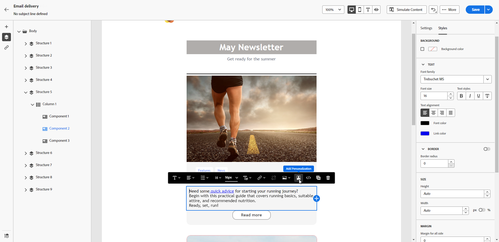
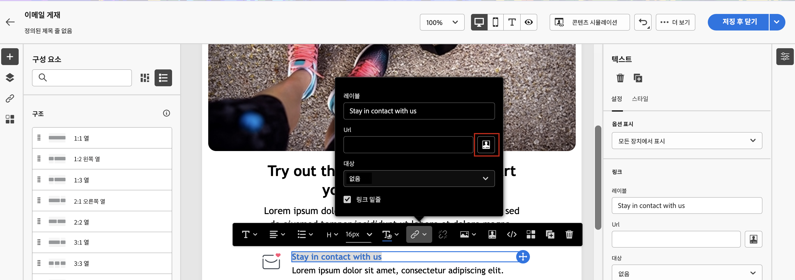

# 콘텐츠 개인화{#add-personalization}

## 메시지 제목란 개인화 {#personalize-subject-line}

메시지의 **[!UICONTROL 제목 줄]** 필드에 개인화를 추가하려면 아래 단계를 따르십시오.

1. 게재를 열고 클릭 **[!UICONTROL 콘텐츠 편집]**.
1. 다음을 클릭합니다. **[!UICONTROL 개인화 대화 상자 열기]** 아이콘(오른쪽) **[!UICONTROL 제목 줄]** 이메일 필드 또는 **[!UICONTROL 제목]** 푸시/SMS 게재용 필드.

   {width="600"}

1. 제목 줄이나 제목을 입력하고 추가할 개인화 속성을 선택합니다.

1. **[!UICONTROL 확인]**&#x200B;을 클릭하여 확인합니다. 개인화 속성이 콘텐츠에 추가됩니다.

## 이메일 콘텐츠 개인화 {#personalize-emails}

이메일 콘텐츠를 개인화하려면 이메일 디자이너에서 메시지를 열고 다음 작업을 수행하십시오.

1. 텍스트 블록 내부를 클릭합니다.
1. 상황별 도구 모음에서 **[!UICONTROL 개인화 추가]**&#x200B;를 선택합니다.

   

1. 개인화 편집기에 수신자의 이름을 삽입하고 확인합니다.

   

   개인화 속성이 이메일 콘텐츠에 추가됩니다.

   콘텐츠를 시뮬레이트하여 렌더링을 확인할 수 있습니다. [자세히 알아보기](../preview-test/preview-content.md)

   

1. 이메일에 콘텐츠 블록을 추가하려면 동일한 단계를 적용하고 마지막 아이콘에서 콘텐츠 블록을 선택합니다.

   

1. 콘텐츠 블록을 삽입하면 이메일 콘텐츠에 추가됩니다. 게재 준비 단계에서 개인화가 생성되면 수신자 프로필에 자동으로 적용됩니다.

   

## 이메일 링크 개인화 {#personalize-links}

**링크**&#x200B;를 개인화하려면 다음 작업을 수행하십시오.

1. 텍스트 블록 또는 이미지를 선택합니다.
1. 상황별 도구 모음에서 **링크 삽입**&#x200B;을 선택합니다.

   

1. 링크 레이블을 입력하고 **링크 삽입** 버튼을 사용하여 링크를 개인화합니다.

   

1. 개인화 편집기를 사용하여 링크를 정의하고 개인화한 다음 확인합니다.

   

## 오퍼 개인화 {#personalize-offers}

오퍼 표시에 텍스트 유형의 콘텐츠를 추가할 때도 개인화 편집기에 액세스할 수 있습니다. [이 섹션](../content/offers.md)에서 자세히 알아보십시오.

