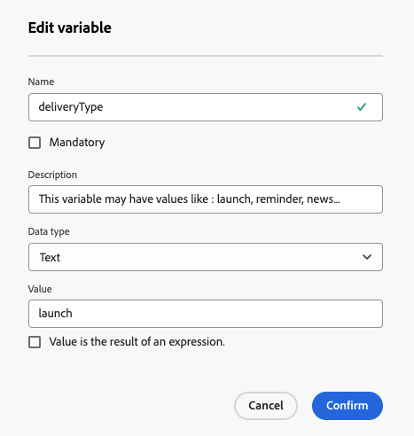

# 콘텐츠 개인화 {#add-personalization}

>[!CONTEXTUALHELP]
>id="acw_personalization_editor_add_current_date"
>title="현재 날짜 추가"
>abstract="이 메뉴는 콘텐츠를 개인화하는 데 활용할 수 있는 날짜 형식 지정과 관련된 기능을 제공합니다."

게재 콘텐츠 Personalization은 메시지를 개별 수신자에게 맞춤화할 수 있는 주요 기능으로, 커뮤니케이션의 관련성을 높이고 참여를 유도합니다.

Adobe Campaign에서는 프로필의 이름, 위치 또는 과거 상호 작용과 같은 [프로필 데이터](#data-personalization) 및 게재의 특정 [변수](#variables-personalization)를 사용하여 커뮤니케이션에서 텍스트, 이미지 및 오퍼와 같은 요소를 동적으로 사용자 지정합니다.

게재 개인화는 사용자 경험을 개선하고 참여율을 향상시켜 전환율과 고객 만족도를 향상시킵니다.

## 개인화에 프로필 데이터 사용 {#data-personalization}

제목란, 전자 메일 링크 및 텍스트/단추 콘텐츠 구성 요소와 같은 **[!UICONTROL 개인화 대화 상자 열기]** 아이콘이 있는 필드에서 액세스할 수 있는 표현식 편집기를 사용하여 프로필 데이터를 통해 게재를 개인화합니다. [식 편집기에 액세스하는 방법을 알아봅니다](gs-personalization.md#access).

### Personalization 구문 {#syntax}

Personalization 태그는 특정 구문 `<%= table.field %>`을(를) 따릅니다. 예를들어 받는 사람 테이블에서 받는 사람의 성을 삽입하려면 `<%= recipient.lastName %>` 구문을 사용합니다.

게재 준비 프로세스 중에 Adobe Campaign은 이러한 태그를 해석하여 각 수신자에 대한 해당 필드 값으로 대체합니다. 콘텐츠를 시뮬레이션하여 실제 교체를 확인합니다.

독립 실행형 이메일 전달을 위해 외부 파일에서 연락처를 업로드할 때 입력 파일의 모든 필드를 개인화할 수 있습니다. 구문은 다음과 같습니다. `<%= dataSource.field %>`

### 개인화 태그 추가 {#add}

게재에 개인화 태그를 추가하려면 다음 단계를 수행합니다.

1. 제목란이나 SMS 본문 같은 텍스트 유형 편집 필드에서 액세스할 수 있는 **[!UICONTROL 개인화 대화 상자 열기]** 아이콘을 사용하여 식 편집기를 엽니다. [식 편집기에 액세스하는 방법을 알아봅니다](gs-personalization.md#access).

   {zoomable="yes"}{width="800" align="center"}

1. 표현식 편집기가 열립니다. Adobe Campaign 데이터베이스에서 사용할 수 있는 개인화 필드는 화면 왼쪽에 있는 여러 메뉴로 구성됩니다.

   {zoomable="yes"}{width="800" align="center"}

   | 메뉴 | 설명 |
   |------|-------------|
   | {zoomable="yes"} | **[!UICONTROL 구독자 응용 프로그램]** 메뉴에는 사용된 터미널 또는 운영 체제와 같은 응용 프로그램의 구독자와 관련된 필드가 나열됩니다. *이 메뉴는 푸시 알림에만 사용할 수 있습니다.* |
   | {zoomable="yes"} | **[!UICONTROL 받는 사람]** 메뉴에는 받는 사람의 이름, 나이 또는 주소와 같이 받는 사람 테이블에 정의된 필드가 나열됩니다. 독립 실행형 전자 메일 게재를 위해 [외부 파일에서 연락처를 업로드](../audience/file-audience.md)할 때 이 메뉴에는 입력 파일에서 사용할 수 있는 모든 필드가 나열됩니다. |
   | {zoomable="yes"} | **[!UICONTROL 메시지]** 메뉴에는 지정된 수신자가 있는 마지막 이벤트의 날짜와 같이 모든 채널에서 받는 사람 또는 장치로 보낸 모든 메시지를 포함하여 게재 로그와 관련된 필드가 나열됩니다. |
   | {zoomable="yes"} | **[!UICONTROL 게재]** 메뉴에는 게재 채널 또는 레이블과 같이 게재 수행에 필요한 매개 변수와 관련된 필드가 나열됩니다. |

   >[!NOTE]
   >
   >기본적으로 각 메뉴에는 선택한 테이블(수신자, 메시지/게재) 내의 모든 필드가 나열됩니다. 선택한 테이블에 연결된 테이블의 필드를 포함하려면 목록 아래에 있는 **[!UICONTROL 고급 특성 표시]** 옵션을 사용하도록 설정하십시오.

1. 개인화 필드를 추가하려면 컨텐츠 내에서 원하는 위치에 커서를 놓고 `+` 단추를 클릭하여 삽입합니다.

1. 콘텐츠가 준비되면 저장하고 콘텐츠를 시뮬레이션하여 개인화 렌더링을 테스트합니다. 아래 예는 수신자의 이름을 사용하는 SMS 메시지의 개인화를 보여 줍니다.

   {zoomable="yes"}{width="800" align="center"}

   {zoomable="yes"}{width="800" align="center"}

## 개인화에 변수 사용 {#variables-personalization}

변수를 사용하여 게재를 개인화할 수도 있습니다. [게재에 변수 추가](../advanced-settings/delivery-settings.md#variables-delivery)에 대해 자세히 알아보세요.

예를 들어 `deliveryType` 변수는 아래와 같이 정의됩니다.

{zoomable="yes"}

이 변수는 **[!UICONTROL Personalization 추가]** 아이콘과 이 예제의 표현식 `<%= variables.deliveryType %>`을(를) 사용하여 게재 콘텐츠에 사용됩니다.

{zoomable="yes"}

**[!UICONTROL 콘텐츠 시뮬레이션]** 버튼을 사용하여 변수 사용을 확인하십시오.

{zoomable="yes"}