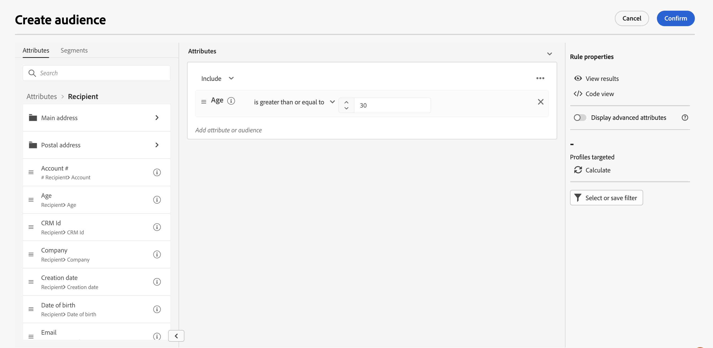

# 사전 정의된 필터 작업 {#predefined-filters}

>[!CONTEXTUALHELP]
>id="acw_homepage_card3"
>title="사전 정의된 필터 관리"
>abstract="이제 Campaign Web은 특정 요구 사항에 맞게 사전 정의된 필터를 손쉽게 관리하고 맞춤화할 수 있는 사용자 친화적인 인터페이스를 제공합니다. 한 번 제작하여 나중에 사용할 수 있도록 저장합니다."

>[!CONTEXTUALHELP]
>id="acw_predefined-filters-dashboard"
>title="사전 정의된 필터"
>abstract="이제 Campaign Web은 특정 요구 사항에 맞게 사전 정의된 필터를 손쉽게 관리하고 맞춤화할 수 있는 사용자 친화적인 인터페이스를 제공합니다. 한 번 제작하여 나중에 사용할 수 있도록 저장합니다."

사전 정의된 필터 는 나중에 사용할 수 있도록 생성 및 저장되는 사용자 지정 필터입니다. 데이터 목록을 필터링하거나 게재 대상을 만들 때와 같이 규칙 빌더로 필터링 작업을 수행하는 동안 바로 가기로 사용할 수 있습니다.

기존의 기본 제공 필터를 사용하여 데이터의 특정 하위 세트에 액세스하거나 사전 정의된 필터를 직접 만들어 저장할 수 있습니다.

## 사전 정의된 필터 만들기 {#create-predefined-filter}

>[!CONTEXTUALHELP]
>id="acw_predefined-filters-creation"
>title="사전 정의된 필터 만들기"
>abstract="사전 정의된 필터의 레이블을 입력하고 해당 레이블이 적용되는 테이블을 선택합니다. 추가 옵션을 열어 설명을 추가하고 이 필터를 즐겨찾기로 설정합니다. 그런 다음 &#39;규칙 만들기&#39; 버튼을 사용하여 필터링 조건을 정의합니다."

규칙 빌더로 필터를 만들면 나중에 사용할 수 있도록 저장할 수 있습니다. 사용자 지정 필터로 저장한 경우 나중에 사용할 수 있습니다. 왼쪽 탐색 메뉴의 전용 메뉴에서 사전 정의된 필터를 만들고 편집할 수도 있습니다.

규칙 빌더에 사용자 지정 필터를 저장하려면 아래 단계를 수행합니다.

1. 규칙 빌더를 열고 필터링 조건을 정의합니다. 아래 예에서는 마드리드에 거주하는 수신자를 필터링합니다.
1. 다음을 클릭합니다. **필터 선택 또는 저장** 단추 및 선택 **필터로 저장**.

   

1. 선택 **새 필터 만들기**&#x200B;을 누르고 해당 필터의 이름과 설명을 입력합니다.

   

1. (선택 사항) **즐겨찾기로 저장** 즐겨찾기에 사전 정의된 이 필터를 보려면 옵션을 선택합니다.

   필터가 즐겨찾기로 저장되면 의 모든 사용자가 사용할 수 있습니다. **즐겨 찾는 필터** 필터 만들기 목록의 섹션(아래 참조):

   

1. 클릭 **확인** 변경 사항을 저장합니다.

이제 사용자 지정 필터를에서 사용할 수 있습니다 **사전 정의된 필터** 모든 Campaign 사용자가 나열하고 액세스할 수 있습니다.

에서 필터를 만들 수도 있습니다. **사전 정의된 필터** 왼쪽 메뉴에 있는 항목. 이렇게 하려면 아래 단계를 수행합니다.

1. 검색 **사전 정의된 필터** 왼쪽 메뉴에 있는 항목.
1. 다음을 클릭합니다. **필터 만들기** 단추를 클릭합니다.
1. 필터 이름을 입력하고 **문서 유형** 필드에서 적용할 스키마를 선택합니다. 기본 스키마는 입니다. `Recipients(nms)`.
1. 필터에 대한 규칙을 정의합니다. 예를 들어 30세 이상의 프로필입니다.

   

1. 변경 내용을 저장합니다. 필터가 사전 정의된 필터 목록에 추가됩니다.

## 사전 정의된 필터 사용 {#use-predefined-filter}

규칙 속성을 정의할 때 사전 정의된 필터를 사용할 수 있습니다. 사전 정의된 필터에 액세스하려면 다음을 선택합니다. **사용자 정의 필터 선택** 선택 사항을 추가합니다.

그런 다음 현재 컨텍스트에 사용할 수 있는 사전 정의된 필터의 전체 목록에 액세스할 수 있습니다.

에서 사용할 수 있는 필터 단축키를 사용할 수도 있습니다. **즐겨 찾는 필터** 섹션에 있는 섹션을 참조하십시오.

예를 들어 사전 정의된 필터에서 대상을 작성하려면 다음 단계를 수행합니다.

1. 검색 **대상** 왼쪽 메뉴에 있는 항목.
1. 다음을 클릭합니다. **대상자 만들기** 단추를 클릭합니다.
1. 대상자 이름을 입력하고 **대상자 만들기** 단추를 클릭합니다.
1. 다음 항목 선택 **쿼리** 활동을 만든 후 오른쪽 창에서 **대상자 만들기** 단추를 클릭합니다.

   

1. 다음에서 **필터 선택 또는 저장 단추**, 을(를) 선택합니다. **사용자 정의 필터 선택** 옵션을 선택합니다.

   

1. 대상을 만드는 데 사용할 사전 정의된 필터를 찾아 선택하고 확인합니다.

   

1. 이 필터의 규칙 속성을 확인하고 확인하십시오.

   

   이제 필터가 **쿼리** 활동.

   

1. 변경 사항을 저장하고 **시작** 단추를 사용하여 대상을 작성하고 대상 목록에서 사용할 수 있도록 설정합니다.

## 사전 정의된 필터 관리 {#manage-predefined-filter}

사전 정의된 필터는 모두 왼쪽 탐색 메뉴의 전용 항목에 그룹화됩니다.

이 목록에서 위에 자세히 설명된 대로 새 필터를 만들 수 있으며,

* 기존 필터를 편집하고 규칙 및 속성을 변경합니다
* 사전 정의된 필터 복제
* 사전 정의된 필터 삭제

## 기본 제공 사전 정의된 필터 {#ootb-predefined-filter}

Campaign에는 클라이언트 콘솔에서 빌드된 사전 정의된 필터 세트가 포함되어 있습니다. 이러한 필터는 대상자 및 규칙을 정의하는 데 사용할 수 있습니다. 수정해서는 안 됩니다.
