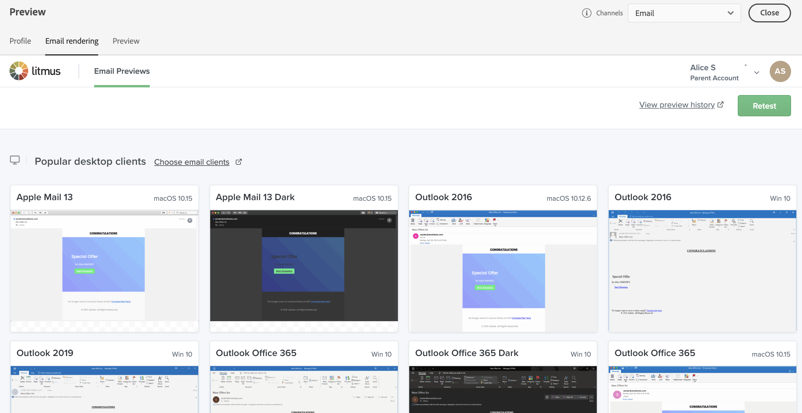

# 이메일 렌더링 테스트 {#email-rendering}

이메일을 보내기 전에 메시지가 다양한 웹 클라이언트 및 장치에서 수신자에게 최적으로 표시되는지 확인하십시오.

이를 위해 [!DNL Adobe Campaign] 내의 **Litmus** 계정을 사용하여 다른 컨텍스트에서 전자 메일 렌더링을 즉시 미리 봅니다. 이를 통해 주요 데스크탑 애플리케이션, 웹 메일 서비스, 모바일 장치 등과의 호환성을 확인할 수 있습니다.

>[!CAUTION]
>
>Campaign에서 이메일 렌더링을 사용하면 서드파티 시스템으로 증명을 보냅니다. Litmus 계정을 [!DNL Campaign]과(와) 연결하면 Adobe이 해당 서드파티에게 보낼 수 있는 데이터에 대해 책임을 지지 않는다는 것을 알게 됩니다. Litmus의 이메일 데이터 보존 정책은 이러한 증명에 포함될 수 있는 개인화 데이터를 포함하여 이러한 이메일에 적용됩니다. 이러한 데이터에 액세스하거나 삭제하려면 Litmus에 직접 문의하십시오.

이메일 렌더링 기능에 액세스하려면 다음 전제 조건을 완료하십시오.

* Litmus 계정이 있습니다.
* 프로필 및/또는 테스트 프로필을 선택합니다. [이 섹션](preview-content.md)에서 방법을 알아보세요.

그런 다음 아래 단계를 수행합니다.

1. [콘텐츠 편집](../email/edit-content.md) 화면 또는 [전자 메일 Designer](../email/get-started-email-designer.md)에서 **[!UICONTROL 콘텐츠 시뮬레이션]** 단추를 클릭합니다.

1. **[!UICONTROL 전자 메일 렌더링]** 단추를 선택합니다.

   {zoomable="yes"}

1. 오른쪽 상단의 **Litmus 계정 연결**&#x200B;을 클릭합니다.

   {zoomable="yes"}

1. 자격 증명을 입력하고 로그인하십시오.

   {zoomable="yes"}

1. 전자 메일 미리 보기를 생성하려면 **테스트 실행** 단추를 클릭하십시오.

1. 인기 있는 데스크탑, 모바일 및 웹 기반 클라이언트에서 이메일 콘텐츠를 검토합니다.

   {zoomable="yes"}

<!--
TO CHECK IF user is directed to Litmus or if the email rendering is shown directly in the Campaign UI.

CONTENT ABOVE COPIED FROM AJO

If not redirecting to Litmus:

To test the email rendering, follow these steps:

1. Access the email content creation screen, then click **[!UICONTROL Simulate content]**.

1. Click the **[!UICONTROL Render email]** button.

    The left pane provides various desktop, mobile, and web-based email clients. Select the desired email client to display a preview of your email in the right pane. 

    {zoomable="yes"}

    >[!NOTE]
    >
    >The email clients list provides a sample of the major mail clients. Additional email clients are available from the filter button next to the top search bar.

 -->