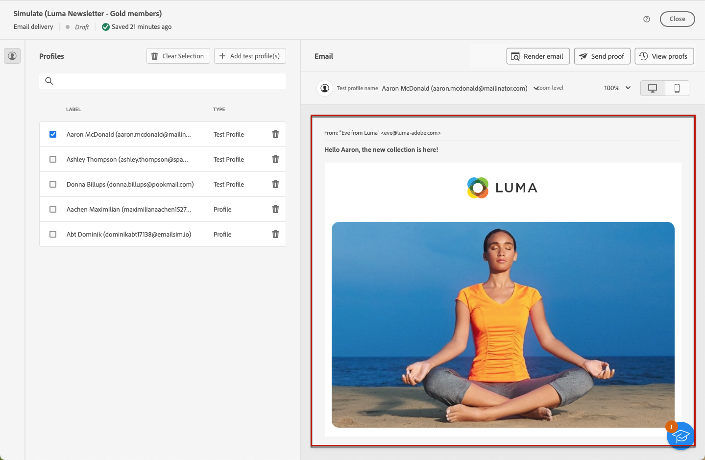

# 메시지 콘텐츠 미리보기 {#preview-content}

사용 [!DNL Campaign] 콘텐츠 시뮬레이션 기능으로 메시지를 보내기 전에 메시지 콘텐츠를 미리 볼 수 있습니다. 이를 통해 개인화를 제어하고 수신자에게 표시되는 방식을 확인할 수 있습니다.

게재 콘텐츠를 미리 보려면 아래 단계를 따르십시오.

1. 게재의 콘텐츠 편집 화면 또는 [이메일 디자이너](../email/get-started-email-designer.md).

1. 다음을 클릭합니다. **[!UICONTROL 콘텐츠 시뮬레이션]** 단추를 클릭합니다.

   

1. 개인화된 콘텐츠를 미리 보는 데 사용할 프로필을 선택하려면 다음을 사용합니다.

   * **[!UICONTROL 테스트 프로필 추가]** 이메일 및 SMS 게재 미리 보기

   * **[!UICONTROL 구독자 추가]** 푸시 알림 미리 보기용

1. 프로필과 테스트 프로필을 결합하여 이메일 또는 SMS 메시지를 미리 볼 수 있습니다.

   * 다음 **[!UICONTROL 테스트 프로필]** 탭에는 데이터베이스의 추가 수신자와 가상 수신자인 모든 시드 주소가 나열됩니다.
     

     테스트 프로필은 **[!UICONTROL 고객 관리]** > **[!UICONTROL 프로필]** 메뉴 아래의 제품에서 사용할 수 있습니다. [자세히 알아보기](../audience/test-profiles.md#create-test-profiles)

   * 다음 **[!UICONTROL 프로필]** 탭은에 저장된 모든 수신자를 나열합니다. **[!UICONTROL 프로필 및 타겟]** 폴더의 [!DNL Campaign] 클라이언트 콘솔입니다. 다음에서 자세히 알아보기 [Campaign v8(클라이언트 콘솔) 설명서](https://experienceleague.adobe.com/docs/campaign/campaign-v8/audience/view-profiles.html){target="_blank"}.

     에서 프로필을 보고 만들고 관리할 수 있습니다. **[!UICONTROL 프로필]** 탭. [자세히 알아보기](../audience/about-recipients.md)

1. 테스트 프로필 또는 프로필 목록을 검색할 때 필터를 사용하여 검색을 구체화할 수 있습니다.

   

   예를 들어 다음과 같은 테스트 프로필을 모두 찾는 규칙을 정의할 수 있습니다. **[!UICONTROL 잠재 고객]** 상태. 를 사용하여 규칙을 추가하는 방법을 알아봅니다. [쿼리 모델러](../query/query-modeler-overview.md).

1. 클릭 **[!UICONTROL 선택]** 을 클릭하여 선택 항목을 확인합니다.

   게재 콘텐츠 미리보기가 의 오른쪽 창에 표시됩니다. **[!UICONTROL 시뮬레이트]** 화면. 개인화된 요소는 왼쪽 창에서 선택한 프로필의 데이터로 바뀝니다.

   

1. 여러 프로필을 추가한 경우 목록에서 전환하여 해당 게재 콘텐츠를 미리 볼 수 있습니다. 왼쪽 창의 해당 단추를 사용하여 테스트 프로필을 더 추가하고 선택을 취소할 수도 있습니다.

1. 이메일 게재의 경우 다음을 조정할 수 있습니다. **[!UICONTROL 확대/축소 레벨]** 오른쪽 상단의 전용 아이콘을 사용하여 데스크탑 또는 모바일 디바이스에서 콘텐츠를 미리 볼 수 있습니다.

1. 다음에서 **[!UICONTROL 시뮬레이트]** 화면 또한 다음 작업을 수행할 수 있습니다.
   * 유효성 검사를 위해 특정 수신자에게 테스트 게재 보내기 - [자세히 알아보기](test-deliveries.md)
   * 전송된 테스트 게재의 로그에 액세스 - [자세히 알아보기](test-deliveries.md#access-test-deliveries)
   * 이메일의 경우, 방문 빈도가 높은 이메일 클라이언트의 메시지 콘텐츠 렌더링 을 확인합니다. [자세히 알아보기](email-rendering.md)

