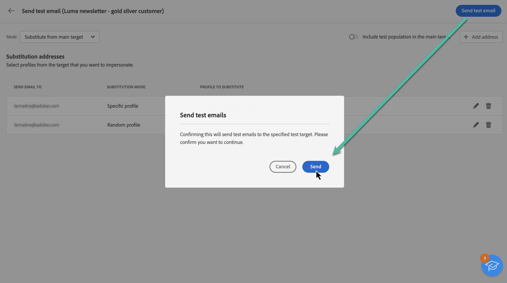

# 증명 보내기 {#send-proofs}

테스트 이메일을 보내면 이메일의 유효성을 검사하고 링크, 옵트아웃 링크 및 미러 페이지, 이미지와 같은 다양한 요소를 확인하고 가능한 오류를 감지할 수 있습니다.

증명을 두 가지 유형의 수신자에게 보낼 수 있습니다.

* **테스트 프로필**: 시드 주소로 증명을 보냅니다. 이 주소는 데이터베이스에서 추가 및 가상 수신자입니다.
* **대체 프로필**: 기존 프로필을 사용하여 특정 이메일 주소로 증명을 보냅니다. 이를 통해 프로필 위치에 자신을 배치하여 프로필에서 받게 될 메시지의 정확한 모습을 확인할 수 있습니다.

## 증명 수신자를 선택합니다 {#recipients}

1. 전자 메일 콘텐츠 만들기 화면에 액세스한 다음 를 클릭합니다 **[!UICONTROL 컨텐츠 시뮬레이션]**.

1. 을(를) 클릭합니다. **[!UICONTROL 테스트]** 단추를 누른 다음 **[!UICONTROL 모드]** 증명을 받을 수신자 유형을 선택하려면 드롭다운 목록을 사용합니다.

<!-- to check: by default, profiles selected in previous screen are pre-selected for proofs. Can add addtitional profiles + remove preselected?-->

### 테스트 프로필에 증명 보내기

1. 을(를) 선택합니다 **[!UICONTROL 테스트 프로필 사용]** 모드.

1. 테스트 이메일을 받을 테스트 프로필을 추가합니다.

   <!--FOR BETA: You can also build an audience to select test profiles based on your own criteria using the **[!UICONTROL Add test audience]** button.-->

   

### 대체 프로필에 증명 보내기

1. 을(를) 선택합니다 **[!UICONTROL target에서 대체]** 모드.

1. 증명을 받을 이메일 주소를 추가합니다.

   >[!NOTE]
   >
   >모든 이메일 주소를 지정할 수 있습니다. 따라서 Adobe Campaign V8 사용자가 아니더라도 모든 사용자에게 증명을 보낼 수 있습니다.

1. 각 이메일 주소에 대해 사용할 타겟에서 프로필을 선택합니다. Adobe Campaign에서 타겟에서 임의의 프로필을 선택하도록 할 수도 있습니다.

   

증명 수신자를 선택하면 테스트 이메일을 보낼 수 있습니다. [증명을 보내는 방법을 알아봅니다](#send)

>[!NOTE]
>
>증명을 받는 사람에게 최종 이메일 메시지를 보내려면 을(를) 활성화합니다 **[!UICONTROL 기본 타겟에 테스트 모집단 포함]** 옵션 켜짐.

## 증명 보내기 {#send}

선택한 수신자에게 증명을 보내려면 **[!UICONTROL 테스트 전자 메일 보내기]** 그런 다음 전송을 확인합니다.

게재 콘텐츠를 완성할 때까지 필요한 만큼 증명을 보냅니다. 이 작업이 완료되면 주요 타겟으로 이메일을 보낼 수 있습니다. [이메일 준비 및 보내기 방법 알아보기](../monitor/prepare-send.md)

## 보낸 증명 액세스 {#access-proofs}

증명을 보내고 나면 **[!UICONTROL 테스트 전자 메일 로그 보기]** 버튼을 클릭합니다. 이러한 로그를 사용하면 선택한 게재에 대해 보내는 모든 증명에 액세스하고 해당 전송과 관련된 특정 통계를 시각화할 수 있습니다.

게재와 같이 게재 목록에서 증명에 액세스할 수도 있습니다.

