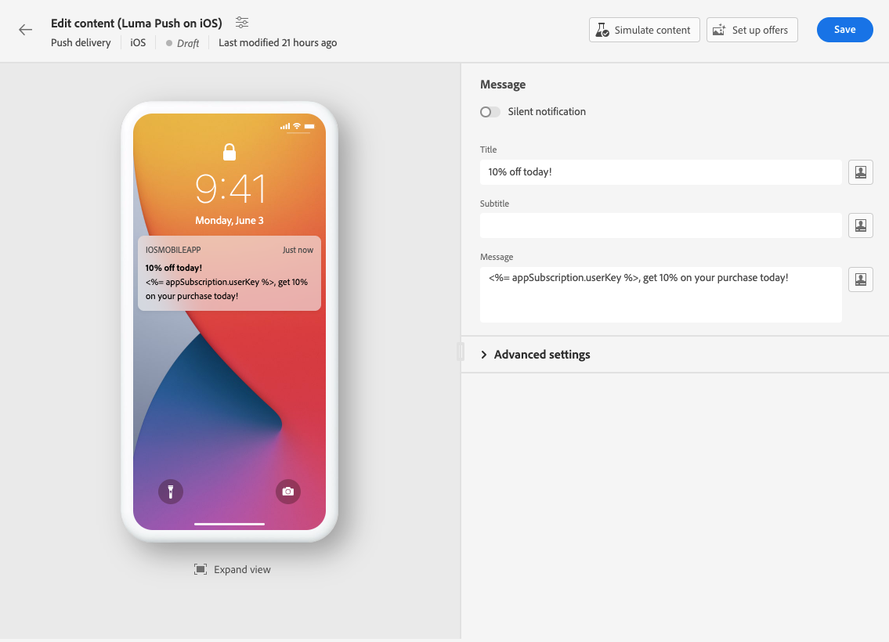
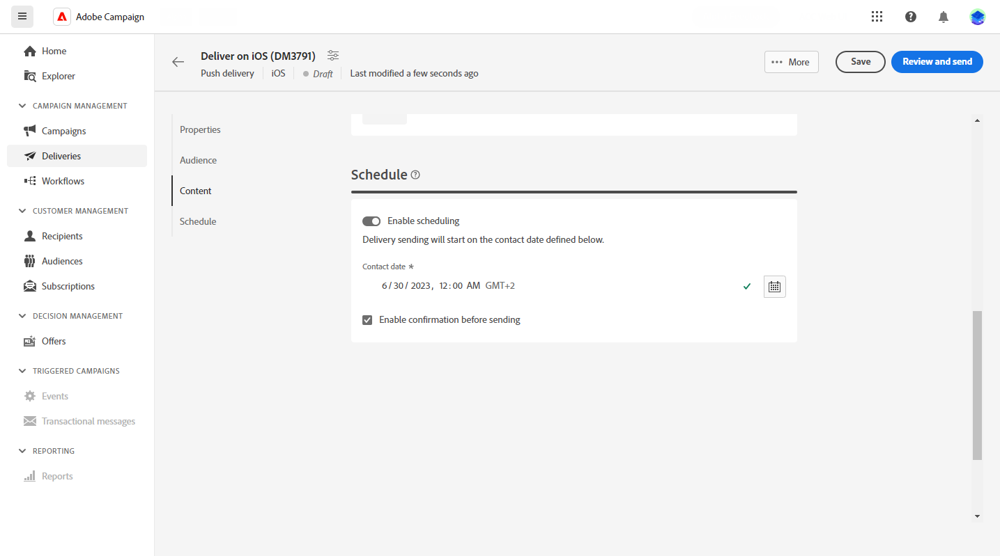

# 푸시 알림 게재 만들기 {#create-push}

>[!CONTEXTUALHELP]
>id="acw_push_notification_template"
>title="푸시 알림 템플릿"
>abstract="푸시 게재를 시작하려면 푸시 알림 템플릿을 선택합니다. 게재 템플릿을 사용하면 캠페인과 게재 전반에 걸쳐 사용자 정의 콘텐츠와 설정을 쉽게 재사용할 수 있습니다."
>additional-url="https://experienceleague.adobe.com/docs/campaign-web/v8/msg/delivery-template.html?lang=ko-KR" text="게재 템플릿 사용"

>[!CONTEXTUALHELP]
>id="acw_deliveries_push_properties"
>title="게재 속성 푸시"
>abstract="푸시 게재 속성을 정의합니다. 푸시 레이블을 입력하고 **추가 옵션**&#x200B;을 사용하여 내부 이름, 게재 폴더 및 코드를 구성합니다. 사용자 정의 설명을 입력할 수도 있습니다."

독립형 푸시 알림 게재를 만들거나 캠페인 워크플로우의 컨텍스트에서 푸시 알림을 만들 수 있습니다. 아래 단계에서는 독립 실행형(일회성) 푸시 게재의 절차를 자세히 설명합니다. 캠페인 워크플로우의 컨텍스트에서 작업 중인 경우 만들기 단계는 의 세부 정보입니다. [이 섹션](../workflows/activities/channels.md#create-a-delivery-in-a-campaign-workflow).

## 푸시 게재 만들기 {#create-push-delivery}

새 독립 실행형 푸시 게재를 만들려면 다음 단계를 수행하십시오.

1. 다음으로 이동 **[!UICONTROL 게재]** 왼쪽 레일에서 메뉴를 클릭하고  **[!UICONTROL 게재 만들기]** 단추를 클릭합니다.

1. 아래 **[!UICONTROL 채널]** 섹션, 선택 **푸시 알림** 을 채널로 선택한 다음 선택한 장치 운영 체제(Android 또는 iOS)에 따라 템플릿을 선택합니다. [템플릿에 대해 자세히 알아보기](../msg/delivery-template.md)

1. **[!UICONTROL 게재 만들기]** 버튼을 클릭하여 확인합니다.

   {zoomable=&quot;yes&quot;}

## 게재 설정 구성 {#configure-push-settings}

아래에 자세히 설명된 대로 게재 설정을 구성합니다.

1. 입력 **[!UICONTROL 레이블]** 배달을 위해. 기본적으로 레이블은 선택한 템플릿의 레이블로 설정됩니다. 업데이트해야 합니다.

1. 찾아보기 **[!UICONTROL 추가 옵션]** 필요한 경우 옵션을 사용자 지정하는 드롭다운입니다. 게재가 확장된 스키마를 기반으로 하는 경우 **사용자 지정 옵션** 필드를 사용할 수 있습니다.

   +++요구 사항에 따라 다음 설정을 구성합니다.
   * **[!UICONTROL 내부 이름]**: 게재에 고유 식별자를 할당합니다.
   * **[!UICONTROL 폴더]**: 게재를 특정 폴더에 저장합니다.
   * **[!UICONTROL 게재 코드]**: 고유한 명명 규칙을 사용하여 게재를 구성합니다.
   * **[!UICONTROL 설명]**: 게재에 대한 설명을 입력합니다.
   * **[!UICONTROL 특성]**: 분류 목적으로 이메일의 특성을 지정합니다.
+++

## 푸시 게재 대상자 선택 {#create-audience-push}

>[!CONTEXTUALHELP]
>id="acw_deliveries_push_audience"
>title="푸시 알림 대상자 정의"
>abstract="메시지의 대상자를 정의하려면 먼저 푸시 게재와 연결된 앱을 선택해야 합니다. 기본적으로 푸시 알림은 애플리케이션의 모든 구독자에게 전송됩니다. **대상자 선택** 버튼을 클릭하여 특정 대상자로 세분화할 수 있습니다. 필요한 경우 컨트롤 그룹을 추가하여 게재의 영향을 측정할 수 있습니다."
>additional-url="https://experienceleague.adobe.com/docs/campaign-web/v8/audiences/target-audiences/control-group.html?lang=ko-KR" text="컨트롤 그룹 설정"

먼저 앱을 선택해야 합니다. 그런 다음 아래에 설명된 대로 푸시 알림 대상을 세분화할 수 있습니다.

1. 다음에서 **[!UICONTROL 대상자]** 섹션에서 이 게재에 사용할 애플리케이션을 선택합니다. 기본적으로 푸시 알림은 애플리케이션의 모든 구독자에게 전송됩니다. 다음을 클릭하여 특정 대상자로 세분화할 수 있습니다. **[!UICONTROL 대상자 선택]** 단추를 클릭합니다.

   {zoomable=&quot;yes&quot;}

1. 기존 대상자를 선택하거나 고유한 대상자를 만들어 푸시 게재의 대상 모집단을 세분화합니다. 푸시 알림의 경우 기본값 [대상 차원](../audience/about-recipients.md#targeting-dimensions) 은(는) **구독자 애플리케이션** (nms:appSubscriptionRcp) - 수신자 테이블에 연결됩니다.

   에서 기존 대상자를 선택하는 방법 알아보기 [이 페이지](../audience/add-audience.md)

   에서 새 대상을 만드는 방법 알아보기 [이 페이지](../audience/one-time-audience.md)

1. 전환 **[!UICONTROL 컨트롤 그룹 활성화]** 컨트롤 그룹을 설정하여 게재의 영향을 측정하는 옵션입니다. 메시지가 해당 컨트롤 그룹으로 전송되지 않으므로 메시지를 받은 모집단의 행동과 받지 않은 연락처의 행동을 비교할 수 있습니다. [자세히 알아보기](../audience/control-group.md)

## 푸시 알림 콘텐츠 정의 {#create-content-push}

알림의 콘텐츠를 정의하려면 **[!UICONTROL 콘텐츠 편집]**. [자세히 알아보기](content-push.md)

{zoomable=&quot;yes&quot;}

이 화면에서 다음을 수행할 수도 있습니다. [콘텐츠 시뮬레이션](../preview-test/preview-test.md) 및 [오퍼 설정](../msg/offers.md).

## 게재 보내기 예약 {#schedule-push}

워크플로우의 컨텍스트에서 게재를 보낼 때 다음을 사용해야 합니다 **스케줄러** 활동. 다음에서 자세히 알아보기 [이 페이지](../workflows/activities/scheduler.md). 아래 단계는 독립형 게재에만 적용됩니다.

독립 실행형 푸시 게재를 특정 날짜 및 시간으로 예약하려면 다음 단계를 따르십시오.

1. 다음으로 이동 **[!UICONTROL 예약]** 섹션에 있는 마지막 항목이 될 필요가 없습니다.

1. 사용 **[!UICONTROL 예약 활성화]** 활성화하려면 전환하십시오.

1. 원하는 전송 날짜 및 시간을 설정합니다.

게재를 시작하면 메시지가 수신자에 대해 정의한 정확한 날짜 및 시간에 자동으로 전송됩니다.

{zoomable=&quot;yes&quot;}

에서 게재 예약에 대해 자세히 알아보기 [이 섹션](../msg/gs-messages.md#gs-schedule)

## 게재 고급 설정 {#adv-push}

클릭 **[!UICONTROL 게재 설정 구성]** 게재 템플릿과 관련된 고급 옵션에 액세스 [자세히 알아보기](../advanced-settings/delivery-settings.md)

{zoomable=&quot;yes&quot;}
