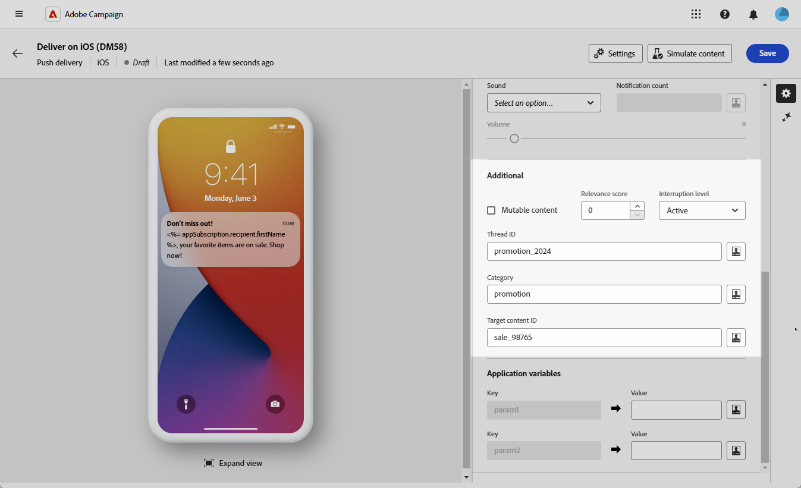
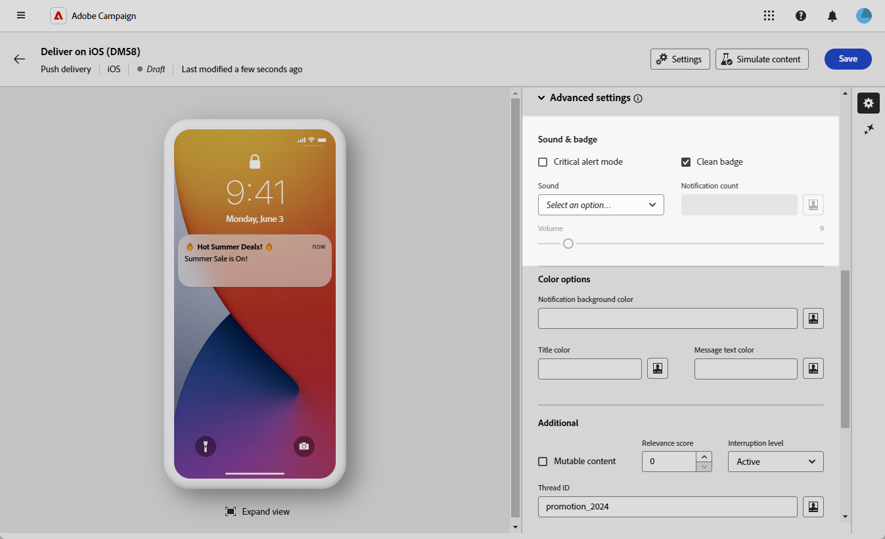

# iOS 리치 푸시 게재 디자인 {#rich-push}

>[!IMPORTANT]
>
>리치 푸시 알림을 디자인하기 전에 V2 커넥터를 구성해야 합니다. 자세한 절차는 [이 페이지](https://experienceleague.adobe.com/en/docs/campaign-classic/using/sending-messages/sending-push-notifications/configure-the-mobile-app/configuring-the-mobile-application)를 참조하세요.

## 알림 콘텐츠 정의 {#push-message}

푸시 게재가 만들어지면 다음 템플릿 중 하나를 사용하여 해당 콘텐츠를 정의합니다.

* **기본값**&#x200B;을 사용하면 간단한 아이콘과 함께 제공되는 이미지를 사용하여 알림을 보낼 수 있습니다.
* **기본**&#x200B;은(는) 알림에 텍스트, 이미지 및 단추를 포함할 수 있습니다.
* **회전판**&#x200B;을 사용하면 사용자가 이동할 수 있는 텍스트 및 여러 이미지로 알림을 보낼 수 있습니다.
* **타이머**&#x200B;에 알림에 실시간 카운트다운 타이머가 포함되어 있습니다.

이러한 템플릿을 개인화하는 방법에 대한 자세한 내용을 보려면 아래 탭으로 이동하십시오.

>[!BEGINTABS]

>[!TAB 기본값]

1. **[!UICONTROL 템플릿]** 드롭다운에서 **[!UICONTROL 기본값]**&#x200B;을 선택합니다.

   

1. **[!UICONTROL 제목]** 필드에 알림 센터에서 사용할 수 있는 알림 목록에 표시할 제목의 레이블을 입력합니다.

   이 필드는 iOS 알림 페이로드의 **title** 매개 변수의 값을 정의합니다.

1. 선택적으로 iOS 알림 페이로드의 **자막** 매개 변수에 해당하는 **[!UICONTROL 자막]**&#x200B;을 추가합니다.

1. **[!UICONTROL 메시지]** 필드에 메시지 내용을 입력합니다.

1. 표현식 편집기를 사용하여 콘텐츠를 정의하고, 데이터를 개인화하고, 다이내믹 콘텐츠를 추가합니다. [자세히 알아보기](../personalization/personalize.md)

   

1. 푸시 알림을 추가로 개인화하려면 푸시 알림에 추가할 **[!UICONTROL 이미지 시작]** URL을 선택하세요.

1. **[!UICONTROL 고급 설정]** 드롭다운에서 **[!UICONTROL 사운드 및 배지]** 탭으로 이동하여 알림에 대한 사운드 및 배지 옵션과 같은 추가 설정을 사용자 지정합니다. [자세히 알아보기](#sound-badge)

   

1. 추가 사용자 지정을 위해 푸시 알림에 사용할 수 있는 **[!UICONTROL 추가]** 옵션을 살펴보십시오. [자세히 알아보기](#push-advanced)

   

1. **[!UICONTROL 응용 프로그램 변수]** 메뉴에서 **[!UICONTROL 응용 프로그램 변수]**&#x200B;이(가) 자동으로 추가됩니다. 이를 통해 사용자가 알림을 활성화할 때 표시할 특정 애플리케이션 화면을 구성하는 것과 같은 알림 동작을 정의할 수 있습니다.

메시지 콘텐츠를 정의하고 나면 테스트 구독자를 사용하여 메시지를 미리 보고 테스트합니다.

>[!TAB 기본]

1. **[!UICONTROL 템플릿]** 드롭다운에서 **[!UICONTROL 기본]**&#x200B;을 선택합니다.

   

1. 메시지를 작성하려면 **[!UICONTROL 제목]**, **[!UICONTROL 확장된 제목]**, **[!UICONTROL 메시지]** 및 **[!UICONTROL 확장된 메시지]** 필드에 텍스트를 입력하십시오.

   **[!UICONTROL 메시지]** 텍스트는 축소된 보기에 나타나며 알림을 확장하면 **[!UICONTROL 확장된 메시지]**&#x200B;이 표시됩니다.

   

1. 표현식 편집기를 사용하여 콘텐츠를 정의하고, 데이터를 개인화하고, 다이내믹 콘텐츠를 추가합니다. [자세히 알아보기](../personalization/personalize.md)

1. 선택적으로 iOS 알림 페이로드의 **자막** 매개 변수에 해당하는 **[!UICONTROL 자막]**&#x200B;을 추가합니다.

1. 알림에서 사용자 클릭과 연결된 **[!UICONTROL 클릭 동작]**&#x200B;을 정의하는 URL을 추가하십시오. 이는 사용자가 특정 화면을 열거나 앱에서 특정 작업을 수행하는 것과 같이 알림과 상호 작용할 때의 동작을 결정합니다.

1. 푸시 알림을 추가로 개인화하려면 푸시 알림에 추가할 **[!UICONTROL 이미지 시작]** URL을 선택하세요.

1. **[!UICONTROL 고급 설정]** 드롭다운에서 **[!UICONTROL 사운드 및 배지]** 탭으로 이동하여 알림에 대한 사운드 및 배지 옵션과 같은 추가 설정을 사용자 지정합니다. [자세히 알아보기](#sound-badge)

   

1. **[!UICONTROL 색상 옵션]** 메뉴에서 **[!UICONTROL 알림 배경색]**, **[!UICONTROL 알림 배경색]** 및 **[!UICONTROL 메시지 텍스트 색]**&#x200B;에 대한 16진수 색상 코드를 입력하십시오.

   

1. 추가 사용자 지정을 위해 푸시 알림에 사용할 수 있는 **[!UICONTROL 추가]** 옵션을 살펴보십시오. [자세히 알아보기](#push-advanced)

1. **[!UICONTROL 응용 프로그램 변수]** 메뉴에서 **[!UICONTROL 응용 프로그램 변수]**&#x200B;이(가) 자동으로 추가됩니다. 이를 통해 사용자가 알림을 활성화할 때 표시할 특정 애플리케이션 화면을 구성하는 것과 같은 알림 동작을 정의할 수 있습니다.

메시지 콘텐츠를 정의하고 나면 테스트 구독자를 사용하여 메시지를 미리 보고 테스트합니다.

>[!TAB 회전]

1. **[!UICONTROL 템플릿]** 드롭다운에서 **[!UICONTROL 회전]**&#x200B;을 선택합니다.

   

1. 메시지를 작성하려면 **[!UICONTROL 제목]**, **[!UICONTROL 확장된 제목]**, **[!UICONTROL 메시지]** 및 **[!UICONTROL 확장된 메시지]** 필드에 텍스트를 입력하십시오.

   **[!UICONTROL 메시지]** 텍스트는 축소된 보기에 나타나며 알림을 확장하면 **[!UICONTROL 확장된 메시지]**&#x200B;이 표시됩니다.

   

1. 표현식 편집기를 사용하여 콘텐츠를 정의하고, 데이터를 개인화하고, 다이내믹 콘텐츠를 추가합니다. [자세히 알아보기](../personalization/personalize.md)

1. 선택적으로 iOS 알림 페이로드의 **자막** 매개 변수에 해당하는 **[!UICONTROL 자막]**&#x200B;을 추가합니다.

1. 알림에서 사용자 클릭과 연결된 **[!UICONTROL 클릭 동작]**&#x200B;을 정의하는 URL을 추가하십시오. 이는 사용자가 특정 화면을 열거나 앱에서 특정 작업을 수행하는 것과 같이 알림과 상호 작용할 때의 동작을 결정합니다.

1. **[!UICONTROL 회전]**&#x200B;의 작동 방식 선택:

   * **[!UICONTROL 자동]**: 미리 정의된 간격으로 전환하면서 이미지를 슬라이드로 자동 순환합니다.
   * **[!UICONTROL 수동]**: 사용자가 슬라이드 사이를 수동으로 스와이프하여 이미지를 탐색할 수 있도록 허용합니다.

1. **[!UICONTROL 이미지 추가]**&#x200B;를 클릭하고 **[!UICONTROL 이미지]** URL, **[!UICONTROL 텍스트]** 및 **[!UICONTROL 작업 URI]**&#x200B;를 입력하십시오.

   최소 3개의 이미지와 최대 5개의 이미지를 포함해야 합니다.

   

1. 아래쪽 및 위쪽 화살표를 사용하여 이미지 순서를 처리합니다.

1. **[!UICONTROL 고급 설정]** 드롭다운에서 **[!UICONTROL 사운드 및 배지]** 탭으로 이동하여 알림에 대한 사운드 및 배지 옵션과 같은 추가 설정을 사용자 지정합니다. [자세히 알아보기](#sound-badge)

1. **[!UICONTROL 색상 옵션]** 메뉴에서 **[!UICONTROL 알림 배경색]**, **[!UICONTROL 알림 배경색]** 및 **[!UICONTROL 메시지 텍스트 색]**&#x200B;에 대한 16진수 색상 코드를 입력하십시오.

   

1. 추가 사용자 지정을 위해 푸시 알림에 사용할 수 있는 **[!UICONTROL 추가]** 옵션을 살펴보십시오. [자세히 알아보기](#push-advanced)

1. **[!UICONTROL 응용 프로그램 변수]** 메뉴에서 **[!UICONTROL 응용 프로그램 변수]**&#x200B;이(가) 자동으로 추가됩니다. 이를 통해 사용자가 알림을 활성화할 때 표시할 특정 애플리케이션 화면을 구성하는 것과 같은 알림 동작을 정의할 수 있습니다.

메시지 콘텐츠를 정의하고 나면 테스트 구독자를 사용하여 메시지를 미리 보고 테스트합니다.

>[!TAB 타이머]

1. **[!UICONTROL 알림 유형]** 드롭다운에서 **[!UICONTROL 타이머]**&#x200B;를 선택합니다.

   

1. 메시지를 작성하려면 **[!UICONTROL 제목]**, **[!UICONTROL 확장된 제목]**, **[!UICONTROL 메시지]** 및 **[!UICONTROL 확장된 메시지]** 필드에 텍스트를 입력하십시오.

   **[!UICONTROL 메시지]** 텍스트는 축소된 보기에 나타나며 알림을 확장하면 **[!UICONTROL 확장된 메시지]**&#x200B;이 표시됩니다.

   

1. 표현식 편집기를 사용하여 콘텐츠를 정의하고, 데이터를 개인화하고, 다이내믹 콘텐츠를 추가합니다. [자세히 알아보기](../personalization/personalize.md)

1. 선택적으로 iOS 알림 페이로드의 **자막** 매개 변수에 해당하는 **[!UICONTROL 자막]**&#x200B;을 추가합니다.

1. 알림에서 사용자 클릭과 연결된 **[!UICONTROL 클릭 동작]**&#x200B;을 정의하는 URL을 추가하십시오. 이는 사용자가 특정 화면을 열거나 앱에서 특정 작업을 수행하는 것과 같이 알림과 상호 작용할 때의 동작을 결정합니다.

1. 푸시 알림을 추가로 개인화하려면 푸시 알림에 추가할 **[!UICONTROL 이미지 시작]** URL을 선택하세요.

1. **[!UICONTROL 타이머 기간]**&#x200B;을(를) 초 단위로 설정하거나 **[!UICONTROL 타이머 종료 타임스탬프]**&#x200B;를 특정 에포크 타임스탬프로 설정합니다.

   

1. **[!UICONTROL 대체 제목]**, **[!UICONTROL 대체 메시지]** 및 **[!UICONTROL 대체 시작 이미지]** 필드에 타이머가 만료된 후 표시할 텍스트와 이미지를 입력하십시오.

   

1. **[!UICONTROL 고급 설정]** 드롭다운에서 **[!UICONTROL 사운드 및 배지]** 탭으로 이동하여 알림에 대한 사운드 및 배지 옵션과 같은 추가 설정을 사용자 지정합니다. [자세히 알아보기](#sound-badge)

1. **[!UICONTROL 색상 옵션]** 메뉴에서 **[!UICONTROL 알림 배경색]**, **[!UICONTROL 알림 배경색]** 및 **[!UICONTROL 메시지 텍스트 색]**&#x200B;에 대한 16진수 색상 코드를 입력하십시오.

1. 추가 사용자 지정을 위해 푸시 알림에 사용할 수 있는 **[!UICONTROL 추가]** 옵션을 살펴보십시오. [자세히 알아보기](#push-advanced)

1. **[!UICONTROL 응용 프로그램 변수]** 메뉴에서 **[!UICONTROL 응용 프로그램 변수]**&#x200B;이(가) 자동으로 추가됩니다. 이를 통해 사용자가 알림을 활성화할 때 표시할 특정 애플리케이션 화면을 구성하는 것과 같은 알림 동작을 정의할 수 있습니다.

메시지 콘텐츠를 정의하고 나면 테스트 구독자를 사용하여 메시지를 미리 보고 테스트합니다.

>[!ENDTABS]

## 푸시 알림 고급 설정 {#push-advanced}

### 사운드 및 배지 옵션 {#sound-badge}

| 매개변수 | 설명 |
|-----------|-------------|
| **[!UICONTROL 중요 경고 모드]** | 사용자의 휴대폰이 포커스 모드로 설정되어 있거나 음소거된 경우에도 알림에 사운드를 추가하려면 이 옵션을 활성화합니다. |
| **[!UICONTROL 배지 정리]** | 배지 값을 새로 고치려면 이 옵션을 활성화합니다. |
| **[!UICONTROL 소리]** | 장치에서 알림을 받을 때 소리가 재생되도록 설정합니다. |
| **[!UICONTROL 알림 수]** | 읽지 않은 새 알림의 수를 나타내는 숫자를 애플리케이션 아이콘에 직접 표시하도록 설정하십시오. |
| **[!UICONTROL 볼륨]** | 사운드의 볼륨을 0에서 100으로 설정합니다. 사운드는 애플리케이션에 포함되어야 하며 서비스를 만들 때 정의되어야 합니다. |

### 색상 옵션 {#color}

| 매개변수 | 설명 |
|-----------|-------------|
| **[!UICONTROL 알림 배경색]** | 16진수 색상 코드를 사용하여 알림 배경의 색상을 설정합니다. |
| **[!UICONTROL 제목 색상]** | 16진수 색상 코드를 사용하여 제목의 색상을 설정합니다. |
| **[!UICONTROL 메시지 텍스트 색상]** | 16진수 색상 코드를 사용하여 텍스트 색상을 설정합니다. |

### 고급 옵션 {#notification-options}

| 매개변수 | 설명 |
|-----------|-------------|
| **[!UICONTROL 변경 가능한 콘텐츠]** | 모바일 애플리케이션에서 미디어 콘텐츠를 다운로드하도록 하려면 이 옵션을 활성화합니다. |
| **[!UICONTROL 관련성 점수]** | 관련성 점수를 0에서 100으로 설정합니다. 시스템은 이 옵션을 사용하여 알림 요약에서 알림을 정렬합니다. |
| **[!UICONTROL 중단 수준]** | <ul><li>**활성**: 기본적으로 설정되어 있으면 시스템에서 알림을 즉시 표시하고 화면을 켜며 소리를 재생할 수 있습니다. 알림은 포커스 모드를 통과하지 않습니다.</li><li>**수동**: 시스템에서 화면을 켜거나 소리를 재생하지 않고 알림 목록에 알림을 추가합니다. 알림은 포커스 모드를 통과하지 않습니다.</li><li>**시간에 민감함**: 시스템에서 알림을 즉시 표시하고 화면을 켜고 소리를 재생하며 포커스 모드를 중단합니다. 이 수준에서는 Apple의 특별한 권한이 필요하지 않습니다.</li><li>**중요**: 시스템에서 알림을 즉시 표시하고 화면을 켜며 음소거 스위치나 포커스 모드를 사용하지 않습니다. 이 수준에는 Apple의 특별한 권한이 필요합니다.</li></ul> |
| **[!UICONTROL 스레드 ID]** | 관련 알림을 함께 그룹화하는 데 사용되는 식별자를 설정합니다. |
| **[!UICONTROL 범주]** | 작업 단추를 표시하는 범주 ID의 이름을 설정합니다. 이러한 알림은 사용자가 애플리케이션을 열거나 탐색하지 않고도 알림에 응답하여 다른 작업을 보다 빠르게 수행할 수 있도록 합니다. |
| **[!UICONTROL 대상 콘텐츠 ID]** | 알림을 열 때 앞으로 가져올 응용 프로그램 창을 대상으로 하는 데 사용되는 식별자를 설정합니다. |