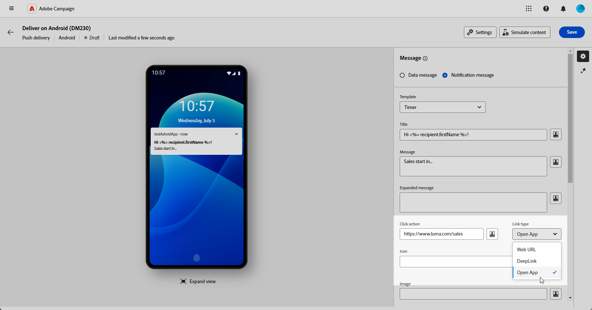

# Android 리치 푸시 게재 디자인 {#rich-push}

>[!CONTEXTUALHELP]
>id="acw_deliveries_push_remind_later"
>title="나중에 알림 버튼"
>abstract="**나중에 알림** 버튼은 알림을 예약하는 옵션을 제공합니다. 타임스탬프 필드에는 에포크를 초 단위로 나타내는 값이 필요합니다."

>[!IMPORTANT]
>
>* 이 기능을 사용하려면 Campaign v8.6.3 <!--or v8.7.2-->로 업데이트해야 합니다. Campaign v8 클라이언트 콘솔 [릴리스 정보](https://experienceleague.adobe.com/ko/docs/campaign/campaign-v8/releases/release-notes){target="_blank"}에서 자세히 알아보십시오.
>
>* 리치 푸시 알림을 디자인하기 전에 먼저 V2 커넥터를 구성해야 합니다. 자세한 절차는 [이 페이지](https://experienceleague.adobe.com/ko/docs/campaign-classic/using/sending-messages/sending-push-notifications/configure-the-mobile-app/configuring-the-mobile-application-android#configuring-external-account-android){target="_blank"}를 참조하세요.

Firebase Cloud Messaging을 사용하면 두 가지 유형의 메시지 중에서 선택할 수 있습니다.

* **[!UICONTROL 데이터 메시지]**&#x200B;는 클라이언트 앱에서 처리됩니다. 이러한 메시지는 모바일 애플리케이션으로 직접 전송되며, 모바일 애플리케이션은 디바이스에 Android 알림을 생성하고 표시합니다. 데이터 메시지에는 사용자 정의 애플리케이션 변수만 포함됩니다.

* **[!UICONTROL 알림 메시지]**&#x200B;이(가) FCM SDK에 의해 자동으로 처리됩니다. FCM은 클라이언트 앱을 대신하여 사용자의 장치에 메시지를 자동으로 표시합니다. 알림 메시지에는 사전 정의된 매개 변수 및 옵션 세트가 포함되어 있지만 사용자 지정 애플리케이션 변수를 사용하여 추가로 개인화할 수 있습니다.

{zoomable="yes"}

## 알림 콘텐츠 정의 {#push-message}

푸시 게재가 만들어지면 다음 템플릿 중 하나를 사용하여 해당 콘텐츠를 정의할 수 있습니다.

* **기본값**&#x200B;을 사용하면 간단한 아이콘과 함께 제공되는 이미지를 사용하여 알림을 보낼 수 있습니다.

* **기본**&#x200B;은(는) 알림에 텍스트, 이미지 및 단추를 포함할 수 있습니다.

* **회전판**&#x200B;을 사용하면 사용자가 이동할 수 있는 텍스트 및 여러 이미지로 알림을 보낼 수 있습니다.

* **아이콘 단추**&#x200B;를 사용하면 아이콘과 해당 이미지를 사용하여 알림을 보낼 수 있습니다.

* **입력란**&#x200B;은(는) 알림을 통해 사용자 입력과 피드백을 직접 수집합니다.

* **제품 카탈로그**&#x200B;에는 다양한 제품 이미지가 표시됩니다.

* **제품 평가**&#x200B;를 통해 사용자는 피드백을 제공하고 제품에 대한 등급을 매길 수 있습니다.

* **타이머**&#x200B;에 알림에 실시간 카운트다운 타이머가 포함되어 있습니다.

* **베젤 제로**&#x200B;는 이미지의 전체 배경 표면을 사용하며 텍스트는 원활하게 오버레이됩니다.

이러한 템플릿을 개인화하는 방법에 대한 자세한 내용을 보려면 아래 탭으로 이동하십시오.

>[!BEGINTABS]

>[!TAB 기본값]

1. **[!UICONTROL 템플릿]** 드롭다운에서 **[!UICONTROL 기본값]**&#x200B;을 선택합니다.

   

1. 메시지를 작성하려면 **[!UICONTROL 제목]** 및 **[!UICONTROL 메시지]** 필드에 텍스트를 입력하십시오.

   

1. 표현식 편집기를 사용하여 콘텐츠를 정의하고, 데이터를 개인화하고, 다이내믹 콘텐츠를 추가합니다. [자세히 알아보기](../personalization/personalize.md)

1. 알림에서 사용자 클릭과 관련된 **[!UICONTROL 클릭 동작]**&#x200B;을(를) 정의합니다. 이는 사용자가 특정 화면을 열거나 앱에서 특정 작업을 수행하는 것과 같이 알림과 상호 작용할 때의 동작을 결정합니다.

1. 푸시 알림을 추가로 개인화하려면 푸시 알림에 추가할 **[!UICONTROL 이미지]** URL과 프로필의 장치에 표시할 알림의 **[!UICONTROL 아이콘]**&#x200B;을 선택할 수 있습니다.

   

1. 푸시 알림의 **[!UICONTROL 고급 설정]**&#x200B;을 구성합니다. [자세히 알아보기](#push-advanced)

메시지 콘텐츠를 정의했으면 테스트 구독자를 사용하여 메시지를 미리 보고 테스트할 수 있습니다.

>[!TAB 기본]

1. **[!UICONTROL 템플릿]** 드롭다운에서 **[!UICONTROL 기본]**&#x200B;을 선택합니다.

   

1. 메시지를 작성하려면 **[!UICONTROL 제목]**, **[!UICONTROL 메시지]** 및 **[!UICONTROL 확장된 메시지]** 필드에 텍스트를 입력하십시오.

   알림을 확장할 때 **[!UICONTROL 확장된 메시지]**&#x200B;가 표시되는 동안 **[!UICONTROL 메시지]** 텍스트가 축소된 보기에 나타납니다.

   

1. 표현식 편집기를 사용하여 콘텐츠를 정의하고, 데이터를 개인화하고, 다이내믹 콘텐츠를 추가합니다. [자세히 알아보기](../personalization/personalize.md)

1. 알림에서 사용자 클릭과 연결된 **[!UICONTROL 클릭 동작]**&#x200B;을 정의하는 URL을 추가하십시오. 이는 사용자가 특정 화면을 열거나 앱에서 특정 작업을 수행하는 것과 같이 알림과 상호 작용할 때의 동작을 결정합니다.

1. **[!UICONTROL 클릭 동작]** 필드에 추가한 URL의 **[!UICONTROL 링크 유형]**&#x200B;을(를) 선택하십시오.

   * **[!UICONTROL 웹 URL]**: 웹 URL은 사용자를 온라인 콘텐츠로 안내합니다. 클릭하면 디바이스의 기본 웹 브라우저에서 를 열고 지정된 URL로 이동하라는 메시지가 표시됩니다.

   * **[!UICONTROL 딥링크]**: 딥링크는 앱이 닫힌 경우에도 앱 내의 특정 섹션으로 사용자를 안내하는 URL입니다. 클릭하면 대화 상자가 표시되어 사용자가 링크를 처리할 수 있는 다양한 앱 중에서 선택할 수 있습니다.

   * **[!UICONTROL 앱 열기]**: 앱 URL을 열면 응용 프로그램 내의 콘텐츠에 직접 연결할 수 있습니다. 이를 통해 애플리케이션이 명확화 대화 상자를 거치지 않고 특정 유형의 링크에 대한 기본 핸들러로 자리매김할 수 있습니다.

   Android 앱 링크를 처리하는 방법에 대한 자세한 내용은 [Android 개발자 설명서](https://developer.android.com/training/app-links)를 참조하세요.

   

1. 푸시 알림을 추가로 개인화하려면 푸시 알림에 추가할 **[!UICONTROL 이미지]** URL과 프로필의 장치에 표시할 알림의 **[!UICONTROL 아이콘]**&#x200B;을 선택할 수 있습니다.

1. **[!UICONTROL 추가 단추]**&#x200B;를 클릭하고 다음 필드를 채웁니다.

   * **[!UICONTROL 레이블]**: 단추에 표시되는 텍스트입니다.
   * **[!UICONTROL 링크 URI]**: 단추를 클릭할 때 실행할 URI를 지정합니다.
   * **[!UICONTROL 링크 유형]**: 링크 유형은 **[!UICONTROL 웹 URL]**, **[!UICONTROL 딥링크]** 또는 **[!UICONTROL 앱 열기]**&#x200B;입니다.

   푸시 알림에 최대 3개의 버튼을 포함할 수 있는 옵션이 있습니다. **[!UICONTROL 나중에 알림 단추]**&#x200B;를 선택한 경우 최대 두 개의 단추만 포함할 수 있습니다.

   

1. 푸시 알림에 나중에 알림 옵션을 추가하려면 **[!UICONTROL 나중에 알림 추가]** 단추를 클릭하세요. **[!UICONTROL 레이블]** 및 **[!UICONTROL 타임스탬프]**&#x200B;을(를) 입력하십시오.

   타임스탬프 필드에는 에포크(초)를 나타내는 값이 필요합니다.

   

1. 푸시 알림의 **[!UICONTROL 고급 설정]**&#x200B;을 구성합니다. [자세히 알아보기](#push-advanced)

메시지 콘텐츠를 정의했으면 테스트 구독자를 사용하여 메시지를 미리 보고 테스트할 수 있습니다.

>[!TAB 회전]

1. **[!UICONTROL 템플릿]** 드롭다운에서 **[!UICONTROL 회전]**&#x200B;을 선택합니다.

   

1. 메시지를 작성하려면 **[!UICONTROL 제목]**, **[!UICONTROL 메시지]** 및 **[!UICONTROL 확장된 메시지]** 필드에 텍스트를 입력하십시오.

   알림을 확장할 때 **[!UICONTROL 확장된 메시지]**&#x200B;가 표시되는 동안 **[!UICONTROL 메시지]** 텍스트가 축소된 보기에 나타납니다.

   

1. 표현식 편집기를 사용하여 콘텐츠를 정의하고, 데이터를 개인화하고, 다이내믹 콘텐츠를 추가합니다. [자세히 알아보기](../personalization/personalize.md)

1. 알림에서 사용자 클릭과 연결된 **[!UICONTROL 클릭 동작]**&#x200B;을 정의하는 URL을 추가하십시오. 이는 사용자가 특정 화면을 열거나 앱에서 특정 작업을 수행하는 것과 같이 알림과 상호 작용할 때의 동작을 결정합니다.

1. **[!UICONTROL 클릭 동작]** 필드에 추가한 URL의 **[!UICONTROL 링크 유형]**&#x200B;을(를) 선택하십시오.

   * **[!UICONTROL 웹 URL]**&#x200B;L: 웹 URL은 사용자를 온라인 콘텐츠로 안내합니다. 클릭하면 디바이스의 기본 웹 브라우저에서 를 열고 지정된 URL로 이동하라는 메시지가 표시됩니다.

   * **[!UICONTROL 딥링크]**: 딥링크는 앱이 닫힌 경우에도 앱 내의 특정 섹션으로 사용자를 안내하는 URL입니다. 클릭하면 대화 상자가 표시되어 사용자가 링크를 처리할 수 있는 다양한 앱 중에서 선택할 수 있습니다.

   * **[!UICONTROL 앱 열기]**: 앱 URL을 열면 응용 프로그램 내의 콘텐츠에 직접 연결할 수 있습니다. 이를 통해 애플리케이션이 명확화 대화 상자를 거치지 않고 특정 유형의 링크에 대한 기본 핸들러로 자리매김할 수 있습니다.

   Android 앱 링크를 처리하는 방법에 대한 자세한 내용은 [Android 개발자 설명서](https://developer.android.com/training/app-links)를 참조하세요.

   

1. 푸시 알림을 추가로 개인화하려면 알림의 **[!UICONTROL 아이콘]**&#x200B;을(를) 선택하여 프로필의 장치에 표시할 수 있습니다.

1. **[!UICONTROL 회전]**&#x200B;의 작동 방식 선택:

   * **[!UICONTROL 자동]**: 미리 정의된 간격으로 전환하면서 이미지를 슬라이드로 자동 순환합니다.
   * **[!UICONTROL 수동]**: 사용자가 슬라이드 사이를 수동으로 스와이프하여 이미지를 탐색할 수 있도록 허용합니다.

     기본 슬라이드와 함께 이전 및 다음 이미지의 미리 보기를 포함하려면 **[!UICONTROL 필름 스트립]** 옵션을 활성화하십시오.

1. **[!UICONTROL 이미지 추가]**&#x200B;를 클릭하고 이미지 URL과 텍스트를 입력하십시오.

   최소 3개의 이미지와 최대 5개의 이미지를 포함해야 합니다.

   

1. 아래쪽 및 위쪽 화살표를 사용하여 이미지 순서를 처리합니다.

1. 푸시 알림의 **[!UICONTROL 고급 설정]**&#x200B;을 구성합니다. [자세히 알아보기](#push-advanced)

메시지 콘텐츠를 정의했으면 테스트 구독자를 사용하여 메시지를 미리 보고 테스트할 수 있습니다.

>[!TAB 아이콘 단추]

1. **[!UICONTROL 템플릿]** 드롭다운에서 **[!UICONTROL 아이콘 단추]**&#x200B;를 선택합니다.

   

1. 알림에서 사용자 클릭과 연결된 **[!UICONTROL 클릭 동작]**&#x200B;을 정의하는 URL을 추가하십시오. 이는 사용자가 특정 화면을 열거나 앱에서 특정 작업을 수행하는 것과 같이 알림과 상호 작용할 때의 동작을 결정합니다.

1. **[!UICONTROL 클릭 동작]** 필드에 추가한 URL의 **[!UICONTROL 링크 유형]**&#x200B;을(를) 선택하십시오.

   * **[!UICONTROL 웹 URL]**: 웹 URL은 사용자를 온라인 콘텐츠로 안내합니다. 클릭하면 디바이스의 기본 웹 브라우저에서 를 열고 지정된 URL로 이동하라는 메시지가 표시됩니다.

   * **[!UICONTROL 딥링크]**: 딥링크는 앱이 닫힌 경우에도 앱 내의 특정 섹션으로 사용자를 안내하는 URL입니다. 클릭하면 대화 상자가 표시되어 사용자가 링크를 처리할 수 있는 다양한 앱 중에서 선택할 수 있습니다.

   * **[!UICONTROL 앱 열기]**: 앱 URL을 열면 응용 프로그램 내의 콘텐츠에 직접 연결할 수 있습니다. 이를 통해 애플리케이션이 명확화 대화 상자를 거치지 않고 특정 유형의 링크에 대한 기본 핸들러로 자리매김할 수 있습니다.

   Android 앱 링크를 처리하는 방법에 대한 자세한 내용은 [Android 개발자 설명서](https://developer.android.com/training/app-links)를 참조하세요.

   

1. 푸시 알림을 추가로 개인화하려면 알림의 **[!UICONTROL 아이콘]**&#x200B;을(를) 선택하여 프로필의 장치에 표시할 수 있습니다.

1. **[!UICONTROL 취소 단추 이미지]**&#x200B;의 URL을 추가하십시오.

1. **[!UICONTROL 추가 아이콘]**&#x200B;을 클릭하고 **이미지 URL**, **[!UICONTROL 링크 URI]**&#x200B;를 입력한 다음 **[!UICONTROL 링크 유형]**&#x200B;을 선택합니다.

   최소 3개의 아이콘과 최대 5개의 아이콘을 포함해야 합니다.

   

1. 아래쪽 및 위쪽 화살표를 사용하여 이미지 순서를 처리합니다.

1. 푸시 알림의 **[!UICONTROL 고급 설정]**&#x200B;을 구성합니다. [자세히 알아보기](#push-advanced)

   

메시지 콘텐츠를 정의했으면 테스트 구독자를 사용하여 메시지를 미리 보고 테스트할 수 있습니다.

>[!TAB 입력란]

1. **[!UICONTROL 알림 유형]** 드롭다운에서 **[!UICONTROL 입력 상자]**&#x200B;를 선택합니다.

   

1. 메시지를 작성하려면 **[!UICONTROL 제목]**, **[!UICONTROL 메시지]** 및 **[!UICONTROL 확장된 메시지]** 필드에 텍스트를 입력하십시오.

   알림을 확장할 때 **[!UICONTROL 확장된 메시지]**&#x200B;가 표시되는 동안 **[!UICONTROL 메시지]** 텍스트가 축소된 보기에 나타납니다.

   

1. 다이내믹 개인화 필드를 사용하여 콘텐츠를 정의하고, 데이터를 개인화하고, 다이내믹 콘텐츠를 추가합니다. [자세히 알아보기](../personalization/personalize.md)

1. 알림에서 사용자 클릭과 연결된 **[!UICONTROL 클릭 동작]**&#x200B;을 정의하는 URL을 추가하십시오. 이는 사용자가 특정 화면을 열거나 앱에서 특정 작업을 수행하는 것과 같이 알림과 상호 작용할 때의 동작을 결정합니다.

1. **[!UICONTROL 클릭 동작]** 필드에 추가한 URL의 **[!UICONTROL 링크 유형]**&#x200B;을(를) 선택하십시오.

   * **[!UICONTROL 웹 URL]**: 웹 URL은 사용자를 온라인 콘텐츠로 안내합니다. 클릭하면 디바이스의 기본 웹 브라우저에서 를 열고 지정된 URL로 이동하라는 메시지가 표시됩니다.

   * **[!UICONTROL 딥링크]**: 딥링크는 앱이 닫힌 경우에도 앱 내의 특정 섹션으로 사용자를 안내하는 URL입니다. 클릭하면 대화 상자가 표시되어 사용자가 링크를 처리할 수 있는 다양한 앱 중에서 선택할 수 있습니다.

   * **[!UICONTROL 앱 열기]**: 앱 URL을 열면 응용 프로그램 내의 콘텐츠에 직접 연결할 수 있습니다. 이를 통해 애플리케이션이 명확화 대화 상자를 거치지 않고 특정 유형의 링크에 대한 기본 핸들러로 자리매김할 수 있습니다.

   Android 앱 링크를 처리하는 방법에 대한 자세한 내용은 [Android 개발자 설명서](https://developer.android.com/training/app-links)를 참조하세요.

1. 푸시 알림을 추가로 개인화하려면 푸시 알림에 추가할 **[!UICONTROL 이미지]** URL과 프로필의 장치에 표시할 알림의 **[!UICONTROL 아이콘]**&#x200B;을 선택할 수 있습니다.

1. **입력 상자**&#x200B;에 다음 옵션을 입력하십시오.

   * **[!UICONTROL 받는 사람 이름]**: 입력 받는 사람의 이름 또는 식별자를 입력하십시오.
   * **[!UICONTROL 입력 텍스트]**: **입력 상자**&#x200B;에 대한 텍스트를 입력하십시오.
   * **[!UICONTROL 피드백 텍스트]**: 회신 후에 표시할 텍스트를 입력하십시오.
   * **[!UICONTROL 피드백 이미지]**: 회신 후에 표시되는 이미지의 URL을 추가합니다.

   

1. 푸시 알림의 **[!UICONTROL 고급 설정]**&#x200B;을 구성합니다. [자세히 알아보기](#push-advanced)

메시지 콘텐츠를 정의했으면 테스트 구독자를 사용하여 메시지를 미리 보고 테스트할 수 있습니다.

>[!TAB 제품 카탈로그]

1. **[!UICONTROL 알림 유형]** 드롭다운에서 **[!UICONTROL 제품 카탈로그]**&#x200B;를 선택합니다.

   

1. 메시지를 작성하려면 **[!UICONTROL 제목]** 및 **[!UICONTROL 메시지]** 필드에 텍스트를 입력하십시오.

   

1. 다이내믹 개인화 필드를 사용하여 콘텐츠를 정의하고, 데이터를 개인화하고, 다이내믹 콘텐츠를 추가합니다. [자세히 알아보기](../personalization/personalize.md)

1. 알림에서 사용자 클릭과 연결된 **[!UICONTROL 클릭 동작]**&#x200B;을 정의하는 URL을 추가하십시오. 이는 사용자가 특정 화면을 열거나 앱에서 특정 작업을 수행하는 것과 같이 알림과 상호 작용할 때의 동작을 결정합니다.

1. **[!UICONTROL 클릭 동작]** 필드에 추가한 URL의 **[!UICONTROL 링크 유형]**&#x200B;을(를) 선택하십시오.

   * **[!UICONTROL 웹 URL]**: 웹 URL은 사용자를 온라인 콘텐츠로 안내합니다. 클릭하면 디바이스의 기본 웹 브라우저에서 를 열고 지정된 URL로 이동하라는 메시지가 표시됩니다.

   * **[!UICONTROL 딥링크]**: 딥링크는 앱이 닫힌 경우에도 앱 내의 특정 섹션으로 사용자를 안내하는 URL입니다. 클릭하면 대화 상자가 표시되어 사용자가 링크를 처리할 수 있는 다양한 앱 중에서 선택할 수 있습니다.

   * **[!UICONTROL 앱 열기]**: 앱 URL을 열면 응용 프로그램 내의 콘텐츠에 직접 연결할 수 있습니다. 이를 통해 애플리케이션이 명확화 대화 상자를 거치지 않고 특정 유형의 링크에 대한 기본 핸들러로 자리매김할 수 있습니다.

   Android 앱 링크를 처리하는 방법에 대한 자세한 내용은 [Android 개발자 설명서](https://developer.android.com/training/app-links)를 참조하세요.

1. 푸시 알림을 추가로 개인화하려면 알림의 **[!UICONTROL 아이콘]**&#x200B;을(를) 선택하여 프로필의 장치에 표시할 수 있습니다.

1. **클릭 유도 문구** 및 **이미지**&#x200B;를 입력하세요.

1. **[!UICONTROL 표시 유형]**&#x200B;을(를) 가로 또는 세로 중에서 선택합니다.

1. **[!UICONTROL 카탈로그]** 항목 정보를 입력하십시오.

   최소 3개 항목과 최대 5개 항목을 포함해야 합니다.

   

1. 아래쪽 및 위쪽 화살표를 사용하여 이미지 순서를 처리합니다.

1. 푸시 알림의 **[!UICONTROL 고급 설정]**&#x200B;을 구성합니다. [자세히 알아보기](#push-advanced)

메시지 콘텐츠를 정의했으면 테스트 구독자를 사용하여 메시지를 미리 보고 테스트할 수 있습니다.

>[!TAB 제품 등급]

1. **[!UICONTROL 알림 유형]** 드롭다운에서 **[!UICONTROL 제품 등급]**&#x200B;을 선택합니다.

   

1. 메시지를 작성하려면 **[!UICONTROL 제목]**, **[!UICONTROL 메시지]** 및 **[!UICONTROL 확장된 메시지]** 필드에 텍스트를 입력하십시오.

   알림을 확장할 때 **[!UICONTROL 확장된 메시지]**&#x200B;가 표시되는 동안 **[!UICONTROL 메시지]** 텍스트가 축소된 보기에 나타납니다.

   

1. 알림에서 사용자 클릭과 연결된 **[!UICONTROL 클릭 동작]**&#x200B;을 정의하는 URL을 추가하십시오. 이는 사용자가 특정 화면을 열거나 앱에서 특정 작업을 수행하는 것과 같이 알림과 상호 작용할 때의 동작을 결정합니다.

1. **[!UICONTROL 클릭 동작]** 필드에 추가한 URL의 **[!UICONTROL 링크 유형]**&#x200B;을(를) 선택하십시오.

   * **[!UICONTROL 웹 URL]**: 웹 URL은 사용자를 온라인 콘텐츠로 안내합니다. 클릭하면 디바이스의 기본 웹 브라우저에서 를 열고 지정된 URL로 이동하라는 메시지가 표시됩니다.

   * **[!UICONTROL 딥링크]**: 딥링크는 앱이 닫힌 경우에도 앱 내의 특정 섹션으로 사용자를 안내하는 URL입니다. 클릭하면 대화 상자가 표시되어 사용자가 링크를 처리할 수 있는 다양한 앱 중에서 선택할 수 있습니다.

   * **[!UICONTROL 앱 열기]**: 앱 URL을 열면 응용 프로그램 내의 콘텐츠에 직접 연결할 수 있습니다. 이를 통해 애플리케이션이 명확화 대화 상자를 거치지 않고 특정 유형의 링크에 대한 기본 핸들러로 자리매김할 수 있습니다.

   Android 앱 링크를 처리하는 방법에 대한 자세한 내용은 [Android 개발자 설명서](https://developer.android.com/training/app-links)를 참조하세요.

1. 푸시 알림을 추가로 개인화하려면 푸시 알림에 추가할 **[!UICONTROL 이미지]** URL과 프로필의 장치에 표시할 알림의 **[!UICONTROL 아이콘]**&#x200B;을 선택할 수 있습니다.

1. **[!UICONTROL 선택되지 않은 상태의 등급 아이콘]**&#x200B;과 **[!UICONTROL 선택한 상태의 등급 아이콘]**&#x200B;을(를) 추가합니다.

   

1. **[!UICONTROL 등급 추가]**&#x200B;를 클릭하고 **[!UICONTROL 링크 URI]** 및 **[!UICONTROL 링크 유형]**&#x200B;을 입력하십시오.

   최소 3개의 등급과 최대 5개의 등급을 포함해야 합니다.

   

1. 아래쪽 및 위쪽 화살표를 사용하여 이미지 순서를 처리합니다.

1. 푸시 알림의 **[!UICONTROL 고급 설정]**&#x200B;을 구성합니다. [자세히 알아보기](#push-advanced)

메시지 콘텐츠를 정의했으면 테스트 구독자를 사용하여 메시지를 미리 보고 테스트할 수 있습니다.

>[!TAB 타이머]

1. **[!UICONTROL 알림 유형]** 드롭다운에서 **[!UICONTROL 타이머]**&#x200B;를 선택합니다.

   

1. 메시지를 작성하려면 **[!UICONTROL 제목]** 및 **[!UICONTROL 메시지]** 필드에 텍스트를 입력하십시오.

   다이내믹 개인화 필드를 사용하여 콘텐츠를 정의하고, 데이터를 개인화하고, 다이내믹 콘텐츠를 추가합니다. [자세히 알아보기](../personalization/personalize.md)

   

1. 알림에서 사용자 클릭과 연결된 **[!UICONTROL 클릭 동작]**&#x200B;을 정의하는 URL을 추가하십시오. 이는 사용자가 특정 화면을 열거나 앱에서 특정 작업을 수행하는 것과 같이 알림과 상호 작용할 때의 동작을 결정합니다.

1. **[!UICONTROL 클릭 동작]** 필드에 추가한 URL의 **[!UICONTROL 링크 유형]**&#x200B;을(를) 선택하십시오.

   * **[!UICONTROL 웹 URL]**: 웹 URL은 사용자를 온라인 콘텐츠로 안내합니다. 클릭하면 디바이스의 기본 웹 브라우저에서 를 열고 지정된 URL로 이동하라는 메시지가 표시됩니다.

   * **[!UICONTROL 딥링크]**: 딥링크는 앱이 닫힌 경우에도 앱 내의 특정 섹션으로 사용자를 안내하는 URL입니다. 클릭하면 대화 상자가 표시되어 사용자가 링크를 처리할 수 있는 다양한 앱 중에서 선택할 수 있습니다.

   * **[!UICONTROL 앱 열기]**: 앱 URL을 열면 응용 프로그램 내의 콘텐츠에 직접 연결할 수 있습니다. 이를 통해 애플리케이션이 명확화 대화 상자를 거치지 않고 특정 유형의 링크에 대한 기본 핸들러로 자리매김할 수 있습니다.

   Android 앱 링크를 처리하는 방법에 대한 자세한 내용은 [Android 개발자 설명서](https://developer.android.com/training/app-links)를 참조하세요.

   

1. 푸시 알림을 추가로 개인화하려면 푸시 알림에 추가할 **[!UICONTROL 이미지]** URL과 프로필의 장치에 표시할 알림의 **[!UICONTROL 아이콘]**&#x200B;을 선택할 수 있습니다.

1. **[!UICONTROL 타이머 기간]**&#x200B;을(를) 초 단위로 설정하거나 **[!UICONTROL 타이머 종료 타임스탬프]**&#x200B;를 특정 에포크 타임스탬프로 설정합니다.

   

1. **[!UICONTROL 대체 제목]**, **[!UICONTROL 대체 메시지]**, **[!UICONTROL 대체 확장 메시지]** 및 **[!UICONTROL 대체 시작 이미지]** 필드에 타이머가 만료된 후 표시할 텍스트와 이미지를 입력하십시오.

   

1. 푸시 알림의 **[!UICONTROL 고급 설정]**&#x200B;을 구성합니다. [자세히 알아보기](#push-advanced)

메시지 콘텐츠를 정의했으면 테스트 구독자를 사용하여 메시지를 미리 보고 테스트할 수 있습니다.

>[!TAB 베젤 제로]

1. **[!UICONTROL 알림 유형]** 드롭다운에서 **[!UICONTROL 제로 베젤]**&#x200B;을 선택합니다.

   

1. 메시지를 작성하려면 **[!UICONTROL 제목]**, **[!UICONTROL 메시지]** 및 **[!UICONTROL 확장된 메시지]** 필드에 텍스트를 입력하십시오.

   알림을 확장할 때 **[!UICONTROL 확장된 메시지]**&#x200B;가 표시되는 동안 **[!UICONTROL 메시지]** 텍스트가 축소된 보기에 나타납니다.

   

1. 다이내믹 개인화 필드를 사용하여 콘텐츠를 정의하고, 데이터를 개인화하고, 다이내믹 콘텐츠를 추가합니다. [자세히 알아보기](../personalization/personalize.md)

1. 알림에서 사용자 클릭과 연결된 **[!UICONTROL 클릭 동작]**&#x200B;을 정의하는 URL을 추가하십시오. 이는 사용자가 특정 화면을 열거나 앱에서 특정 작업을 수행하는 것과 같이 알림과 상호 작용할 때의 동작을 결정합니다.

1. **[!UICONTROL 클릭 동작]** 필드에 추가한 URL의 **[!UICONTROL 링크 유형]**&#x200B;을(를) 선택하십시오.

   * **[!UICONTROL 웹 URL]**: 웹 URL은 사용자를 온라인 콘텐츠로 안내합니다. 클릭하면 디바이스의 기본 웹 브라우저에서 를 열고 지정된 URL로 이동하라는 메시지가 표시됩니다.

   * **[!UICONTROL 딥링크]**: 딥링크는 앱이 닫힌 경우에도 앱 내의 특정 섹션으로 사용자를 안내하는 URL입니다. 클릭하면 대화 상자가 표시되어 사용자가 링크를 처리할 수 있는 다양한 앱 중에서 선택할 수 있습니다.

   * **[!UICONTROL 앱 열기]**: 앱 URL을 열면 응용 프로그램 내의 콘텐츠에 직접 연결할 수 있습니다. 이를 통해 애플리케이션이 명확화 대화 상자를 거치지 않고 특정 유형의 링크에 대한 기본 핸들러로 자리매김할 수 있습니다.

   Android 앱 링크를 처리하는 방법에 대한 자세한 내용은 [Android 개발자 설명서](https://developer.android.com/training/app-links)를 참조하세요.

1. 푸시 알림을 추가로 개인화하려면 푸시 알림에 추가할 **[!UICONTROL 이미지]** URL과 프로필의 장치에 표시할 알림의 **[!UICONTROL 아이콘]**&#x200B;을 선택할 수 있습니다.

   

1. 알림에 주로 이미지나 텍스트가 표시되는지 여부에 관계없이 알림에 대한 **[!UICONTROL 축소된 알림 스타일]**&#x200B;을(를) 선택하십시오.

1. 푸시 알림의 **[!UICONTROL 고급 설정]**&#x200B;을 구성합니다. [자세히 알아보기](#push-advanced)

메시지 콘텐츠를 정의했으면 테스트 구독자를 사용하여 메시지를 미리 보고 테스트할 수 있습니다.

>[!ENDTABS]

## 푸시 알림 고급 설정 {#push-advanced}

{zoomable="yes"}

| 매개변수 | 설명 |
|---------|---------|
| **[!UICONTROL 아이콘 색상]** | 16진수 색상 코드로 아이콘 색상을 설정합니다. |
| **[!UICONTROL 제목 색상]** | 16진수 색상 코드로 제목의 색상을 설정합니다. |
| **[!UICONTROL 메시지 텍스트 색상]** | 16진수 색상 코드를 사용하여 메시지 텍스트 색상을 설정합니다. |
| **[!UICONTROL 타이머 색]** | 16진수 색상 코드로 타이머의 색상을 설정합니다. |
| **[!UICONTROL 알림 배경색]** | 16진수 색상 코드로 알림 배경의 색상을 설정합니다. |
| **[!UICONTROL 소리]** | 장치에서 알림을 받을 때 소리가 재생되도록 설정합니다. |
| **[!UICONTROL 알림 수]** | 애플리케이션 아이콘에 직접 표시할 읽지 않은 새 정보의 수를 설정합니다. 사용자는 이를 통해 보류 중인 알림 수를 빠르게 확인할 수 있습니다. |
| **[!UICONTROL 채널 ID]** | 알림의 채널 ID를 설정합니다. 이 채널 ID의 알림을 수신하려면 먼저 앱에서 이 채널 ID로 채널을 만들어야 합니다. |
| **[!UICONTROL 태그]** | 알림 대화 상자에서 기존 알림을 바꾸는 데 사용되는 식별자를 설정합니다. 이렇게 하면 여러 알림이 누적되는 것을 방지하고 최신 관련 알림만 표시됩니다. |
| **[!UICONTROL 우선 순위]** | 알림의 우선 순위 수준을 기본, 최소, 낮음 또는 높음으로 설정합니다. 우선 순위 수준은 알림이 표시되는 방식과 특정 시스템 설정을 우회할 수 있는지 여부에 영향을 주며 알림의 중요도와 긴급도를 결정합니다. 자세한 내용은 [FCM 설명서](https://firebase.google.com/docs/reference/fcm/rest/v1/projects.messages#notificationpriority)를 참조하세요. |
| **[!UICONTROL 가시성]** | 공개, 비공개 또는 비밀일 수 있는 알림의 가시성 수준을 설정합니다. 표시 수준은 잠금 화면 및 기타 중요 영역에 표시되는 알림 콘텐츠의 양을 결정합니다. 자세한 내용은 [FCM 설명서](https://firebase.google.com/docs/reference/fcm/rest/v1/projects.messages#visibility)를 참조하세요. |
| **[!UICONTROL 고정 알림]** | 활성화되면 사용자가 알림을 클릭한 후에도 알림이 계속 표시됩니다.  비활성화되면 사용자가 알림과 상호 작용할 때 알림이 자동으로 해제됩니다. 고정 동작을 사용하면 중요한 알림을 더 오랜 시간 동안 화면에 유지할 수 있습니다. |
| **[!UICONTROL 응용 프로그램 변수]** | 알림 동작을 정의할 수 있습니다. 이러한 변수는 완전히 사용자 정의할 수 있으며 모바일 디바이스로 전송되는 메시지 페이로드의 일부로 포함됩니다. |