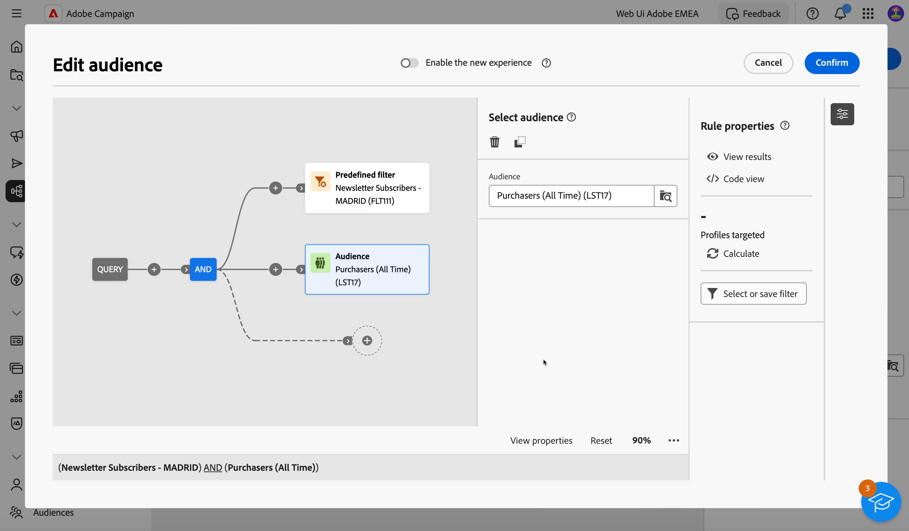

# 첫 번째 쿼리 작성 {#build-query}

쿼리 작성을 시작하려면 수행할 작업에 따라 선택한 위치에서 쿼리 모델러에 액세스합니다. 쿼리 모델러가 빈 캔버스로 열립니다. 쿼리의 첫 번째 노드를 추가하려면 + 단추를 클릭합니다.

다음 두 가지 유형의 요소를 추가할 수 있습니다.

* 구성 요소 필터링(사용자 지정 조건, 대상 선택, 사전 정의된 필터)을 통해 고유한 규칙을 작성하고, 대상 또는 사전 정의된 필터를 선택하여 쿼리를 구체화할 수 있습니다.

  예 *&#39;Sports&#39; 뉴스레터를 구독한 수신자*. *뉴욕에 사는 수신자*, *샌프란시스코에 사는 수신자*

* 그룹 연산자(AND, OR, EXCEPT)를 사용하면 다이어그램에서 필요에 맞게 필터링 구성 요소를 함께 그룹화할 수 있습니다.

  예: *&quot;스포츠&quot; 뉴스레터를 구독한 수신자&#x200B;**및**뉴욕에 사는 사람&#x200B;**또는**샌프란시스코*.

필터링 구성 요소와 그룹 연산자를 추가하고 결합하는 방법에 대한 자세한 단계는 아래에 나와 있습니다.

## 필터링 구성 요소 추가

구성 요소 필터링을 사용하면 다음을 사용하여 쿼리를 세분화할 수 있습니다.

* **사용자 지정 조건**: 데이터베이스 및 고급 표현식의 속성을 사용하여 자체 조건을 빌드하여 쿼리를 필터링합니다.
* **대상**: 기존 대상자를 사용하여 쿼리를 필터링합니다.
* **미리 정의된 필터**: 기존의 사전 정의된 필터를 사용하여 쿼리를 필터링합니다.

### 사용자 지정 조건 구성

>[!CONTEXTUALHELP]
>id="acw_orchestration_querymodeler_customcondition"
>title="사용자 정의 상태"
>abstract="사용자 정의 상태"

사용자 지정 조건을 사용하여 쿼리를 필터링하려면 다음 단계를 따르십시오.

1. 원하는 노드의 + 단추를 클릭하고 다음을 선택합니다. **[!UICONTROL 사용자 지정 조건]**.
1. 오른쪽에 사용자 지정 조건 속성 창이 열립니다. 속성 필드에서 조건을 만드는 데 사용할 데이터베이스에서 속성을 선택합니다.

   사용 가능한 속성은 수신자 테이블에 연결된 테이블의 필드를 포함하여 Campaign 데이터베이스의 모든 필드를 나타냅니다.

   

   >[!NOTE]
   >
   >표현식 편집 단추를 사용하면 Campaign 웹 표현식 편집기를 활용하여 데이터베이스 및 도우미 함수의 필드를 사용하여 표현식을 수동으로 정의할 수 있습니다.

1. 드롭다운 목록에서 적용할 연산자를 선택합니다.

   +++사용 가능한 연산자 목록

   >[!NOTE]
   >
   >드롭다운 목록에서 사용할 수 있는 연산자는 선택한 속성의 데이터 유형에 따라 다릅니다.

   | 운영자 | 목적 | 예제 |
   |  ---  |  ---  |  ---  |
   | 다음과 같음 | 두 번째 값 열에 입력한 데이터와 동일한 결과를 반환합니다. | 성(@lastName)이 &#39;Jones&#39;와 같으면 성이 Jones인 수신자만 반환됩니다. |
   | 다음과 같지 않음 | 입력한 값과 동일하지 않은 모든 값을 반환합니다. | 언어(@language)가 &#39;English&#39;와 같음 |
   | 보다 큼 | 입력한 값보다 큰 값을 반환합니다. | 50세보다 큰 연령(@age)</strong>는 &#39;50&#39;보다 큰 모든 값, 즉 &#39;51&#39;, &#39;52&#39; 등을 반환합니다. |
   | 보다 작음 | 입력한 값보다 작은 값을 반환합니다. | &#39;DaysAgo(100)&#39; 이전 생성일(@created)</strong>는 100일 이전에 만든 모든 수신자를 반환합니다. |
   | 보다 크거나 같음 | 입력한 값보다 크거나 같은 모든 값을 반환합니다. | 나이(@age)가 &#39;30&#39;보다 크거나 같음</strong>는 30세 이상의 모든 수신자를 반환합니다. |
   | 보다 작거나 같음 | 입력한 값과 같거나 낮은 값을 모두 반환합니다. | 나이(@age) &#39;60&#39; 이하</strong>는 60세 이하의 모든 수신자를 반환합니다. |
   | 포함 위치 | 표시된 값에 포함된 결과를 반환합니다. 이러한 값은 쉼표로 구분해야 합니다. | 생년월일(@birthDate)은 &#39;12/10/1979,12/10/1984&#39;에 포함되어 있으며 이 날짜 사이에 태어난 수급자를 반환합니다. |
   | 다음에 없음 | 연산자에 포함 과 같은 작업을 합니다. 여기서는 입력한 값을 기준으로 수신자를 제외합니다. | 생년월일(@birthDate)은 &#39;1979/10/1984/12/10&#39;에 포함되지 않습니다. 앞의 예와는 달리 이 날짜 내에 태어난 수신자는 반환되지 않습니다. |
   | 비어 있음 | 이 경우 찾고 있는 결과는 두 번째 값 열의 빈 값과 일치합니다. | Mobile (@mobilePhone) is empty 는 모바일 번호가 없는 모든 수신자를 반환합니다. |
   | 비어 있지 않음 | Is empty 연산자와 반대로 작동합니다. 두 번째 값 열에는 데이터를 입력할 필요가 없습니다. | 이메일(@email)이 비어 있지 않습니다. |
   | 다음으로 시작 | 입력한 값으로 시작하는 결과를 반환합니다. | 계정 번호(@account)는 &#39;32010&#39;로 시작합니다. |
   | 다음으로 시작하지 않음 | 입력한 값으로 시작하지 않는 결과 반환 | 계정 번호(@account)가 &#39;20&#39;으로 시작하지 않음 |
   | 포함 | 입력한 값 이상이 포함된 결과를 반환합니다. | 이메일 도메인(@domain)에 &#39;mail&#39;이 포함됨</strong>은(는) &#39;mail&#39;을 포함하는 모든 도메인 이름을 반환합니다. 따라서 &#39;gmail.com&#39; 도메인도 반환됩니다. |
   | 다음을 포함하지 않음 | 입력한 값이 포함되지 않은 결과를 반환합니다. | 이메일 도메인(@domain)에 &quot;vo&quot;가 포함되지 않음</strong>. 이 경우 &#39;vo&#39;가 포함된 도메인 이름은 반환되지 않습니다. &#39;voila.fr&#39; 도메인 이름은 결과에 표시되지 않습니다. |
   | 다음과 유사 | 비슷함 은 포함 연산자와 매우 유사합니다. 값에 % 와일드카드 문자를 삽입할 수 있습니다. | &#39;Jon%s&#39;과(와) 같은 성(@lastName) 여기서 운영자가 &#39;n&#39;과 &#39;s&#39; 사이의 누락된 문자를 잊었다면 와일드카드 문자는 &#39;Jones&#39;라는 이름을 찾기 위한 &#39;조커&#39;로 사용된다. |
   | 비슷하지 않음 | 비슷함 은 포함 연산자와 매우 유사합니다. 값에 % 와일드카드 문자를 삽입할 수 있습니다. | 성(@lastName)은 &#39;Smi%h&#39;와 다릅니다. 여기에서 성이 &#39;Smi%h&#39;인 수신자는 반환되지 않습니다. |

+++

1. 값 필드에서 예상 값을 선택합니다.

   또한 Campaign 웹 표현식 편집기를 활용하여 데이터베이스 및 도우미 함수의 필드를 사용하여 표현식을 수동으로 정의할 수 있습니다. 이렇게 하려면 표현식 편집 버튼을 클릭합니다.

   *예: 21세 이상의 모든 프로필을 반환하는 쿼리*

   

<!--
querying linked tables
collect additional information on the targeted population, e.g. contract numbers, subscriptions to newsletters or origin.
Select the type of data you want to add. This can be data belonging to the filtering dimension or data stored in linked tables. Select the table which contains the information you want to collect and click Next.

aggregates: Define a calculation mode for the field to be added, such as an aggregate for example.-->

### 대상자 선택

>[!CONTEXTUALHELP]
>id="acw_orchestration_querymodeler_selectaudience"
>title="대상자 선택"
>abstract="대상자 선택"

기존 대상자를 사용하여 쿼리를 필터링하려면 다음 단계를 따르십시오.

1. 원하는 노드의 + 단추를 클릭하고 다음을 선택합니다. **[!UICONTROL 대상자 선택]**.

1. 오른쪽에 대상 속성 선택 창이 열립니다. 쿼리를 필터링하는 데 사용할 대상을 선택합니다.

   *예: &quot;축제 방문자&quot; 대상에 속하는 모든 프로필을 반환하는 쿼리*

   

### 미리 정의된 필터 사용

>[!CONTEXTUALHELP]
>id="acw_orchestration_querymodeler_predefinedfilter"
>title="미리 정의된 필터"
>abstract="미리 정의된 필터"

사전 정의된 필터를 사용하여 쿼리를 필터링하려면 다음 단계를 수행합니다.

1. 원하는 노드의 + 단추를 클릭하고 다음을 선택합니다. **[!UICONTROL 미리 정의된 필터]**.

1. 오른쪽에 대상 속성 선택 창이 열립니다. 사용자 지정 필터 목록 또는 즐겨찾기에서 사전 정의된 필터를 선택합니다.

   *예: &quot;비활성 고객&quot; 사전 정의된 필터에 해당하는 모든 프로필을 반환하는 쿼리*

   

## 필터링 구성 요소와 연산자 결합

>[!CONTEXTUALHELP]
>id="acw_orchestration_querymodeler_group"
>title="그룹"
>abstract="그룹"

쿼리에 필터링 구성 요소를 추가하면 쿼리 캔버스에 새 전환이 자동으로 만들어지고 새 필터링 구성 요소가 AND 연산자로 첫 번째 요소에 연결됩니다. 즉, 두 필터링 구성 요소의 결과가 모두 쿼리 결과로 결합됩니다.

이 예제에서는 새로운 대상자 유형 필터링 구성 요소가 캔버스에 추가됩니다. 새 전환 시 자동으로 추가되고, AND 연산자로 사전 정의된 필터 유형 조건에 연결됩니다. 이 경우 쿼리 결과에는 &quot;Madridians&quot; 사전 정의된 필터 AND가 타겟팅한 수신자와 &quot;Discount hunters&quot; 대상에 속하는 수신자가 포함됩니다.

필터링 조건을 함께 연결하는 데 사용되는 연산자를 변경하려면 해당 연산자를 클릭하고 에서 원하는 연산자를 선택합니다. 연산자를 클릭하고 오른쪽에 열리는 그룹 창에서 원하는 연산자를 선택하여 변경할 수 있습니다.

사용 가능한 연산자는 다음과 같습니다.

* AND(교차): 아웃바운드 전환에서 모든 필터링 구성 요소의 결과를 결합합니다.
* OR(결합): 아웃바운드 전환에 있는 필터링 구성 요소 중 하나 이상의 결과를 포함합니다.
* 제외 (제외): 아웃바운드 전환의 모든 필터링 구성 요소에서 결과를 제외합니다.

## 쿼리 확인 및 유효성 검사

>[!CONTEXTUALHELP]
>id="acw_orchestration_querymodeler_ruleproperties"
>title="규칙 속성"
>abstract="규칙 속성"

캔버스에 쿼리를 빌드하면 오른쪽에 있는 규칙 속성 창을 사용하여 쿼리를 확인할 수 있습니다. 사용 가능한 작업은 다음과 같습니다.

* **결과 보기:** 쿼리의 결과 데이터를 표시합니다.
* **코드 보기**: SQL에서 쿼리의 코드 기반 버전을 표시합니다.
* **계산**: 쿼리가 타겟팅한 레코드 수를 업데이트하고 표시합니다.
* **필터 선택 또는 저장**: 캔버스에서 사용할 기존의 사전 정의된 필터를 선택하거나 나중에 다시 사용할 수 있도록 쿼리를 사전 정의된 필터로 저장합니다. [사전 정의된 필터로 작업하는 방법 알아보기](../get-started/predefined-filters.md)

  >[!IMPORTANT]
  >
  >규칙 속성 창에서 사전 정의된 필터를 선택하면 캔버스에 내장된 쿼리가 선택한 필터로 바뀝니다.
