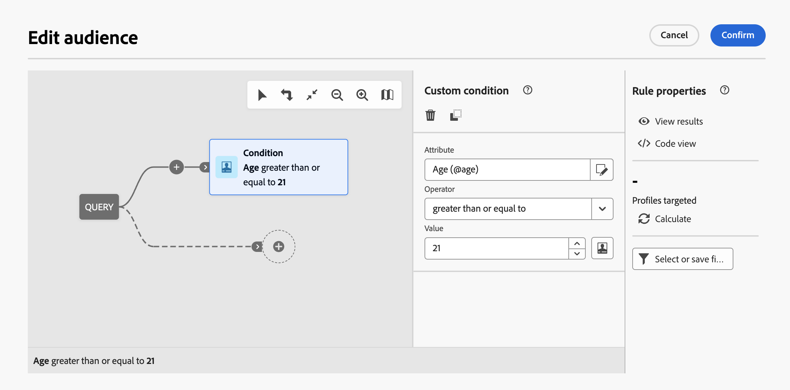
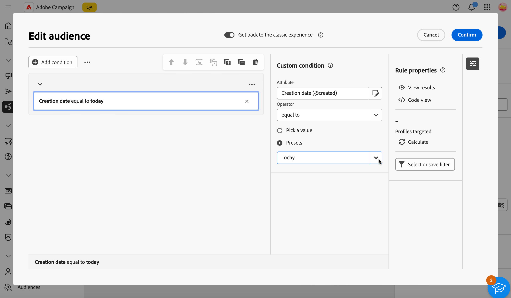

# 첫 번째 쿼리 작성 {#build-query}

쿼리 작성을 시작하려면 수행할 작업에 따라 선택한 위치에서 쿼리 모델러에 액세스합니다. 쿼리 모델러가 빈 캔버스로 열립니다. 쿼리의 첫 번째 노드를 구성하려면 **+** 단추를 클릭하십시오.

>[!IMPORTANT]
>
>쿼리 모델러에 대한 완전히 새로운 인터페이스를 사용할 수 있습니다. 새 규칙 빌더를 사용하면 간소화된 인터페이스를 통해 쿼리를 더 쉽게 작성할 수 있습니다. 이 경험으로 전환하려면 오른쪽 상단 모서리에서 토글 버튼을 누릅니다. 언제든지 토글을 눌러 새 인터페이스를 비활성화하면 클래식 쿼리 모델러로 돌아갈 수 있습니다. 이 새 인터페이스에서 쿼리 모델러와 동일한 원칙을 적용할 수 있습니다.
>>{zoomable="yes"}에 대한 토글을 보여 주는 이미지

다음 두 가지 유형의 요소를 추가할 수 있습니다.

* **구성 요소 필터링**(사용자 지정 조건, 대상 선택, 사전 정의된 필터)을 통해 고유한 규칙을 만들거나, 대상을 선택하거나, 사전 정의된 필터를 사용하여 쿼리를 구체화할 수 있습니다. 쿼리의 시작과 점선 전환에 추가됩니다. [필터링 구성 요소로 작업하는 방법을 알아봅니다](#filtering)

  예: *스포츠 뉴스레터를 구독한 수신자*, *뉴욕에 거주하는 수신자*, *샌프란시스코에 거주하는 수신자*

>[!BEGINTABS]

>[!TAB 클래식 쿼리 모델러]

{zoomable="yes"}

>[!TAB 새 규칙 빌더]

{zoomable="yes"}

>[!ENDTABS]

* **그룹 연산자**(AND, OR, EXCEPT)를 사용하면 다이어그램에서 필터링 구성 요소를 그룹화할 수 있습니다. 필터링 구성 요소 전의 기존 전환에 추가됩니다. [연산자 작업 방법 알아보기](#filtering)

  예: *Super VIP **AND** VIP인 수신자 **OR** VIP 데모, **21세 이하 및 45세 이상 수신자**&#x200B;명

>[!BEGINTABS]

>[!TAB 클래식 쿼리 모델러]

{zoomable="yes"}

>[!TAB 새 규칙 빌더]

{zoomable="yes"}

>[!ENDTABS]

## 쿼리 내 값의 분포 {#distribution-values-query}

값 분포는 현재 쿼리 매개 변수를 기반으로 하여 테이블 내에 있는 필드의 각 값에 대한 백분율을 보여줍니다. 쿼리 내의 값 분포를 알면 세그멘테이션을 세분화하는 데 도움이 됩니다.

이 옵션에 액세스하려면 아래 표시된 것처럼 쿼리에서 속성 선택 단추를 클릭합니다. 그런 다음 선택한 특성 옆에 있는 **[!UICONTROL 정보]** 아이콘을 클릭합니다. **[!UICONTROL 값 배포]** 단추에 액세스할 수 있습니다.

{zoomable="yes"}

>[!NOTE]
>
>* 값이 많은 필드의 경우 처음 20개 값만 표시됩니다. 이러한 경우 **[!UICONTROL 부분 로드]** 알림이 경고합니다.
>* **[!UICONTROL 값 배포]** 옵션은 모든 특성 선택기에서 액세스할 수 있습니다. [특성을 선택하는 방법 알아보기](../get-started/attributes.md)
>* **[!A고급 필터]**&#x200B;를 사용하여 결과에 조건을 추가할 수 있습니다. [여기에서 자세히 알아보십시오](../get-started/work-with-folders.md#filter-the-values).

## 필터링 구성 요소 추가 {#filtering}

구성 요소 필터링을 사용하면 다음을 사용하여 쿼리를 세분화할 수 있습니다.

* **[사용자 지정 조건](#custom-condition)**: 데이터베이스 및 고급 식의 특성을 사용하여 사용자 지정 조건을 만들어 쿼리를 필터링합니다.
* **[대상](#audiences)**: 기존 대상을 사용하여 쿼리를 필터링합니다.
* **[미리 정의된 필터](#predefined-filters)**: 미리 정의된 기존 필터를 사용하여 쿼리를 필터링합니다.

### 사용자 정의 조건 구성 {#custom-condition}

>[!CONTEXTUALHELP]
>id="acw_orchestration_querymodeler_customcondition"
>title="사용자 정의 조건"
>abstract="사용자 정의 조건은 데이터베이스 및 고급 표현식의 속성으로 고유한 조건을 빌드하여 쿼리를 필터링할 수 있는 필터링 구성 요소입니다."

사용자 지정 조건을 사용하여 쿼리를 필터링하려면 다음 단계를 따르십시오.

1. 원하는 노드에서 **+** 단추를 클릭하고 **[!UICONTROL 사용자 지정 조건]**&#x200B;을 선택합니다. 오른쪽에 사용자 지정 조건 속성 창이 열립니다.

1. **특성** 필드에서 조건을 만드는 데 사용할 데이터베이스에서 특성을 선택합니다. 속성 목록에는 연결된 테이블의 속성을 포함하여 Campaign 데이터베이스의 모든 속성이 포함됩니다. [특성을 선택하고 즐겨찾기에 추가하는 방법 알아보기](../get-started/attributes.md)

   {zoomable="yes"}

   >[!NOTE]
   >
   >**표현식 편집** 단추를 사용하면 Campaign 웹 표현식 편집기를 사용하여 데이터베이스 및 도우미 함수의 필드를 사용하여 표현식을 수동으로 정의할 수 있습니다. [표현식을 편집하는 방법을 알아봅니다](expression-editor.md)

1. 드롭다운 목록에서 적용할 연산자를 선택합니다. 다양한 연산자를 사용할 수 있습니다. 드롭다운 목록에서 사용할 수 있는 연산자는 속성의 데이터 유형에 따라 다릅니다.

   +++사용 가능한 연산자 목록

   | 운영자 | 목적 | 예제 |
   |---|---|---|
   | 다음과 같음 | 두 번째 값 열에 입력한 데이터와 동일한 결과를 반환합니다. | 성(@lastName)이 &#39;Jones&#39;와 같으면 성이 Jones인 수신자만 반환됩니다. |
   | 다음과 같지 않음 | 입력한 값과 동일하지 않은 모든 값을 반환합니다. | 언어(@language)가 &#39;English&#39;와 같지 않습니다. |
   | 보다 큼 | 입력한 값보다 큰 값을 반환합니다. | Age (@age)가 50보다 크면 &#39;51&#39;, &#39;52&#39;와 같이 &#39;50&#39;보다 큰 모든 값이 반환됩니다. |
   | 보다 작음 | 입력한 값보다 작은 값을 반환합니다. | &#39;DaysAgo(100)&#39; 이전 생성일(@created)은 100일 이전에 생성된 모든 수신자를 반환합니다. |
   | 보다 크거나 같음 | 입력한 값보다 크거나 같은 모든 값을 반환합니다. | &#39;30&#39;보다 크거나 같은 나이(@age)는 30세 이상의 모든 수신자를 반환합니다. |
   | 보다 작거나 같음 | 입력한 값과 같거나 낮은 값을 모두 반환합니다. | &#39;60&#39;보다 작거나 같은 나이(@age)는 60세 이하의 모든 수신자를 반환합니다. |
   | 포함 위치 | 표시된 값에 포함된 결과를 반환합니다. 이러한 값은 쉼표로 구분해야 합니다. | 생년월일(@birthDate)은 &#39;1979/10/1984/10/12/12&#39;에 포함되어 있으며 이 날짜 사이에 태어난 수취인을 반환합니다. |
   | 다음에 없음 | 연산자에 포함 과 같은 작업을 합니다. 여기서 수신자는 입력된 값을 기준으로 제외됩니다. | 생년월일(@birthDate)은 &#39;1979/10/1984/12/10&#39;에 포함되지 않습니다. 이 날짜 내에 태어난 수신자는 반환되지 않습니다. |
   | 비어 있음 | 두 번째 값 열에서 빈 값과 일치하는 결과를 반환합니다. | Mobile (@mobilePhone) is empty 는 모바일 번호가 없는 모든 수신자를 반환합니다. |
   | 비어 있지 않음 | Is empty 연산자와 반대로 작동합니다. 두 번째 값 열에는 데이터를 입력할 필요가 없습니다. | 이메일(@email)이 비어 있지 않습니다. |
   | 다음으로 시작 | 입력한 값으로 시작하는 결과를 반환합니다. | 계정 번호(@account)는 &#39;32010&#39;로 시작합니다. |
   | 다음으로 시작하지 않음 | 입력한 값으로 시작하지 않는 결과를 반환합니다. | 계정 번호(@account)가 &#39;20&#39;으로 시작하지 않습니다. |
   | 다음 포함 | 입력한 값 이상이 포함된 결과를 반환합니다. | 이메일 도메인(@domain)에 &#39;mail&#39;이 있으면 &#39;mail&#39;이 포함된 모든 도메인 이름(예: &#39;gmail.com&#39;)이 반환됩니다. |
   | 다음을 포함하지 않음 | 입력한 값이 포함되지 않은 결과를 반환합니다. | 이메일 도메인(@domain)에 &#39;vo&#39;가 포함되어 있지 않습니다. &#39;vo&#39;가 포함된 도메인 이름(예: &#39;voila.fr&#39;)은 결과에 표시되지 않습니다. |
   | 다음과 유사 | 포함 연산자와 유사하게 값에 % 와일드카드 문자를 삽입할 수 있습니다. | &#39;Jon%s&#39;과(와) 같은 성(@lastName) 와일드카드 문자는 &quot;Joker&quot;로 작동하여 &quot;Jones&quot;와 같은 이름을 찾습니다. |
   | 비슷하지 않음 | 포함 연산자와 유사하게 값에 % 와일드카드 문자를 삽입할 수 있습니다. | 성(@lastName)은 &#39;Smi%h&#39;와 다릅니다. 성이 &#39;Smith&#39;인 수신자는 반환되지 않습니다. |

+++

1. **값** 필드에서 예상 값을 정의합니다. 또한 Campaign 웹 표현식 편집기를 사용하여 데이터베이스 및 도우미 함수의 필드를 사용하여 표현식을 수동으로 정의할 수 있습니다. 이렇게 하려면 **표현식 편집** 단추를 클릭하십시오. [표현식을 편집하는 방법을 알아봅니다](expression-editor.md)

   *21세 이상의 모든 프로필을 반환하는 쿼리 예제:*

>[!BEGINTABS]

>[!TAB 클래식 쿼리 모델러]

{zoomable="yes"}

>[!TAB 새 규칙 빌더]

{zoomable="yes"}

>[!ENDTABS]

날짜 유형 특성의 경우 **[!UICONTROL 사전 설정]** 옵션을 사용하여 사전 정의된 값을 사용할 수 있습니다.

>[!BEGINTABS]

>[!TAB 클래식 쿼리 모델러]

{zoomable="yes"}

>[!TAB 새 규칙 빌더]

{zoomable="yes"}

>[!ENDTABS]

#### 연결된 테이블에 대한 사용자 지정 조건(1-1 및 1-N 링크){#links}

사용자 지정 조건을 사용하면 현재 규칙에서 사용하는 테이블에 연결된 테이블을 쿼리할 수 있습니다. 여기에는 1-1 카디널리티 링크가 있는 테이블 또는 컬렉션 테이블(1-N 링크)이 포함됩니다.

**1-1 링크**&#x200B;의 경우 연결된 테이블로 이동하여 원하는 특성을 선택하고 예상 값을 정의하십시오.

**값** 선택기에서 테이블 링크를 직접 선택하고 확인할 수도 있습니다. 이 경우 아래 예와 같이 전용 선택기를 사용하여 선택한 테이블에 사용할 수 있는 값을 선택해야 합니다.

+++쿼리 예

여기에서 쿼리는 레이블이 &quot;실행 중&quot;인 브랜드를 타겟팅합니다.

1. **Brand** 테이블 내부로 이동하여 **Label** 특성을 선택하십시오.

   브랜드 테이블의 {zoomable="yes"}{width="85%" align="center"}

1. 속성에 대한 예상 값을 정의합니다.

   {zoomable="yes"}{width="85%" align="center"}

다음은 테이블 링크가 직접 선택된 쿼리 샘플입니다. 이 테이블에 사용할 수 있는 값은 전용 선택기에서 선택해야 합니다.

{zoomable="yes"}{width="85%" align="center"}

+++

**1-N 링크**&#x200B;의 경우 아래 예와 같이 쿼리를 세분화할 하위 조건을 정의할 수 있습니다.

+++쿼리 예

여기서 쿼리는 BrewMaster 제품과 관련된 구매를 한 수신자를 대상으로 하며, 총 금액 100$ 이상입니다.

1. **구매** 테이블을 선택하고 확인합니다.

   {zoomable="yes"}{width="50%" align="center"}

1. 아웃바운드 전환이 추가되어 하위 조건을 만들 수 있습니다.

   {zoomable="yes"}{width="85%" align="center"}

1. **가격** 특성을 선택하고 1000$ 이상의 구매를 대상으로 합니다.

   가격 특성의 {zoomable="yes"}{width="85%" align="center"}

1. 필요에 따라 하위 조건을 추가합니다. 여기에서는 BrewMaster 제품을 구매한 대상 프로필에 조건을 추가했습니다.

   {zoomable="yes"}{width="85%" align="center"}

+++

#### 집계 데이터를 사용한 작업 {#aggregate}

사용자 지정 조건을 사용하면 집계 작업을 수행할 수 있습니다. 이렇게 하려면 컬렉션 테이블에서 속성을 직접 선택해야 합니다.

1. 원하는 수집 테이블 내부로 이동하여 합계 작업을 수행할 속성을 선택합니다.

   특성 목록의 {zoomable="yes"}{width="85%" align="center"}

1. 속성 창에서 **데이터 집계** 옵션을 전환하고 원하는 집계 함수를 선택합니다.

>[!BEGINTABS]

>[!TAB 클래식 쿼리 모델러]

{zoomable="yes"}{width="85%" align="center"}

>[!TAB 새 규칙 빌더]

{zoomable="yes"}{width="85%" align="center"}

>[!ENDTABS]

### 대상자 선택 {#audiences}

>[!CONTEXTUALHELP]
>id="acw_orchestration_querymodeler_selectaudience"
>title="대상자 선택"
>abstract="**대상자 선택** 옵션을 사용하여 쿼리 필터링에 사용할 대상자를 선택할 수 있습니다."

기존 대상자를 사용하여 쿼리를 필터링하려면 다음 단계를 따르십시오.

>[!BEGINTABS]

>[!TAB 클래식 쿼리 모델러]

1. 원하는 노드에서 **+** 단추를 클릭하고 **[!UICONTROL 대상 선택]**&#x200B;을 선택합니다.

1. 오른쪽에 **대상 선택** 속성 창이 열립니다. 쿼리를 필터링하는 데 사용할 대상을 선택합니다.

   *쿼리 예제는 &quot;축제 참가자&quot; 대상에 속하는 모든 프로필을 반환합니다.*

   {zoomable="yes"}

>[!TAB 새 규칙 빌더]

1. **[!UICONTROL 조건 추가]** 단추 옆에 있는 **확장** 단추를 클릭하고 **[!UICONTROL 대상 선택]**&#x200B;을 선택합니다.

1. 오른쪽에 **대상 선택** 속성 창이 열립니다. 쿼리를 필터링하는 데 사용할 대상을 선택합니다.

   *Coffee Works 대상에 속하는 모든 프로필을 반환하는 쿼리 예시:*

   {zoomable="yes"}

>[!ENDTABS]

### 미리 정의된 필터 사용 {#predefined-filters}

>[!CONTEXTUALHELP]
>id="acw_orchestration_querymodeler_predefinedfilter"
>title="미리 정의된 필터"
>abstract="**미리 정의된 필터** 옵션을 사용하여 사용자 정의 필터 목록이나 즐겨찾기에서 미리 정의된 필터를 선택할 수 있습니다."

사전 정의된 필터를 사용하여 쿼리를 필터링하려면 다음 단계를 수행합니다.

>[!BEGINTABS]

>[!TAB 클래식 쿼리 모델러]

1. 원하는 노드에서 **+** 단추를 클릭하고 **[!UICONTROL 미리 정의된 필터]**&#x200B;을(를) 선택합니다.

1. **미리 정의된 필터** 속성 창이 오른쪽에 열립니다. 사용자 지정 필터 목록 또는 즐겨찾기에서 사전 정의된 필터를 선택합니다.

   *미리 정의된 &quot;비활성 고객&quot; 필터에 해당하는 모든 프로필을 반환하는 쿼리 예입니다.*

   {zoomable="yes"}

>[!TAB 새 규칙 빌더]

1. **[!UICONTROL 조건 추가]** 단추 옆에 있는 **확장** 단추를 클릭하고 **[!UICONTROL 미리 정의된 필터]**&#x200B;를 선택합니다.

1. **미리 정의된 필터** 속성 창이 오른쪽에 열립니다. 사용자 지정 필터 목록 또는 즐겨찾기에서 사전 정의된 필터를 선택합니다.

   *미리 정의된 &quot;비활성 고객&quot; 필터에 해당하는 모든 프로필을 반환하는 쿼리 예입니다.*

   {zoomable="yes"}

>[!ENDTABS]

### 구성 요소 복사-붙여넣기 {#copy}

쿼리 모델러를 사용하면 하나 이상의 필터링 구성 요소를 복사하여 전환 끝에 붙여넣을 수 있습니다. 이 작업은 현재 쿼리 캔버스 내에서 또는 인스턴스 내의 캔버스에서 실행할 수 있습니다.

>[!NOTE]
>
>복사된 선택 사항은 인스턴스에서 작업하는 동안 유지됩니다. 로그오프했다가 다시 로그인하면 더 이상 선택 항목을 붙여넣을 수 없습니다.

>[!IMPORTANT]
>
>현재 새 규칙 빌더 경험에서 구성 요소를 복사하여 붙여넣을 수 없습니다. 다음 단계를 수행하려면 맨 위에 있는 **[!UICONTROL 클래식 경험으로 돌아가기]** 토글을 클릭하여 클래식 쿼리 모델러를 사용하십시오.

필터링 구성 요소를 복사하여 붙여넣으려면 다음 단계를 수행합니다.

1. 쿼리 캔버스에서 복사할 필터링 구성 요소를 클릭하여 선택합니다. 여러 구성 요소를 선택하려면 캔버스의 오른쪽 위 모서리에 있는 도구 모음에서 사용할 수 있는 다중 선택 도구를 사용합니다.

1. 구성 요소의 속성 창 또는 화면 맨 아래에 있는 파란색 리본에서 **[!UICONTROL 복사]** 단추를 클릭합니다(여러 구성 요소를 선택한 경우).

   | 단일 구성 요소 복사 | 여러 구성 요소 복사 |
   |  ---  |  ---  |
   | {zoomable="yes"}{width="200" align="center" zoomable="yes"} | {zoomable="yes"}{width="200" align="center" zoomable="yes"} |

1. 구성 요소를 붙여넣으려면 원하는 전환 끝에 있는 + 단추를 클릭하고 **n개 항목 붙여넣기**&#x200B;를 선택합니다.

   {zoomable="yes"}

## 필터링 구성 요소를 연산자와 결합 {#operators}

>[!CONTEXTUALHELP]
>id="acw_orchestration_querymodeler_group"
>title="그룹"
>abstract="이 창에서 필터링 조건을 함께 연결하는 데 사용되는 연산자를 변경할 수 있습니다."

쿼리에 새 필터링 구성 요소를 추가할 때마다 **AND** 연산자로 다른 구성 요소에 자동으로 연결됩니다. 즉, 두 필터링 구성 요소의 결과가 결합됩니다.

이 예제에서는 두 번째 전환에 새로운 대상자 유형 필터링 구성 요소를 추가했습니다. 구성 요소가 **AND** 연산자와 함께 사전 정의된 필터 조건에 연결되어 있습니다. 즉, 쿼리 결과에는 &quot;뉴스레터 구독자 - 마드리드&quot; 사전 정의된 필터 및 &quot;구매자(항상)&quot; 대상에 속하는 &quot;뉴스레터 구독자 - 마드리드&quot; 사전 정의된 필터의 대상 수신자가 포함됩니다.

>[!BEGINTABS]

>[!TAB 클래식 쿼리 모델러]

{zoomable="yes"}

필터링 조건을 함께 연결하는 데 사용되는 연산자를 변경하려면 해당 연산자를 클릭하고 오른쪽에 열리는 **그룹** 창에서 원하는 연산자를 선택하십시오.

사용 가능한 연산자는 다음과 같습니다.

* **AND(교차)**: 아웃바운드 전환의 모든 필터링 구성 요소와 일치하는 결과를 결합합니다.
* **OR(유니온)**: 아웃바운드 전환의 필터링 구성 요소 중 하나 이상과 일치하는 결과를 포함합니다.
* **제외(제외)**: 아웃바운드 전환의 모든 필터링 구성 요소와 일치하는 결과를 제외합니다.

{zoomable="yes"}

또한 구성 요소를 동일한 그룹으로 그룹화하고 함께 연결하여 중간 구성 요소 그룹을 만들 수 있습니다. 이렇게 하면 AND 연산자가 기본적으로 입력되므로 원하는 연산자로 변경할 수 있습니다.

>[!TAB 새 규칙 빌더]

{zoomable="yes"}

필터링 조건을 함께 연결하는 데 사용되는 연산자를 변경하려면 해당 연산자를 클릭하면 OR(EXCEPT)로 변경되고 AND(AND)로 다시 변경되며, 원하는 연산자를 선택합니다.

사용 가능한 연산자는 다음과 같습니다.

* **AND(교차)**: 아웃바운드 전환의 모든 필터링 구성 요소와 일치하는 결과를 결합합니다.
* **OR(유니온)**: 아웃바운드 전환의 필터링 구성 요소 중 하나 이상과 일치하는 결과를 포함합니다.
* **제외(제외)**: 아웃바운드 전환의 모든 필터링 구성 요소와 일치하는 결과를 제외합니다.

{zoomable="yes"}

>[!ENDTABS]

아래 예에서는 &quot;VIP to reward&quot; 또는 &quot;Super VIP&quot; 대상의 결과를 포함하는 중간 그룹을 만들었습니다.

>[!BEGINTABS]

>[!TAB 클래식 쿼리 모델러]

{zoomable="yes"}

>[!TAB 새 규칙 빌더]

{zoomable="yes"}

>[!ENDTABS]

## 쿼리 확인 및 검증

>[!CONTEXTUALHELP]
>id="acw_orchestration_querymodeler_ruleproperties"
>title="규칙 속성"
>abstract="캔버스에 쿼리를 작성한 후에는 오른쪽에 있는 **규칙 속성** 창을 사용하여 확인할 수 있습니다. 이 창에서는 결과 데이터를 표시하고, 쿼리의 SQL 코드 버전을 검색하고, 타기팅된 레코드 수를 확인할 수 있습니다. **필터 선택 또는 저장** 버튼을 사용하여 쿼리를 미리 정의된 필터로 저장하거나 캔버스 콘텐츠를 기존 필터로 바꿀 수 있습니다."

캔버스에 쿼리를 만들면 오른쪽에 있는 **규칙 속성** 창을 사용하여 쿼리를 확인할 수 있습니다. 이 창은 대상자를 만들기 위해 쿼리를 작성할 때 표시됩니다. 사용 가능한 작업은 다음과 같습니다.

* **결과 보기:** 쿼리의 결과 데이터를 표시합니다.
* **코드 보기**: SQL에서 쿼리의 코드 기반 버전을 표시합니다.
* **계산**: 쿼리의 대상 레코드 수를 업데이트하고 표시합니다.
* **필터 선택 또는 저장**: 캔버스에서 사용할 미리 정의된 기존 필터를 선택하거나 나중에 다시 사용할 수 있도록 쿼리를 미리 정의된 필터로 저장합니다. [미리 정의된 필터로 작업하는 방법을 알아봅니다](../get-started/predefined-filters.md)

  >[!IMPORTANT]
  >
  >규칙 속성 창에서 사전 정의된 필터를 선택하면 캔버스에 내장된 쿼리가 선택한 필터로 바뀝니다.

쿼리가 준비되면 오른쪽 상단의 **[!UICONTROL 확인]** 단추를 클릭하여 저장합니다.

>[!BEGINTABS]

>[!TAB 클래식 쿼리 모델러]

쿼리를 열면 언제든지 수정할 수 있습니다. 기존 쿼리를 열면 **+** 단추 표시 없이 간소화된 보기로 표시됩니다. 쿼리에 새 요소를 추가하려면 캔버스에서 구성 요소 또는 연산자를 선택하여 **+** 단추를 표시합니다.

{zoomable="yes"}

>[!TAB 새 규칙 빌더]

쿼리를 열면 언제든지 수정할 수 있습니다. 이렇게 하려면 왼쪽 상단의 **[!UICONTROL 조건 추가]** 단추를 클릭하십시오.

{zoomable="yes"}

>[!ENDTABS]
