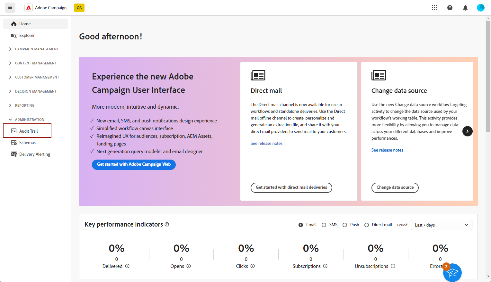
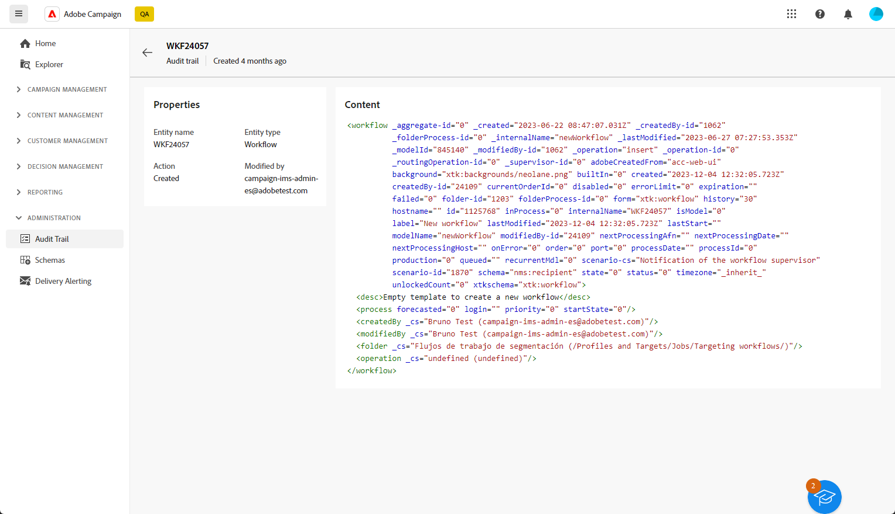

# 감사 추적{#audit-trail}

>[!CONTEXTUALHELP]
>id="acw_homepage_welcome_rn1"
>title="감사 추적"
>abstract="새로운 감사 추적 기능은 Adobe Campaign 인스턴스에 실시간으로 수행된 모든 작업 및 이벤트에 대한 세부 시간 기록을 제공합니다."
>additional-url="https://experienceleague.adobe.com/docs/campaign-web/v8/release-notes/release-notes.html?lang=ko-KR" text="릴리스 정보 참조"

Adobe Campaign 웹 사용자 인터페이스에서 **[!UICONTROL 감사 추적]** 기능은 인스턴스 내의 중요한 엔티티에 대한 모든 수정 사항(일반적으로 인스턴스의 원활한 작업에 큰 영향을 주는 엔티티)을 사용자가 완전히 볼 수 있도록 합니다.

>[!IMPORTANT]
>
>* Adobe Campaign 웹 사용자 인터페이스는 사용자 권한, 템플릿, 개인화 또는 캠페인 내에서 변경된 사항을 감사하지 않습니다.
>* 감사 추적은 인스턴스 관리자만 관리할 수 있습니다.

**[!UICONTROL 감사 추적]** 이 기능은 Adobe Campaign 인스턴스 내에서 발생하는 작업 및 이벤트의 세부 로그를 실시간으로 지속적으로 기록합니다. 편리한 방법을 사용하여 데이터의 시간 기록 레코드에 액세스하고, 워크플로 상태, 이를 수정할 최신 개인 또는 인스턴스 내에서 사용자가 수행한 활동과 같은 쿼리를 해결합니다.

+++ 감사 추적 사용 가능한 엔터티에 대해 자세히 알아보기

* **소스 스키마 감사 추적** 에서는 Campaign V8 클라이언트 콘솔 내에서 스키마에 대한 활동 및 최근 수정 사항을 모니터링할 수 있습니다.

  스키마에 대한 자세한 내용은 [Campaign v8 설명서](https://experienceleague.adobe.com/en/docs/campaign/campaign-v8/developer/shemas-forms/schemas).

* **워크플로우 감사 추적** 을(를) 통해 다음과 같은 현재 상태를 포함하여 워크플로우에 대한 활동 및 최근 변경 사항을 추적할 수 있습니다.

   * 시작
   * 일시 정지
   * 정지
   * 다시 시작
   * 정리 - 작업 삭제 내역에 해당합니다.
   * 시뮬레이션 모드에서 시작 작업과 동일한 시뮬레이션
   * 지금 대기 중인 작업 실행 작업과 동일한 절전 모드 해제
   * 무조건 정지

  워크플로우에 대한 자세한 내용은 다음을 참조하십시오. [페이지](../workflows/gs-workflows.md).

* **옵션 감사 추적** 를 사용하면 Campaign V8에서 활동 및 옵션에 대한 최근 수정 사항을 모니터링할 수 있습니다.

  옵션에 대한 자세한 내용은 다음을 참조하십시오. [페이지](https://experienceleague.adobe.com/en/docs/campaign-classic/using/installing-campaign-classic/appendices/configuring-campaign-options).

* **게재 감사 추적** 을(를) 통해 활동 및 게재에 수행된 마지막 수정 사항을 확인할 수 있습니다.

  게재에 대한 자세한 내용은 다음을 참조하십시오. [페이지](../msg/gs-deliveries.md).

* **외부 계정** 기술 워크플로우 또는 캠페인 워크플로우와 같은 기술 프로세스에서 사용하는 Campaign V8의 외부 계정에 대한 수정 사항을 확인할 수 있습니다.

  외부 계정에 대한 자세한 내용은 다음을 참조하십시오. [페이지](https://experienceleague.adobe.com/en/docs/campaign/campaign-v8/config/configuration/external-accounts).

* **게재 매핑** 를 사용하면 Campaign V8에서 게재 매핑에 대해 수행된 활동 및 최근 수정 사항을 모니터링할 수 있습니다.

  게재 매핑에 대한 자세한 내용은 다음을 참조하십시오 [페이지](https://experienceleague.adobe.com/en/docs/campaign/campaign-v8/audience/add-profiles/target-mappings).

* **웹 애플리케이션** 입력 및 선택 필드가 있는 페이지를 만드는 데 사용되는 Campaign V8에서 웹 양식에 대해 수정된 내용을 확인할 수 있으며, 여기에는 데이터베이스의 데이터가 포함될 수 있습니다.

  웹 애플리케이션에 대한 자세한 내용은 다음을 참조하십시오. [페이지](https://experienceleague.adobe.com/en/docs/campaign/campaign-v8/content/webapps).

* **오퍼** 을(를) 통해 활동 및 오퍼에 대한 마지막 수정 사항을 확인할 수 있습니다.

  오퍼에 대한 자세한 내용은 다음을 참조하십시오. [페이지](../msg/offers.md).

* **연산자** 를 사용하면 Campaign V8에서 운영자에 대해 수행된 활동 및 최근 수정 사항을 모니터링할 수 있습니다.

  연산자에 대한 자세한 내용은 다음을 참조하십시오. [페이지](https://experienceleague.adobe.com/en/docs/campaign/campaign-v8/offers/interaction-settings/interaction-operators).

+++

## 감사 추적 액세스 {#accessing-audit-trail}

인스턴스의 **[!UICONTROL 감사 추적]**:

1. 아래 **[!UICONTROL 관리]** 메뉴, 선택 **[!UICONTROL 감사 추적]** .

   

1. 다음 **[!UICONTROL 감사 추적]** 엔티티 목록이 있는 창이 열립니다. Adobe Campaign 웹 사용자 인터페이스는 워크플로우, 옵션, 게재 및 스키마에 대한 만들기, 편집 및 삭제 작업을 감사합니다.

   마지막 수정 사항에 대해 자세히 알아보려면 엔티티 중 하나를 선택합니다.

1. 다음 **[!UICONTROL 감사 엔티티]** 창은 다음과 같이 선택한 엔티티에 대한 자세한 정보를 제공합니다.

   * **[!UICONTROL 유형]** : 워크플로우, 옵션, 게재 또는 스키마.
   * **[!UICONTROL 엔티티]** : 활동의 내부 이름입니다.
   * **[!UICONTROL 수정한 사람]** : 이 엔티티를 마지막으로 수정한 사람의 사용자 이름입니다.
   * **[!UICONTROL 작업]** : 이 엔티티에서 마지막으로 수행된 작업(생성됨, 수정됨 또는 삭제됨)입니다.
   * **[!UICONTROL 수정일]** : 이 엔티티에 대해 마지막으로 수행된 작업의 날짜입니다.

   코드 블록은 엔티티에서 정확히 변경된 사항에 대한 자세한 정보를 제공합니다.

   

