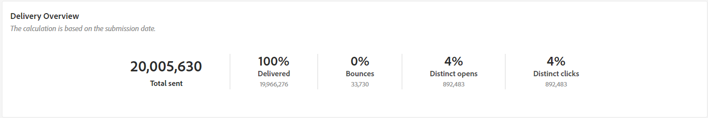
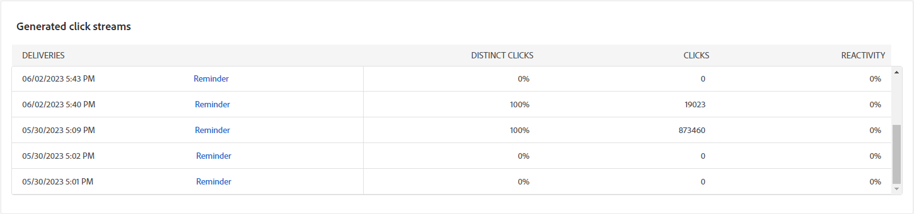
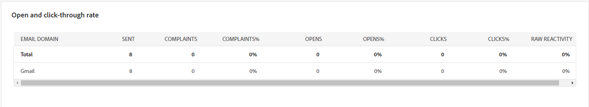
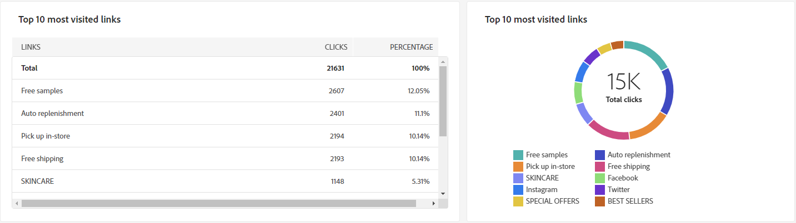

# 이메일 채널에 대한 캠페인 보고서 {#campaign-reports-email-channel}

각 캠페인 보고서는 캠페인의 성공 및 오류를 자세히 설명하는 다양한 위젯으로 나뉩니다. 이메일 채널의 경우 보고서 및 지표가 아래에 자세히 설명되어 있습니다. [이 페이지](campaign-reports.md)에서 캠페인 보고서에 액세스하는 방법을 알아보세요.

## 게재 요약 {#delivery-summary-email}

>[!CONTEXTUALHELP]
>id="acw_campaign_reporting_deliveries_overview"
>title="게재 개요"
>abstract="**게재 개요**&#x200B;는 방문자가 이메일 게재에 참여하는 방식에 대한 자세한 정보를 포함하는 주요 성과 지표(KPI)를 제공합니다."

### 게재 개요 {#delivery-summary-email-ovv}

**[!UICONTROL 게재 개요]** 보고서는 방문자의 전자 메일 게재 참여도에 대한 자세한 정보를 제공하는 주요 성과 지표(KPI)를 제공합니다. 지표는 아래에 자세히 설명되어 있습니다.

{zoomable="yes"}

+++이메일 캠페인 보고서 지표에 대해 자세히 알아보십시오.

* **[!UICONTROL 게재할 메시지]**: 게재를 준비하는 동안 처리된 총 메시지 수입니다.

* **[!UICONTROL 배달됨]**: 보낸 총 메시지 수와 관련하여 성공적으로 보낸 메시지 수입니다.

* **[!UICONTROL 바운스 수]**: 보낸 총 메시지 수와 관련하여 게재 및 자동 반환 처리 중에 누적된 총 오류 수입니다.

* **[!UICONTROL 총 열기 수]**: 메시지를 한 번 이상 연 타겟팅된 총 받는 사람 수

* **[!UICONTROL 총 클릭 수]**: 게재를 한 번 이상 클릭한 총 고유 수신자 수입니다.

+++

### 초기 타깃 대상자 통계 {#delivery-summary-email-initial-target}

>[!CONTEXTUALHELP]
>id="acw_campaign_reporting_deliveries_target"
>title="초기 타깃 대상자 통계"
>abstract="초기 타깃 대상자 통계 테이블에는 수신자와 관련된 데이터가 표시됩니다."

**[!UICONTROL 초기 대상 통계]** 테이블에는 수신자와 관련된 데이터가 표시됩니다. 지표는 아래에 자세히 설명되어 있습니다.

{zoomable="yes"}

+++이메일 캠페인 보고서 지표에 대해 자세히 알아보십시오.

* **[!UICONTROL 초기 대상]**: 타깃팅된 총 받는 사람 수

* **[!UICONTROL 게재할 메시지]**: 게재를 준비한 후 게재할 총 메시지 수입니다.

* **[!UICONTROL 규칙에 의해 거부됨]**: 규칙을 적용할 때 분석 중에 무시된 총 주소 수: 주소 누락, 격리, 차단 목록 등

+++

### 실행 통계 {#delivery-summary-email-exec-stats}

>[!CONTEXTUALHELP]
>id="acw_campaign_reporting_email_exec_stats"
>title="실행 통계"
>abstract="**실행 통계** 테이블에는 전달할 메시지, 성공, 오류, 새 격리 등 게재 성공에 대한 자세한 내용이 나와 있습니다."

**[!UICONTROL 실행 통계]** 표에는 게재 성공 여부가 자세히 설명되어 있습니다. 지표는 아래에 자세히 설명되어 있습니다.

{zoomable="yes"}

+++이메일 캠페인 보고서 지표에 대해 자세히 알아보십시오.

* **[!UICONTROL 게재할 메시지]**: 게재를 준비한 후 게재할 총 메시지 수입니다.

* **[!UICONTROL 성공]**: 배달할 메시지 수와 관련하여 처리된 메시지 수입니다.

* **[!UICONTROL 오류]**: 배달할 메시지 수와 관련하여 게재 및 자동 반동 처리 중에 누적된 총 오류 수입니다.

* **[!UICONTROL 새 격리]**: 배달할 메시지 수와 관련하여 배달 실패(사용자 알 수 없음, 잘못된 도메인) 후에 격리된 총 주소 수입니다.

  전자 메일 오류 유형은 [Adobe Campaign v8(클라이언트 콘솔) 설명서](https://experienceleague.adobe.com/docs/campaign/campaign-v8/send/failures/delivery-failures.html#email-error-types){target="_blank"}에 나와 있습니다.

+++

### 반응 통계 {#delivery-summary-email-reaction-stats}

>[!CONTEXTUALHELP]
>id="acw_campaign_reporting_email_reaction_stats"
>title="반응 통계"
>abstract="**반응 통계** 테이블에는 열람, 구독, 구독 취소, 페이지 미러링 링크 클릭 횟수 등 게재에 대한 수신자 활동과 관련하여 사용 가능한 데이터가 표시됩니다."

**[!UICONTROL 반응 통계]** 표에는 게재를 위한 받는 사람 활동에 사용 가능한 데이터가 포함되어 있습니다. 지표는 아래에 자세히 설명되어 있습니다.

{zoomable="yes"}

+++이메일 캠페인 보고서 지표에 대해 자세히 알아보십시오.

* **[!UICONTROL 고유 열기 수]**: 메시지를 한 번 이상 연 총 대상 받는 사람 수

* **[!UICONTROL 총 열기 수]**: 메시지를 한 번 이상 연 이 도메인의 개별 대상 받는 사람 수입니다.

* **[!UICONTROL 구독 취소]**: 해당 기간 동안 구독 취소를 클릭한 수신자 수입니다.

* **[!UICONTROL 미러 페이지]**: 미러 페이지 링크를 클릭한 수신자 수

* **[!UICONTROL 전달]**: 전자 메일을 전달한 받는 사람의 수입니다.
+++

### 생성된 클릭스트림 {#delivery-summary-email-click-streams}

>[!CONTEXTUALHELP]
>id="acw_campaign_reporting_email_click_streams"
>title="생성된 클릭스트림"
>abstract="**생성된 클릭스트림** 테이블에는 수신자가 게재된 내용과 상호 작용한 방식과 관련하여 사용 가능한 데이터가 표시됩니다."

**[!UICONTROL 생성된 클릭 스트림]** 테이블에는 수신자가 게재와 상호 작용하는 방식에 따른 데이터가 표시됩니다. 지표는 아래에 자세히 설명되어 있습니다.

{zoomable="yes"}

+++이메일 캠페인 보고서 지표에 대해 자세히 알아보십시오.

* **[!UICONTROL 고유 클릭 수]**: 게재를 한 번 이상 클릭한 총 고유 수신자 수입니다.

* **[!UICONTROL 총 클릭 수]**: 게재에 있는 링크의 총 클릭 수입니다.

* **[!UICONTROL 반응성]**: 게재를 연 예상 대상 받는 사람 수와 관련하여 게재를 클릭한 대상 받는 사람 수의 비율입니다.

+++

## 비게재 항목 {#non-deliverables-email}

### 유형별 오류 분류 {#delivery-summary-email-breakdown-per-type}

>[!CONTEXTUALHELP]
>id="acw_campaign_reporting_error_type"
>title="유형별 오류 분류"
>abstract="**유형별 오류 분류** 테이블과 그래프에는 발생한 각 오류 유형(알 수 없는 사용자, 사서함 가득 참, 잘못된 도메인 등)과 관련하여 사용 가능한 데이터가 포함되어 있습니다."

**[!UICONTROL 유형별 오류 분석]** 테이블 및 그래프에는 각 도메인 유형에 대해 발생할 수 있는 오류에 대한 사용 가능한 데이터가 포함되어 있습니다. 지표는 아래에 자세히 설명되어 있습니다.

이 보고서에 표시된 오류는 격리 프로세스를 트리거합니다. 격리 관리에 대한 자세한 내용은 [Campaign v8(클라이언트 콘솔) 설명서](https://experienceleague.adobe.com/docs/campaign/campaign-v8/campaigns/send/failures/delivery-failures.html){target="_blank"}를 참조하세요.

{zoomable="yes"}

+++이메일 캠페인 보고서 지표에 대해 자세히 알아보십시오.

* **[!UICONTROL 사용자 알 수 없음]**: 전자 메일 주소가 잘못되었음을 나타내기 위해 배달하는 동안 오류 유형이 생성되었습니다.

* **[!UICONTROL 잘못된 도메인]**: 전자 메일 주소의 도메인이 잘못되었거나 존재하지 않음을 나타내기 위해 게재를 보낼 때 생성되는 오류 유형입니다.

* **[!UICONTROL 사서함 가득 참]**: 받는 사람의 받은 편지함에 메시지가 너무 많음을 나타내기 위해 다섯 번 배달을 시도한 후에 생성된 오류 형식입니다.

* **[!UICONTROL 계정 사용 안 함]**: 주소가 더 이상 존재하지 않음을 나타내기 위해 게재를 보낼 때 오류 유형이 생성되었습니다.

* **[!UICONTROL 거부됨]**: IAP(인터넷 액세스 공급자)에서 주소를 거부할 때 생성되는 오류 형식(예: 보안 규칙(스팸 방지 소프트웨어) 적용 후)입니다.

* **[!UICONTROL 연결할 수 없음]**: 메시지 배포 문자열에서 발생하는 오류 유형: SMTP 릴레이에 문제 발생, 일시적으로 도메인에 연결할 수 없음 등

* **[!UICONTROL 연결되지 않음]**: 전송 시 받는 사람의 휴대폰이 꺼져 있거나 네트워크에서 연결이 끊어져 있음을 나타내는 오류 형식입니다.

+++

### 도메인별 오류 분류 {#delivery-summary-email-breakdown-per-domain}

>[!CONTEXTUALHELP]
>id="acw_campaign_reporting_error_domain"
>title="도메인별 오류 분류"
>abstract="**도메인별 오류 분류** 테이블과 그래프에는 각 도메인에 따라 발생한 각 오류 유형에 대해 사용 가능한 데이터가 표시됩니다."

**[!UICONTROL 도메인당 오류 분석]** 테이블 및 그래프에는 각 도메인에서 발생한 오류에 대해 사용 가능한 데이터가 포함되어 있습니다. 지표는 위에서 자세히 설명한 **[!UICONTROL 유형별 오류 분석]** 테이블 및 그래프와 공통됩니다.

## 지표 추적 {#tracking-indicators-email}

### 게재 통계 {#delivery-summary-email-statistics}

>[!CONTEXTUALHELP]
>id="acw_delivery_campaign_delivery_statistics_summary"
>title="게재 통계"
>abstract="**게재 통계** 그래프에 게재 성공과 발생한 오류가 자세히 표시됩니다."

**[!UICONTROL 게재 통계]** 지표는 보낸 전자 메일에 사용할 수 있는 데이터에 대한 자세한 정보를 제공하는 주요 성능 지표(KPI)를 제공합니다. 지표는 아래에 자세히 설명되어 있습니다.

{zoomable="yes"}

+++이메일 캠페인 보고서 지표에 대해 자세히 알아보십시오.

* **[!UICONTROL 전달할 메시지]**: 배달할 메시지 수와 관련하여 성공적으로 처리된 메시지 수입니다.

* **[!UICONTROL 고유 열기 수]**: 메시지를 한 번 이상 연 총 대상 받는 사람 수

* **[!UICONTROL 총 열기 수]**: 메시지를 한 번 이상 연 이 도메인의 개별 대상 받는 사람 수입니다.

* **[!UICONTROL 옵트아웃 링크 클릭 수]**: 구독 취소 링크 클릭 수.

* **[!UICONTROL 미러 링크 클릭 수]**: 미러 페이지 링크 클릭 수.

* **[!UICONTROL 전달 예상]**: 대상 받는 사람이 전달한 전자 메일 수를 예상합니다.
+++

### 열람 및 클릭스루 비율 {#delivery-summary-open-rate}

>[!CONTEXTUALHELP]
>id="acw_campaign_reporting_open_clickthrough"
>title="열람 및 클릭스루 비율"
>abstract="**열람 및 클릭스루 비율** 테이블에 게재를 이용하는 수신자와 관련된 데이터가 표시됩니다."

**[!UICONTROL 열람 및 클릭스루 비율]** 테이블에는 수신자와 관련된 데이터가 표시됩니다. 지표는 아래에 자세히 설명되어 있습니다.

열기 및 클릭스루 비율 테이블의 {zoomable="yes"}

+++ 이메일 캠페인 보고서 지표에 대해 자세히 알아보십시오.

* **[!UICONTROL 전송됨]**: 보낸 총 메시지 수

* **[!UICONTROL 컴플레인]**: 받는 사람이 원치 않는 것으로 보고한 이 도메인에 대한 메시지 수 및 비율입니다.

* **[!UICONTROL 고유 열기 수]**: 이 도메인에 대해 최소 한 번 이상 메시지를 연 고유한 대상 받는 사람의 수와 백분율.

* **[!UICONTROL 고유 클릭 수]**: 같은 게재를 한 번 이상 클릭한 고유한 대상 받는 사람의 수와 백분율.

* **[!UICONTROL 원시 재활동]**: 게재를 한 번 이상 클릭한 수신자 수와 한 번 이상 연 수신자 수의 비율입니다.

+++

## URL 및 클릭 스트림 {#url-email}

>[!CONTEXTUALHELP]
>id="acw_campaign_reporting_urls_clickstreams"
>title="URL 및 클릭 스트림"
>abstract="**URL 및 클릭스트림** 보고서는 게재 중 가장 많이 클릭한 URL에 대한 자세한 정보를 포함하는 주요 성과 지표(KPI)를 제공합니다."

**[!UICONTROL URL 및 클릭 스트림]** 보고서는 게재 중 가장 많이 클릭한 URL에 대한 자세한 정보를 제공하는 주요 성능 지표(KPI)를 제공합니다. 지표는 아래에 자세히 설명되어 있습니다.

{zoomable="yes"}

+++ 이메일 캠페인 보고서 지표에 대해 자세히 알아보십시오.

* **[!UICONTROL 반응성]**: 게재를 연 예상 대상 받는 사람 수와 관련하여 게재를 클릭한 대상 받는 사람 수의 비율입니다.

* **[!UICONTROL 고유 클릭 수]**: 게재를 한 번 이상 클릭한 총 고유 수신자 수입니다.

* **[!UICONTROL 총 클릭 수]**: 게재에 있는 링크의 총 클릭 수입니다.

* **[!UICONTROL 플랫폼 평균]**: 각 비율(반응성, 개별 클릭 수 및 누적된 클릭 수) 아래에 표시되는 이 평균 비율은 이전 6개월 동안 전송된 게재에 대해 계산됩니다. 유형화가 동일한 게재 및 동일한 채널의 게재만 고려됩니다. 증명이 제외됩니다.

+++

### 가장 많이 방문한 상위 링크 10개 {#top10-campaign-report-email}

>[!CONTEXTUALHELP]
>id="acw_campaign_reporting_urls_clickstreams_top10"
>title="가장 많이 방문한 상위 링크 10개"
>abstract="**가장 많이 방문한 상위 링크 10개** 그래프와 테이블에는 링크당 수신자 비헤이비어와 관련하여 사용 가능한 데이터가 포함되어 있습니다."

**[!UICONTROL 가장 많이 방문한 상위 10개 링크]** 그래프 및 표에는 링크당 받는 사람 동작에 사용할 수 있는 데이터가 포함되어 있습니다. 지표는 아래에 자세히 설명되어 있습니다.

{zoomable="yes"}

+++이메일 캠페인 보고서 지표에 대해 자세히 알아보십시오.

* **[!UICONTROL 클릭 수]**: 게재의 총 링크 클릭 수입니다.

* **[!UICONTROL 백분율]**: 게재와 상호 작용한 사용자의 비율입니다.

+++

### 시간 경과에 따른 클릭 분류 {#campaign-report-email-breakdown-clicks}

>[!CONTEXTUALHELP]
>id="acw_delivery_campaign_urls_click_breakdown"
>title="시간 경과에 따른 클릭 분류"
>abstract="**시간 경과에 따른 클릭 분류** 그래프는 링크당 수신자 비헤이비어와 관련하여 사용 가능한 데이터를 보여 줍니다."

**[!UICONTROL 시간 경과에 따른 클릭 수 분석]** 그래프에는 링크당 받는 사람 동작에 사용할 수 있는 데이터가 포함되어 있습니다.

{zoomable="yes"}

## 사용자 활동 {#user-activities-email}

>[!CONTEXTUALHELP]
>id="acw_campaign_reporting_user_activities"
>title="사용자 활동"
>abstract="**사용자 활동** 그래프에 열람 및 클릭의 분류가 차트 형식으로 표시됩니다."

**[!UICONTROL 사용자 활동]** 보고서는 차트 형식으로 열린 횟수와 클릭수의 분류를 표시합니다. 이 보고서에 대한 지표는 아래에 자세히 설명되어 있습니다.

사용자 활동 보고서의 {zoomable="yes"}{align="center"}

+++이메일 게재 보고서 지표에 대해 자세히 알아보십시오.

* **[!UICONTROL 클릭 수]**: 게재의 총 링크 클릭 수입니다.

* **[!UICONTROL 열기]**: 메시지를 한 번 이상 연 이 도메인의 개별 대상 받는 사람 수입니다.

+++