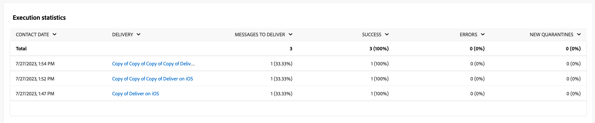

# 푸시 채널에 대한 캠페인 보고서 {#campaign-reports-push-channel}

각 캠페인 보고서는 캠페인의 성공 및 오류를 자세히 설명하는 다양한 위젯으로 나뉩니다. 푸시 채널의 경우 아래에 보고서와 지표가 자세히 설명되어 있습니다. 에서 캠페인 보고서에 액세스하는 방법 알아보기 [이 페이지](campaign-reports.md).

## 게재 요약 {#delivery-summary-push}

>[!CONTEXTUALHELP]
>id="acw_campaign_reporting_push_deliveries_overview"
>title="게재 개요"
>abstract="**게재 개요** 보고서는 방문자가 푸시 알림 게재에 참여하는 방식에 대한 자세한 정보를 포함하는 주요 성과 지표(KPI)를 제공합니다."

다음 **[!UICONTROL 게재 개요]** 보고서는 방문자의 푸시 알림 전달 방식에 대한 자세한 정보를 제공하는 주요 성과 지표(KPI)를 제공합니다. 지표는 아래에 자세히 설명되어 있습니다.

{zoomable=&quot;yes&quot;}

+++푸시 캠페인 보고서 지표에 대해 자세히 알아보십시오.

* **[!UICONTROL 게재할 메시지]**: 게재를 준비하는 동안 처리된 총 메시지 수입니다.

* **[!UICONTROL 전달됨]**: 성공적으로 전송된 메시지 수와 총 전송된 메시지 수

* **[!UICONTROL 오류]**: 총 보낸 메시지 수와 관련하여 게재 및 자동 반환 처리 중에 누적된 총 오류.

* **[!UICONTROL 총 클릭수]**: 한 번 이상 게재를 클릭한 총 고유 수신자 수입니다.

+++

### 초기 타깃 대상자 통계 {#delivery-summary-push-initial-target}

>[!CONTEXTUALHELP]
>id="acw_campaign_reporting_push_target"
>title="초기 타깃 대상자 통계"
>abstract="**초기 타깃 대상자 통계** 테이블에는 수신자와 관련된 데이터가 표시됩니다."

다음 **[!UICONTROL 초기 타겟 대상 통계]** 테이블에는 수신자와 관련된 데이터가 표시됩니다. 지표는 아래에 자세히 설명되어 있습니다.

{zoomable=&quot;yes&quot;}

+++푸시 캠페인 보고서 지표에 대해 자세히 알아보십시오.

* **[!UICONTROL 초기 대상자]**: 타겟팅된 총 수신자 수.

* **[!UICONTROL 게재할 메시지]**: 게재를 준비한 후 게재할 총 메시지 수

* **[!UICONTROL 규칙에 의해 거부됨]**&#x200B;차단 목록에 추가하다 : 분석 중에 무시된 총 주소 수: 격리된 주소, 격리된 주소 수 등 규칙 적용 시

+++

### 실행 통계 {#delivery-summary-push-exec-stats}

>[!CONTEXTUALHELP]
>id="acw_campaign_reporting_push_exec_stats"
>title="실행 통계"
>abstract="**실행 통계** 테이블에는 전달할 메시지, 성공, 오류, 새 격리 등 게재 성공에 대한 자세한 내용이 나와 있습니다."

다음 **[!UICONTROL 실행 통계]** 게재의 성공 여부를 표로 자세히 설명합니다. 지표는 아래에 자세히 설명되어 있습니다.

{zoomable=&quot;yes&quot;}

+++푸시 캠페인 보고서 지표에 대해 자세히 알아보십시오.

* **[!UICONTROL 게재할 메시지]**: 게재를 준비한 후 게재할 총 메시지 수

* **[!UICONTROL 성공]**: 배달할 메시지 수와 관련하여 성공적으로 처리된 메시지 수입니다.

* **[!UICONTROL 오류]**: 게재할 메시지 수와 관련하여 게재 및 자동 반동 처리 중에 누적된 총 오류 수입니다.

* **[!UICONTROL 새로운 격리]**: 게재 실패 후 격리된 총 주소 수(예: 잘못된 등록, 메시지 거부, 페이로드 오류) 게재할 메시지 수 관련.

  푸시 알림 오류 유형은 [Adobe Campaign v8(클라이언트 콘솔) 설명서](https://experienceleague.adobe.com/docs/campaign/campaign-v8/send/failures/delivery-failures.html#push-error-types){target="_blank"}.

+++

### 생성된 클릭스트림 {#delivery-summary-push-click-streams}

>[!CONTEXTUALHELP]
>id="acw_campaign_reporting_push_click_streams"
>title="생성된 클릭스트림"
>abstract="**생성된 클릭스트림** 테이블에는 수신자가 게재된 내용과 상호 작용한 방식과 관련하여 이용 가능한 데이터가 표시됩니다."

다음 **[!UICONTROL 생성된 클릭 스트림]** 테이블에는 수신자와 게재의 상호 작용 방식에 따른 데이터가 표시됩니다. 지표는 아래에 자세히 설명되어 있습니다.

{zoomable=&quot;yes&quot;}

+++푸시 캠페인 보고서 지표에 대해 자세히 알아보십시오.

* **[!UICONTROL 고유 클릭수]**: 한 번 이상 게재를 클릭한 총 고유 수신자 수입니다.

* **[!UICONTROL 총 클릭수]**: 게재의 총 링크 클릭 수입니다.

* **[!UICONTROL 반응성]**: 게재를 연 예상 대상 수신자 수와 관련하여 게재에서 클릭한 대상 수신자 수의 비율입니다.

+++
