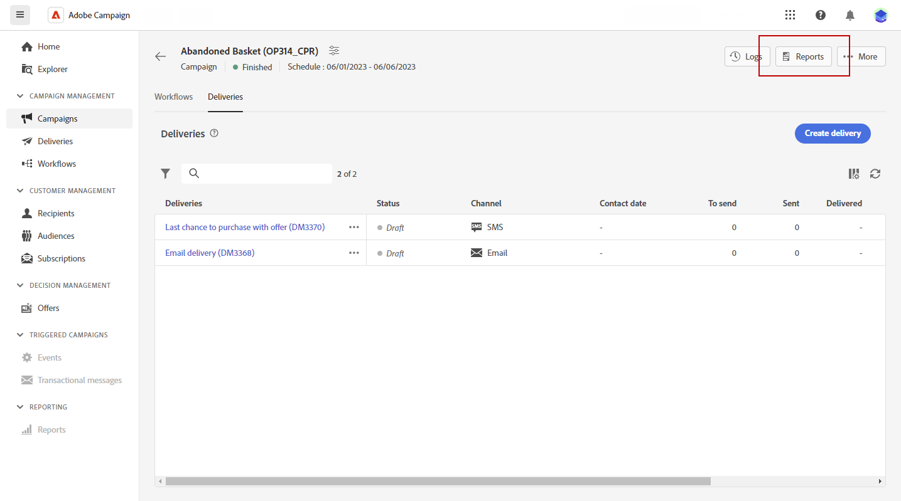

# 캠페인 보고서 {#campaign-reports}

<!-- CAN BE REMOVED___
>[!CONTEXTUALHELP]
>id="acw_campaign_reporting_sending"
>title="Reporting Sending"
>abstract="The Sending tab within your report provides in-depth insights into your visitors' interactions with your deliveries and any potential errors they may have encountered."

>[!CONTEXTUALHELP]
>id="acw_campaign_reporting_tracking"
>title="Reporting tracking"
>abstract="The Tracking tab within your report offers valuable data, including recipient behavior per link, breakdown of opens and clicks, as well as detailed information about the most frequently clicked URLs during a delivery."
-->

캠페인 보고서에 액세스하려면 다음을 클릭하십시오. **보고서** 캠페인의 대시보드에서 버튼을 클릭합니다.

또는 세 점을 사용할 수 있습니다 **추가 작업** 아래에 표시된 대로 캠페인 목록에서 캠페인 이름 옆에 있는 버튼:

{width="50%" align="left" zoomable="yes"}

캠페인 보고서는 캠페인의 성공 및 오류를 자세히 설명하는 다양한 위젯으로 나뉩니다.

각 채널에 대한 보고서 및 관련 지표의 전체 목록은 다음 페이지에서 사용할 수 있습니다.

* [이메일 채널](campaign-reports-email.md)
* [SMS 채널](campaign-reports-sms.md)
* [푸시 채널](campaign-reports-push.md)

