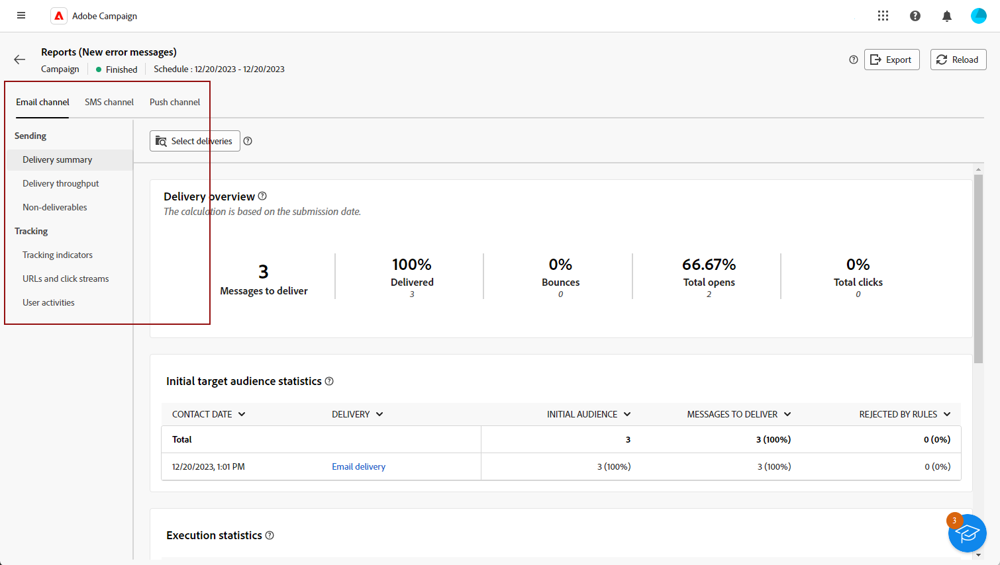
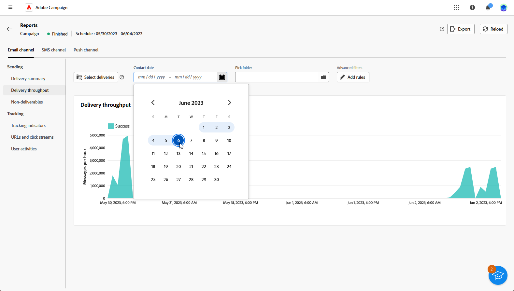

# 캠페인 보고서 시작하기 {#campaign-reports}

**캠페인 보고서**&#x200B;는 다양한 게재와 관련된 모든 정보를 통합하여 **캠페인**&#x200B;에 대한 포괄적인 개요를 제공합니다. 이러한 보고서는 채널별 성공률, 대상자 참여 및 기타 필수 지표 등 각 게재의 성과에 대한 철저한 분석을 제공합니다. 이를 통해 캠페인에 미치는 전반적인 효과와 영향을 평가할 수 있습니다.

각 채널에 대한 보고서 및 관련 지표의 전체 목록은 다음 페이지에서 사용할 수 있습니다.

* [이메일 캠페인 채널](campaign-reports-email.md)
* [SMS 캠페인 채널](campaign-reports-sms.md)
* [캠페인 채널 푸시](campaign-reports-push.md)
* [다이렉트 메일 캠페인 채널](campaign-reports-direct-mail.md)

## 보고서 대시보드 관리 {#manage-reports}

캠페인 보고서에 액세스하고 관리하려면 다음 단계를 수행합니다.

1. **[!UICONTROL 캠페인]** 메뉴로 이동합니다. 캠페인 대시보드에서 **보고서** 단추를 클릭합니다.

   {zoomable="yes"}

   또는 캠페인 목록에서 캠페인 이름 옆에 있는 세 점 **추가 작업** 단추를 사용하고 **[!UICONTROL 보고서 보기]**&#x200B;를 선택할 수 있습니다.

   {zoomable="yes"}

1. 왼쪽 메뉴에서 목록에서 보고서를 선택하고 탭을 통해 각 채널의 데이터를 표시합니다.

   {zoomable="yes"}

1. 캠페인에 포함된 특정 게재를 대상으로 지정하려면 대시보드에서 **[!UICONTROL 게재 선택]**&#x200B;을 클릭합니다.

1. **[!UICONTROL 게재 처리량]** 메뉴에서 특정 데이터를 타겟팅할 **시작** 및 **[!UICONTROL 종료 시간]**&#x200B;을(를) 선택하십시오.

   {zoomable="yes"}

1. **[!UICONTROL 폴더 선택]** 필드에서 특정 폴더의 게재 또는 캠페인을 타겟팅할지 여부를 선택합니다.

   **[!UICONTROL 규칙 추가]**&#x200B;를 선택하여 보고 데이터를 더 잘 필터링할 수 있는 쿼리 작성을 시작할 수도 있습니다. [쿼리 모델러를 사용하는 방법을 알아봅니다](../query/query-modeler-overview.md)

   {zoomable="yes"}

1. **[!UICONTROL URL 및 클릭 스트림]**&#x200B;에서 **[!UICONTROL 가장 많이 방문한 링크]** 또는 **[!UICONTROL 기간]**&#x200B;을 선택할 수도 있습니다.

   **[!UICONTROL 보기 기준]** 옵션을 사용하면 URL, 레이블 또는 범주를 필터링할 수 있습니다.
