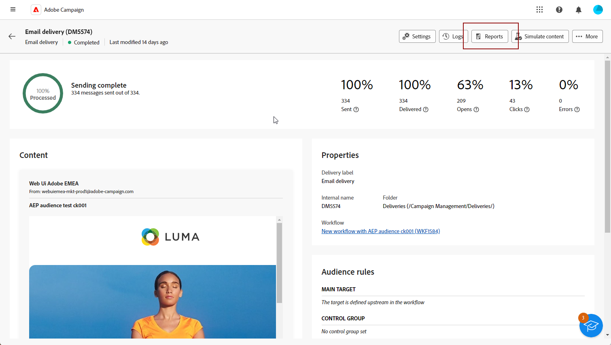
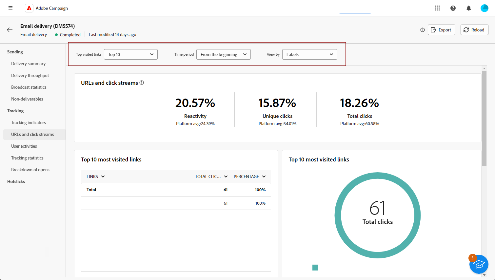

# 게재 보고서 시작 {#reports}

>[!CONTEXTUALHELP]
>id="acw_campaign_reporting_deliveries_selection"
>title="집계된 게재 보고"
>abstract="집계된 데이터 보고서를 표시하려면 두 개 이상의 게재를 선택합니다."

다음 **게재 보고서** 에만 초점을 맞춘 심층적인 통찰력과 데이터 제공 **게재** 모든 채널에 적용됩니다. 이러한 보고서는 개별 게재의 성과, 효율성 및 결과에 대해 자세한 정보와 함께 포괄적인 개요를 제공합니다.

각 채널에 대한 보고서 및 관련 지표의 전체 목록은 다음 페이지에서 사용할 수 있습니다.

* [이메일 게재 보고서](email-report.md)
* [SMS 게재 보고서](sms-report.md)
* [푸시 게재 보고서](push-report.md)

## 보고서 대시보드 관리 {#manage-reports}

Adobe Campaign은 각 게재에 대해 액세스할 수 있는 여러 유형의 보고서를 제공합니다. 이러한 보고서를 사용하면 내장된 대시보드에서 메시지의 영향과 성능을 측정하고 시각화할 수 있습니다.

보고서를 표시하고 관리하려면 다음 단계를 수행합니다.

1. 특정 게재에 대한 보고서를 생성하려면 **[!UICONTROL 게재]** 메뉴를 선택하고 보고할 게재를 선택합니다.

1. 출처: **[!UICONTROL 게재]** 대시보드, 클릭 **[!UICONTROL 보고서]**.

   

   또는 세 점을 사용할 수 있습니다 **추가 작업** 게재 목록의 게재 이름 옆에 있는 버튼을 클릭하고 을(를) 선택합니다. **[!UICONTROL 보고서 보기]**.

   

1. 왼쪽 메뉴의 목록에서 보고서를 선택합니다.

   

1. 게재가 반복되는 경우 다음을 클릭하여 보고할 특정 게재를 선택합니다. **[!UICONTROL 게재 선택]**.

   다음을 선택하여 보고서에 기간을 적용할 수도 있습니다. **[!UICONTROL 연락일]**.

   

1. 다음에서 **[!UICONTROL URL 및 클릭 스트림]**, 다음을 선택할 수도 있습니다. **[!UICONTROL 가장 많이 방문한 링크]** 또는 **[!UICONTROL 기간]**.

   다음 **[!UICONTROL 보기 기준]** 옵션을 사용하면 URL, 레이블 또는 범주를 필터링할 수 있습니다.

   
