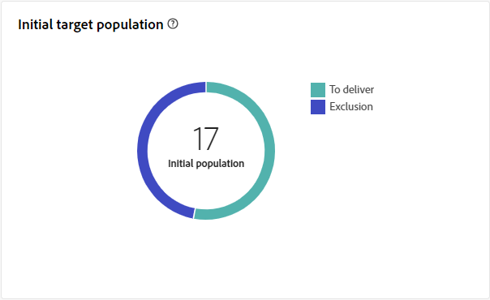

# 다이렉트 메일 게재 보고서 {#direct-mail-report}

**DM 게재 보고서**&#x200B;는 DM 게재와 관련된 포괄적인 통찰력과 데이터를 제공합니다. 여기에는 개별 게재의 성능, 효율성 및 결과에 대한 자세한 정보가 포함되어 있으며 전체 개요를 제공합니다.

## 게재 요약 {#delivery-summary-direct-mail}

### 게재 개요 {#delivery-overview-direct-mail}

>[!CONTEXTUALHELP]
>id="acw_delivery_reporting_delivery_overview_direct_mail"
>title="게재 개요"
>abstract="**게재 개요**&#x200B;는 각 다이렉트 메일 게재와 방문자의 상호 작용에 대한 심층적인 인사이트를 제공하는 핵심 성과 지표(KPI)를 제시합니다. 지표는 아래에 설명되어 있습니다."

**[!UICONTROL 게재 개요]**&#x200B;는 각 DM 게재와의 방문자 상호 작용에 대한 자세한 통찰력을 제공하며 필수 KPI(주요 성능 지표)를 표시합니다. 지표는 아래에 설명되어 있습니다.

{zoomable="yes"}{align="center"}

+++게재 개요 지표에 대해 자세히 알아보십시오.

* **[!UICONTROL 게재할 메시지]**: 게재를 준비하는 동안 처리된 총 메시지 수입니다.
* **[!UICONTROL 대상]**: DM 메시지의 대상 프로필로 적합한 사용자 프로필 수입니다.
* **[!UICONTROL 제외]**: DM 메시지를 받지 않는 대상 프로필에서 제외된 사용자 프로필 수입니다.
+++

### 초기 대상 집단 {#direct-mail-delivery-targeted-population}

>[!CONTEXTUALHELP]
>id="acw_delivery_reporting_initial_target_direct_mail"
>title="초기 대상 집단"
>abstract="**초기 대상 집단** 그래프에는 게재 준비의 결과를 바탕으로 수신자 및 메시지 관련 데이터가 표시됩니다."

**[!UICONTROL 초기 대상 모집단]** 그래프는 수신자와 관련된 데이터를 표시합니다. 지표는 게재를 준비하는 동안 계산되며 초기 대상자, 보낼 메시지 수 및 제외된 수신자 수를 포함합니다.

{zoomable="yes"}

정확한 숫자를 표시하려면 마우스를 그래프의 일부 위에 놓습니다.

{zoomable="yes"}

+++DM 게재 보고서 지표에 대해 자세히 알아보십시오.

* **[!UICONTROL 초기 대상]**: 타깃팅된 총 받는 사람 수
* **[!UICONTROL 게재]**: 게재를 준비한 후 게재할 총 메시지 수
* **[!UICONTROL 제외]**: 대상 모집단에서 제외된 총 받는 사람 수입니다.
+++

### 게재 통계 {#direct-mail-delivery-stats}

>[!CONTEXTUALHELP]
>id="acw_delivery_reporting_delivery_statistics_summary_direct_mail"
>title="게재 통계"
>abstract="**게재 통계** 그래프에는 다이렉트 메일 게재 성공과 발생한 오류가 자세히 표시됩니다."

**[!UICONTROL 게재 통계]** 그래프는 게재 성능에 대한 개요를 제공하며, 성공 및 효과를 측정하는 자세한 지표를 제공합니다.

{zoomable="yes"}

+++다이렉트 메일 캠페인 보고서 지표에 대해 자세히 알아보십시오.

* **[!UICONTROL 보낸 메시지]**: 게재를 준비한 후 배달할 총 메시지 수입니다.
* **[!UICONTROL 성공]**: 처리할 메시지 수와 배달할 메시지 수가 비교되었습니다.
* **[!UICONTROL 오류]**: 게재 및 자동 반동 처리 중에 누적된 총 오류 수와 배달될 메시지 수 비교.
* **[!UICONTROL 새 격리]**: 배달할 메시지 수와 비교하여 배달 실패 후 격리된 총 주소 수(예: 사용자 알 수 없음, 잘못된 도메인)입니다.
+++

### 제외 이유 {#direct-mail-delivery-exclusions}

>[!CONTEXTUALHELP]
>id="acw_delivery_reporting_causes_exclusion_direct_mail"
>title="제외 이유 게재"
>abstract="**제외 원인** 그래프는 게재 준비 과정에서 거부된 메시지의 분포를 각 규칙별로 분류하여 보여 줍니다."

**[!UICONTROL 제외 이유]** 그래프는 게재를 준비하는 동안 메시지 거부 이유를 분류합니다. 이 분류는 다양한 규칙으로 구성되며 메시지 제외에 기여하는 요인에 대한 자세한 보기를 제공합니다. 제외 규칙은 [Campaign v8(콘솔) 설명서](https://experienceleague.adobe.com/docs/campaign/campaign-v8/send/failures/delivery-failures.html#email-error-types){_blank}에 자세히 설명되어 있습니다.

{zoomable="yes"}{align="center" zoomable="yes"}

+++제외 지표의 원인에 대해 자세히 알아보십시오.

* **[!UICONTROL 격리된 주소]**: 주소가 격리될 때 오류 유형이 생성됩니다.
* **[!UICONTROL 주소가 지정되지 않음]**: 주소가 존재하지 않을 때 오류 유형이 생성됩니다.
* **[!UICONTROL 잘못된 품질 주소]**: 우편 주소 품질 등급이 너무 낮으면 오류 유형이 생성됩니다.
* **[!UICONTROL 차단 목록에 추가된 주소]**: 배달하는 동안 받는 사람이 차단 목록에 추가된으로 있을 때 오류 형식이 생성되었습니다.
* **[!UICONTROL Double]**: 키 값이 고유하지 않아 받는 사람이 제외될 때 오류 형식이 생성되었습니다.
* **[!UICONTROL 컨트롤 그룹]**: 받는 사람의 주소가 컨트롤 그룹의 일부입니다.
* **[!UICONTROL 대상 크기가 제한됨]**: 받는 사람의 최대 게재 크기에 도달했습니다.
+++

### 제외 {#direct-mail-exclusions}

>[!CONTEXTUALHELP]
>id="acw_delivery_reporting_exclusions_direct_mail"
>title="제외"
>abstract="**[!UICONTROL 제외]** 테이블에는 게재 준비 과정에서 거부된 메시지를 규칙별로 자세히 분석한 내용이 표시됩니다."

**[!UICONTROL 제외]** 테이블은 게재를 준비하는 동안 거부된 메시지에 대해 특정 규칙으로 분류한 자세한 분류를 제공합니다. 이 분류는 메시지 제외 이유에 대한 명확한 이해를 제공합니다.

{zoomable="yes"}{align="center" zoomable="yes"}

사용 가능한 지표는 위에서 설명한 [제외 이유](#direct-mail-delivery-exclusions)와 동일합니다.