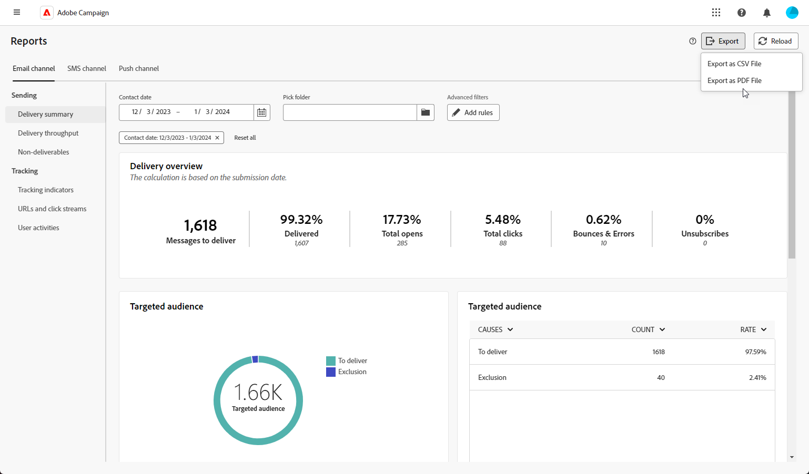

# 보고서 내보내기 {#export-reports}

>[!CONTEXTUALHELP]
>id="acw_reporting_email_exportation"
>title="보고서 내보내기"
>abstract="**내보내기** 버튼을 클릭하면 이러한 지표를 PDF 또는 CSV 포맷으로 내보내어 공유하거나 인쇄할 수 있습니다."

보고서를 공유, 조작 또는 인쇄할 수 있는 PDF 또는 CSV 형식으로 내보낼 수 있습니다.

1. 보고서에서 **[!UICONTROL 내보내기]**&#x200B;를 클릭하고 **[!UICONTROL PDF 파일로 내보내기]** 또는 **[!UICONTROL CSV 파일로 내보내기]**&#x200B;를 선택합니다.

   {zoomable="yes"}

1. 파일을 저장할 폴더를 찾은 다음 필요한 경우 이름을 바꾸고 **[!UICONTROL 저장]**&#x200B;을 클릭합니다.

이제 PDF 또는 CSV 파일에서 보고서를 보거나 공유할 수 있습니다.