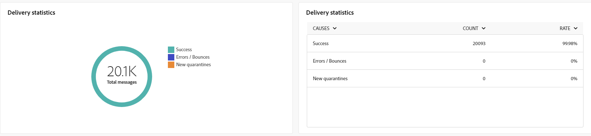

# DM 채널에 대한 전역 보고서 {#global-report-direct}

글로벌 보고서는 채널 수준의 트래픽 및 참여 지표에 대한 포괄적인 개요를 사용자에게 제공합니다.

다음 위치로 이동 **[!UICONTROL 보고서]** 내 메뉴 **[!UICONTROL 보고]** 섹션. 보고서 날짜, 폴더 또는 규칙에 따라 데이터를 필터링할 수 있습니다. [자세히 알아보기](global-reports.md)

## 게재 요약 {#delivery-summary-direct}

### 게재 개요 {#delivery-overview-direct}

다음 **[!UICONTROL 게재 개요]** 은 방문자와 각 이메일 게재의 상호 작용에 대한 심층적인 통찰력을 제공하는 주요 성능 지표(KPI)를 제공합니다. 지표는 아래에 요약되어 있습니다.

{zoomable=&quot;yes&quot;}{align="center"}

+++게재 개요 지표에 대해 자세히 알아보십시오.

* **[!UICONTROL 게재할 메시지]**: 게재를 준비하는 동안 처리된 총 메시지 수입니다.

* **[!UICONTROL 전달됨]**: 성공적으로 전송된 메시지 수와 총 전송된 메시지 수

* **[!UICONTROL 오류]**: 총 보낸 메시지 수와 관련하여 게재 및 자동 반환 처리 중에 누적된 총 오류.

* **[!UICONTROL 구독 취소]**: 구독 취소를 클릭한 수신자 수입니다.
+++

### 타겟팅된 대상자 {#delivery-summary-direct-initial-target}

에 대한 테이블 및 그래프 **[!UICONTROL 타깃팅된 대상]** 아래에 제공된 세부 지표를 사용하여 수신자와 관련된 데이터를 표시합니다.

{zoomable=&quot;yes&quot;}{align="center"}

+++타깃팅된 대상 지표에 대해 자세히 알아보십시오.

* **[!UICONTROL 타깃팅된 대상]**: 타겟팅된 총 수신자 수.

* **[!UICONTROL 게재할 메시지]**: 게재를 준비한 후 게재할 총 메시지 수

* **[!UICONTROL 제외]**&#x200B;차단 목록에 추가하다 : 분석 중에 무시된 총 주소 수: 격리된 주소, 격리된 주소 수 등 규칙 적용 시

+++

### 게재 통계 {#delivery-summary-direct-exec-stats}

다음 **[!UICONTROL 게재 통계]** 표는 모든 DM 게재의 성공 사례를 아래에 요약된 세부 지표와 함께 제공합니다.

{zoomable=&quot;yes&quot;}{align="center"}

+++게재 통계 지표에 대해 자세히 알아보십시오.

* **[!UICONTROL 게재할 메시지]**: 게재를 준비한 후 게재할 총 메시지 수

* **[!UICONTROL 성공]**: 배달할 메시지 수와 관련하여 성공적으로 처리된 메시지 수입니다.

* **[!UICONTROL 오류 / 바운스]**: 게재할 메시지 수와 관련하여 게재 및 자동 반동 처리 중에 누적된 총 오류 수입니다.

* **[!UICONTROL 새로운 격리]**: 배달할 메시지 수와 관련하여 배달 실패 후 격리된 총 주소 수(사용자 알 수 없음, 잘못된 도메인)입니다.

+++

### 제외 이유 {#causes-exclusion}

{zoomable=&quot;yes&quot;}{align="center"}

제외 그래프 및 표는 타겟팅된 프로필에서 제외된 사용자 프로필이 메시지를 받지 못하는 이유를 설명합니다.

## 게재 처리량 {#delivery-throughput}

이 보고서는 지정된 기간 내의 게재 처리량에 대한 포괄적인 세부 정보를 제공합니다. 메시지 게재 속도를 측정하는 데 사용되는 주요 지표는 시간당 전송된 메시지 수입니다.

## 비게재 항목 {#non-deliverables-direct}

### 유형별 오류 분류 {#delivery-summary-direct-breakdown-per-type}

다음 **[!UICONTROL 유형별 오류 분류]** 표 및 그래프는 다양한 도메인에서 경험하는 잠재적 오류와 관련된 데이터를 나타내며, 아래에 특정 지표가 제공됩니다.

이 보고서에 표시된 오류는 격리 프로세스를 트리거합니다. 격리 관리에 대한 자세한 내용은 다음을 참조하십시오. [Campaign v8(클라이언트 콘솔) 설명서](https://experienceleague.adobe.com/docs/campaign/campaign-v8/campaigns/send/failures/delivery-failures.html){target="_blank"}.

+++유형별 오류 분류에 대해 자세히 알아보십시오.

* **[!UICONTROL 알 수 없는 사용자]**: 주소가 잘못되었음을 나타내기 위해 게재 중에 생성된 오류 유형.

* **[!UICONTROL 잘못된 도메인]**: 주소의 도메인이 잘못되었거나 존재하지 않음을 나타내기 위해 게재를 보낼 때 생성되는 오류 유형입니다.

* **[!UICONTROL 사서함 가득 참]**: 5회 게재 시도 후 생성된 오류 유형은 수신자의 받은 편지함에 메시지가 너무 많음을 나타냅니다.

* **[!UICONTROL 계정 비활성화]**: 주소가 더 이상 존재하지 않음을 나타내기 위해 게재를 보낼 때 생성된 오류 유형.

* **[!UICONTROL 거부됨]**: IAP(인터넷 액세스 공급자)에서 주소를 거부할 때 오류 유형 이 생성됩니다(예: 보안 규칙 적용 후).

* **[!UICONTROL 연결할 수 없음]**: 메시지 배포 문자열에서 발생하는 오류 유형: SMTP 릴레이 장애, 일시적으로 도메인에 연결할 수 없음 등

* **[!UICONTROL 연결되지 않음]**: 전송 시 수신자의 휴대폰이 꺼져 있거나 네트워크에서 연결이 끊겼음을 나타내는 오류 유형입니다.

+++

### 도메인별 오류 분류 {#delivery-summary-email-breakdown-per-domain}

다음 **[!UICONTROL 도메인별 오류 분류]** 표 및 그래프는 각 도메인 내의 잠재적 오류와 관련된 데이터를 보여 줍니다. 지표는 **[!UICONTROL 유형별 오류 분류]** 위에 자세히 설명된 표 및 그래프입니다.

