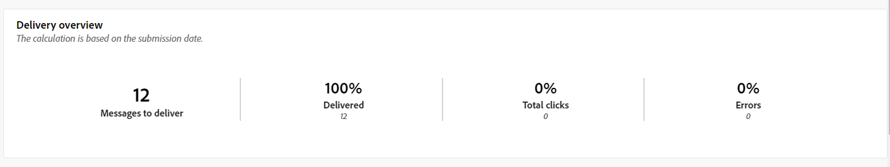

# 푸시 채널에 대한 글로벌 보고서 {#campaign-reports-push}

글로벌 보고서는 채널 수준의 트래픽 및 참여 지표에 대한 포괄적인 개요를 사용자에게 제공합니다.

**[!UICONTROL 보고]** 섹션 내의 **[!UICONTROL 보고서]** 메뉴로 이동합니다. 보고서 날짜, 폴더 또는 규칙에 따라 데이터를 필터링할 수 있습니다. [자세히 알아보기](global-reports.md)

## 게재 요약 {#delivery-summary-push}

### 게재 개요 {#delivery-overview-push}

>[!CONTEXTUALHELP]
>id="acw_push_global_report_overview"
>title="푸시 게재 개요"
>abstract="푸시 **게재 개요** KPI는 푸시 게재를 철저히 점검하여 자세한 인사이트와 구체적인 데이터를 제공합니다. 이는 게재의 성과, 효율성 및 결과에 관한 포괄적인 세부 정보를 제공합니다."

**[!UICONTROL 게재 개요]** 보고서는 방문자가 모든 푸시 알림 게재를 수행하는 방법에 대한 자세한 정보를 제공하는 주요 성능 지표(KPI)를 제공합니다. 지표는 아래에 자세히 설명되어 있습니다.

{zoomable="yes"}

+++게재 개요 지표에 대해 자세히 알아보십시오.

* **[!UICONTROL 게재할 메시지]**: 게재를 준비하는 동안 처리된 총 메시지 수입니다.

* **[!UICONTROL 배달됨]**: 보낸 총 메시지 수와 관련하여 성공적으로 보낸 메시지 수입니다.

* **[!UICONTROL 총 클릭 수]**: 게재를 한 번 이상 클릭한 총 고유 수신자 수입니다.

* **[!UICONTROL 오류]**: 보낸 총 메시지 수와 관련하여 게재 및 자동 반환 처리 중 누적된 총 오류 수입니다.

+++

### 타기팅된 대상자 {#delivery-summary-push-initial-target}

>[!CONTEXTUALHELP]
>id="acw_global_reporting_push_targeted_audience"
>title="푸시 타기팅된 집단"
>abstract="**타기팅된 집단** 그래프와 테이블은 푸시 메시지 대상자와 관련된 데이터를 보여 주며 게재할 메시지와 제외 항목에 대한 정보를 제공합니다."

**[!UICONTROL 타깃팅된 대상]** 테이블 및 그래프는 보낸 각 푸시 알림 배달에 대해 받는 사람과 관련된 데이터를 제공합니다. 지표는 아래에 자세히 설명되어 있습니다.

{zoomable="yes"}

+++타깃팅된 대상 지표에 대해 자세히 알아보십시오.

* **[!UICONTROL 타깃팅된 대상]**: 타깃팅된 총 수신자 수.

* **[!UICONTROL 게재할 메시지]**: 게재를 준비한 후 게재할 총 메시지 수입니다.

* **[!UICONTROL 제외]**: 규칙을 적용할 때 분석 중에 무시된 총 주소 수: 주소가 누락됨, 격리됨, 차단 목록 및 유사한 이유.

+++

### 게재 통계 {#delivery-summary-push-exec-stats}

>[!CONTEXTUALHELP]
>id="acw_global_reporting_push_delivery_stats"
>title="푸시 게재 통계"
>abstract="**전체 통계** 보고서는 성공률, 오류, 격리를 포함하여 전송된 푸시 알림에 대한 정보를 제공합니다."

**[!UICONTROL 게재 통계]** 표에는 모든 푸시 알림 게재의 성공 여부가 자세히 설명되어 있습니다. 지표는 아래에 자세히 설명되어 있습니다.

{zoomable="yes"}

+++게재 통계 지표에 대해 자세히 알아보십시오.

* **[!UICONTROL 총 메시지]**: 게재를 준비한 후 게재할 총 메시지 수입니다.

* **[!UICONTROL 성공]**: 배달할 메시지 수와 관련하여 처리된 메시지 수입니다.

* **[!UICONTROL 오류/바운스 수]**: 배달할 메시지 수와 관련하여 게재 및 자동 리바운드 처리 중에 누적된 총 오류 수입니다.

* **[!UICONTROL 새 격리]**: 배달할 메시지 수와 관련하여 배달 실패(잘못된 등록, 메시지 거부, 페이로드 오류 등) 후에 격리된 총 주소 수입니다.

  푸시 알림 오류 유형은 [Adobe Campaign v8(클라이언트 콘솔) 설명서](https://experienceleague.adobe.com/docs/campaign/campaign-v8/send/failures/delivery-failures.html#push-error-types){target="_blank"}에 나와 있습니다.

+++

### 제외 이유 {#causes-exclusion}

>[!CONTEXTUALHELP]
>id="acw_global_reporting_push_exclusion"
>title="푸시 제외 이유"
>abstract="**제외 이유** 그래프와 테이블은 사용자 프로필이 푸시 알림을 받지 못한 다양한 이유를 보여 줍니다."

**[!UICONTROL 제외 이유]** 그래프 및 표에는 대상 프로필에서 제외된 사용자 프로필이 메시지를 받지 못하는 이유가 표시됩니다.

푸시 알림 오류 유형은 [Adobe Campaign v8(클라이언트 콘솔) 설명서](https://experienceleague.adobe.com/docs/campaign/campaign-v8/send/failures/delivery-failures.html#push-error-types){target="_blank"}에 나와 있습니다.

## 게재 처리량 {#delivery-throughput-sms}

>[!CONTEXTUALHELP]
>id="acw_global_reporting_throughput_push"
>title="게재 처리량 보고서"
>abstract="**게재 처리량** 보고서는 지정된 기간 내 전체 플랫폼의 푸시 알림 게재 처리량에 대한 자세한 정보를 제공합니다."

{zoomable="yes"}

**[!UICONTROL 게재 처리량]** 보고서는 푸시 알림 게재 시스템의 효과에 대한 포괄적인 통찰력을 제공하여 지정된 기간 동안의 성공 및 오류율에 대한 자세한 요약을 제공합니다.