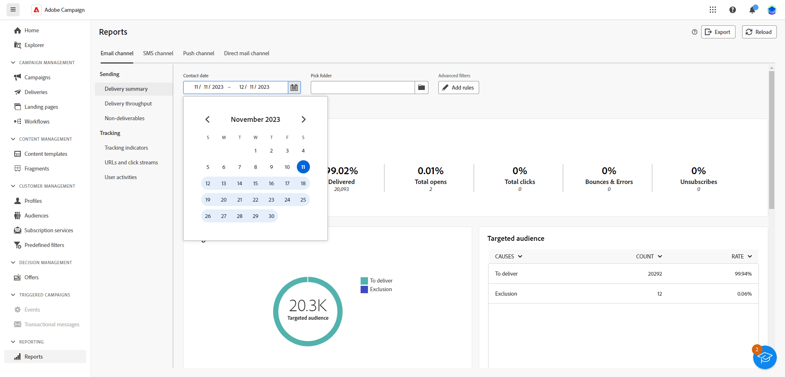

# 글로벌 보고서 시작 {#global-report-gs}

>[!CONTEXTUALHELP]
>id="acw_campaign_reporting_global_report"
>title="글로벌 보고서"
>abstract="글로벌 보고서는 캠페인 성과를 분석하는 강력하고 효율적인 방법을 제공합니다. 이들 보고서는 캠페인 내 각 채널에 대한 주요 트래픽 및 참여 지표에 대한 통합 보기를 제공합니다."

**글로벌 보고서**&#x200B;는 Campaign 인스턴스 내의 각 채널에 대한 트래픽 및 참여 지표에 대한 통합된 전체 요약을 제공하는 효과적인 도구 역할을 합니다. 이러한 보고서는 다양한 위젯으로 구성되어 있으며, 각 위젯은 캠페인 또는 게재 성과에 대한 고유한 관점을 제공합니다.

주요 성능 지표(KPI)는 매시간 새로 고쳐지며 최신 통찰력을 확보할 수 있습니다. 기본적으로 데이터는 지난 30일을 포함하도록 필터링되어 캠페인 및 게재 성과에 대한 최신 및 관련 관점을 제공합니다.

각 채널에 대한 보고서 및 관련 지표의 전체 목록은 다음 페이지에서 사용할 수 있습니다.

* [이메일 글로벌 보고서](global-report-email.md)
* [SMS 글로벌 보고서](global-report-sms.md)
* [글로벌 보고서 푸시](global-report-push.md)

## 보고서 대시보드 관리 {#manage-reports}

글로벌 보고서에 액세스하고 관리하려면 다음 단계를 수행합니다.

1. 다음 위치로 이동 **[!UICONTROL 보고서]** 내 메뉴 **[!UICONTROL 보고]** 섹션.

1. 왼쪽 메뉴에서 목록을 선택하고 탭을 통해 각 채널의 데이터를 표시합니다.

   {zoomable=&quot;yes&quot;}

1. 대시보드에서 을(를) 선택합니다 **시작** 및 **[!UICONTROL 종료 시간]** 특정 데이터를 대상으로 지정합니다.

   {zoomable=&quot;yes&quot;}

1. 다음에서 **[!UICONTROL 폴더 선택]** 필드에서 특정 폴더의 게재 또는 캠페인을 타겟팅하려면 선택합니다.

   {zoomable=&quot;yes&quot;}

1. 클릭 **[!UICONTROL 규칙 추가]** 보고 데이터를 더 잘 필터링하기 위한 쿼리 작성을 시작합니다. [쿼리 모델러를 사용하는 방법 알아보기](../query/query-modeler-overview.md)

1. 다음에서 **[!UICONTROL URL 및 클릭 스트림]**, 다음을 선택할 수도 있습니다. **[!UICONTROL 가장 많이 방문한 링크]** 또는 **[!UICONTROL 기간]**.

   다음 **[!UICONTROL 보기 기준]** 옵션을 사용하면 URL, 레이블 또는 범주를 필터링할 수 있습니다.
