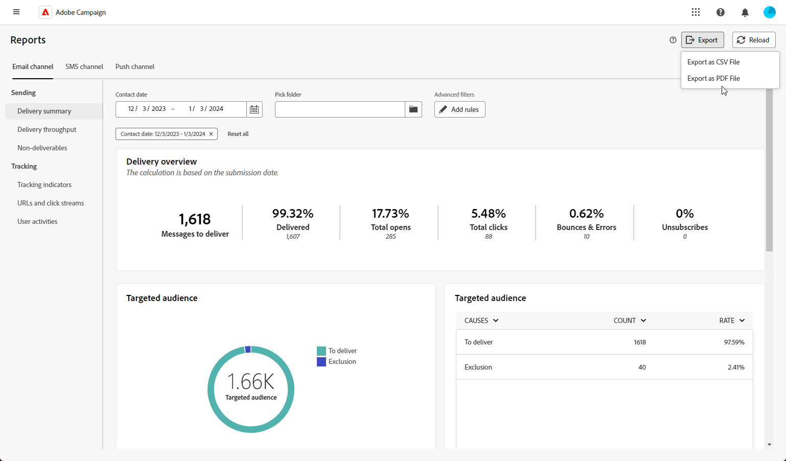

# 글로벌 보고서 시작 {#global-report-gs}

글로벌 보고서는 모든 채널의 트래픽 및 참여에 대한 포괄적인 개요를 제공하며 캠페인 및 게재 성능에 대한 고유한 통찰력을 제공하는 다양한 위젯을 제공합니다.

## 보고서 대시보드 관리 {#manage-reports}

글로벌 보고서에 액세스하고 관리하려면 다음 단계를 수행합니다.

1. 다음 위치로 이동 **[!UICONTROL 보고서]** 내 메뉴 **[!UICONTROL 보고]** 섹션.

1. 대시보드에서 을(를) 선택합니다 **시작** 및 **[!UICONTROL 종료 시간]** 특정 데이터를 대상으로 지정합니다.

   

1. 다음에서 **[!UICONTROL 폴더 선택]** 필드에서 특정 폴더의 게재 또는 캠페인을 타겟팅하려면 선택합니다.

   

1. 클릭 **[!UICONTROL 규칙 추가]** 보고 데이터를 더 잘 필터링하기 위한 쿼리 작성을 시작합니다.

1. 다음에서 **[!UICONTROL URL 및 클릭 스트림]**, 다음을 선택할 수도 있습니다. **[!UICONTROL 가장 많이 방문한 링크]** 또는 **[!UICONTROL 기간]**.

   다음 **[!UICONTROL 보기 기준]** 옵션을 사용하면 URL, 레이블 또는 범주를 필터링할 수 있습니다.

## 보고서 내보내기 {#export-reports}

서로 다른 보고서를 PDF 또는 CSV 형식으로 쉽게 내보내 공유, 조작 또는 인쇄할 수 있습니다.

1. 보고서에서 **[!UICONTROL 내보내기]** 및 선택 **[!UICONTROL PDF 파일로 내보내기]** 또는 **[!UICONTROL CSV 파일로 내보내기]**.

   

1. 파일을 저장할 폴더를 찾아 필요한 경우 이름을 변경한 다음 를 클릭합니다 **[!UICONTROL 저장]**.

이제 보고서를 PDF 또는 CSV 파일로 보거나 공유할 수 있습니다.

