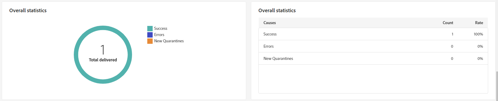
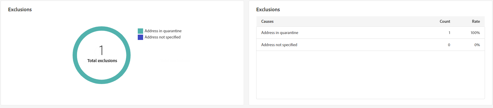

# 게재 보고서 푸시 {#push-report}

>[!CONTEXTUALHELP]
>id="acw_push_report_overview"
>title="푸시 보고서 요약"
>abstract="푸시 게재 보고 지표를 살펴보십시오."

## 푸시 요약 {#push-summary}

* **[!UICONTROL 게재 개요]** 은 방문자가 푸시 메시지에 참여하는 방식에 대한 자세한 정보를 제공하는 주요 성능 지표(KPI)를 제공합니다.

  +++푸시 게재 보고서 지표에 대해 자세히 알아보십시오.

   * **[!UICONTROL 총 전송됨]**: 게재 분석 중에 처리된 총 메시지 수입니다.

   * **[!UICONTROL 전달됨]**: 성공적으로 전송된 메시지 수와 총 전송된 메시지 수

   * **[!UICONTROL 클릭수]**: 푸시 메시지와 상호 작용한 총 수신자 수

   * **[!UICONTROL 오류]**: 게재 중에 발생하여 프로필로 전송되지 않은 총 오류 수입니다.

+++

  

* **대상 모집단** 대상자에 따른 그래프 및 표 표시 데이터:

  +++푸시 게재 보고서 지표에 대해 자세히 알아보십시오.

   * **[!UICONTROL 게재하기]**: 게재 분석 중에 처리된 총 메시지 수입니다.

   * **[!UICONTROL 제외]**: 분석에서 제외된 프로필 수입니다.

+++

  

* **전체 통계** 은 다음을 포함하여 전송된 푸시 알림에 대한 데이터를 제공합니다.

  +++푸시 게재 보고서 지표에 대해 자세히 알아보십시오.

   * **[!UICONTROL 성공]**: 정상적으로 처리된 메시지 수.

   * **[!UICONTROL 오류]**: 게재 중에 발생하여 메시지가 특정 프로필로 전송되지 않는 총 오류 수입니다.

   * **[!UICONTROL 새로운 격리]**: 제외되어 격리에 추가된 프로필 수입니다.

+++

  

* **[!UICONTROL 제외]** 그래프와 표에는 타겟팅된 프로필에서 제외된 사용자 프로필에서 메시지를 받지 못하게 한 다양한 이유가 표시됩니다.

  

## 게재 처리량 {#delivery-throughput}

이 보고서는 지정된 기간 내에 전체 플랫폼의 게재 처리량에 대한 자세한 정보를 제공합니다. 메시지 게재 속도를 측정하는 데 사용되는 기본 지표는 시간당 전송된 메시지 수입니다.

