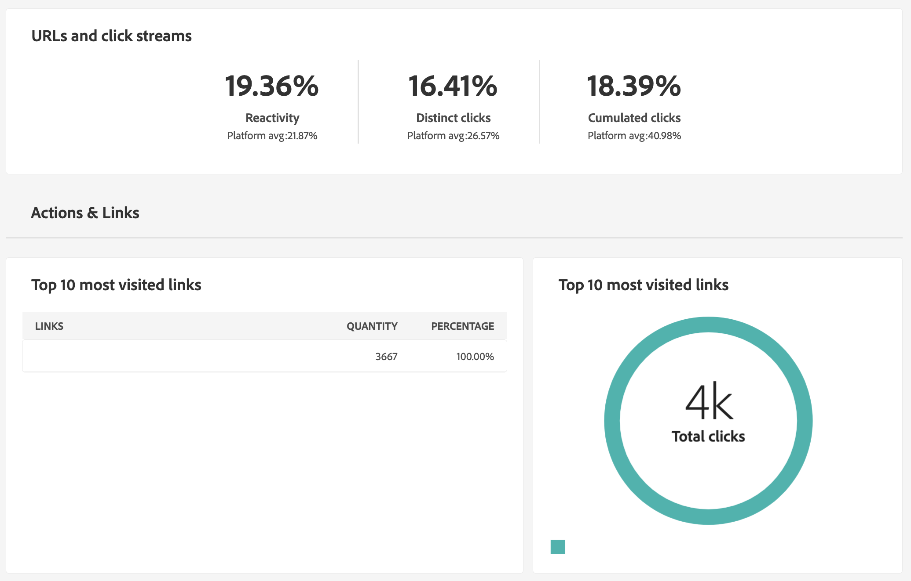
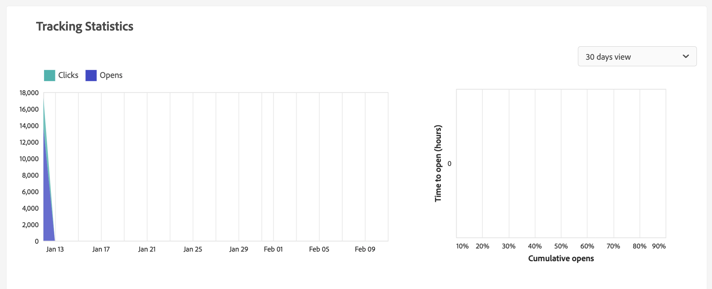

# 게재 보고서 {#reports}

Adobe Campaign에서는 각 게재에 액세스할 수 있는 몇 가지 유형의 보고서를 제공합니다. 이러한 보고서를 사용하면 내장된 대시보드에서 메시지의 영향과 성과를 측정하고 시각화할 수 있습니다.

보고서를 표시하려면 다음 단계를 수행합니다.

1. 이메일 게재에 액세스하고 **보고서** 버튼을 클릭합니다.

   

1. 왼쪽 메뉴에서 목록에서 보고서를 선택합니다.

   {width="70%" align="left"}

## 보내는 중

* **게재 요약**: 이 보고서는 게재에 대한 모든 주요 정보를 제공합니다. Target 채우기, 제외 원인, 게재 통계.

   

* **게재 처리량**: 이 보고서에는 지정된 기간 동안의 게재 처리량에 대한 정보가 포함되어 있습니다. 메시지가 전달되는 속도를 측정하기 위해 기준은 시간당 전송된 메시지 수와 메시지 크기(초당 비트 수)입니다. 아래 예에서 첫 번째 그래프는 성공적으로 게재한 것을 파란색으로 표시하고 잘못된 게재 수를 주황색으로 표시합니다.

   

* **브로드캐스트 통계**: 이 보고서는 인터넷 도메인, 처리 및 전송된 모든 메시지, 하드 바운스, 열기, 클릭 및 구독 취소에 대한 분류를 표시합니다.

   

* **게재 불가 및 이탈**: 이 보고서는 게재 불가 부분의 분류와 인터넷 도메인별 바운스 수 분류를 보여줍니다.

   

## 추적

* **지표 추적**: 이 보고서는 게재를 받을 때 수신자의 동작을 추적하기 위한 주요 지표를 결합합니다. 게재 및 수신 통계, 열기 및 클릭스루 비율, 생성된 클릭 스트림, 웹 추적 및 소셜 네트워크에 대한 활동 공유를 제공합니다.

   

* **URL 및 클릭 스트림**: 이 보고서는 게재 후 방문한 페이지 목록을 보여줍니다.

   

* **사용자 활동**: 이 보고서는 30분, 시간 또는 일별 열기 및 클릭 수를 차트 형태로 보여줍니다.

   

* **추적 통계**: 이 보고서는 열기 및 클릭에 대한 통계를 제공합니다.

   

* **열기 분류**: 이 보고서는 관련 기간 동안 운영 체제, 장치 및 브라우저별 열기 수를 보여줍니다. 각 카테고리에 대해 두 개의 차트가 사용됩니다. 첫 번째는 컴퓨터 및 모바일 장치에서 열리는 통계에 대한 통계입니다. 두 번째는 모바일 장치에서 열리는 경우에만 관련된 통계를 표시합니다.

   

## 핫클릭

이 보고서는 각 링크에 대한 클릭 비율( HTML 및/또는 텍스트)을 포함하는 메시지 콘텐츠를 보여줍니다. 개인화 블록은 구독 취소 링크, 미러 페이지 링크 및 오퍼 링크를 총 누적 클릭 수에 고려하지만 보고서에 표시되지 않습니다.

