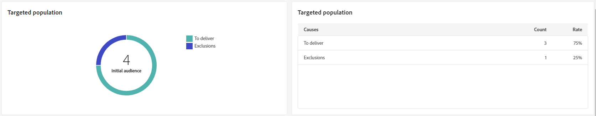
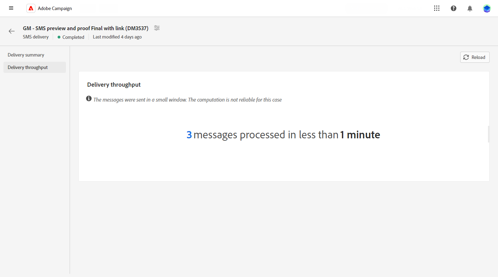

# SMS 게재 보고서 {#sms-report}

>[!CONTEXTUALHELP]
>id="acw_delivery_reporting_sending_sms"
>title="보고 전송"
>abstract="보고서 내의 **전송** 탭은 방문자와 게재 간의 상호 작용 및 방문자가 경험할 수 있는 잠재적인 오류에 대한 심층적인 통찰력을 제공합니다."

**SMS 게재 요약** 은 SMS 게재에 대한 포괄적인 개요를 제공하여 광범위한 인사이트와 특정 데이터를 얻을 수 있습니다. 성과, 효율성 및 게재 결과에 대해 포괄적인 정보를 제공합니다.

## 게재 요약 {#delivery-summary}

>[!CONTEXTUALHELP]
>id="acw_sms_report_overview"
>title="SMS 게재 개요"
>abstract="**SMS 게재 요약** 은 SMS 게재에 대한 포괄적인 개요를 제공하여 광범위한 인사이트와 특정 데이터를 얻을 수 있습니다. 성과, 효율성 및 게재 결과에 대해 포괄적인 정보를 제공합니다."

### 게재 개요 {#sms-delivery-overview}

다음 **[!UICONTROL 게재 개요]** 보고서는 성공률 및 오류율과 방문자가 SMS 메시지에 참여하는 방식에 대한 자세한 정보를 제공하는 주요 성과 지표(KPI)를 제공합니다.

+++SMS 게재 보고서 지표에 대해 자세히 알아보십시오.

* **[!UICONTROL 총 전송됨]**: 게재를 준비하는 동안 처리된 메시지 비율 및 총 수입니다.

* **[!UICONTROL 성공]**: 보낸 총 메시지 수와 관련하여 성공적으로 보낸 메시지 수 및 비율입니다.

* **[!UICONTROL 클릭스루 비율]**: SMS 게재에 포함된 링크와 상호 작용한 사용자의 비율 및 수입니다.

* **[!UICONTROL 오류]**: 게재 중에 발생하여 프로필로 전송되지 않은 오류의 백분율과 총 수입니다.

+++

### 대상 모집단 {#sms-delivery-targeted-population}

>[!CONTEXTUALHELP]
>id="acw_delivery_reporting_sms_targeted_population"
>title="SMS 대상 모집단"
>abstract="**대상 모집단** 그래프와 표에 SMS 대상자(게재할 메시지 및 제외)와 관련된 데이터가 표시됩니다."

다음 **대상 모집단** 그래프 및 표는 대상자를 기준으로 데이터를 표시합니다. 지표는 아래에 자세히 설명되어 있습니다.

+++SMS 게재 보고서 지표에 대해 자세히 알아보십시오.

* **[!UICONTROL 게재하기]**: 게재를 준비하는 동안 처리된 총 메시지 수 및 메시지 비율(%)입니다.

* **[!UICONTROL 제외]**: 분석에서 제외된 프로필 수 및 비율입니다.
+++

### 전체 통계 {#sms-delivery-overall}

>[!CONTEXTUALHELP]
>id="acw_delivery_reporting_sms_overall_stats"
>title="SMS 전체 통계"
>abstract="**전체 통계** 보고서는 보낸 SMS에 대한 데이터(성공, 오류 및 격리)를 제공합니다."

다음 **전체 통계** 보고서는 보낸 SMS 메시지에 대한 데이터를 제공합니다. 지표는 아래에 자세히 설명되어 있습니다.

+++SMS 게재 보고서 지표에 대해 자세히 알아보십시오.

* **[!UICONTROL 성공]**: 정상적으로 처리된 메시지 수 및 비율.

* **[!UICONTROL 오류]**: 메시지가 특정 프로필로 전송되지 않도록 하는 게재 중 발생한 총 오류 수 및 비율.

* **[!UICONTROL 새로운 격리]**: 제외되어 격리에 추가된 프로필의 수와 백분율
+++

### 제외 {#sms-delivery-exclusions}

>[!CONTEXTUALHELP]
>id="acw_delivery_reporting_sms_exclusions"
>title="SMS 제외"
>abstract="**제외** 그래프와 테이블에 대상 프로필에서 제외된 사용자 프로필이 메시지를 받지 못하는 다양한 이유가 표시됩니다."

다음 **[!UICONTROL 제외]** 그래프 및 표에는 타겟팅된 프로필에서 제외된 사용자 프로필에서 메시지를 받을 수 없는 이유가 표시됩니다. 제외 규칙은 다음에 자세히 설명되어 있습니다. [Campaign v8(콘솔) 설명서](https://experienceleague.adobe.com/docs/campaign/campaign-v8/send/failures/delivery-failures.html#sms-quarantines){_blank}.

## 게재 처리량 {#delivery-throughput}

>[!CONTEXTUALHELP]
>id="acw_delivery_reporting_throughput_sms"
>title="SMS 게재 처리량"
>abstract="**게재 처리량** 보고서는 지정된 기간 내 게재 처리량에 대한 자세한 정보를 제공합니다.  메시지 게재 속도를 측정하는 데 사용되는 주요 지표는 시간당 전송된 메시지 수입니다."

이 보고서는 지정된 기간 내의 게재 처리량에 대한 자세한 정보를 제공합니다. 메시지 게재 속도를 측정하는 데 사용되는 주요 지표는 시간당 전송된 메시지 수입니다.

