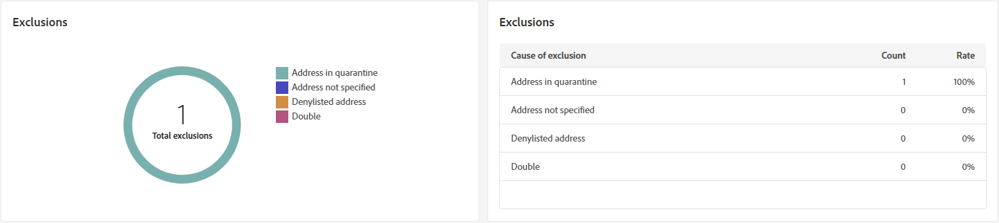

# SMS 게재 보고서 {#report}

>[!CONTEXTUALHELP]
>id="acw_sms_report_overview"
>title="SMS 보고서 요약"
>abstract="SMS 게재 보고 지표를 살펴보십시오."

>[!CONTEXTUALHELP]
>id="acw_delivery_reporting_sending_sms"
>title="전송 보고"
>abstract="보고서 내의 전송 탭에서는 방문자가 게재와 상호 작용하고 발생할 수 있는 모든 오류에 대한 심층적인 통찰력을 제공합니다."

다음 **SMS 게재 보고서** 는 SMS 채널에 대한 포괄적인 개요를 제공하여 광범위한 통찰력과 특정 데이터를 제공합니다. 각 게재의 성능, 효과 및 결과에 대한 포괄적인 정보를 제공합니다.

## 게재 요약 {#delivery-summary}

* **[!UICONTROL 게재 개요]** 은 방문자가 SMS 메시지에 참여하는 방식에 대한 자세한 정보를 제공하는 주요 성과 지표(KPI)를 제공합니다.

  

  +++SMS 게재 보고서 지표에 대해 자세히 알아보십시오.

   * **[!UICONTROL 총 전송됨]**: 게재를 준비하는 동안 처리된 총 메시지 수입니다.

   * **[!UICONTROL 성공]**: 성공적으로 전송된 메시지 수와 총 전송된 메시지 수

   * **[!UICONTROL 클릭스루 비율]**: SMS 게재에 포함된 링크와 상호 작용한 사용자의 비율입니다.

   * **[!UICONTROL 오류]**: 게재 중에 발생하여 프로필로 전송되지 않은 총 오류 수입니다.
+++

* **대상 모집단** 그래프 및 표는 대상자를 기준으로 데이터를 표시합니다.

  

  +++SMS 게재 보고서 지표에 대해 자세히 알아보십시오.

   * **[!UICONTROL 게재하기]**: 게재를 준비하는 동안 처리된 총 메시지 수입니다.

   * **[!UICONTROL 제외]**: 분석에서 제외된 프로필 수입니다.
+++

* **전체 통계** 은(는) 다음을 포함하여 보낸 SMS 메시지에 대한 데이터를 제공합니다.

  

  +++SMS 게재 보고서 지표에 대해 자세히 알아보십시오.

   * **[!UICONTROL 성공]**: 정상적으로 처리된 메시지 수.

   * **[!UICONTROL 오류]**: 게재 중에 발생하여 메시지가 특정 프로필로 전송되지 않는 총 오류 수입니다.

   * **[!UICONTROL 새로운 격리]**: 제외되어 격리에 추가된 프로필 수입니다.
+++

* **[!UICONTROL 제외]** 그래프와 표에는 타겟팅된 프로필에서 제외된 사용자 프로필에서 메시지를 받지 못하게 한 다양한 이유가 표시됩니다.

  

## 게재 처리량 {#delivery-throughput}

>[!CONTEXTUALHELP]
>id="acw_delivery_reporting_throughput_sms"
>title="게재 처리량 메뉴"
>abstract="게재 처리량 보고서는 지정된 기간 내에 전체 플랫폼의 게재 처리량에 대한 자세한 정보를 제공합니다."

이 보고서는 지정된 기간 내에 전체 플랫폼의 게재 처리량에 대한 자세한 정보를 제공합니다. 메시지 게재 속도를 측정하는 데 사용되는 기본 지표는 시간당 전송된 메시지 수입니다.

