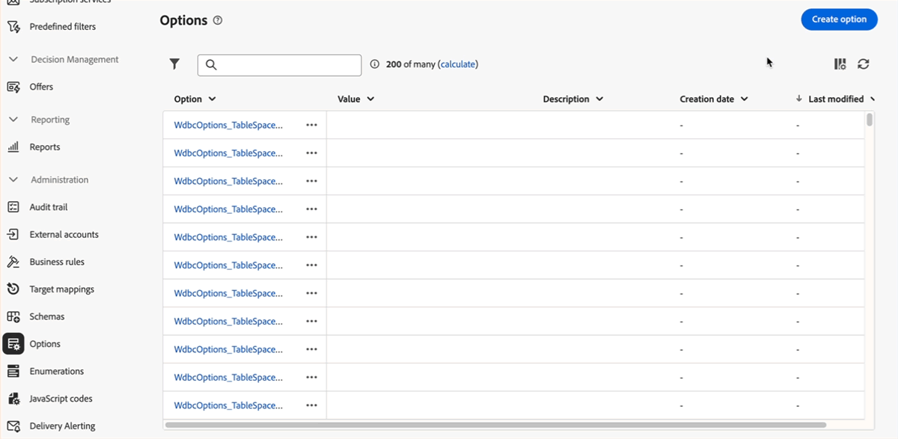

# 초기 릴리스 정보 {#e-release}

Adobe Campaign Web 사용자 인터페이스는 지속적으로 새로운 기능, 기존 기능 개선, 버그 해결을 제공합니다. 모든 변경 사항은 매달 말에 [릴리스 정보](release-notes.md)에 통합됩니다.

**아래의 초기 릴리스 정보는 릴리스 예정일까지 사전 예고 없이 변경될 수 있습니다**. 링크, 화면 및 업데이트된 설명서는 릴리스 일자에 [릴리스 정보](release-notes.md)에 게시됩니다.

## 2025년 1월 릴리스 {#25-1-release}

**릴리스 일자**: 2025년 2월 5일

1월 릴리스부터 다음과 같은 기능 및 개선 사항을 이용할 수 있습니다.

### 기능 {#25-1-features}

<table>
<thead>
<tr>
<th><strong>시각적 조각 만들기 및 사용하기</strong> </th>
</tr>
</thead>
<tbody>
<tr>
<td>

시각적 조각은 여러 이메일 게재 또는 콘텐츠 템플릿에서 재사용할 수 있는 사전 정의된 시각적 블록입니다. 이 기능은 이제 서버 빌드 8.6.4 이상을 실행하는 모든 고객이 사용할 수 있습니다.

자세한 내용은 <a href="../content/use-visual-fragments.md">세부 설명서</a>를 참조하십시오.

</td>
</tr>
</tbody>
</table>

<table>
<thead>
<tr>
<th><strong>서드파티 시스템을 사용하여 게재 전송</strong> </th>
</tr>
</thead>
<tbody>
<tr>
<td>

이제 Campaign 웹 인터페이스에서 외부 게재와 외부 게재 템플릿을 정의할 수 있습니다. 이 모드에서는 메시지가 입력 파일에 컴파일되어 외부 공급자와 공유할 수 있습니다. 기본적으로 외부 게재 모드는 다이렉트 메일(DM) 채널에 사용됩니다.

</td>
</tr>
</tbody>
</table>

<table>
<thead>
<tr>
<th><strong>비즈니스 규칙(유형화 규칙) 만들기</strong> </th>
</tr>
</thead>
<tbody>
<tr>
<td>

이제 Adobe Campaign 웹 인터페이스에서 유형화 및 유형화 규칙을 만들 수 있습니다. 유형화는 유형화 규칙의 컬렉션으로, 게재를 제어하고, 필터링하고, 우선순위를 지정하는 데 도움이 됩니다. 유형화는 게재에 구독 취소 링크 또는 제목 줄과 같은 필수 요소가 항상 포함되도록 하며 구독 취소자, 경쟁 업체 또는 충성도가 낮은 고객과 같은 특정 그룹을 타깃 대상자에서 제외하는 필터링 규칙을 적용합니다.

<!--p>For more information, refer to the <a href="../administration/external-account.md">detailed documentation</a>.</p-->
</td>
</tr>
</tbody>
</table>

<table>
<thead>
<tr>
<th><strong>열거 관리</strong> </th>
</tr>
</thead>
<tbody>
<tr>
<td>

이제 Adobe Campaign Web 사용자 인터페이스를 통해 직접 열거를 만들 수 있습니다. 열거는 필드를 채우기 위해 시스템이 제안하는 값의 목록입니다. 열거를 사용하여 이러한 필드의 값을 표준화하고, 쿼리 내에서 데이터 입력이나 사용을 돕습니다.

<!--p>For more information, refer to the <a href="../administration/external-account.md">detailed documentation</a>.</p-->
</td>
</tr>
</tbody>
</table>

<table>
<thead>
<tr>
<th><strong>사용자 정의 옵션 만들기</strong> </th>
</tr>
</thead>
<tbody>
<tr>
<td>

이제 Adobe Campaign Web 사용자 인터페이스에서 기술 옵션에 액세스하여 요구 사항에 맞는 사용자 정의 옵션을 직접 만들 수 있습니다. 이 기능은 특히 중간 데이터를 저장하기 위해 JavaScript 코드 워크플로 활동을 수행할 때 유용합니다.

<!--p>For more information, refer to the <a href="../administration/external-account.md">detailed documentation</a>.</p-->
</td>
</tr>
</tbody>
</table>

<table>
<thead>
<tr>
<th><strong>JavaScript 코드 정의 및 호출</strong> </th>
</tr>
</thead>
<tbody>
<tr>
<td>

이제 Adobe Campaign Web 사용자 인터페이스에서 JavaScript 코드를 만들 수 있습니다. 이를 통해 라이브러리처럼 여러 워크플로에서 활용할 수 있는 재사용 가능한 함수를 만들 수 있습니다.

<!--p>For more information, refer to the <a href="../administration/external-account.md">detailed documentation</a>.</p-->
</td>
</tr>
</tbody>
</table>

### 개선 사항 {#25-1-improvements}

* 인터페이스에서 사용자 정의 필드의 표시 사용자 정의:

   * 이제 인터페이스에서 표시할 추가 사용자 정의 필드를 선택할 수 있습니다.
   * 이제 다른 필드의 입력에 따라 목록 값을 제한하는 것과 같이 링크 유형 사용자 정의 필드를 표시하기 위한 규칙을 설정할 수 있습니다.
   * 이제 인터페이스에서 필드를 보다 유연하게 배열할 수 있습니다. 필드를 단일 열에 걸쳐 배치하거나 더 나은 구성을 위해 하위 섹션으로 그룹화할 수 있습니다.
   * 이제 특정 필드를 읽기 전용으로 설정할 수 있습니다.

* 최근 항목 및 즐겨찾기 필터: 자주 사용되는 속성을 빠르게 재사용하기 위해 이제 이를 즐겨찾기에 추가할 수 있습니다. 이렇게 하면 향후 작업에 간편하게 액세스할 수 있습니다. 즐겨찾기 외에도 가장 최근에 선택한 속성을 조회하고 사용할 수 있습니다.

