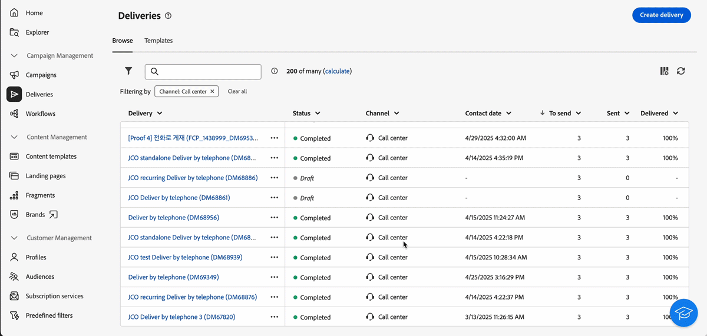
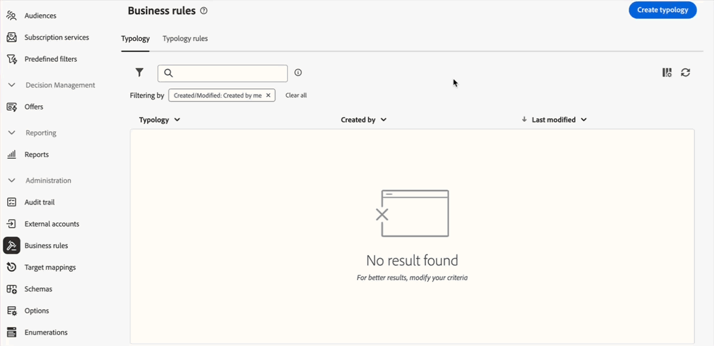

# 2025 릴리스 정보 {#2025-release}

이 페이지에는 **2025년 릴리스**&#x200B;를 통해 이용할 수 있는 모든 변경 사항과 개선 사항이 나열되어 있습니다. 최신 릴리스 정보는 [이 페이지](release-notes.md)에서 확인할 수 있습니다.

## 2025년 6월 릴리스 {#25-6-release}

### 개선 사항 {#25-6-improvements}

* 이제 콜센터와 사용자 정의 채널 모두에 대한 게재 요약 보고서를 사용할 수 있습니다. [자세히 알아보기](../reporting/direct-mail.md)

* SMS 게재를 구성할 때 이제 특정 SMS 매개변수에 액세스할 수 있습니다. 이는 클라이언트 콘솔에서 사용할 수 있는 매개변수와 동일합니다. [자세히 알아보기](../advanced-settings/delivery-settings.md#sms-tab)

* 이제 자주 사용하는 폴더가 탐색기 페이지의 왼쪽 패널 상단에 표시되어 간편하게 액세스할 수 있습니다. [자세히 알아보기](../get-started/work-with-folders.md#favorite-folders)

* 이제 규칙 빌더가 드래그 앤 드롭을 지원하여 쿼리 구성 요소를 더 효율적으로 재정렬할 수 있습니다. [자세히 알아보기](../query/build-query.md#drag-and-drop)

* 규칙 빌더의 “인간 조건”이 개선되었습니다. 화면 하단에 표시되는 규칙의 작성된 일반 언어 버전은 다음과 같습니다.

   * 속성이 이제 강조 표시되고 연관된 스키마가 표시됩니다.
   * 이들 요소를 클릭하면 더 자세한 정보를 볼 수 있습니다.
   * 이제 해당 버튼을 사용하여 인간 조건을 복사할 수 있습니다.

* 이제 “기술 워크플로” 및 “자동으로 생성된 오브젝트” 폴더에 대한 액세스가 제한되어 이들 폴더를 볼 수 없습니다. [자세히 알아보기](../get-started/work-with-folders.md#about-folders)

## 2025년 5월 릴리스 {#25-5-release}

다음 기능은 5월 릴리스 이후 모든 사용자가 사용할 수 있습니다.

<table>
<thead>
<tr>
<th><strong>브랜드 정렬 점수 (Beta)</strong> </th>
</tr>
</thead>
<tbody>
<tr>
<td>

브랜드 정렬 점수 기능은 이메일 디자이너에서 직접 명확한 피드백을 제공하여 내 콘텐츠가 브랜드의 톤, 스타일 및 가이드라인에 부합하는지 확인하는 데 도움을 줍니다. 이 기능은 Beta 버전으로 사용할 수 있습니다.

자세한 내용은 <a href="../content/brands-score.md">세부 설명서</a>를 참조하십시오.

</td>
</tr>
</tbody>
</table>

<table>
<thead>
<tr>
<th><strong>외부 게재를 위한 사용자 정의 채널</strong> </th>
</tr>
</thead>
<tbody>
<tr>
<td>

이제 Adobe Campaign Web UI에서 직접 사용자 정의 외부 채널을 기반으로 게재를 조율하고 실행할 수 있습니다. 이들 게재는 독립적으로 실행하거나 워크플로의 일부로 실행할 수도 있습니다. 서드파티와 통합된 사용자 정의 외부 채널의 생성은 콘솔에서 수행됩니다.

참고: 사용자 정의 채널의 경우 Web UI에서 보고 기능을 사용할 수 없습니다. 보고서에 액세스하려면 클라이언트 콘솔로 이동해야 합니다.

자세한 내용은 <a href="../call-center/gs-custom-channel.md">세부 설명서</a>를 참조하십시오.

</td>
</tr>
</tbody>
</table>

### 개선 사항 {#25-5-improvements}

유형화 규칙 생성 화면이 업데이트되어 규칙 유형을 더 쉽게 선택할 수 있게 되었습니다.

## 2025년 4월 릴리스 {#25-4-release}

**릴리스 일자**: 2025년 4월 29일

### 새로운 기능 {#25-4-features}

다음 기능은 4월 릴리스 이후 모든 사용자가 사용할 수 있습니다.

<table>
<thead>
<tr>
<th><strong>콜센터 채널</strong> </th>
</tr>
</thead>
<tbody>
<tr>
<td>

이제 Campaign Web 사용자 인터페이스에서 콜센터 채널을 사용할 수 있습니다. 이 채널은 콜센터를 통해 처리되는 커뮤니케이션 또는 상호 작용을 관리하고 추적하는 데 사용되는 커뮤니케이션 방식을 의미합니다. 일반적으로 상담원이 고객이나 잠재 고객에게 전화를 거는 경우에 사용됩니다.

참고: 콜센터 채널의 경우 Web UI에서 보고 기능을 사용할 수 없습니다. 보고서에 액세스하려면 클라이언트 콘솔로 이동해야 합니다.

자세한 내용은 <a href="../call-center/gs-call-center.md">세부 설명서</a>를 참조하십시오.

</td>
</tr>
</tbody>
</table>

<table>
<thead>
<tr>
<th><strong>새로운 규칙 빌더</strong> </th>
</tr>
</thead>
<tbody>
<tr>
<td>

이제 개선된 사용자 인터페이스에서 복잡한 조건을 정의하는 데 도움이 되는 새로운 규칙 작성기를 사용할 수 있습니다. 필요에 따라 이전 규칙 빌더에서 새로운 규칙 빌더로 전환할 수 있습니다.

자세한 내용은 <a href="../query/query-modeler-overview.md">세부 설명서</a>를 참조하십시오.

</td>
</tr>
</tbody>
</table>

<table>
<thead>
<tr>
<th><strong>외부 계정 작성</strong> </th>
</tr>
</thead>
<tbody>
<tr>
<td>

캠페인 관리자는 이제 Campaign Web 사용자 인터페이스에서 외부 시스템과의 새로운 연결을 설정할 수 있습니다.
기존 외부 계정을 보고, 업데이트하고, 관리할 수도 있습니다.

자세한 내용은 <a href="../administration/external-account.md">세부 설명서</a>를 참조하십시오.

</td>
</tr>
</tbody>
</table>

### 개선 사항 {#25-4-improvements}

**일반 인터페이스 개선**

* 이제 사용자 인터페이스에서 스키마 속성에 대한 필드 설명, 즐겨찾기에 추가 및 값 분포 옵션을 더 쉽게 확인할 수 있습니다. 자세한 내용은 [세부 설명서](../get-started/attributes.md)를 참조하십시오.
* 이제 인터페이스에서 날짜와 시간이 Experience League 환경 설정에서 설정된 기본 언어에 따라 표시됩니다. 이 개선 사항은 몇몇 언어에만 적용됩니다. 지원되는 언어의 전체 목록을 보려면 [세부 설명서](https://experienceleague.adobe.com/ko/docs/core-services/interface/features/browser-language){target=_blank}를 참조하십시오.

<!--
ko * Built-in options are now only visible in the list of options if the **Show advanced options** toggle is activated.
ko * The typology rules creation screen has been updated to facilitate the selection of the type of rule.
-->

**이메일 편집기**: 이제 Campaign Web UI의 접근성을 높이기 위해 이메일 디자이너에서 두 개의 새로운 필드를 사용할 수 있습니다. 이 필드는 이메일 콘텐츠의 `title` 요소와 `html` 요소의 언어 속성에 해당합니다. 이러한 설정은 이메일 본문 섹션에서 프리헤더 필드 외에도 정의할 수 있습니다. 자세한 내용은 [세부 설명서](../email/metadata.md)를 참조하십시오.

<!--
**Workflow**: You can now select an existing Javascript code in workflow properties or in a Javascript activity.    
-->

**스키마**

* 이제 Campaign Web 사용자 인터페이스에서 목록의 임시 스키마를 편집할 수 있습니다. 자세한 내용은 [세부 설명서](../audience/manage-audience.md)를 참조하십시오.
* 이제 샘플 화면에서 스키마의 사용자 정의 필드를 미리 볼 수 있습니다. 자세한 내용은 [세부 설명서](../administration/custom-fields.md#add)를 참조하십시오.
* 이제 끌어다 놓기로 목록에서 사용자 정의 필드를 이동할 수 있습니다. 자세한 내용은 [세부 설명서](../administration/custom-fields.md#add)를 참조하십시오.

### 제한적으로 사용 가능한 새로운 기능 {#25-4-features-la}

>[!AVAILABILITY]
>
>다음 기능은 제한 공개(LA)로 제공됩니다. **Adobe Campaign Standard에서 Adobe Campaign v8로** 마이그레이션하는 고객으로 제한되며 다른 환경에는 배포할 수 없습니다. 해당 고객은 Campaign 서버를 v8.7.4로 업그레이드해야 합니다.
>
>[Campaign Standard에서 Campaign v8로의 전환](../rn/acs-migration.md) 및 [Campaign Standard 사용자를 위한 기능](https://experienceleague.adobe.com/docs/experience-cloud/campaign/campaign-standard-migration-home.html?lang=ko) 설명서 페이지를 참조하십시오.

* **다국어 게재 생성** - 이제 Adobe Campaign Web 사용자 인터페이스에서 다양한 언어로 여러 이메일 게재를 전송할 수 있습니다. 다국어 게재 기능을 사용하면 게재의 기본 언어는 물론, 게재를 전송할 수 있는 다양한 언어를 선택할 수 있습니다. 선택한 언어로 게재 내용을 미리 볼 수도 있습니다. 자세한 내용은 [세부 설명서](../email/edit-content.md)를 참조하십시오.

* **다국어를 위한 동적 보고** - 이제 다국어 이메일 게재에 대해 동적 보고가 가능합니다. 자세한 내용은 [세부 설명서](../reporting/global-reports.md)를 참조하십시오.

* **SMS REST API 지원(LA)** - 이제 SMS 채널에서 트랜잭션 메시지 REST API를 사용할 수 있습니다. 페이로드에 이메일과 휴대폰이 모두 있는 경우 “wishedChannel” 필드를 사용하여 채널을 지정할 수 있습니다. 제공되지 않으면 wishedChannel에서 SMS를 명시적으로 요청하지 않는 한 기본적으로 이메일이 사용됩니다. 자세한 내용은 [세부 설명서](https://experienceleague.adobe.com/docs/campaign/campaign-v8/developer/apis/get-started-apis.html?lang=ko){target=_blank}를 참조하십시오.

## 2025년 2월 릴리스 {#25-2-release}

**릴리스 일자**: 2025년 2월 18일

2월 릴리스부터 다음과 같은 기능 및 개선 사항을 이용할 수 있습니다.

### 기능 {#25-2-features}

<table>
<thead>
<tr>
<th><strong>비즈니스 규칙(유형화 규칙) 만들기</strong> </th>
</tr>
</thead>
<tbody>
<tr>
<td>

이제 Adobe Campaign Web 사용자 인터페이스에서 유형화 및 유형화 규칙을 만들 수 있습니다. 유형화를 통해 게재 전송을 제어, 필터링 및 모니터링할 수 있습니다. 유형화는 게재에 항상 필수 구성 요소(예: 구독 취소 링크 또는 제목 줄) 또는 그룹(예: 구독 취소자, 경쟁 업체 또는 충성도가 낮은 고객)을 대상자에서 제외하기 위한 필터링 규칙이 포함되어 있는지 확인하는 데 사용됩니다.

자세한 내용은 <a href="../administration/typologies.md">세부 설명서</a>를 참조하십시오.

</td>
</tr>
</tbody>
</table>

<table>
<thead>
<tr>
<th><strong>대상 매핑</strong> </th>
</tr>
</thead>
<tbody>
<tr>
<td>

이제 Campaign Web 사용자 인터페이스에서 대상 매핑을 만들 수 있습니다. 대상 매핑은 다양한 게재 채널(이메일, SMS, 푸시 알림)이 스키마의 데이터 필드에 연결되는 방식을 정의합니다. 대상 매핑을 통해 프로필, 약정 수혜자, 운영자, 구독자, 잠재 고객 등 타기팅되는 대상자를 정의할 수 있습니다.

자세한 내용은 <a href="../administration/target-mappings.md">세부 설명서</a>를 참조하십시오.

</td>
</tr>
</tbody>
</table>

<table>
<thead>
<tr>
<th><strong>스키마 세부 정보</strong> </th>
</tr>
</thead>
<tbody>
<tr>
<td>

이제 목록에서 스키마 이름을 선택하여 스키마의 세부 정보에 액세스할 수 있습니다. 이제 스키마 세부 정보에 표시되는 <b>사용자 정의 필드 편집</b> 버튼을 사용하여 사용자 정의 필드 편집 기능에 액세스할 수 있습니다.

자세한 내용은 <a href="../administration/schemas.md">세부 설명서</a>를 참조하십시오.

</td>
</tr>
</tbody>
</table>

## 2025년 1월 릴리스 {#25-1-release}

**릴리스 일자**: 2025년 2월 5일

1월 릴리스부터 다음과 같은 기능 및 개선 사항을 이용할 수 있습니다.

### 기능 {#25-1-features}

<table>
<thead>
<tr>
<th><strong>시각적 조각 만들기 및 사용하기</strong> </th>
</tr>
</thead>
<tbody>
<tr>
<td>

시각적 조각은 여러 이메일 게재 또는 콘텐츠 템플릿에서 재사용할 수 있는 사전 정의된 시각적 블록입니다. 이 기능은 이제 서버 빌드 8.6.4 이상을 실행하는 모든 고객이 사용할 수 있습니다.

자세한 내용은 <a href="../content/use-visual-fragments.md">세부 설명서</a>를 참조하십시오.

</td>
</tr>
</tbody>
</table>

<table>
<thead>
<tr>
<th><strong>서드파티 시스템을 사용하여 게재 전송</strong> </th>
</tr>
</thead>
<tbody>
<tr>
<td>

이제 Campaign 웹 인터페이스에서 외부 게재와 외부 게재 템플릿을 정의할 수 있습니다. 이 모드에서는 메시지가 출력 파일에 컴파일되어 외부 공급자와 공유할 수 있습니다. 기본적으로 외부 게재 모드는 다이렉트 메일(DM) 채널에 사용됩니다.

자세한 내용은 <a href="../msg/send-external-deliveries.md">세부 설명서</a>를 참조하십시오.

</td>
</tr>
</tbody>
</table>

<table>
<thead>
<tr>
<th><strong>열거 관리</strong> </th>
</tr>
</thead>
<tbody>
<tr>
<td>

이제 Adobe Campaign Web 사용자 인터페이스를 통해 직접 열거를 만들 수 있습니다. 열거는 필드를 채우기 위해 시스템이 제안하는 값의 목록입니다. 열거를 사용하여 이러한 필드의 값을 표준화하고, 쿼리 내에서 데이터 입력이나 사용을 돕습니다.

자세한 내용은 <a href="../administration/enumerations.md">세부 설명서</a>를 참조하십시오.

</td>
</tr>
</tbody>
</table>

<table>
<thead>
<tr>
<th><strong>사용자 정의 옵션 만들기</strong> </th>
</tr>
</thead>
<tbody>
<tr>
<td>

이제 Adobe Campaign Web 사용자 인터페이스에서 기술 옵션에 액세스하여 요구 사항에 맞는 사용자 정의 옵션을 직접 만들 수 있습니다. 이 기능은 특히 중간 데이터를 저장하기 위해 JavaScript 코드 워크플로 활동을 수행할 때 유용합니다.

자세한 내용은 <a href="../administration/options.md">세부 설명서</a>를 참조하십시오.

</td>
</tr>
</tbody>
</table>

<table>
<thead>
<tr>
<th><strong>JavaScript 코드 정의 및 호출</strong> </th>
</tr>
</thead>
<tbody>
<tr>
<td>

이제 Adobe Campaign Web 사용자 인터페이스에서 JavaScript 코드를 만들 수 있습니다. 이를 통해 라이브러리처럼 여러 워크플로에서 활용할 수 있는 재사용 가능한 함수를 만들 수 있습니다.

자세한 내용은 <a href="../administration/javascript-codes.md">세부 설명서</a>를 참조하십시오.

</td>
</tr>
</tbody>
</table>

<table>
<thead>
<tr>
<th><strong>AI 어시스턴트를 사용하여 랜딩 페이지 생성</strong> </th>
</tr>
</thead>
<tbody>
<tr>
<td>

이제 AI 어시스턴트를 랜딩 페이지 게재에 사용할 수 있으며 이를 통해 텍스트, 이미지 또는 전체 페이지 레이아웃을 생성할 수 있습니다.

AI 어시스턴트에 대한 자세한 내용은 <a href="../email/generative-lp.md">세부 설명서</a>를 참조하십시오.

</td>
</tr>
</tbody>
</table>

### 개선 사항 {#25-1-improvements}

* 인터페이스에서 사용자 정의 필드의 표시 사용자 정의:

   * 이제 인터페이스에서 표시할 추가 사용자 정의 필드를 선택할 수 있습니다.
   * 이제 다른 필드의 입력에 따라 목록 값을 제한하는 것과 같이 링크 유형 사용자 정의 필드를 표시하기 위한 규칙을 설정할 수 있습니다.
   * 이제 인터페이스에서 필드를 보다 유연하게 배열할 수 있습니다. 필드를 단일 열에 걸쳐 배치하거나 더 나은 구성을 위해 하위 섹션으로 그룹화할 수 있습니다.
   * 이제 특정 필드를 읽기 전용으로 설정할 수 있습니다.

* 최근 항목 및 즐겨찾기 필터: 자주 사용되는 속성을 빠르게 재사용하기 위해 이제 이를 즐겨찾기에 추가할 수 있습니다. 이렇게 하면 향후 작업에 간편하게 액세스할 수 있습니다. 즐겨찾기 외에도 가장 최근에 선택한 속성을 조회하고 사용할 수 있습니다.

* 외부 계정: 외부 계정을 새로 만들 때 새로운 **[!UICONTROL 라우팅]** 유형을 사용할 수 있습니다. 이렇게 하면 외부 게재에 사용할 특정 외부 계정을 구성할 수 있습니다. [자세히 알아보기](../administration/external-account.md#routing)
