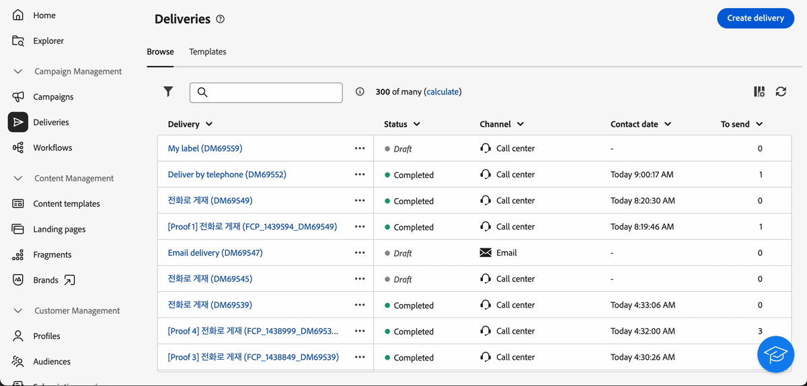

# 릴리스 정보 {#latest-release}

>[!CONTEXTUALHELP]
>id="acw_homepage_learning_card2"
>title="릴리스 정보"
>abstract="Adobe Campaign Web 사용자 인터페이스 릴리스는 기능 배포에 대한 보다 확장 가능한 단계별 접근 방식을 고려하는 연속 게재 모델에서 작동합니다. 따라서 Campaign 릴리스 정보는 최신 기능, 개선 사항 및 수정 사항을 포함하여 한 달에 여러 번 업데이트됩니다. 정기적으로 확인하는 것이 좋습니다."

Adobe Campaign Web 사용자 인터페이스 릴리스는 기능 배포에 대한 보다 확장 가능한 단계별 접근 방식을 고려하는 연속 게재 모델에서 작동합니다. 따라서 이들 릴리스 정보는 월별로 여러 차례 업데이트됩니다. 이들 릴리스 정보를 정기적으로 확인하십시오.

이전 릴리스에서 사용할 수 있는 변경 사항 및 개선 사항은 [2024](release-notes-24.md) 및 [2025](release-notes-25.md)에 나와 있습니다.

## 2025년 4월 릴리스 {#25-4-release}

**릴리스 일자**: 2025년 4월 29일 수요일

### 새로운 기능 {#25-4-features}

다음 기능은 4월 릴리스 이후 모든 사용자가 사용할 수 있습니다.

<table>
<thead>
<tr>
<th><strong>콜 센터 채널</strong> </th>
</tr>
</thead>
<tbody>
<tr>
<td>

이제 Campaign 웹 사용자 인터페이스에서 콜 센터 채널을 사용할 수 있습니다. 이 채널은 콜 센터를 통해 처리되는 커뮤니케이션 또는 상호 작용(일반적으로 상담원이 고객 또는 잠재 고객에게 전화를 거는 경우)을 관리하고 추적하는 데 사용되는 커뮤니케이션 방법을 말합니다.

자세한 내용은 <a href="../call-center/gs-call-center.md">세부 설명서</a>를 참조하십시오.

</td>
</tr>
</tbody>
</table>

<table>
<thead>
<tr>
<th><strong>새 규칙 빌더</strong> </th>
</tr>
</thead>
<tbody>
<tr>
<td>

이제 개선된 사용자 인터페이스에서 복잡한 조건을 정의하는 데 도움이 되는 새로운 규칙 빌더를 사용할 수 있습니다. 필요에 따라 이전 규칙 빌더에서 새 규칙 빌더로 전환할 수 있습니다.

자세한 내용은 <a href="../query/query-modeler-overview.md">세부 설명서</a>를 참조하십시오.

</td>
</tr>
</tbody>
</table>

<table>
<thead>
<tr>
<th><strong>외부 계정 작성</strong> </th>
</tr>
</thead>
<tbody>
<tr>
<td>

이제 Campaign 관리자는 Campaign 웹 사용자 인터페이스에서 외부 시스템과의 새 연결을 설정할 수 있습니다.
기존 외부 계정을 확인, 업데이트 및 관리할 수도 있습니다.

자세한 내용은 <a href="../administration/external-account.md">세부 설명서</a>를 참조하십시오.

</td>
</tr>
</tbody>
</table>

### 개선 사항 {#25-4-improvements}

**일반 인터페이스 개선 사항**

* 이제 스키마 속성에 대한 필드 설명, 즐겨찾기에 추가 및 값 배포 옵션이 사용자 인터페이스에 더 잘 표시됩니다. 자세한 내용은 [세부 설명서](../get-started/attributes.md)를 참조하십시오.
* 이제 인터페이스에서 Experience League 환경 설정에 설정된 기본 언어에 따라 날짜 및 시간이 표시됩니다. 이 개선 사항은 여러 언어에서만 사용할 수 있습니다. 지원되는 언어의 전체 목록을 보려면 [자세한 설명서](https://experienceleague.adobe.com/en/docs/core-services/interface/features/browser-language){target=_blank}를 참조하세요.

<!--
ko * Built-in options are now only visible in the list of options if the **Show advanced options** toggle is activated.
ko * The typology rules creation screen has been updated to facilitate the selection of the type of rule.
-->

**전자 메일 편집기**: Campaign 웹 UI의 액세스 가능성을 높이기 위해 이제 전자 메일 Designer에서 두 개의 새 필드를 사용할 수 있습니다. 이 두 필드는 전자 메일 콘텐츠의 `html` 요소에 있는 `title` 요소 및 lang 특성에 해당합니다. 이메일 본문 섹션에서 사전 헤더 필드 외에 이러한 설정을 정의할 수 있습니다.

<!--
**Workflow**: You can now select an existing Javascript code in workflow properties or in a Javascript activity.    
-->

**스키마**

* 이제 Campaign 웹 사용자 인터페이스에서 목록의 임시 스키마를 편집할 수 있습니다. 자세한 내용은 [세부 설명서](../audience/manage-audience.md)를 참조하십시오.
* 이제 샘플 화면에서 스키마의 사용자 정의 필드를 미리 볼 수 있습니다. 자세한 내용은 [세부 설명서](../administration/custom-fields.md#add)를 참조하십시오.
* 이제 끌어서 놓기를 사용하여 목록에서 사용자 정의 필드를 이동할 수 있습니다. 자세한 내용은 [세부 설명서](../administration/custom-fields.md#add)를 참조하십시오.

### 제한 공개된 새로운 기능 {#25-4-features-la}

>[!AVAILABILITY]
>
>다음 기능은 제한 공개(LA)로 제공됩니다. **을(를) Adobe Campaign Standard에서 Adobe Campaign v8**(으)로 마이그레이션하는 고객으로 제한되며 다른 환경에 배포할 수 없습니다. Campaign 서버를 v8.7.4로 업그레이드해야 합니다.
>
>[Campaign Standard에서 Campaign v8로의 전환](../rn/acs-migration.md) 및 [Campaign Standard 사용자를 위한 기능](https://experienceleague.adobe.com/docs/experience-cloud/campaign/campaign-standard-migration-home.html?lang=ko) 설명서 페이지를 참조하십시오.

* **다국어 게재 만들기** - 이제 Adobe Campaign 웹 사용자 인터페이스에서 여러 언어로 여러 전자 메일 게재를 보낼 수 있습니다. 다국어 게재 기능을 사용하면 게재의 기본 언어와 게재를 보낼 수 있는 다양한 언어를 선택할 수 있습니다. 선택한 언어로 이러한 게재를 미리 볼 수도 있습니다. 자세한 내용은 [세부 설명서](../email/edit-content.md)를 참조하십시오.

* **다국어에 대한 동적 보고** - 이제 다국어 이메일 게재에 동적 보고를 사용할 수 있습니다. 자세한 내용은 [세부 설명서](../reporting/global-reports.md)를 참조하십시오.

* **SMS REST API 지원(LA)** - 이제 SMS 채널에 트랜잭션 메시지 REST API를 사용할 수 있습니다. 이메일과 휴대폰이 모두 페이로드에 있으면 &quot;wishedChannel&quot; 필드를 사용하여 채널을 지정할 수 있습니다. 제공하지 않을 경우 wiredChannel이 명시적으로 SMS를 요청하지 않는 한 이메일이 기본적으로 사용됩니다. 자세한 내용은 [세부 설명서](https://experienceleague.adobe.com/en/docs/experience-cloud/campaign/apis/managing-transactional-messages){target=_blank}를 참조하십시오.

