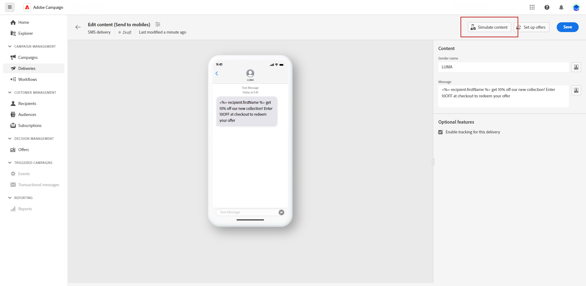

# SMS 게재 미리보기 및 전송 {#send-sms-delivery}

>[!CONTEXTUALHELP]
>id="acw_deliveries_metrics_newquarantines"
>title="새 격리 지표"
>abstract="게재할 메시지 수와 관련하여 게재 실패(알 수 없는 사용자, 잘못된 도메인) 후 격리된 총 주소 수입니다."

## SMS 게재 미리 보기{#preview-sms}

메시지 콘텐츠를 정의했으면 테스트 프로필을 활용하여 미리 보고 테스트할 수 있습니다. 개인화된 콘텐츠를 포함한 경우 테스트 프로필 데이터를 사용하여 이 콘텐츠가 메시지에 어떻게 표시되는지 검사할 수 있습니다. 이를 통해 메시지가 의도한 대로 표시되고 개인화된 정보가 올바르게 표시되는지 확인할 수 있습니다.

SMS 게재를 미리 보는 주요 단계는 다음과 같습니다. 게재 미리 보기 방법에 대한 자세한 내용은에서 확인할 수 있습니다. [이 섹션](../preview-test/preview-content.md).

1. 게재 콘텐츠 페이지에서 **[!UICONTROL 콘텐츠 시뮬레이션]** 개인화된 콘텐츠를 미리 볼 수 있습니다.

   

1. **[!UICONTROL 테스트 프로필 추가]**&#x200B;를 클릭하여 하나 또는 여러 테스트 프로필 또는 프로필을 선택합니다.

   <!--
    Once your test profiles are selected, click **[!UICONTROL Select]**.
    
    -->

1. 오른쪽 창에는 개인화된 요소가 선택한 프로필의 데이터로 동적으로 대체되는 SMS 게재 미리보기가 있습니다.

   

이제 SMS 메시지를 검토하고 대상자에게 전송할 수 있습니다.

## SMS 게재 테스트 {#test-sms}

포함 **Adobe Campaign**, 메시지를 기본 대상자에게 보내기 전에 테스트할 수 있습니다. 이는 이메일 캠페인의 유효성을 확인하고 잠재적 문제를 식별하는 데 필수적인 단계입니다.

테스트 SMS를 보내는 것은 게재의 품질과 효과를 확인하는 중요한 단계입니다. 테스트 수신자는 링크, 옵트아웃 링크 및 이미지와 같은 다양한 요소를 검토할 수 있을 뿐만 아니라 렌더링, 콘텐츠, 개인화 설정 및 SMS 구성에서 발생하는 오류를 식별할 수 있습니다. 이 프로세스는 주요 대상에게 도달하기 전에 SMS를 철저히 평가하고 최적화하는 데 도움이 됩니다.

 에서 테스트 SMS를 보내는 방법 알아보기 [이 섹션](../preview-test/test-deliveries.md).

## SMS 게재 보내기 {#send-sms}

1. SMS 콘텐츠를 개인화한 후 을(를) 클릭합니다 **[!UICONTROL 검토 및 보내기]** (으)로부터 **[!UICONTROL 게재]** 페이지를 가리키도록 업데이트하는 중입니다.

   

1. 클릭 **[!UICONTROL 준비]** 진행 상황 및 통계를 모니터링합니다.

   오류가 발생하는 경우 오류에 대한 자세한 내용은 로그 메뉴를 참조하십시오.

1. 을(를) 클릭하여 메시지 보내기 **[!UICONTROL 보내기]** 최종 전송 프로세스를 진행합니다.

   

   SMS 게재가 예약된 경우 **[!UICONTROL 예약된 대로 보내기]** 단추를 클릭합니다. 에서 게재 예약에 대해 자세히 알아보기 [이 섹션](../msg/gs-messages.md#schedule-the-delivery-sending).

1. 다음을 클릭하여 보내기 작업을 확인합니다. **[!UICONTROL 보내기]** 단추를 클릭합니다.

게재가 전송되면 게재 페이지에서 KPI(주요 성과 지표) 데이터를 추적하고 **[!UICONTROL 로그]** 메뉴 아래의 제품에서 사용할 수 있습니다.

이제 기본 제공 보고서를 통해 메시지의 영향을 측정할 수 있습니다. [자세히 알아보기](../reporting/sms-report.md)

