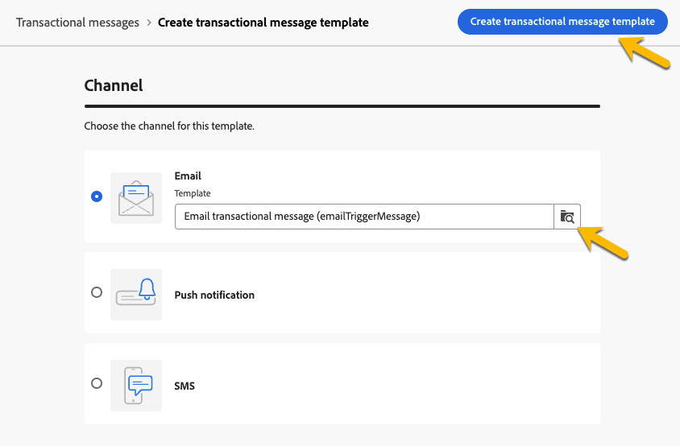

# 트랜잭션 메시지 만들기

트랜잭션 메시지에서 이벤트는 개인화된 메시지 전송을 트리거합니다.
이를 활성화하려면 각 이벤트 유형에 대한 메시지 템플릿을 만들어야 합니다. 이러한 템플릿에는 트랜잭션 메시지를 개인화하는 데 필요한 모든 정보가 포함되어 있습니다.

## 트랜잭션 메시지 템플릿 만들기 {#transactional-template}

Campaign 웹 사용자 인터페이스에서 트랜잭션 메시지 구성의 첫 번째 단계는 템플릿 만들기 또는 메시지 직접 만들기입니다. 이는 [클라이언트 콘솔의 트랜잭션 메시지 구성](https://experienceleague.adobe.com/en/docs/campaign/campaign-v8/send/real-time/transactional)과 다릅니다.

트랜잭션 메시지 템플릿을 사용하여 최종 대상자에게 도달하기 전에 프로필에서 받은 게재 콘텐츠를 미리 볼 수 있습니다. 예를 들어 관리자는 템플릿을 설정하고 구성하여 마케팅 사용자가 사용할 수 있도록 할 수 있습니다.

트랜잭션 메시지 템플릿을 만들려면 아래 단계를 수행하십시오.

* **[!UICONTROL 트리거된 메시지]** 섹션에서 **[!UICONTROL 트랜잭션 메시지]**(으)로 이동합니다. **[!UICONTROL 템플릿]** 탭에서 트랜잭션 메시지에 대한 모든 게재 템플릿을 볼 수 있습니다. **[!UICONTROL 트랜잭션 메시지 템플릿 만들기]** 단추를 클릭하여 템플릿 만들기를 시작합니다.

  {zoomable="yes"}

* 표시되는 새 페이지에서 템플릿의 채널을 선택합니다. 이 예제에서는 **[!UICONTROL 전자 메일]** 채널을 선택합니다. 다른 메시지 템플릿에서 작업하고 템플릿 목록에서 선택할 수도 있습니다.

  {zoomable="yes"}

  **[!UICONTROL 트랜잭션 메시지 만들기]** 단추를 다시 클릭하여 선택한 채널에서 템플릿 만들기의 유효성을 검사합니다.

* 이제 트랜잭션 메시지 템플릿의 구성에 액세스할 수 있습니다.

  {zoomable="yes"}

### 트랜잭션 메시지 속성 {#transactional-properties}

>[!CONTEXTUALHELP]
>id="acw_transacmessages_properties"
>title="트랜잭션 메시지 속성"
>abstract="트랜잭션 메시지 속성을 구성하려면 이 양식을 입력하십시오."

>[!CONTEXTUALHELP]
>id="acw_transacmessages_email_properties"
>title="트랜잭션 메시지 이메일 속성"
>abstract="트랜잭션 메시지 이메일 속성을 구성하려면 이 양식을 입력하십시오."

>[!CONTEXTUALHELP]
>id="acw_transacmessages_sms_properties"
>title="트랜잭션 메시지 SMS 속성"
>abstract="트랜잭션 메시지 SMS 속성을 구성하려면 이 양식을 입력하십시오."

>[!CONTEXTUALHELP]
>id="acw_transacmessages_push_properties"
>title="트랜잭션 메시지 푸시 속성"
>abstract="트랜잭션 메시지 푸시 속성을 구성하려면 이 양식을 입력하십시오."

트랜잭션 메시지의 **[!UICONTROL 속성]** 섹션은 다음을 설정하는 데 도움이 됩니다.

* **[!UICONTROL Label]**&#x200B;은(는) 트랜잭션 메시지 목록에 표시되는 이름입니다. 연구와 향후 사용을 위해 명확히 하십시오.
* **[!UICONTROL 내부 이름]**&#x200B;은(는) 메시지를 만든 다른 메시지와 구별하는 고유한 이름입니다.
* **[!UICONTROL 폴더]**&#x200B;에서 트랜잭션 메시지 템플릿을 만듭니다.
* **[!UICONTROL 실행 폴더]**&#x200B;는 실행 후 메시지가 저장되는 곳입니다.
* **[!UICONTROL 게재 코드]**: 필요한 경우 보고할 메시지를 인식하는 데 도움이 되는 코드입니다.
* **[!UICONTROL 설명]**
* **[!UICONTROL 특성]**&#x200B;은(는) 열거형 *deliveryNature*&#x200B;에 나열된 게재 특성입니다. [열거형에 대해 자세히 알아보기](https://experienceleague.adobe.com/en/docs/campaign/campaign-v8/config/configuration/ui-settings#enumerations)

{zoomable="yes"}

### 모바일 앱 {#mobile-app}

>[!CONTEXTUALHELP]
>id="acw_transacmessages_mobileapp"
>title="트랜잭션 메시지 모바일 앱"
>abstract="이 섹션에서는 메시지를 푸시할 애플리케이션을 선택할 수 있습니다."

이 섹션에서는 메시지를 푸시할 애플리케이션을 선택할 수 있습니다.

검색 아이콘을 클릭하면 Adobe Campaign 인스턴스에 나열된 모바일 애플리케이션에 액세스할 수 있습니다.

{zoomable="yes"}

### 컨텍스트 샘플 {#context-sample}

>[!CONTEXTUALHELP]
>id="acw_transacmessages_context"
>title="트랜잭션 메시지 컨텍스트"
>abstract="컨텍스트 샘플을 사용하면 테스트 이벤트를 만들어 프로필 개인화와 함께 받은 트랜잭션 메시지를 미리 볼 수 있습니다."

>[!CONTEXTUALHELP]
>id="acw_transacmessages_addcontext"
>title="트랜잭션 메시지 컨텍스트"
>abstract="컨텍스트 샘플을 사용하면 테스트 이벤트를 만들어 프로필 개인화와 함께 받은 트랜잭션 메시지를 미리 볼 수 있습니다. "

컨텍스트 샘플을 사용하면 테스트 이벤트를 만들어 프로필 개인화와 함께 받은 트랜잭션 메시지를 미리 볼 수 있습니다.

조건을 추가합니다. 컨텍스트 샘플 없이 템플릿을 사용할 수 있지만, 단점은 개인화된 콘텐츠를 미리 볼 수 없다는 것입니다.

암호 설정 예제에서 이벤트는 사용자의 이름, 성 및 암호를 재설정할 수 있는 개인화된 링크를 보냅니다. 아래 그림과 같이 컨텍스트를 구성할 수 있습니다.

컨텍스트의 콘텐츠는 필요한 개인화에 따라 다릅니다.

{zoomable="yes"}

### 트랜잭션 메시지 템플릿 콘텐츠 {#transactional-content}

>[!CONTEXTUALHELP]
>id="acw_transacmessages_content"
>title="트랜잭션 메시지 콘텐츠"
>abstract="트랜잭션 메시지 콘텐츠를 만드는 방법을 알아봅니다"

>[!CONTEXTUALHELP]
>id="acw_transacmessages_personalization"
>title="트랜잭션 메시지 개인화"
>abstract="트랜잭션 메시지 콘텐츠를 개인화하는 방법을 알아봅니다"

트랜잭션 메시지의 콘텐츠로 작업하는 것은 게재의 콘텐츠 생성과 같습니다. **[!UICONTROL 전자 메일 디자이너 열기]** 또는 **[!UICONTROL 전자 메일 본문 편집]**&#x200B;을 클릭하고 템플릿 콘텐츠를 선택하거나 HTML 코드를 가져옵니다.

{zoomable="yes"}

콘텐츠에 개인화를 추가하려면 개인화를 추가할 섹션을 클릭하고 **[!UICONTROL Personalization 추가]** 아이콘을 선택합니다.

{zoomable="yes"}

**[!UICONTROL 개인화 편집]** 창에 액세스할 수 있습니다.
트리거 이벤트에서 변수를 추가하려면 **[!UICONTROL 이벤트 컨텍스트]** 아이콘을 클릭합니다. 템플릿에 대해 정의한 컨텍스트([컨텍스트에 대해 자세히 알아보기](#context-sample))를 탐색하고 **[!UICONTROL +]** 단추를 클릭하여 필요한 변수를 삽입할 수 있습니다.

아래 이미지에서 이름의 개인화를 추가하는 방법을 확인할 수 있습니다.

{zoomable="yes"}

예제에서는 이름과 성을 추가한 다음 **[!UICONTROL 암호 재설정]** 단추 링크를 개인화합니다.

{zoomable="yes"}

### 템플릿 미리 보기

이 템플릿 작성 단계에서는 템플릿 콘텐츠를 미리 보고 개인화를 확인할 수 있습니다.

이렇게 하려면 [컨텍스트 샘플](#context-sample)을 입력하고 **[!UICONTROL 콘텐츠 시뮬레이션]** 단추를 클릭하십시오.

{zoomable="yes"}

## 트랜잭션 메시지 만들기 {#transactional-message}

트랜잭션 메시지를 직접 만들거나 트랜잭션 메시지 템플릿을 사용하여 만들 수 있습니다. [트랜잭션 메시지 템플릿을 만드는 방법을 알아봅니다](#transactional-template).

트랜잭션 메시지를 만들려면 아래 단계를 수행하십시오.

* **[!UICONTROL 트리거된 메시지]** 섹션에서 **[!UICONTROL 트랜잭션 메시지]**(으)로 이동합니다. **[!UICONTROL 찾아보기]** 탭에서 만들어진 모든 트랜잭션 메시지를 볼 수 있습니다. **[!UICONTROL 트랜잭션 메시지 만들기]** 단추를 클릭하여 메시지 만들기를 시작합니다.

  {zoomable="yes"}

* 표시된 새 페이지에서 메시지 채널을 선택하고 작업할 템플릿을 선택합니다. 예제에서는 [여기에서 만든 템플릿](#transactional-template)을(를) 선택합니다.

  {zoomable="yes"}

  **[!UICONTROL 트랜잭션 메시지 만들기]** 단추를 다시 클릭하여 선택한 채널에서 메시지 만들기의 유효성을 검사합니다.

* 이제 트랜잭션 메시지의 구성에 액세스할 수 있습니다. 메시지는 템플릿의 구성을 상속합니다. 이 페이지는 이벤트 유형 구성도 포함한다는 점을 제외하면 트랜잭션 메시지 템플릿 구성 페이지와 거의 동일합니다.

  {zoomable="yes"}

  템플릿에 대한 메시지 구성을 입력합니다.
   * [트랜잭션 메시지 속성](#transactional-properties)
   * [컨텍스트 샘플](#context-sample)
   * [메시지 내용](#transactional-content)
아래에 자세히 설명된 대로 [이벤트 유형을 구성](#event-type)합니다.

* [트랜잭션 메시지의 유효성을 검사한](validate-transactional.md) 후에 **[!UICONTROL 검토 및 게시]** 단추를 클릭하여 메시지를 만들고 게시하십시오.
이제 트리거에서 트랜잭션 메시지 전송을 푸시할 수 있습니다.

### 이벤트 유형 정보 {#event-type}

>[!CONTEXTUALHELP]
>id="acw_transacmessages_event"
>title="트랜잭션 메시지 이벤트"
>abstract="이벤트 유형의 구성은 메시지를 트리거 이벤트에 연결합니다."

이벤트 유형의 구성은 메시지를 트리거 이벤트에 연결합니다.

Campaign 웹 사용자 인터페이스에서 이미 만들어진 이벤트 유형을 선택하고 선택하거나 이 구성 페이지에서 직접 이벤트 유형을 만들 수 있습니다.

{zoomable="yes"}

>[!CAUTION]
>
>다른 트랜잭션 메시지에서 현재 사용 중인 이벤트 유형을 선택하면 두 메시지가 트리거됩니다. 모범 사례를 위해 **ONE 이벤트 형식을 ONE 트랜잭션 메시지에만 연결하는 것이 좋습니다.**

## 트랜잭션 메시지에 오퍼 추가 {#transactional-offers}

트랜잭션 메시지에 오퍼를 포함할 수 있는 옵션이 있으므로 메시지가 이벤트를 트리거하는 경우에도 최종 사용자에게 관련 제안을 제시할 수 있습니다.

이 기능은 트랜잭션 메시지의 콘텐츠 편집 단계 중에 액세스할 수 있습니다. 구성하려면 **[!UICONTROL 오퍼 설정]** 버튼을 클릭하면 됩니다.

설정 프로세스는 표준 게재에 대한 오퍼 구성과 동일합니다. [메시지에 오퍼를 추가하는 방법을 알아보세요](../msg/offers.md).

{zoomable="yes"}
